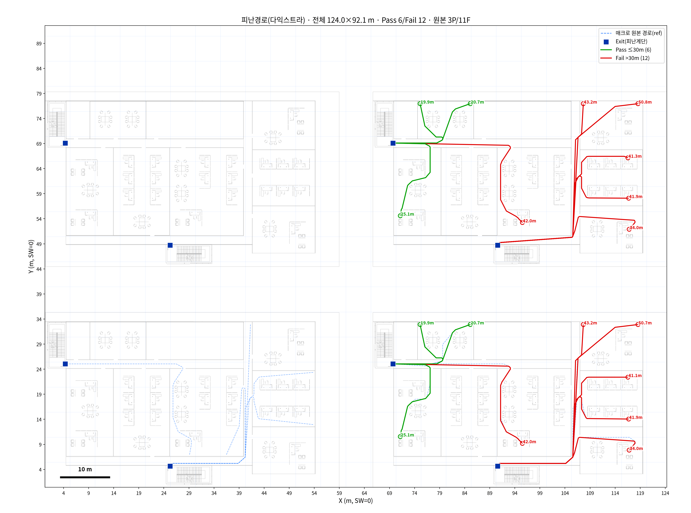
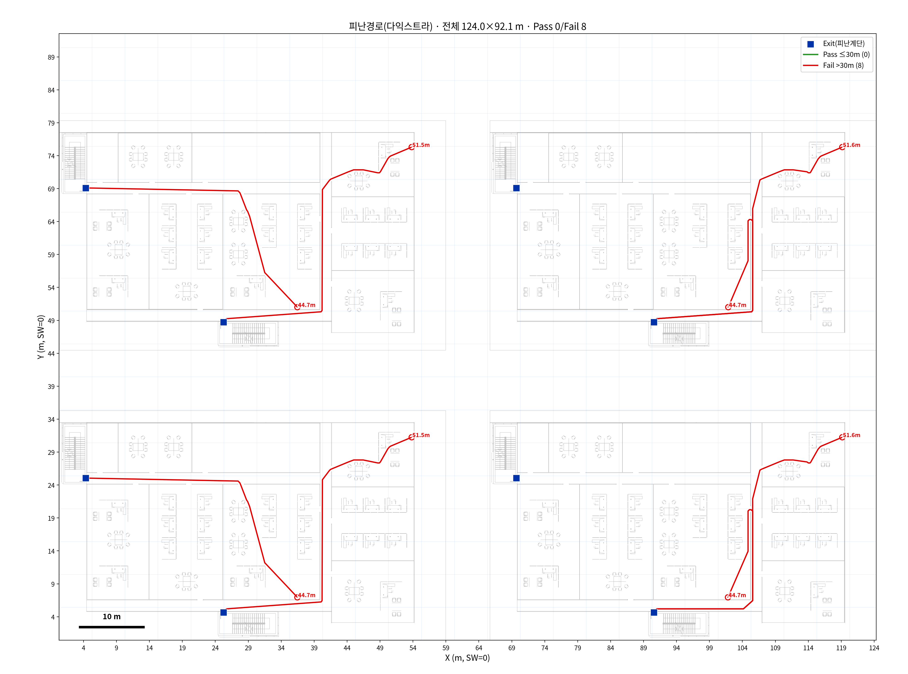
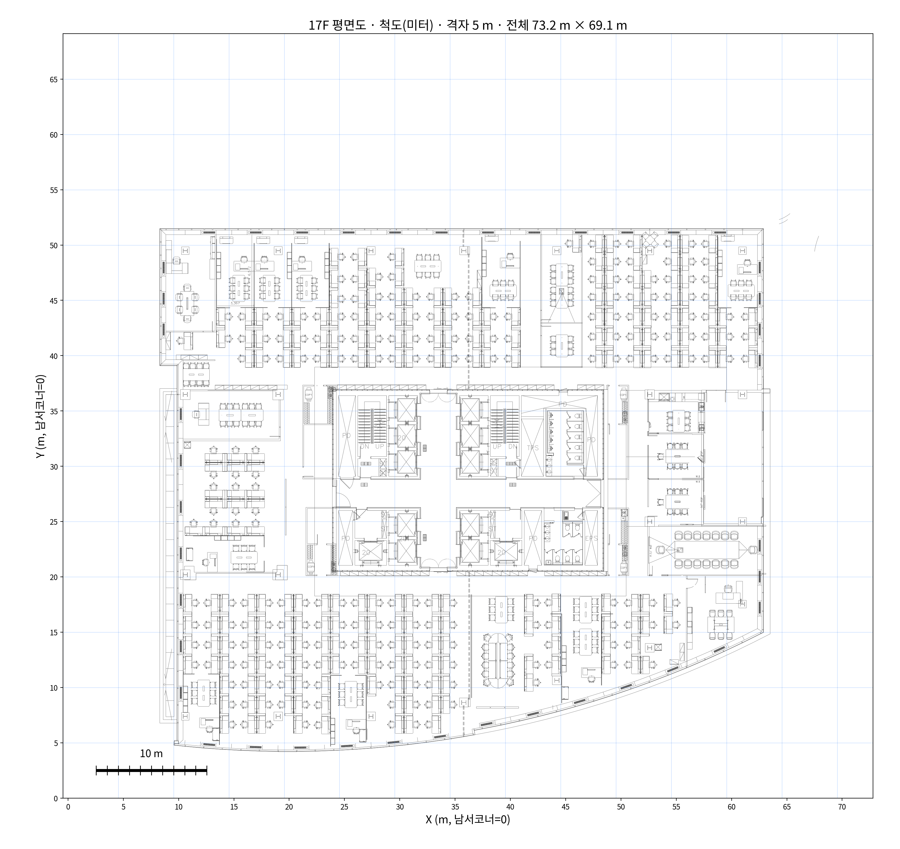
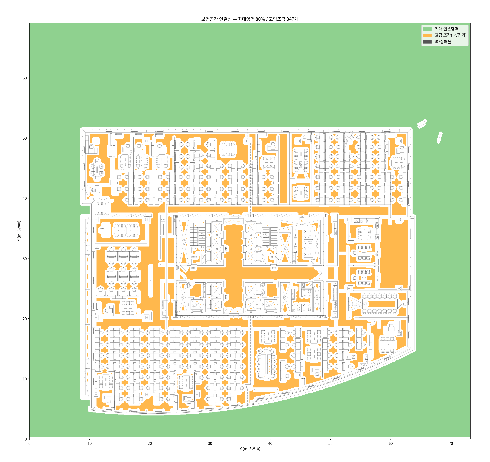

# CAD 기반 최적 피난경로 알고리즘
## — AutoCAD 없이 리눅스/파이썬 자체 구현 및 적용 검증

> **한 줄 요약**
> 삼성화재 최적 피난경로 매크로(AutoCAD/C#)를 **AutoCAD 없이 리눅스·파이썬으로 자체 구현**했고,
> 테스트 도면(`Egress_Review-Test.dxf`)으로 **동작·정확도 검증 완료**. 다만 현재 받은 **17F 도면은
> PDF 변환본이라 적용 불가**함을 확인 → **17층 원본 CAD 도면 필요**.

---

## 1. 배경 & 목표

- 삼성화재로부터 **최적 피난경로 산출 알고리즘**(`TravelDistance_Analyzer`) 소스를 공유받음.
- 원본은 **AutoCAD 2022 + C# DLL** 종속 → 당사 분석 서버(리눅스, AutoCAD 미보유)에서 실행 불가.
- **목표**: 동일 로직을 자체 구현하여 (1) AutoCAD 라이선스·GUI 없이 자동화하고,
  (2) 우리 CCTV 분석 파이프라인(추적 → 피난지표)에 통합.

---

## 2. 알고리즘 원리 (3단계)

| 단계 | 내용 |
|------|------|
| ① 격자화(Mesh) | 도면 공간을 **50 mm 격자**로 나누고, 벽·장애물 주변 **304.8 mm(=1ft) 이격**을 반영해 `벽=1 / 통행가능=0` 판정 |
| ② 최단거리(다익스트라) | **Exit(피난계단)를 모두 출발원으로 동시 시드**하는 멀티소스 다익스트라(8방향) → 각 지점에서 **가장 가까운 Exit까지 피난거리** 산출 |
| ③ 경로 추출 | 역추적 후 **직선화(String-Pulling)** 로 매끈한 피난경로 생성 → 기준거리 대비 **Pass/Fail** 판정 |

**입력 규약**(원본과 동일): Exit = `Evac_Exit` 레이어에 그은 **선의 중점**, 출발점 = `Evac_Occupant`
레이어, 장애물 = **그 외 모든 형상**.

---

## 3. 구현 — 자체 리눅스/파이썬 (AutoCAD API 미사용)

> **AutoCAD .NET API를 전혀 쓰지 않았습니다.** 순수 기하 + 격자 + 그래프 최단경로라
> 오픈소스 스택만으로 동일 결과를 재현했습니다.

- **언어/환경**: Python 3.12 (리눅스, conda `boosttrack`)
- **핵심 라이브러리**: `ezdxf`(도면 파싱) · `numpy` · `scipy`(멀티소스 다익스트라) · `matplotlib`(렌더)
- **모듈 구조** (재사용 가능하도록 분리):

```
evac/
 ├─ core    순수 알고리즘(격자화·다익스트라·경로평활화) — 도면/그림 의존 없음
 ├─ cad     DXF 입출력(Exit·출발점·장애물 수집, Exit 역주입)
 ├─ render  결과 렌더(미터격자·스케일바)
 ├─ pick    Exit 지정 UI(GUI 클릭 / 브라우저 클릭)
 └─ cli     명령행(route · pick · connect)
```

- **DWG→DXF 변환**도 오픈소스/프리웨어로 자동화(ODAFileConverter·libredwg, 헤드리스).
- 결과는 **`17F_plan_scale.png`와 동일한 미터 척도 스타일** 이미지로 출력.

---

## 4. 적용 검증 ✅ — `Egress_Review-Test.dxf`

삼성화재 테스트 도면(벽·문·Exit가 제대로 태깅된 정상 CAD)으로 **전 기능 동작 확인**.


*그림 1. 각 출발점에서 최근접 Exit까지 산출한 피난경로(초록=기준 이내, 빨강=초과)와 피난거리(m).
파란 점선은 삼성 매크로가 실제로 그린 원본 경로 — 겹쳐서 비교 검증.*

### 원본 매크로와 정량 비교 (동일 입력 구간)
| 항목 | 결과 |
|------|------|
| **Pass/Fail 판정** | 겹치는 10개 출발점 **100% 일치** |
| **피난거리 오차** | **+0.4 ~ +0.9 m** (20~50 m 경로 기준 ≈ 1.5%) |
| 오차 원인 | 판정 기준(격자거리)과 화면 표기(직선화 경로길이)의 정의 차이 — 알고리즘 불일치 아님 |


*그림 2. Exit에서 가장 먼 취약 지점(worst-case)을 자동 추출하는 모드도 동작 확인.*

> ✅ **결론: 동일 로직 · 동일 결과.** AutoCAD 없이 리눅스/파이썬으로 완전 재현.

---

## 5. 17F 도면 적용 시도 ❌ — 확인 불가

같은 파이프라인을 현재 받은 **`17F.dwg`(재다운로드 `17F_v2.dwg` 포함, 동일 파일)** 에 적용 시도.
**DWG→DXF로 변환해 정상적으로 열렸으나(형상은 보임), 피난경로 산출은 불가**했습니다.


*그림 3. 17F를 변환해 연 화면. 벽·집기 선은 보이나 이는 **PDF에서 딴 선 그림**일 뿐.*

### 원인
- `17F.dwg`는 설계 원본 CAD가 아니라 **PDF 도면을 AutoCAD로 "가져오기(PDF Import)"해서 선으로
  변환한 파일**임 (레이어가 `PDF_형상`·`PDF_문자`·`PDF_솔리드 채우기` 뿐).
- 따라서 **벽·문 구분이 없고, 특히 문(개구부) 정보가 없어** 방이 닫힌 도형으로만 존재.
- 결과적으로 **보행공간이 서로 격리**되어(외곽 + 고립된 방 조각들), 재실자가 방에서 복도·피난계단으로
  나가는 통로가 데이터상 막힘 → **경로 산출 불가**.


*그림 4. 연결성 진단. 주황(고립된 방·집기)이 층 전체에 흩어져 있고, 이격을 25~305 mm로 바꿔도
보행망이 **~1,800개 조각**으로 분리됨 → 문 개구부가 데이터에 없다는 명확한 증거.*

> ❌ **결론: 알고리즘 문제가 아니라 도면 데이터 품질 문제.**
> 삼성 매크로가 잘 도는 것도 **이미 정리된 설계 CAD**에서 실행하기 때문
> (`Egress_Review-Test.dwg`가 그 예).

---

## 6. 결론 & 다음 단계

| 구분 | 상태 |
|------|------|
| 알고리즘 자체 구현(리눅스/파이썬, AutoCAD 미사용) | ✅ 완료 |
| 정상 도면(Egress) 적용·검증 | ✅ 완료 (원본과 일치) |
| 17F 도면 적용 | ❌ 불가 — PDF 변환본(문 개구부 없음) |
| **필요 조치** | 🔜 **17층 원본 CAD 도면(DWG) 확보** — 벽·문이 실제 레이어로 구분된 설계 원본 |

- **요청 발송 완료**: 진동우 프로께 17층 원본 CAD 도면 요청(현 파일이 PDF 변환본이라 적용 불가함 설명).
- **도면 수령 즉시**: 코드 수정 없이 `Exit 지정 → 경로 산출` 바로 실행 가능.
- **향후 통합**: `core`가 출발점을 인자로 받으므로, **CCTV 추적이 주는 재실자 좌표**를 그대로 넣어
  실시간 피난거리·경로를 산출 → **EPFI(예상 피난시간) 지표**로 연결.

---

<div align="center">

*본 알고리즘/구현 상세는 [README.md](README.md), API·기능명세는 [기능명세.md](기능명세.md) 참조.*

</div>
