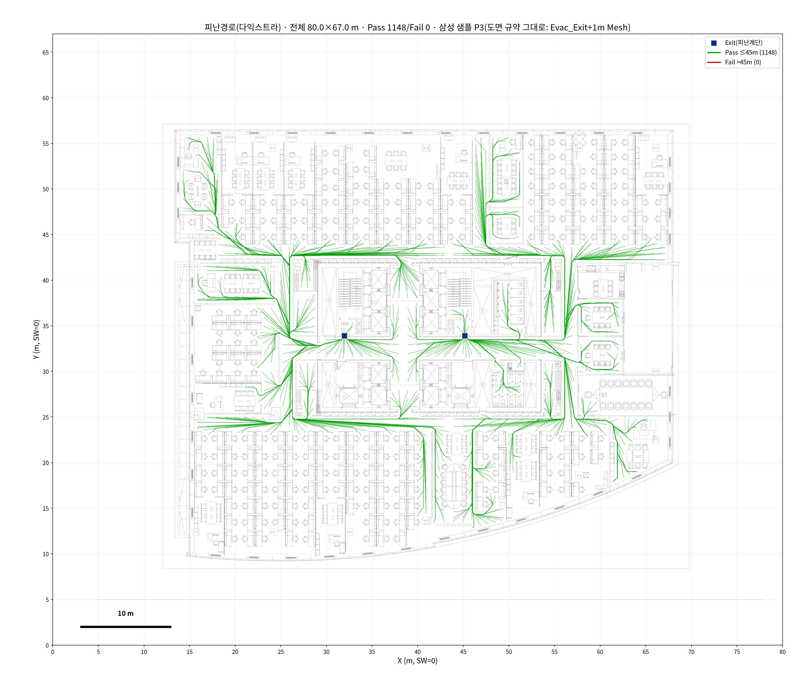
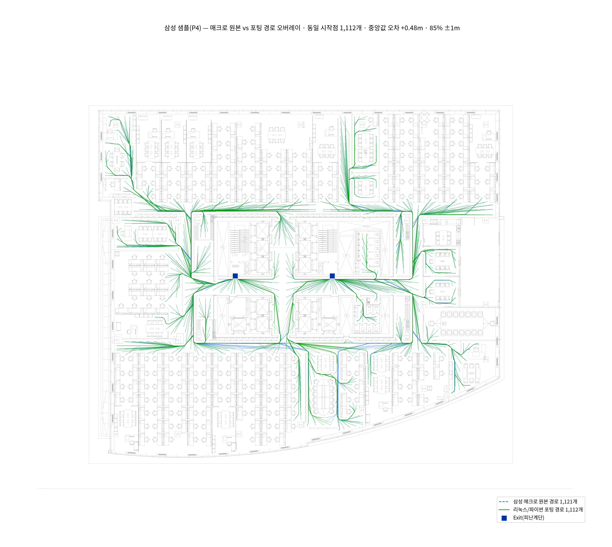
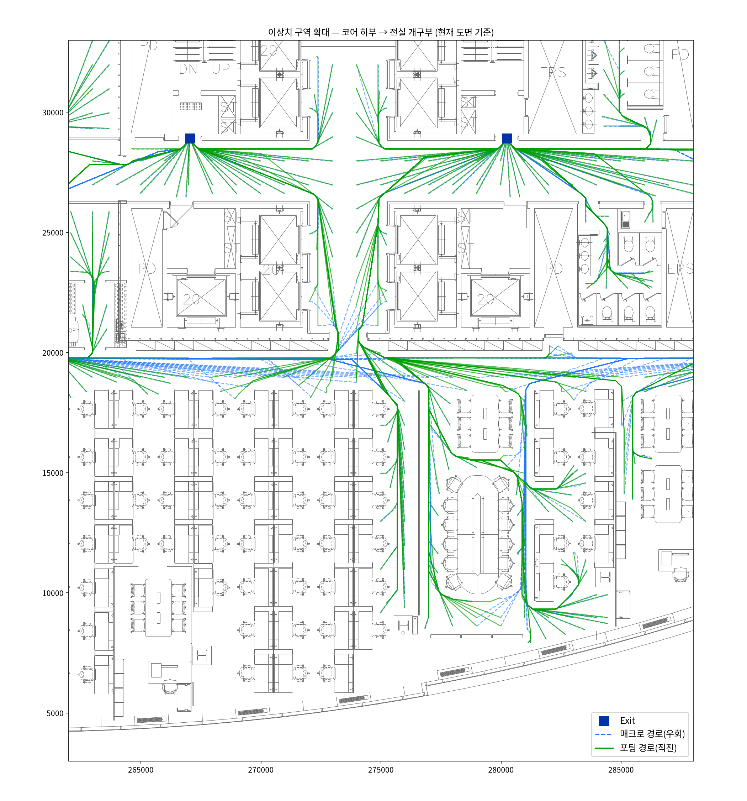
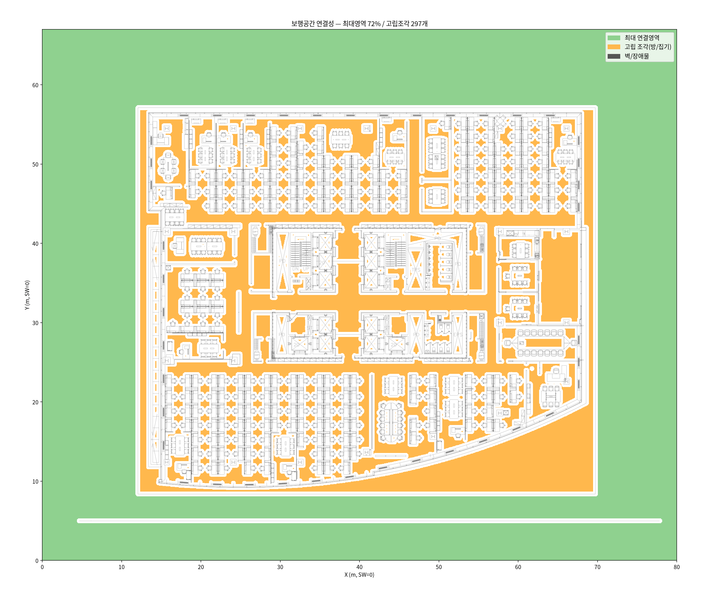

# 삼성화재 회신 & 샘플도면 검증 (2026-07-16)

17F 원본 CAD 요청 메일에 대한 삼성화재 회신과 함께 **샘플도면
(`cad/17F_Egress Review(Sample).dwg`, 9.4MB)** 을 수령. 이 문서는 ①회신 내용 정리,
②샘플도면 구조 분석, ③기존 차단 이슈의 해소 여부 **실측 검증** 결과를 남긴다.

> **결론 먼저**: ✅ **기존 차단 이슈 해소.** 샘플도면 안에 **우리가 갖고 있던 바로 그
> 17F 도면을 삼성이 직접 터치업(문 삭제)한 판**이 들어있고, 우리 포팅(`evac/`)으로
> **17F 전층 1,148개 피난경로 산출 성공**. 매크로 원본 출력과 1:1 비교 시 **85%가
> ±1m 내 일치**(중앙값 +0.48m).

---

## 1. 회신 내용 정리

### 메일 (정해원 프로 → 정서익 팀장, 샘플도면 첨부)

> 요청하신 샘플도면 송부 드립니다.
> 최적 피난경로 알고리즘 **사용방법은 CAD 도면 내에 작성**하였으니 참고해 주시기 바랍니다.
> 참고로, 대상마다 도면의 작성방식이 달라서 **문이나 치수선 등을 자동인식하는 기능은
> 아직 구현이 안되어** 있습니다.
> (현 Version은 장애물이 되는 벽체, 가구류 등을 제외한 **문/치수선 등은 수동으로
> 삭제하는 터치업 과정이 필요**합니다.)

### 구두 설명(통화/메모) 요지

| 주제 | 내용 |
|------|------|
| 도면 출처 | **PDF를 캐드로 불러들인 뒤**(PDF Import) **문만 수동으로 지워서** 만든 것. 문틀은 남기고 문짝(개구부를 막는 요소)만 삭제 → 폐공간을 열어줌 |
| 장애물 인식 | 벽/문/가구를 **따로 구분하지 않음** — "객체가 있으면 다 피해간다". 그래서 문·치수선이 남아있으면 벽으로 인식되어 경로가 막히거나 우회함 |
| 문 자동인식 | **미구현** (문에 대한 정보가 데이터에 없음). 향후 자동 인식·삽입이 과제 |
| 명령어 | `EVAC_WorstN`: 선택 영역에서 출발지점 검색 → **가장 먼 N개**(예: 5개) 경로 표시. `EVAC_Occupant`: **출발지점을 강제 지정** — `Evac_Occupant` 레이어 폴리라인의 **모든 꼭짓점**에서 출구까지 |
| Mesh | 샘플에서는 mesh 구성을 위해 폴리라인 격자를 깔아놓음(도면 표기 기준 **1m×1m**) — 각 노드가 출발점이 됨 |
| 요청사항 | 우리가 터치업한 캐드를 보내주면 원본 PDF와 비교 검토 가능 |

> 💡 **중요한 사실 정정**: 이전 분석(README §17F 불가)에서 "삼성은 깨끗한 원본 설계
> CAD로 돌린다"고 추정했으나, **삼성의 실제 공정도 우리와 동일한 PDF Import 도면**이며,
> 차이는 **문/치수선 수동 삭제(터치업) 공정을 거친다**는 점이었다. 즉 "원본 설계 CAD"는
> 존재하지 않아도 되고, **터치업이 정식 전처리 공정**이다.

---

## 2. 샘플도면 구조 — 도면 자체가 4단계 튜토리얼

`17F_Egress Review(Sample).dwg` 는 **같은 17F 평면도 4판을 나란히 배치**해 사용 절차를
보여준다(도면 내 MTEXT 안내문 원문 요약):

| 패널 | 도면 내 안내문(원문 요지) | 실측 확인 |
|------|--------------------------|-----------|
| **P1 도면 원본** | "문이나 치수선 등이 있으면 장애물로 인식해서 경로측정 불가" | `PDF_형상` 54,113개 — **우리 `cad/17F.dxf`와 엔티티 수 정확히 동일**(같은 도면!) |
| **P2 1차 가공** | "문·치수선 등 장애물로 인식될 요소를 삭제 (문이 그려져 있으면 방에서 외부로 못 나감, 치수선은 벽으로 인식되어 우회)" | `PDF_형상` 52,813개 — **약 1,300개 요소 수동 삭제됨** |
| **P3 출발점 설정** | "1m×1m Mesh 구성, `Evac_Occupant` 레이어 객체의 모든 꼭짓점에서 출발. `Evac_Exit`: Line을 출입구 폭에 따라 그으면 그 **중점**이 도착점" | `Evac_Exit` Line 2개(폭 0.92m) + Mesh 폴리라인 674개(꼭짓점 2,692) + 배경형상은 `GLCC_Background` 레이어 |
| **P4 경로 생성** | "명령어 `EVAC_Occupant` 실행 → 사각형 범위 설정 → NG기준 입력 → 경로길이 Text 크기 입력" | **매크로 실제 출력 경로 1,121개**(`Evac_Path_Pass`) 잔존 — 검증 레퍼런스로 활용 |

- 레이어 구성(11개): `Evac_Exit/Occupant/Path_Pass/Path_Fail`, `GLCC_Background`,
  `PDF_형상/문자/솔리드 채우기`, `spPath_Fail`(우리가 코드에서 찾아낸 **레이어 오타
  버그의 흔적** — 실파일에서 실증됨), `0`, `Defpoints`.
- P3/P4의 배경(장애물) 형상은 `GLCC_Background` 레이어에 있음 — 매크로 skip 대상이
  아니므로 **장애물로 동작**(GLCC_*는 상위버전 매크로 네이밍으로 추정).

---

## 3. 검증 — 기존 차단 이슈가 해소되었는가?

### 3-1. 기존 이슈 대조표

| 기존 차단 이슈 (README §17F 불가) | 해소 여부 |
|-----------------------------------|-----------|
| `Evac_Exit`/`Evac_Occupant` 태그 없음 | ✅ **해소** — P3에 Exit 2개·Mesh 태깅 완료 상태로 제공 |
| 문 개구부가 벡터에 없어 보행망 격리(~1,800조각) → 경로 산출 불가 | ✅ **해소** — P2/P3는 문 삭제 터치업 완료. **17F 전층 경로 산출 성공**(아래) |
| "원본 설계 CAD 필요" | ✅ **불필요로 정정** — 삼성 공정 자체가 PDF Import + 수동 터치업. 샘플의 P2/P3가 곧 "사용 가능한 17F" |

### 3-2. 실측 ①: P3 "도면 규약 그대로" 실행 — 17F 전층 경로 산출 성공

samples P3(Exit 레이어 + 1m Mesh)를 우리 `evac/` 포팅에 그대로 입력:

- **경로 1,148개 생성 · Pass 1,148 / Fail 0** (기준 45m), 거리 0.1~**42.7m**
  (매크로 최장 42.1m와 부합)
- 도달불가 1,544개 노드는 Mesh가 **샤프트·EV코어 등 원래 밀폐공간에도 깔려있기 때문**
  (매크로도 동일하게 스킵 — 매크로 출력 1,121개 ≈ 우리 1,148개)


*그림 1. 삼성 터치업 도면(P3)을 포팅에 그대로 입력 — 이전에 불가능했던 17F 전층 경로
산출이 정상 동작. 두 Exit(파란 사각형)로 전 구역에서 경로가 수렴.*

### 3-3. 실측 ②: P4 매크로 원본 출력과 1:1 정량 비교

P4에 잔존한 **매크로 실제 출력 1,121개 경로의 시작점(유니크 1,112개)** 을 그대로 우리
포팅의 출발점으로 넣고, 매크로 경로 끝점 군집(=Exit 2개소)을 도착점으로 사용:

| 지표 | 결과 |
|------|------|
| 경로 생성 | **1,112 / 1,112 (도달불가 0)** |
| 거리 오차 중앙값 | **+0.48 m** (이전 Egress-Test 검증의 +0.4~0.9m와 일관 — 격자거리 vs 평활화 폴리라인 길이 정의 차) |
| ±1 m 내 일치 | **84.5 %** · ±2 m 내 85.7 % |
| 국소 이상치 | 159개(14%)가 **코어 하부 한 구역에 집중** — 아래 참조 |


*그림 2. 동일 시작점 1,112개 오버레이. 초록(포팅)이 파랑(매크로)을 거의 완전히 덮음 = 일치.*

**국소 이상치 분석**: 이상치 전부가 코어 하부(EV홀 인접) 한 구역에 몰려 있고, 그 구역
에서 우리는 **현재 도면 기준 열려있는 개구부로 직진**(예: 9.9m), 매크로는 **우회**
(28.2m). clearance 스윕(305→450mm)으로도 재현되지 않음 → 알고리즘 차이가 아니라
**매크로 실행 당시의 도면 상태(해당 구역 문이 아직 남아있던 시점)와 현재 배경의 차이**
로 판단. 즉 "문을 지우面 열리고, 남기면 우회한다"는 터치업 원리 그대로.


*그림 3. 이상치 구역 확대. 초록(포팅)은 현재 열린 개구부 직진, 파란 점선(매크로)은 우회.*

### 3-4. 보행공간 연결성 (문 삭제 효과)

터치업된 P3의 연결성 진단: 최대 보행영역이 사무공간 전체를 관통(경로 1,148개가 그 증거).
잔여 고립조각은 **샤프트·EV승강로 등 정당한 밀폐공간**. (이전 17F 원본: 사무공간까지
~1,800조각으로 격리 — `evac_17F_connectivity.png` 대조)


*그림 4. 터치업 도면의 보행공간. 초록(연결영역)이 복도·사무구역을 관통.*

---

## 4. 확정된 운영 절차 (17F 및 신규 층 공통)

```
① PDF 도면 → AutoCAD PDF Import (또는 기존 PDF트레이스 DWG)
② [수동 터치업] 문짝·치수선 등 통행을 막는 요소 삭제 (문틀은 유지)   ← 삼성 공정과 동일
③ Exit 지정: Evac_Exit 레이어에 출입구 폭만큼 Line (또는 우리 CLI --exits/픽커)
④ 출발점: Evac_Occupant 레이어 mesh/polyline (또는 --starts / worstn 자동)
⑤ 실행: evac_route.py route ... → 경로·거리·Pass/Fail + PNG
```

- ②의 터치업이 유일한 수동 공정. 삼성도 자동화 미구현(회신 명시) — 장기적으로
  문 개구부 자동 인식(도면 기호/평행선 패턴 검출)이 공동 과제.
- 17F는 샘플 P2/P3를 그대로 재사용하면 됨(추가 터치업 불필요).

## 5. 다음 단계

1. ~~17F 사용가능 도면 확보~~ → **완료**(샘플 P2/P3).
2. 17F 실경로를 우리 파이프라인 좌표계(SW=0)로 정규화해 **트래킹 좌표 → 실시간
   피난거리** 연동(EPFI) 착수 가능.
3. 삼성 요청사항: 우리가 터치업/활용한 캐드를 회신하면 원본 PDF와 비교 검토해주겠다고
   함 → 결과 공유 시 이 문서의 검증 이미지 활용.

---
*검증 환경: conda `boosttrack`(Python 3.12) · evac 0.1.0 · DWG→DXF: ODAFileConverter 27.1
· 상세 API는 [기능명세.md](기능명세.md), 알고리즘 분석은 [README.md](README.md) 참조.*
