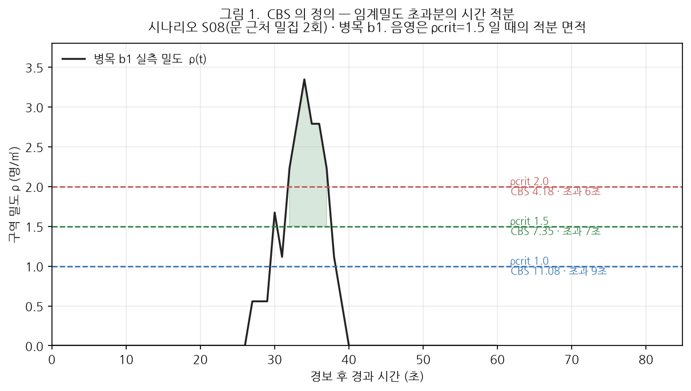
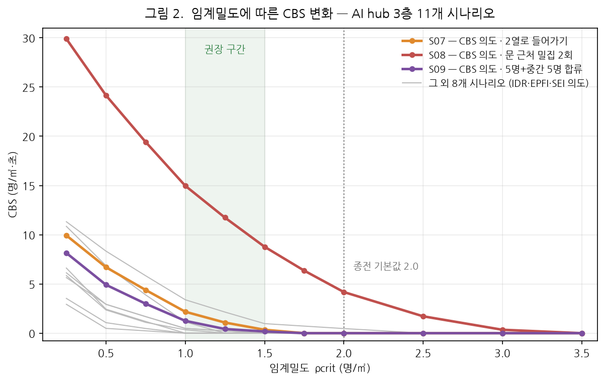
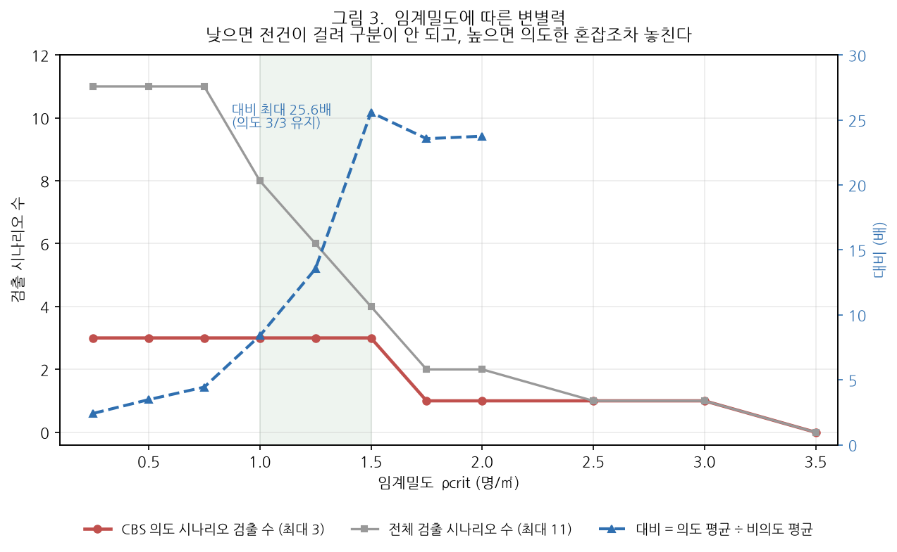
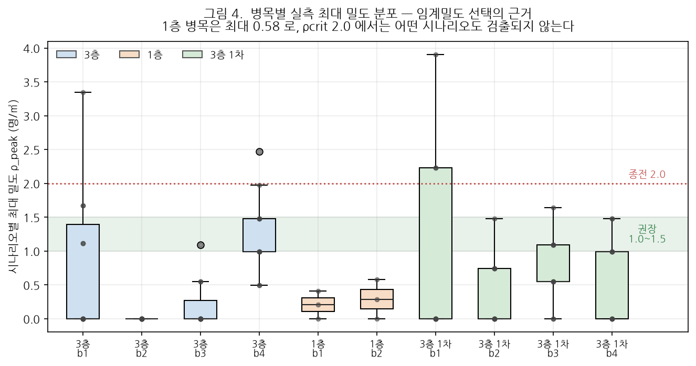
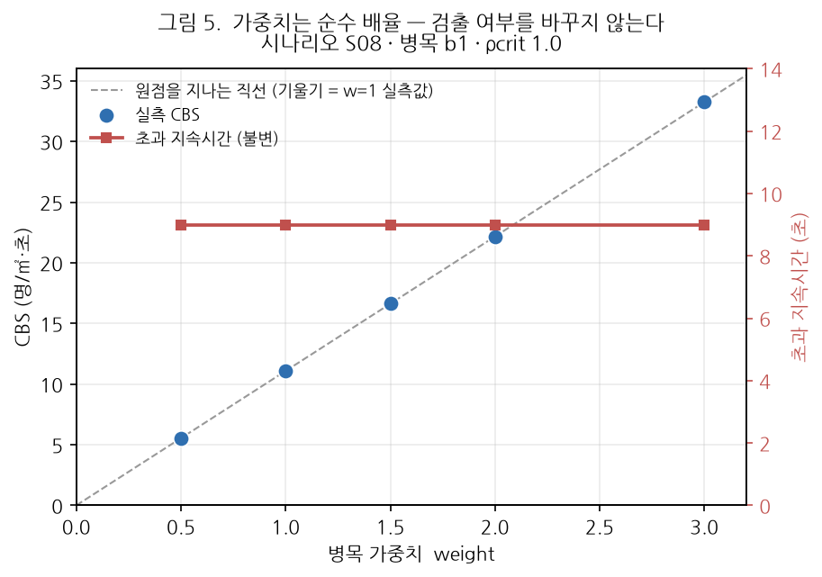

# 병목 혼잡 누적지표(CBS) 파라미터 민감도 검증 결과보고서

**AI hub 피난훈련 실증영상 기반 임계밀도·가중치 스윕**

| 항목 | 내용 |
|---|---|
| 문서번호 | MACS-EVAC-VR-2026-003 |
| 문서구분 | 검증 결과보고서 (최종) |
| 작성일 | 2026년 9월 17일 |
| 작성 | PIA SPACE · MACS-EVAC 개발팀 |
| 검증대상 | MACS-EVAC 피난분석 엔진 — 병목 혼잡 누적지표(CBS) |
| 검증범위 | 임계밀도 `ρcrit` 11개 수준 · 가중치 `weight` 5개 수준 스윕 |
| 판정 | **조건부 적합** — 지표 자체는 정상 작동하나 **기본 임계밀도 2.0 은 부적절**, 1.0~1.5 로 조정 필요 |

---

## 1. 개요

### 1.1 목적

CBS(Cumulative Bottleneck Severity, 병목 혼잡 누적지표)는 설정값에 따라 산출 결과가
크게 달라지는 지표이다. 본 보고서는 **어떤 설정값이 타당한가**를 실증 데이터로 결정하기
위해 파라미터를 체계적으로 바꿔가며 측정한 결과를 기술한다.

앞선 검증(MACS-EVAC-VR-2026-002 관련 사전 점검)에서 CBS 는 **의도한 혼잡 3건 중 1건만
포착**하여 둔감하다는 지적이 있었다. 본 보고서는 그 원인이 알고리즘이 아니라
**임계밀도 설정값**에 있음을 확인하고, 근거에 기반한 권장값을 제시한다.

### 1.2 검증 대상 파라미터

| 파라미터 | 의미 | 스윕 범위 | 지정 단위 |
|---|---|---|---|
| `ρcrit` (임계밀도) | 이 밀도를 넘은 만큼만 누적한다 | 0.25 ~ 3.5 (11수준) | 병목별 또는 전역 |
| `weight` (가중치) | 병목별 중요도 배율 | 0.5 ~ 3.0 (5수준) | 병목별 |

### 1.3 근거 문서

| 구분 | 문서 |
|---|---|
| 상위 요구사항 | `docs/requirements/삼성화재-피난훈련-정량평가-4대지표-요구사항.md` |
| 지표 정의 | `docs/requirements/CBS-병목혼잡누적지표.md` |
| 촬영 시나리오 | `docs/AI-Hub실증-피난훈련-4대지표-검증-시나리오.md` |

---

## 2. 지표 정의 및 검증 방법

### 2.1 지표 정의

$$\mathrm{CBS}_b = \int_{t_{\mathrm{alarm}}}^{t_{\mathrm{end}}}
\max\!\left(0,\; \rho_b(t) - \rho_{\mathrm{crit},b}\right)\cdot w_b \; dt
\qquad [\text{명}/\text{m}^2\!\cdot\!\text{초}]$$

- $\rho_b(t)$ : 병목 $b$ 안의 시각 $t$ 실측 인원 밀도 (명/m²)
- $\rho_{\mathrm{crit},b}$ : 병목 $b$ 의 임계밀도 — **이 값을 넘은 초과분만** 누적된다
- $w_b$ : 병목 $b$ 의 가중치

**값이 클수록 나쁘다.** 0 은 임계밀도를 한 번도 넘지 않았다는 뜻이다.
적분은 1초 주기 좌리만 합으로 계산한다.



*그림 1. CBS 의 정의. 같은 밀도 곡선이라도 임계밀도를 어디에 두느냐에 따라 적분 면적이
크게 달라진다 — 병목 b1 의 CBS 는 ρcrit 2.0 에서 4.18, 1.5 에서 7.35, 1.0 에서 11.08 이다.
초과 지속시간도 6 → 7 → 9 초로 함께 늘어난다.*

### 2.2 검증 데이터

| 패키지 / 층 | 시나리오 | 병목 |
|---|---:|---:|
| AI hub 3층 (`floor4`) | 11 | 4 |
| AI hub 1층 (`floor5`) | 3 | 2 |
| AI hub 3층 1차 리허설 (`floor6`) | 9 | 4 |
| **합계** | **23** | **10** |

### 2.3 검증 방법

1. 각 세션을 **파라미터만 바꿔 재계산**한다(④ 리플레이 [재계산] 과 동일 경로).
   도면·카메라 매핑·추적 결과는 그대로이므로, 관측된 차이는 **전적으로 파라미터에서 온다.**
2. AI hub 3층 11개 시나리오는 촬영 의도가 문서화되어 있다. 이 중 **CBS 를 겨냥해 촬영한
   3건**(S07·S08·S09)을 기준으로 변별력을 판정한다.

| 시나리오 | 촬영 의도 | 기대 |
|---|---|---|
| **S07** | 2열로 줄 서서 진입 | 완만한 혼잡 |
| **S08** | 문 근처에 2회 밀집 | **심한 혼잡** |
| **S09** | 5명 + 중간에 5명 합류 | 통로 합류 혼잡 |

3. 변별력은 아래 두 값으로 본다.

```
의도 검출 수 = CBS > 0 인 CBS-의도 시나리오 수 (최대 3)
대비         = (CBS-의도 3건 평균) ÷ (그 외 8건 평균)
```

---

## 3. 임계밀도(ρcrit) 스윕 결과

### 3.1 전체 결과



*그림 2. 임계밀도에 따른 CBS 변화. 붉은 선(S08)이 전 구간에서 최상위이며,
임계밀도가 높아질수록 모든 곡선이 0 으로 붕괴한다.*

### 3.2 변별력 측정표 (AI hub 3층 11개 시나리오)

| `ρcrit` | 의도 검출 | 전체 검출 | S07 | S08 | S09 | 의도 평균 | 비의도 평균 | **대비** |
|---:|:---:|:---:|---:|---:|---:|---:|---:|---:|
| 0.25 | 3/3 | 11/11 | 9.93 | 29.90 | 8.14 | 15.99 | 6.61 | 2.4배 |
| 0.50 | 3/3 | 11/11 | 6.70 | 24.15 | 4.91 | 11.92 | 3.43 | 3.5배 |
| 0.75 | 3/3 | 11/11 | 4.39 | 19.42 | 2.99 | 8.93 | 2.01 | 4.4배 |
| **1.00** | **3/3** | 8/11 | 2.18 | 14.97 | 1.25 | 6.13 | 0.73 | 8.4배 |
| **1.25** | **3/3** | 6/11 | 1.08 | 11.74 | 0.42 | 4.41 | 0.33 | 13.5배 |
| **1.50** | **3/3** | 4/11 | 0.35 | 8.78 | 0.17 | 3.10 | 0.12 | **25.6배** |
| 1.75 | 1/3 | 2/11 | 0.00 | 6.35 | 0.00 | 2.12 | 0.09 | 23.6배 |
| **2.00** | **1/3** | 2/11 | 0.00 | 4.18 | 0.00 | 1.39 | 0.06 | 23.8배 |
| 2.50 | 1/3 | 1/11 | 0.00 | 1.71 | 0.00 | 0.57 | 0.00 | — |
| 3.00 | 1/3 | 1/11 | 0.00 | 0.35 | 0.00 | 0.12 | 0.00 | — |
| 3.50 | 0/3 | 0/11 | 0.00 | 0.00 | 0.00 | 0.00 | 0.00 | — |

*굵은 줄 = 권장 구간 및 종전 기본값(2.00)*

### 3.3 판독



*그림 3. 임계밀도에 따른 변별력. 양 끝이 모두 실패하고 가운데에 최적 구간이 있다.*

**① 임계밀도가 낮으면(≤ 0.75) 변별력이 없다.**
11개 시나리오 전부가 CBS > 0 이 된다. 혼잡을 의도하지 않은 시나리오까지 전부 걸리므로
"어디가 문제인가"를 답하지 못한다. 대비도 2.4~4.4배에 그친다.

**② 임계밀도가 높으면(≥ 1.75) 의도한 혼잡을 놓친다.**
S07·S09 가 0 이 되어 **3건 중 1건만** 남는다. 종전 기본값 2.00 이 이 구간에 있다.

**③ 최적은 1.50 이다.**
의도 3건을 모두 검출하면서 대비가 **25.6배로 최대**가 된다. 1.75 로 올리는 순간
의도 검출이 3 → 1 로 무너진다. 즉 **1.50 이 변별력의 한계점**이다.

> ### 권장: `ρcrit` = **1.5** (허용 구간 1.0 ~ 1.5)
>
> 1.0 은 검출을 넓게(8/11) 가져가는 보수적 설정이고, 1.5 는 의도한 혼잡만 남기는
> 선명한 설정이다. 훈련 강평 목적이라면 **1.5** 를, 잠재 위험 지점까지 훑으려면
> **1.0** 을 쓴다.

### 3.4 종전 기본값 2.0 의 문제

| | `ρcrit` 2.0 (종전) | `ρcrit` 1.5 (권장) |
|---|---|---|
| CBS 의도 시나리오 검출 | 1 / 3 | **3 / 3** |
| S07 (2열 진입) | 0.00 — **놓침** | 0.35 |
| S09 (합류) | 0.00 — **놓침** | 0.17 |
| 1층 시나리오 검출 | 0 / 3 | 0 / 3 (§4 참조) |

2.0 은 **실측 밀도 분포에 비해 과도하게 높은 값**이다. 전 시나리오를 통틀어 이 값을
넘긴 병목은 10개 중 3개뿐이다.

---

## 4. 층·병목별 밀도 실측 — 임계밀도는 전역 상수가 될 수 없다



*그림 4. 병목별 최대 밀도 분포. 층에 따라 도달 가능한 밀도 자체가 다르다.*

### 4.1 층별 실측 밀도

| 층 | 최대 | 중앙 | 최소 | `ρcrit` 2.0 에서 검출 | `ρcrit` 1.5 에서 검출 |
|---|---:|---:|---:|:---:|:---:|
| 3층 (`floor4`) | 3.35 | 1.48 | 0.99 | 2/11 | 4/11 |
| **1층 (`floor5`)** | **0.58** | 0.41 | 0.29 | **0/3** | **0/3** |
| 3층 1차 (`floor6`) | 3.90 | 1.48 | 0.55 | 3/9 | 4/9 |

**1층은 어떤 임계밀도 권장값으로도 작동하지 않는다.** 실측 최대 밀도가 0.58 이므로
`ρcrit` 이 0.58 이상이면 영구히 0 이다. 1층은 공간이 넓어 같은 인원이 모여도 밀도가
낮게 나온다.

1층에서 CBS 가 반응하려면 `ρcrit` 을 **0.3 내외**로 낮춰야 한다
(0.25 에서 3건 모두 검출, 0.5 에서 1건).

### 4.2 병목별 실측

| 층 | 병목 | 최대 밀도 | 밀도>0 관측 |
|---|---|---:|---|
| 3층 | b1 | 3.35 | 5/11 |
| 3층 | **b2** | **0.00** | **0/11** |
| 3층 | b3 | 1.09 | 3/11 |
| 3층 | b4 | 2.47 | 11/11 |
| 1층 | b1 | 0.41 | 2/3 |
| 1층 | b2 | 0.58 | 2/3 |
| 3층 1차 | b1 | 3.90 | 3/9 |
| 3층 1차 | b2 | 1.48 | 4/9 |
| 3층 1차 | b3 | 1.64 | 7/9 |
| 3층 1차 | b4 | 1.48 | 5/9 |

**3층 b2 는 23개 시나리오 전부에서 밀도가 0 이다.** 병목 영역이 실제 동선에서
벗어나 있다는 뜻이며, 지표 설정이 아니라 **병목 배치를 재검토해야 할 사안**이다.

> ### 권고: 임계밀도는 **병목별로 지정**한다
>
> 시스템은 병목마다 `ρcrit` 을 따로 줄 수 있다(④ 리플레이 및 ① 설정). 전역 상수
> 하나로 층이 다른 공간을 함께 다루면, 좁은 층은 과검출되고 넓은 층은 영구 0 이 된다.
> 권장 초기값: **3층 계열 1.5 · 1층 0.3**.

---

## 5. 가중치(weight) 스윕 결과



*그림 5. 가중치는 CBS 에 정확히 비례하며, 초과 지속시간은 전혀 바뀌지 않는다.*

| `weight` | CBS (b1) | 초과 지속시간 | `w × 11.0818` |
|---:|---:|---:|---:|
| 0.5 | 5.5409 | 9.0 초 | 5.5409 |
| 1.0 | 11.0818 | 9.0 초 | 11.0818 |
| 1.5 | 16.6227 | 9.0 초 | 16.6227 |
| 2.0 | 22.1636 | 9.0 초 | 22.1636 |
| 3.0 | 33.2454 | 9.0 초 | 33.2454 |

*시나리오 S08 · 병목 b1 · `ρcrit` 1.0*

**가중치는 순수 배율이다.** 다섯 수준 전부에서 `CBS = w × (w=1 일 때의 값)` 이
소수점 이하까지 정확히 성립하며, **초과 지속시간은 9.0 초로 불변**이다.

이는 설계 의도와 일치한다.

- 가중치는 **"어느 병목이 더 중요한가"** 를 반영하는 손잡이다
  (예: 계단 앞을 복도보다 무겁게 본다).
- **검출 여부를 바꾸는 손잡이가 아니다.** 혼잡이 안 잡힌다고 가중치를 올리는 것은
  효과가 없다 — 0 에 무엇을 곱해도 0 이다. 그 경우 조정해야 할 값은 `ρcrit` 이다.

---

## 6. 종합 판정

| 검증 항목 | 결과 | 판정 |
|---|---|:---:|
| CBS 정의식 구현 | 초과분 시간 적분이 정상 동작 (그림 1) | **적합** |
| 임계밀도 응답성 | 11개 수준 전부에서 단조 감소, 붕괴 지점 명확 | **적합** |
| 가중치 선형성 | 5개 수준 전부 정확히 비례, 검출 여부 불변 | **적합** |
| 촬영 의도 구분력 | `ρcrit` 1.5 에서 의도 3/3 검출 · 대비 25.6배 | **적합** |
| **기본 설정값 타당성** | **`ρcrit` 2.0 은 의도 혼잡 3건 중 2건을 놓침** | **부적합** |
| **전역 단일 임계밀도** | **1층은 어떤 권장값에서도 영구 0** | **부적합** |

> ## 종합 판정: **조건부 적합**
>
> CBS 알고리즘은 정상 작동한다. 다만 **기본 임계밀도 2.0 은 본 시설의 실측 밀도
> 분포에 맞지 않으며**, 층별 특성을 반영한 **병목별 개별 지정**이 필요하다.

### 조치 사항

| 우선순위 | 조치 | 근거 |
|:---:|---|---|
| 1 | 3층 계열 병목 `ρcrit` 2.0 → **1.5** | §3.3 — 의도 검출 1/3 → 3/3 |
| 2 | 1층 병목 `ρcrit` → **0.3** | §4.1 — 실측 최대 0.58 |
| 3 | 3층 병목 `b2` 영역 재배치 검토 | §4.2 — 전 시나리오 밀도 0 |
| 4 | 가중치는 현행 1.0 유지 | §5 — 검출에 무영향, 중요도 차등이 필요할 때만 조정 |

**조치 1·2 는 재촬영이 필요 없다.** 기존 녹화본에 ④ 리플레이 [재계산] 을 적용하면
즉시 반영된다.

---

## 7. 한계 및 유의사항

1. **대상 시설은 AI hub 1개소**이며, 권장 임계밀도 1.5 는 **이 시설의 실측 밀도 분포에서
   도출한 값**이다. 다른 시설에서는 같은 절차(실측 밀도 분포 → 변별력 스윕)를 다시
   수행해야 한다. 1.5 를 보편 상수로 인용해서는 안 된다.
2. **변별력 판정은 AI hub 3층 11개 시나리오에 한정**한다. 1층은 3건, 3층 1차는 촬영
   의도가 문서화되지 않아 검출 건수만 집계하였다.
3. 밀도는 **병목 영역 면적 대비 인원수**로 계산한다. 병목 영역을 좁게 그리면 같은 인원도
   밀도가 높게 나오므로, **임계밀도는 병목 영역 크기와 함께 정해야 한다.** 본 보고서의
   권장값은 현재 설정된 병목 영역(반경 48~74 px 부채꼴)을 전제로 한다.
4. 비-CBS 시나리오가 검출되는 것을 **오검출로 보지 않았다.** 예컨대 S02(매우 느린 속도)는
   `ρcrit` 1.0 에서 3.39 가 나오는데, 느리게 움직이면 실제로 사람이 뭉치므로
   물리적으로 타당한 반응이다. §3 의 "대비" 는 오검출률이 아니라 **의도 시나리오가
   얼마나 두드러지는가**를 재는 값이다.
5. 본 보고서의 CBS 값은 **④ 리플레이 재계산 경로**로 산출하였다. 리허설 시나리오별
   개별 설정(`exit_overrides` 등)은 녹화 스냅샷에 저장되지 않으므로, 출입구 통과 인원은
   훈련 실행 시점 값과 다를 수 있다. **다만 CBS 는 출입구 계수와 무관**하므로
   본 결과에는 영향이 없다.

---

## 8. 재현 절차

```bash
# 1. 세션 결과 수집 및 ρcrit 스윕 (11수준 × 23세션 = 253회 재계산, 약 60초)
python docs/deliverables/2026-09-17_CBS-임계밀도-파라미터-검증보고서/data/cbs_sweep.py

# 2. 그림 생성
python docs/deliverables/2026-09-17_CBS-임계밀도-파라미터-검증보고서/data/make_figures.py
```

웹 UI 에서 개별 확인하려면 **④ 리플레이 → 임계값 조정 → ρcrit** 을 바꾸고
**[이 값으로 재계산 ↻]** 을 누른다. 병목별 개별 지정은 같은 화면의 병목 목록에서 한다.

---

## 부록 A. 원자료

| 파일 | 내용 |
|---|---|
| [`data/cbs_by_rho.csv`](data/cbs_by_rho.csv) | 23개 시나리오 × 11개 임계밀도 CBS 전수 |
| [`data/cbs_sweep.json`](data/cbs_sweep.json) | 위 + 병목별 CBS·초과시간·위험도 + 밀도 시계열 |
| [`data/cbs_sweep.py`](data/cbs_sweep.py) | 수집 스크립트 |
| [`data/make_figures.py`](data/make_figures.py) | 그림 생성 스크립트 |
| [`img/`](img/) | 본문 수록 그림 5종 (PNG) |

---

<div align="center">

**— 이상 —**

</div>
