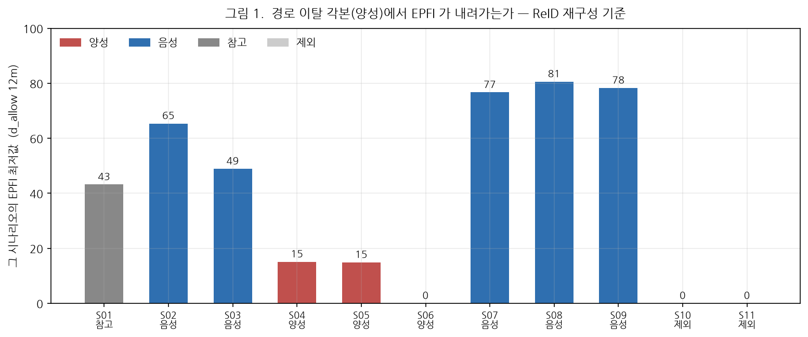
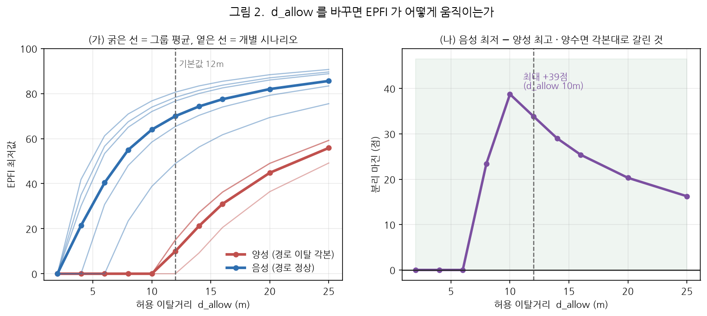
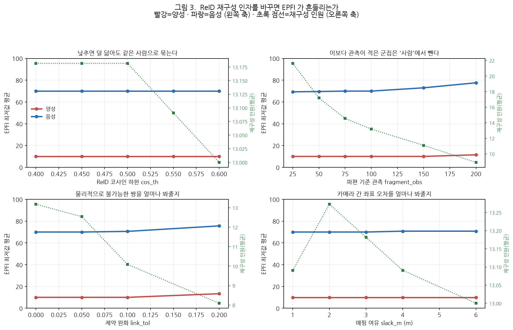

# 경로 충실도 지표(EPFI) 검증 결과보고서

**AI hub 1층·3층 합동 훈련 — 피난경로 개정본 기준 · 파라미터 민감도 포함**

| 항목 | 내용 |
|---|---|
| 문서번호 | MACS-EVAC-VR-2026-006 |
| 문서구분 | 검증 결과보고서 (최종) |
| 작성일 | 2026년 9월 17일 |
| 작성 | PIA SPACE · MACS-EVAC 개발팀 |
| 검증대상 | 경로 충실도 지표(EPFI) |
| 측정 대상 | 개정 피난경로(`r1`·`r2`·`r3`) 기준 재녹화 세션 **14건** |
| 측정 기준 | **ReID 재구성(사람) 단위** · `d_allow` 12 m |
| 스윕 범위 | `d_allow` 10수준 + ReID 재구성 인자 4종 20수준 |
| 판정 | **조건부 적합** — 이탈 각본을 명확히 구분하나 **기본값 `d_allow` 4 m 에서는 판정 불가** |

---

## 1. 지표를 어떻게 읽는가

### 1.1 정의

$$\mathrm{EPFI}_i = \max\!\left(0,\; 1 - \frac{\overline{d_i}}{d_{\mathrm{allow}}}\right) \times 100$$

$\overline{d_i}$ 는 그 사람이 **배정된 경로 중심선에서 평균 얼마나 떨어져 있었는지**(m),
$d_{\mathrm{allow}}$ 는 **허용 이탈거리**다.

### 1.2 값의 방향 — **클수록 좋다**

| 값 | 의미 |
|---|---|
| **100** | 경로 위를 그대로 따라 걸었다 (이탈 0) |
| **50** | 평균 이탈이 허용치의 절반 |
| **0** | 평균 이탈이 **허용치 이상** — 얼마나 더 벗어났는지는 구분되지 않는다 |

> **0점은 "바닥"이지 "최악"이 아니다.** `max(0, …)` 로 잘리므로 허용치를 넘긴 사람은
> 5 m 를 벗어났든 15 m 를 벗어났든 **똑같이 0점**이다. `d_allow` 가 작으면 다수가
> 0점에 몰려 순위를 매길 수 없다(§3).

### 1.3 `d_allow` 는 "한쪽 반경"이다

중심선에서 **좌·우 한쪽 방향의 거리**다. 통로 폭으로 읽으려면 **2배**해야 한다
(`d_allow` 12 m → 통로 폭 24 m).

### 1.4 왜 ReID 재구성 단위인가

엔진이 실시간으로 내는 EPFI 는 **카메라별 트랙 조각(트랙렛)** 단위다. 참가자 10명이
조각 수십 개로 갈리고, **조각마다 경로가 새로 배정**되어 우회한 사람일수록 이탈이
0 으로 리셋된다(MACS-EVAC-VR-2026-004 부록 B, 최대 4.5배 과소평가).

본 검증은 **ReID 재구성**(④ 리플레이 → [리포트] → ID 재구성)으로 조각을 사람으로
묶고 **경로를 한 번만 배정해** 정의식대로 다시 적분한 값을 쓴다.

---

## 2. 검증 설계

### 2.1 역할 구분

| 역할 | 시나리오 | 근거 |
|---|---|---|
| **양성** | S04 · S05 · S06 | **경로를 벗어나도록** 촬영한 각본 |
| **음성** | S02 · S03 · S07 · S08 · S09 | 경로는 정상 — 속도·밀도만 다르다 |
| 참고 | S01 | 일부(2명) 우회 포함 |
| **제외** | S10 · S11 | 두 출구로 갈리는데 **전원이 `r3` 한 경로에 배정** (§5) |
| 별도 | S12 · S13 · S14 | 1층 — 각본에 이탈 요소 없음 |

**음성 대조군이 핵심이다.** EPFI 는 경로 이탈 지표이므로 느리게 걷거나 밀집한 것만으로는
떨어지면 안 된다.

### 2.2 판정 기준

> **이탈 각본(양성)의 EPFI 최저값이 음성보다 낮게 나오는가?**

각 시나리오의 **EPFI 최저값**(가장 많이 벗어난 사람)을 보고, 양성이 음성보다
낮은지를 본다. 누가 이탈했는지는 각본으로만 알고 영상으로 재확인하지 않았으므로
개인을 지목해 맞히는 검증은 하지 않는다.

---

## 3. 기본 설정에서의 결과



**그림 1 읽는 법** — 막대 높이가 그 시나리오의 **EPFI 최저값**이다.
**막대가 낮을수록 경로를 크게 벗어난 사람이 있었다는 뜻**이다.
빨강이 이탈 각본(양성), 파랑이 경로가 정상인 각본(음성)이다.

| 시나리오 | 역할 | **EPFI 최저값** | 최대 이탈 | 배정 경로 |
|---|---|---:|---:|---|
| **S04** | **양성** | **15** | 10.19 m | r1 · r2 · auto-evac-1 |
| **S05** | **양성** | **15** | 10.21 m | r1 · r2 |
| **S06** | **양성** | **0** | 12.71 m | r1 · r2 · auto-evac-1 |
| S02 | 음성 | 65 | 4.16 m | r1 · r2 · auto-evac-1 |
| S03 | 음성 | 49 | 6.13 m | r1 · r2 · auto-evac-1 |
| S07 | 음성 | 77 | 2.80 m | r3 |
| S08 | 음성 | 81 | 2.33 m | r3 |
| S09 | 음성 | 78 | 2.60 m | r3 |
| S01 | 참고 | 43 | 6.81 m | r1 · r2 · auto-evac-1 |

> ### **양성 0~15 대 음성 49~81 — 34점 차이로 겹치지 않는다.**

경로를 벗어나도록 촬영한 3건에서 EPFI 가 명확히 내려가고, 속도·밀도만 다른 5건은
49점 이상을 유지한다. **EPFI 가 경로 이탈에만 반응한다**는 뜻이다.
참고 시나리오 S01(우회 2명 포함)이 43점으로 양성과 음성 사이에 놓이는 것도 각본과 맞는다.

---

## 4. 파라미터 민감도

### 4.1 `d_allow` — 판정 가능 여부를 가르는 인자



**그림 2 읽는 법** — 왼쪽은 `d_allow` 를 바꿨을 때 EPFI 최저값이 어떻게 변하는지다
(굵은 선이 그룹 평균, 옅은 선이 개별 시나리오). **`d_allow` 가 커질수록 모든 값이
올라간다** — 허용치가 넓어지면 같은 이탈도 관대하게 평가되기 때문이다.

오른쪽은 **분리 마진** = (음성 최저값) − (양성 최고값) 이다.
**0보다 커야 양성이 모두 음성보다 낮다**, 즉 지표가 각본을 읽은 것이다.

| `d_allow` | 양성 최고 | 음성 최저 | **분리 마진** |
|---:|---:|---:|---:|
| 2 · 4 · 6 m | 0 | 0 | **0** (전부 0점) |
| 8 m | 0 | 23 | +23 |
| **10 m** | **0** | **39** | **+39 ← 최대** |
| **12 m** | 15 | 49 | **+34** (본 검증 기준) |
| 16 m | 36 | 62 | +25 |
| 20 m | 49 | 69 | +20 |
| 25 m | 59 | 76 | +16 |

**현재 기본값 4 m 에서는 양성·음성 모두 0점이라 아무것도 구별되지 않는다.**
8 m 부터 갈리기 시작해 10~12 m 에서 마진이 최대가 되고, 그보다 키우면 다시 줄어든다
(모두가 높은 점수를 받아 차이가 압축되기 때문).

> **왜 4 m 로는 안 되는가** — 사람 단위로 묶어 재적분하면 이탈거리가 트랙렛 단위보다
> 커진다(경로가 리셋되지 않으므로). 이 시설의 사람별 이탈은 최대 2.3~12.7 m 라,
> 허용치 4 m 로는 절반 이상이 바닥에 깔린다.

### 4.2 ReID 재구성 인자 — 판정은 흔들리지 않는다



**그림 3 읽는 법** — 왼쪽 축(빨강·파랑)이 EPFI 최저값 평균, 오른쪽 축(초록 점선)이
**재구성된 인원 수**다. 재구성 인원이 크게 변해도 **빨강과 파랑 사이의 간격이
유지되는지**가 관심사다.

| 인자 | 재구성 인원 변화 | **분리 마진 변화** |
|---|---|---|
| `cos_th` 0.40 → 0.60 | 13.1 → 13.0 명 | **+33.8 → +33.8** (변화 없음) |
| `slack_m` 1 → 6 m | 12.9 → 13.1 명 | **+33.8 → +33.8** (변화 없음) |
| `fragment_obs` 25 → 200 | **23.5 → 8.1 명** | +33.8 → +29.3 (4.5점) |
| `link_tol` 0 → 0.2 | 13.1 → 7.9 명 | +36.7 → +25.3 (11.4점) |

> **핵심** — `fragment_obs` 를 25 에서 200 으로 바꾸면 **재구성 인원이 23.5명에서
> 8.1명으로 3분의 1** 이 되는데도, 분리 마진은 33.8 → 29.3 으로 **4.5점밖에 안 줄어든다.**
> `cos_th`·`slack_m` 은 아예 영향이 없다.
>
> **EPFI 판정이 ReID 재구성 설정에 강건하다**는 뜻이다. 재구성이 사람을 몇 명으로
> 묶든, "크게 벗어난 사람이 있었다"는 사실은 그대로 잡힌다.

`link_tol`(제약 완화)만 마진을 11.4점 움직인다 — 물리적으로 불가능한 쌍을 억지로
묶으면 한 사람 안에 서로 다른 사람의 궤적이 섞여 이탈거리가 왜곡되기 때문이다.
**기본값 0(순수 complete-link)을 유지하는 편이 안전하다.**

---

## 5. S10·S11 을 제외한 이유

두 시나리오는 인원이 두 출구로 갈리는데, **재구성된 전원이 `r3` 하나에 배정**됐다
(S10 15명 전원 · S11 17명 전원). 다른 출구로 간 사람은 배정 경로에서 멀어질 수밖에
없어 EPFI 가 0 이 된다 — **경로를 이탈해서가 아니라 그쪽으로 가는 경로가 배정되지
않아서**다.

| 시나리오 | 출구 분배 | 배정 경로 | EPFI 최저 | 최대 이탈 |
|---|---|---|---:|---:|
| S10 | 3 : 7 | `r3` 전원 | 0 | 15.15 m |
| S11 | 3 : 9 | `r3` 전원 | 0 | 13.06 m |

경로 이탈 판정이 성립하지 않으므로 대조에서 제외했다.

> **개선 과제** — 출구가 둘인 구간은 **각 출구로 향하는 경로가 각 시작 지점에서
> 각각 최근접이 되도록** 배치해야 한다. 경로 배정은 첫 관측 위치의 최근접 경로로
> 자동 결정되므로, 경로 배치가 곧 배정 규칙이 된다.

---

## 6. 종합 판정

| 검증 항목 | 결과 | 판정 |
|---|---|:---:|
| 정의식 구현 | 이탈 시간 적분 · 정규화 정상 | **적합** |
| 이탈 각본 검출 (`d_allow` 12 m) | 양성 0~15 대 음성 49~81, 34점 분리 | **적합** |
| 음성 대조군 유지 | 속도·밀도 각본이 49점 이상 유지 | **적합** |
| ReID 인자 강건성 | 인원 23→8명 변화에도 마진 4.5점 이내 | **적합** |
| **기본값(`d_allow` 4 m)** | **양성·음성 모두 0점 — 판정 불가** | **부적합** |
| 두 출구 시나리오 | 경로 배정이 한 곳으로 몰려 판정 불가 | **개선 필요** |

> ## 종합 판정: **조건부 적합**
>
> EPFI 는 **경로 이탈 각본을 명확히 구분**하며, ReID 재구성 설정에도 강건하다.
> 다만 **현재 기본값 `d_allow` 4 m 에서는 모든 값이 0점이라 판정 자체가 불가능**하다.

### 조치 사항

| 우선순위 | 조치 | 근거 |
|:---:|---|---|
| 1 | **`d_allow` 4 m → 10~12 m** | §4.1 — 4 m 는 전부 0점, 10~12 m 에서 마진 최대 |
| 2 | `link_tol` 기본값 0 유지 | §4.2 — 유일하게 마진을 11점 흔드는 인자 |
| 3 | 두 출구 구간에 **출구별 경로** 배치 | §5 — S10·S11 판정 불가 원인 |
| 4 | EPFI 는 **재구성 기준**으로 읽도록 안내 | §1.4 — 트랙렛 기준은 우회를 과소평가 |

---

## 7. 한계 및 유의사항

1. **`d_allow` 10~12 m 는 한쪽 반경**이라 통로 폭으로는 20~24 m 다. 물리적 통로 폭으로는
   과하며, **경로가 실제 동선을 거칠게 근사하고 매핑 오차가 얹힌 결과**다. 경로 배치와
   카메라 매핑을 다듬으면 더 좁힐 수 있다. 이 값을 "허용 통로 폭"으로 홍보해서는 안 된다.
2. **왕복 동선(S05)은 정의상 완전히 잡히지 않는다.** 경로 위를 되짚어 돌아가면
   중심선까지의 거리가 0 에 가깝다. S05 가 15점으로 잡힌 것은 복귀 경로가 원래
   경로에서 벗어났기 때문이며, 정확히 되돌아간다면 검출되지 않는다.
3. **각본상 이탈 인원은 촬영 계획 기준**이다. 실제로 몇 명이 얼마나 벗어났는지는
   영상으로 재확인하지 않았다. 본 보고서는 **값이 각본대로 내려가는가**만 판정한다.
4. **ReID 재구성 결과에 의존한다.** 재구성 인원은 10~17명(실제 참가자 10명)으로
   과분할이 남아 있다. §4.2 는 그 흔들림이 판정을 바꾸지 않음을 보였을 뿐,
   재구성이 정확하다는 뜻은 아니다.
5. 본 검증은 **AI hub 1·3층 1개 패키지**다. 다른 시설에서는 `d_allow` 를 그 시설의
   사람별 이탈 분포로 다시 정해야 한다.
6. 옛 경로 `auto-evac-1` 이 floor4 에 남아 있어 일부 인원이 그쪽에 배정됐다.
   **제거하고 재계산해도 본 보고서의 판정 수치는 동일**함을 확인했다(개인별로는
   최대 15.6점 움직이나 최저값은 불변).

---

## 8. 재현 절차

```bash
python docs/deliverables/2026-09-17_EPFI-경로충실도-검증보고서-경로개정본/data/collect.py
python docs/deliverables/2026-09-17_EPFI-경로충실도-검증보고서-경로개정본/data/make_figures.py
```

화면에서는 ④ 리플레이 → `경로v2 …` 세션 → [리포트] → ID 재구성 →
`사람별 지표` 의 **[재구성 기준]** 을 본다. `d_allow` 는 [임계값 조정] 값이 전달된다.

---

## 부록 A. 원자료

| 파일 | 내용 |
|---|---|
| [`data/epfi_sweep.csv`](data/epfi_sweep.csv) | 14세션 × ReID 인자 20설정 — 인원·EPFI·이탈·대피시간·배정경로 |
| [`data/epfi_by_dallow.csv`](data/epfi_by_dallow.csv) | 시나리오별 `d_allow` 10수준 EPFI 최저값 |
| [`data/epfi_sweep.json`](data/epfi_sweep.json) | 위 + 사람별 이탈거리 전수 |
| [`data/collect.py`](data/collect.py) · [`data/make_figures.py`](data/make_figures.py) | 수집·작도 스크립트 |

---

<div align="center">

**— 이상 —**

</div>
