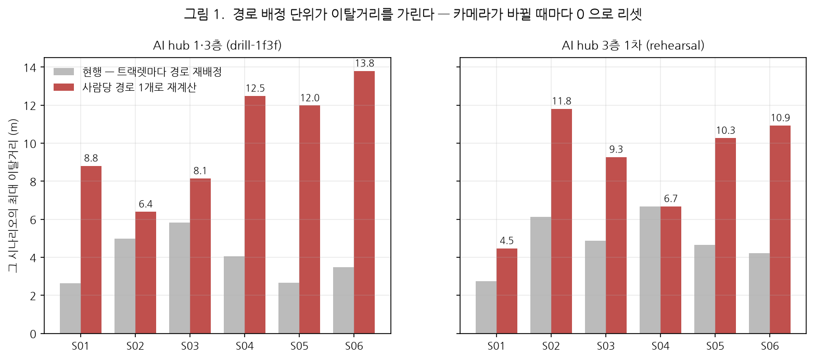
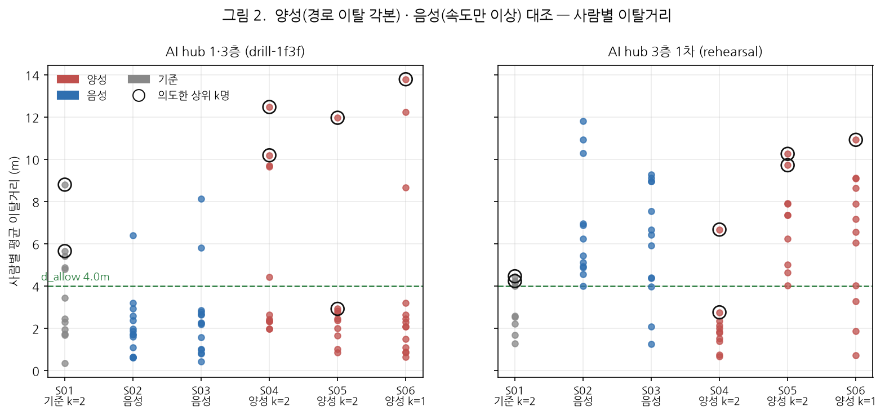

# 경로 충실도 지표(EPFI) 검증 결과보고서

**AI hub 피난훈련 실증영상 기반 — 경로 이탈 각본 대조**

| 항목 | 내용 |
|---|---|
| 문서번호 | MACS-EVAC-VR-2026-004 |
| 문서구분 | 검증 결과보고서 (최종) |
| 작성일 | 2026년 9월 17일 |
| 작성 | PIA SPACE · MACS-EVAC 개발팀 |
| 검증대상 | MACS-EVAC 피난분석 엔진 — 경로 충실도 지표(EPFI) |
| 검증범위 | 경로 이탈 각본 3건(양성) 대 속도 이상 각본 2건(음성), 2개 패키지 12개 세션 |
| 판정 | **부적합 — 구현 결함 확인** · 경로 배정 단위를 고쳐야 한다 (§3) |

---

## 1. 개요

### 1.1 목적

EPFI는 **"권장 피난경로를 얼마나 충실히 따랐는가"** 를 재는 지표다. 본 보고서는
경로를 실제로 벗어나도록 촬영한 각본과, **속도만 다르고 경로는 정상인** 각본을
대조해 **EPFI가 경로 이탈만 가려내는가**를 검증한다.

### 1.2 대조군 설계

촬영 각본을 역할로 나눴다. 음성 대조군이 핵심이다 — EPFI는 경로 이탈 지표이므로
**느리게 걷거나 멈춘 것만으로는 떨어지면 안 된다.**

| 시나리오 | 역할 | 각본 | 이탈 인원 |
|---|---|---|---:|
| S01 | 기준 | 권장경로 + 우측 우회 2명 | 2 |
| S02 | **음성** | **매우 느린 속도 — 경로는 정상** | 0 |
| S03 | **음성** | **2초 멈췄다 이동 — 경로는 정상** | 0 |
| S04 | **양성** | **2명이 완전히 빙 돌아 진입** | 2 |
| S05 | **양성** | **2명이 시작점으로 돌아갔다 재진입** | 2 |
| S06 | **양성** | **1명이 빙빙 돌아 진입** | 1 |

S02·S03은 IDR을 겨냥해 촬영했지만 **출발점이 같고 경로를 이탈하지 않으므로**
EPFI의 음성 대조군으로 쓸 수 있다.

### 1.3 근거 문서

| 구분 | 문서 |
|---|---|
| 상위 요구사항 | `docs/requirements/삼성화재-피난훈련-정량평가-4대지표-요구사항.md` |
| 지표 정의 | `docs/requirements/EPFI-경로충실도지표.md` |
| 촬영 시나리오 | `docs/AI-Hub실증-피난훈련-4대지표-검증-시나리오.md` |

---

## 2. 지표 정의 및 검증 방법

### 2.1 지표 정의

$$\mathrm{EPFI}_i = \max\!\left(0,\; 1 - \frac{\int_0^{T_i} d_i(t)\,dt}{T_i \cdot d_{\mathrm{allow}}}\right) \times 100$$

- $d_i(t)$ : 시각 $t$ 에 대상 $i$ 가 **배정된 경로 중심선**에서 떨어진 거리 (m)
- $d_{\mathrm{allow}}$ : 허용 이탈거리 — 중심선에서 **한쪽 반경**(현재 기본 4 m)
- 값이 클수록 좋다. 평균 이탈거리가 $d_{\mathrm{allow}}$ 를 넘으면 0 점이다.

**경로 배정**은 대상의 **첫 관측 위치에서 가장 가까운 경로**로 정해진다.

### 2.2 검증 데이터

| 패키지 / 층 | 세션 | 경로 | 카메라 |
|---|---:|---:|---:|
| AI hub 1·3층 (`drill-1f3f`, floor4) | 6 | 5 | 7 |
| AI hub 3층 1차 (`rehearsal`, floor6) | 6 | 5 | 16 |

### 2.3 사람 단위 집계가 필요한 이유

엔진이 내는 `person_metrics` 는 **사람이 아니라 트랙렛(카메라별 트랙 조각)** 단위다.
실측에서 참가자 10명이 트랙렛 **34~96개**로 갈렸다(1인당 5~9조각). 이 상태로는
"2명이 빙 돌았다"를 확인할 수 없다.

시스템은 **여정 재구성**(④ 리플레이 → [리포트] → ID 재구성)으로 조각을 사람으로 묶어
`사람별 지표` 표를 이미 제공한다. 본 검증도 **같은 재구성**(기본 파라미터)을 썼다.

다만 그 표의 EPFI 는 **조각별 EPFI 를 관측 수로 가중평균**한 값이었다. 조각마다 배정
경로가 다르므로(§3) 서로 다른 기준의 값을 섞는 셈이다. 그래서 본 검증은 정의식대로
**사람당 경로를 한 번만 배정해 다시 적분**했다.

```
dev_person = Σ(T_i · dev_i) / Σ T_i      ← 참고용: 조각값 가중평균(현행 화면)
EPFI_person = max(0, 1 − dev_person / d_allow) × 100
```

묶은 뒤 인원은 10~16명으로 실제 참가자 수(10명)에 근접한다.

```
dev_person = Σ(T_i · dev_i) / Σ T_i      ← 관측시간 가중 평균 (∫d dt 의 합을 ΣT 로 나눈 것과 같다)
EPFI_person = max(0, 1 − dev_person / d_allow) × 100
```

조각별 EPFI를 단순 평균하면 짧은 조각이 과대표된다. 묶은 뒤 인원은 10~16명으로
실제 참가자 수(10명)에 근접한다.

---

## 3. 핵심 발견 — 경로 배정이 트랙렛마다 리셋된다

### 3.1 무엇이 문제인가

```python
# system/metrics/session.py — observe_point()
p = self.persons.get(gid)          # gid = "rh_cam16:181" (카메라별 트랙 조각)
if p is None:
    rid, rpts = self._assign_route((x, y))   # 그 조각의 첫 관측에서 경로 배정
```

`gid` 가 **카메라별 트랙 조각**이므로, 카메라가 바뀌어 새 조각이 생길 때마다
**그 자리에서 가장 가까운 경로로 다시 배정**된다.

그 결과 **경로를 벗어나 다른 통로로 간 사람도, 그 통로의 경로에 새로 배정되어
이탈거리가 0 으로 리셋된다.** 우회가 길수록 카메라를 많이 거치므로, 역설적으로
**크게 우회할수록 더 잘 가려진다.**

### 3.2 실측



*그림 1. 같은 관측, 배정 단위만 바꾼 결과. 회색이 현행(트랙렛마다 재배정),
붉은색이 사람당 경로 1개로 재계산한 값이다.*

| 시나리오 | 역할 | 현행 최대 이탈 | 사람 단위 최대 이탈 | 배수 |
|---|---|---:|---:|---:|
| S04 | 양성 | 4.05 m | **12.48 m** | ×3.1 |
| S05 | 양성 | 2.67 m | **11.98 m** | ×4.5 |
| S06 | 양성 | 3.49 m | **13.80 m** | ×4.0 |
| S02 | 음성 | 4.98 m | 6.40 m | ×1.3 |
| S03 | 음성 | 5.82 m | 8.15 m | ×1.4 |

*AI hub 1·3층. 양성(우회) 각본에서 배수가 크다 — 가려진 양이 그만큼 많았다는 뜻이다.*

**현행 값으로는 양성 3건의 최대 이탈(2.7~4.1 m)이 음성 2건(5.0~5.8 m)보다 오히려 작다.**
지표가 경로 이탈을 반대로 읽고 있었다.

---

## 4. 대조군 검증 결과



*그림 2. 사람별 이탈거리. 검은 테두리는 각본상 이탈 인원 k명에 해당하는 상위 k개 점.*

### 4.1 AI hub 1·3층 — 분리된다

| 시나리오 | 역할 | 최대 | 중앙 | 판정선 초과 | 각본 |
|---|---|---:|---:|---:|---:|
| S01 | 기준 | 8.81 | 2.95 | 1명 | 2 |
| S02 | 음성 | 6.40 | 1.72 | 1명 | 0 |
| S03 | 음성 | 8.15 | 2.24 | 2명 | 0 |
| **S04** | **양성** | **12.48** | 2.54 | 4명 | 2 |
| **S05** | **양성** | **11.98** | 2.42 | 1명 | 2 |
| **S06** | **양성** | **13.80** | 2.20 | 3명 | 1 |

*판정선 = 그 시나리오 중앙값의 2배 또는 `d_allow`(4 m) 중 큰 값*

양성 3건의 최대 이탈이 **12.0~13.8 m**, 음성 2건은 **6.4~8.2 m** 로 뚜렷하게 갈린다.
**"경로를 크게 벗어난 사람이 있었다"는 사실 자체는 잡아낸다.**

### 4.2 AI hub 3층 1차 — 분리되지 않는다

| 시나리오 | 역할 | 최대 | 중앙 | 각본 |
|---|---|---:|---:|---:|
| S02 | 음성 | **11.81** | **5.85** | 0 |
| S03 | 음성 | **9.27** | **6.42** | 0 |
| S04 | 양성 | 6.68 | 1.86 | 2 |
| S05 | 양성 | 10.27 | 7.38 | 2 |
| S06 | 양성 | 10.93 | 6.87 | 1 |

**같은 각본인데 결과가 뒤집힌다.** 음성 S02·S03 의 중앙 이탈이 5.9~6.4 m 로
양성 S04(1.86 m)보다 크다. 이 패키지에서는 EPFI로 경로 이탈을 판정할 수 없다.

두 패키지의 차이는 카메라 수(7 대 16)와 매핑 품질이다. 카메라가 많을수록 화각 경계의
매핑 오차가 섞이고, 경로 5개가 교차하는 구간에서 배정이 흔들린다. **지표가 시설·매핑
조건에 좌우된다**는 뜻이며, 이 자체가 한계다.

### 4.3 인원 수는 집어내지 못한다


*그림 3. 각본상 이탈 인원과 측정된 이탈자 수.*

1·3층 기준으로도 **각본 인원과 측정 인원이 맞지 않는다.**

| 시나리오 | 각본 | 측정 | |
|---|---:|---:|---|
| S04 | 2명 | 4명 | 초과 |
| S05 | 2명 | **1명** | 누락 |
| S06 | 1명 | 3명 | 초과 |

**S05(시작점 복귀 후 재진입)의 누락은 정의상 필연이다.** 경로 위를 되짚어 돌아가면
중심선까지의 거리가 0 에 가깝다. EPFI 의 $d_i(t)$ 는 **부호 없는 최단거리**라
진행 방향을 보지 않으므로, 왕복 동선은 구조적으로 잡히지 않는다.

### 4.4 EPFI 값은 하한에 포화한다


*그림 4. 사람별 EPFI 분포 (`d_allow` 4 m).*

사람 단위로 계산하면 이탈거리가 커져 **0 점이 대량 발생**한다 — 3층 1차 S02·S05 는
사실상 전원이 0점이다. 현재 `d_allow` 4 m 는 **트랙렛 단위 이탈 분포**(중앙 1.79 m)에
맞춰 정한 값이라, 사람 단위로 바꾸면 함께 재조정해야 한다.

---

## 5. 종합 판정

| 검증 항목 | 결과 | 판정 |
|---|---|:---:|
| 정의식 구현 (적분·정규화) | 수식대로 동작 | **적합** |
| **경로 배정 단위** | **트랙렛마다 리셋 — 우회를 최대 4.5배 과소평가** | **부적합** |
| 경로 이탈 검출 (1·3층) | 양성 12~14 m vs 음성 6~8 m 로 분리 | 조건부 |
| 경로 이탈 검출 (3층 1차) | 음성이 양성보다 큼 — 분리 실패 | **부적합** |
| 이탈 인원 수 특정 | 2명→4명, 1명→3명, 2명→1명 | **부적합** |
| 왕복 동선 검출 | 정의상 불가(부호 없는 거리) | 한계 |

> ## 종합 판정: **부적합 — 구현 결함**
>
> EPFI 는 **경로 이탈을 구조적으로 과소평가**하고 있었다. 카메라가 바뀔 때마다
> 경로가 재배정되어, 크게 우회할수록 더 잘 가려진다(§3). **조치 1 로 수정했다**(§5).
>
> 사람 단위로 고치면 "이탈자가 있었다"는 **사실**은 잡히지만(1·3층),
> **몇 명인지**는 맞히지 못하고, 다른 패키지에서는 분리 자체가 실패한다.

### 조치 사항

| 우선순위 | 조치 | 근거 | 상태 |
|:---:|---|---|---|
| 1 | **경로 배정을 사람 단위로** — 여정 재구성 뒤 첫 관측 한 번만 배정 | §3.2 — 최대 4.5배 과소평가 | **✅ 반영 (2026-09-17)** |
| 2 | `d_allow` 재조정 — 사람 단위 이탈 분포로 다시 정한다 | §4.4 — 0점 포화 | 미착수 |
| 3 | 3층 1차 패키지의 매핑·경로 배치 점검 | §4.2 — 같은 각본, 반대 결과 | 미착수 |
| 4 | 왕복 동선은 EPFI 로 판정하지 않는다고 명시 | §4.3 — 정의상 한계 | 미착수 |

조치 1·2 는 **재촬영이 필요 없다.** 기존 녹화본으로 재계산하면 된다.

### 조치 1 반영 내용 (2026-09-17)

`journey.reconstruct()` 가 사람마다 **경로를 한 번만 배정해 EPFI 를 다시 적분**하고,
결과에 `epfi · dev_m · dev_max_m · route_id` 를 담는다. ④ 리플레이 → [리포트] →
ID 재구성의 `사람별 지표` 표가 그 값을 쓴다(옛 응답이면 조각값 가중평균으로 물러난다).
허용 이탈거리는 `d_allow` 파라미터로 받아, 리플레이에서 조정한 값이 그대로 반영된다.

같은 재구성이 **개인별 대피 소요시간**(`evac_sec` = 첫 관측 → 출구 통과)도 함께 낸다 —
`exit_at` 은 경보 기준이라 늦게 화면에 나타난 사람이 부풀려지는데, 이 값은 그 사람이
실제로 움직인 시간이다. 표에 `대피 s` 열로 나온다.

---

## 6. 한계 및 유의사항

1. **사람 단위 집계는 여정 재구성 결과에 의존한다.** 묶기가 틀리면 이탈거리도 틀린다.
   본 검증에서 재구성 인원은 10~16명(실제 10명)으로, 일부 과분할이 남아 있다.
2. **대조군이 각 2~3건이다.** 통계적 신뢰구간을 말할 표본이 아니며, 확인된 것은
   "1·3층에서는 양성이 음성보다 2배 가까이 큰 이탈을 보였다"는 사실이다.
3. **§4.3 의 판정선(중앙값 2배 또는 `d_allow`)은 이 보고서에서 정한 임시 기준**이다.
   요구사항에 정의된 값이 아니며, 인원 특정 기준을 정하려면 별도 합의가 필요하다.
4. **각본상 이탈 인원은 촬영 계획 기준**이다. 실제 촬영에서 몇 명이 얼마나 벗어났는지는
   영상으로 재확인하지 않았다 — 계획과 실제가 다를 가능성이 남아 있다.
5. 본 보고서의 값은 **`d_allow` 4 m** 기준이다. 이 값은 2026-09-17 에 10 m → 2 m → 4 m
   로 바뀌었으므로, 다른 시점의 문서와 직접 비교하면 안 된다.

---

## 7. 재현 절차

본문의 사람 단위 수치는 **제품 코드가 낸 값 그대로**다 — `collect.py` 는
`journey.reconstruct()` 의 `dev_m`·`epfi`·`evac_sec` 을 받아 정리만 한다.
보고서에서 따로 계산하지 않으므로 화면·API 와 숫자가 갈리지 않는다.

```bash
# 자료 수집 (리플레이 + 여정 재구성, 12세션 · 수 분)
python docs/deliverables/2026-09-17_EPFI-경로충실도-검증보고서/data/collect.py

# 그림·CSV 생성
python docs/deliverables/2026-09-17_EPFI-경로충실도-검증보고서/data/make_figures.py
```

---

## 부록 A. 원자료

| 파일 | 내용 |
|---|---|
| [`data/epfi_by_person.csv`](data/epfi_by_person.csv) | 사람별 전수 — 이탈거리·EPFI 를 두 배정 방식으로 |
| [`data/epfi_data.json`](data/epfi_data.json) | 위 + 관측 수·카메라 수·트랙렛 수·배정 경로 |
| [`data/collect.py`](data/collect.py) · [`data/make_figures.py`](data/make_figures.py) | 수집·작도 스크립트 |
| [`img/`](img/) | 본문 수록 그림 4종 |

---

<div align="center">

**— 이상 —**

</div>
