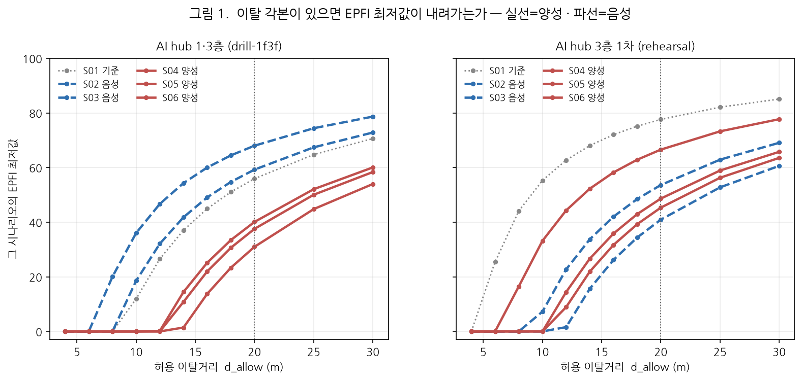
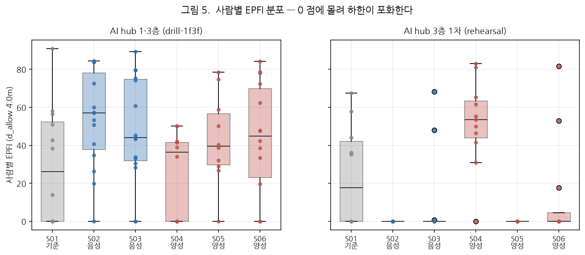
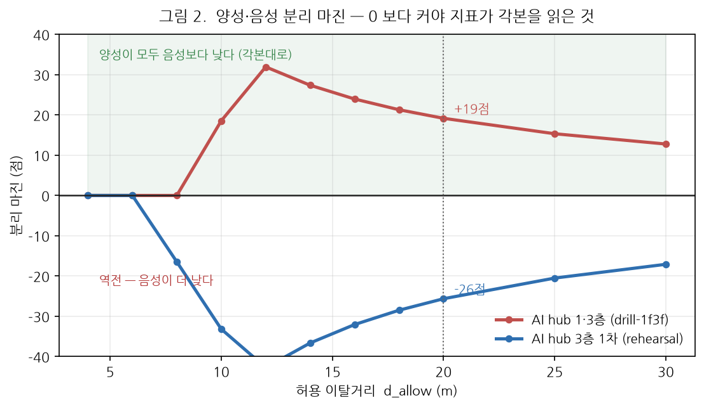
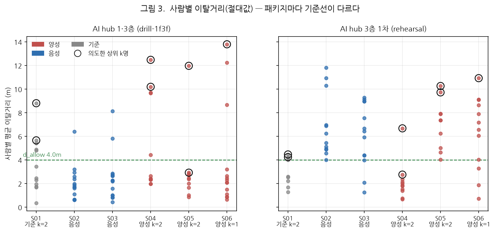
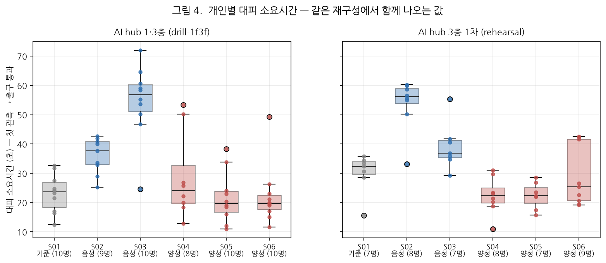
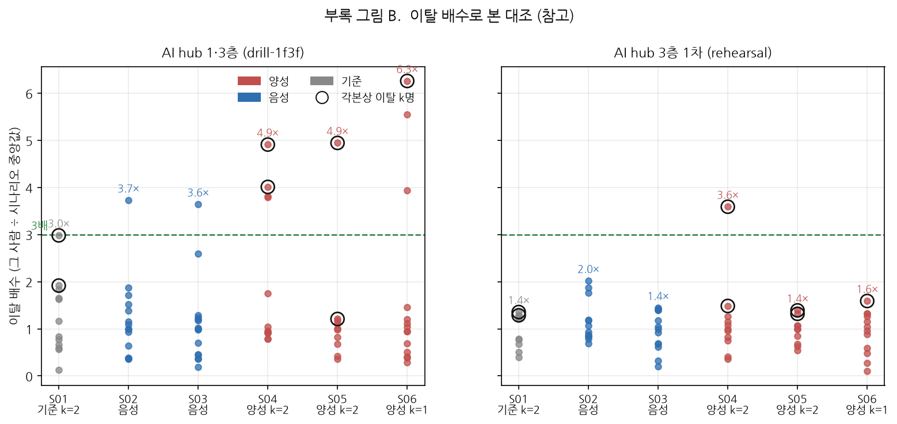

# 경로 충실도 지표(EPFI) 검증 결과보고서

**AI hub 피난훈련 실증영상 — ReID 재구성(사람 단위) 기준 분석**

| 항목 | 내용 |
|---|---|
| 문서번호 | MACS-EVAC-VR-2026-004 |
| 문서구분 | 검증 결과보고서 (최종) |
| 작성일 | 2026년 9월 17일 |
| 작성 | PIA SPACE · MACS-EVAC 개발팀 |
| 검증대상 | MACS-EVAC 피난분석 엔진 — 경로 충실도 지표(EPFI) |
| 측정 기준 | **ReID 재구성(global id) 사람 단위** — ④ 리플레이 → [리포트] → ID 재구성 |
| 검증범위 | 경로 이탈 각본 3건(양성) 대 속도 이상 각본 2건(음성), 2개 패키지 12개 세션 |
| 판정 | **조건부 적합** — 이탈 사실은 잡되 인원 특정·시설 간 일관성은 미흡 |

> **본 보고서의 모든 수치는 ReID 재구성 기준이다.** 카메라별 트랙 조각(트랙렛)
> 단위 값은 본문에서 쓰지 않는다. 두 기준의 차이와 그 원인은 **부록 B** 에 따로 둔다.

---

## 1. 개요

### 1.1 목적

EPFI는 **"권장 피난경로를 얼마나 충실히 따랐는가"** 를 재는 지표다. 본 보고서는
경로를 실제로 벗어나도록 촬영한 각본과, **속도만 다르고 경로는 정상인** 각본을
대조해 **EPFI가 경로 이탈만 가려내는가**를 검증한다.

### 1.2 대조군 설계

음성 대조군이 핵심이다 — EPFI는 경로 이탈 지표이므로 **느리게 걷거나 멈춘 것만으로는
떨어지면 안 된다.**

| 시나리오 | 역할 | 각본 | 이탈 인원 k |
|---|---|---|---:|
| S01 | 기준 | 권장경로 + 우측 우회 2명 | 2 |
| S02 | **음성** | **매우 느린 속도 — 경로는 정상** | 0 |
| S03 | **음성** | **2초 멈췄다 이동 — 경로는 정상** | 0 |
| S04 | **양성** | **2명이 완전히 빙 돌아 진입** | 2 |
| S05 | **양성** | **2명이 시작점으로 돌아갔다 재진입** | 2 |
| S06 | **양성** | **1명이 빙빙 돌아 진입** | 1 |

S02·S03은 IDR을 겨냥해 촬영했지만 **출발점이 같고 경로를 이탈하지 않으므로**
EPFI의 음성 대조군으로 쓸 수 있다.

### 1.3 근거 문서

| 구분 | 문서 |
|---|---|
| 상위 요구사항 | `docs/requirements/삼성화재-피난훈련-정량평가-4대지표-요구사항.md` |
| 지표 정의 | `docs/requirements/EPFI-경로충실도지표.md` |
| 촬영 시나리오 | `docs/AI-Hub실증-피난훈련-4대지표-검증-시나리오.md` |

---

## 2. 측정 기준 및 방법

### 2.1 지표 정의

$$\mathrm{EPFI}_i = \max\!\left(0,\; 1 - \frac{\int_0^{T_i} d_i(t)\,dt}{T_i \cdot d_{\mathrm{allow}}}\right) \times 100$$

- $d_i(t)$ : 시각 $t$ 에 대상 $i$ 가 **배정된 경로 중심선**에서 떨어진 거리 (m)
- $d_{\mathrm{allow}}$ : 허용 이탈거리 — 중심선에서 **한쪽 반경**(본 검증 4 m)
- 값이 클수록 좋다. 평균 이탈거리가 $d_{\mathrm{allow}}$ 를 넘으면 0 점이다.

### 2.2 측정 단위 — 사람

엔진이 실시간으로 내는 값은 **트랙렛(카메라별 트랙 조각)** 단위다. 참가자 10명이
조각 **34~96개**로 갈려(1인당 5~9조각) 그대로는 "2명이 빙 돌았다"를 확인할 수 없다.

본 검증은 **ReID 재구성**(④ 리플레이 → [리포트] → ID 재구성, 기본 파라미터)으로
조각을 사람으로 묶은 뒤, **사람마다 경로를 한 번만 배정해** 정의식대로 적분한 값을
쓴다. 이 계산은 `journey.reconstruct()` 가 수행하며, 보고서는 그 값을 그대로 받는다
— 화면·API·보고서의 숫자가 갈리지 않는다.

재구성 후 인원은 **10~16명**(실제 참가자 10명)이다.

## 3. 검증 결과 — 이탈하면 EPFI 값이 내려가는가

### 3.1 무엇을 판정하는가

누가 이탈했는지는 **각본으로만** 알 수 있고 영상으로 재확인하지 않았다(§6-4).
그러므로 개인을 지목해 맞히는 검증은 성립하지 않는다. 검증할 수 있는 것은 하나다.

> **이탈 각본이 있는 시나리오에서 EPFI 값이 실제로 더 낮게 나오는가?**

시나리오마다 **EPFI 최저값**(가장 많이 벗어난 사람의 값)을 보고, 양성 3건이
음성 2건보다 낮은지 확인한다.

### 3.2 `d_allow` 를 함께 봐야 하는 이유



*그림 1. 시나리오별 EPFI 최저값. 실선이 양성(이탈 각본), 파선이 음성(속도만 이상).*

EPFI 는 $\max(0,\;1-\bar d/d_{\mathrm{allow}})$ 이라 **평균 이탈이 $d_{\mathrm{allow}}$ 를
넘으면 전부 0** 이 된다. 현재 기본값 4 m 에서는 12개 시나리오의 최저값이
**모두 0** 이라 아무것도 구별되지 않는다. 그래서 `d_allow` 를 넓혀가며 본다.



*그림 5. `d_allow` 4 m 에서의 사람별 EPFI 분포 — 0 점에 몰려 순위를 매길 수 없다.*

### 3.3 측정표 — 시나리오별 EPFI 최저값

**AI hub 1·3층**

| 시나리오 | 역할 | 4 m | 8 m | 12 m | 16 m | **20 m** | 25 m |
|---|---|---:|---:|---:|---:|---:|---:|
| S01 | 기준 | 0 | 0 | 27 | 45 | 56 | 65 |
| S02 | 음성 | 0 | 20 | 47 | 60 | **68** | 74 |
| S03 | 음성 | 0 | 0 | 32 | 49 | **59** | 67 |
| **S04** | **양성** | 0 | 0 | 0 | 22 | **38** | 50 |
| **S05** | **양성** | 0 | 0 | 0 | 25 | **40** | 52 |
| **S06** | **양성** | 0 | 0 | 0 | 14 | **31** | 45 |

**AI hub 3층 1차**

| 시나리오 | 역할 | 4 m | 8 m | 12 m | 16 m | **20 m** | 25 m |
|---|---|---:|---:|---:|---:|---:|---:|
| S01 | 기준 | 0 | 44 | 63 | 72 | 78 | 82 |
| S02 | 음성 | 0 | 0 | 2 | 26 | **41** | 53 |
| S03 | 음성 | 0 | 0 | 23 | 42 | **54** | 63 |
| **S04** | **양성** | 0 | 16 | 44 | 58 | **67** | 73 |
| **S05** | **양성** | 0 | 0 | 14 | 36 | **49** | 59 |
| **S06** | **양성** | 0 | 0 | 9 | 32 | **45** | 56 |

### 3.4 분리 마진



*그림 2. 분리 마진 = (음성 최저값 중 가장 낮은 것) − (양성 최저값 중 가장 높은 것).
양수면 양성이 모두 음성보다 낮다 = 지표가 각본을 읽은 것이다.*

| `d_allow` | AI hub 1·3층 | AI hub 3층 1차 |
|---:|---:|---:|
| 4 m | 0 (전부 0점) | 0 (전부 0점) |
| 8 m | 0 | −33 |
| 12 m | **+32** | −40 |
| 16 m | **+24** | −32 |
| **20 m** | **+19** | **−26** |
| 25 m | **+15** | −21 |
| 30 m | **+13** | −17 |

### 3.5 판독

**① AI hub 1·3층 — 값이 내려간다.**
`d_allow` 12 m 이상에서 **양성 3건이 음성 2건보다 예외 없이 낮다.**
20 m 기준 양성 31·38·40 대 음성 59·68 로 **19점 이상 벌어지며 겹치지 않는다.**
이탈 각본이 EPFI 하락으로 나타난다는 뜻이다.

**② AI hub 3층 1차 — 뒤집혀 있다.**
전 구간에서 마진이 **음수**다. 20 m 기준 양성 최고가 67(S04)인데 음성 최저가
41(S02)로, **이탈 각본이 없는 쪽이 더 낮게 나온다.** 이 패키지에서는 EPFI 로
경로 이탈을 판정할 수 없다.

**③ 현재 기본값 `d_allow` 4 m 에서는 어느 쪽도 판정 불가다.**
12개 시나리오 전부 최저값 0점이다.

두 패키지의 차이는 카메라 수(7 대 16)와 매핑 품질이다. 3층 1차는 사람별 이탈거리
중앙값 자체가 5.9~7.4 m 로 높아(1·3층은 1.7~3.0 m) 개별 이탈이 잡음에 묻힌다.



*그림 3. 사람별 이탈거리 절대값 — 3층 1차는 전체 수준이 높다.*

---

## 4. 같은 재구성에서 함께 나오는 값 — 대피 소요시간



*그림 4. 개인별 대피 소요시간(첫 관측 → 출구 통과).*

ReID 재구성은 사람 단위로 출구 통과 시각을 알므로, **개인별 대피 소요시간**을
함께 낸다. 4대 지표에는 없는 값이다.

```
대피 소요시간 = 출구 통과 시각 − 그 사람이 처음 관측된 시각
```

경보 기준이 아니라 **첫 관측 기준**인 이유: 경보 후 뒤늦게 화면에 들어온 사람을
느렸다고 오해하지 않기 위해서다(실측 p12 — 경보 기준 48.9초, 첫 관측 기준 42.9초).

| 시나리오 | 대피 중앙값 |
|---|---:|
| 1·3층 S05 (양성) | 19.6 s |
| 1·3층 S06 (양성) | 19.8 s |
| 1·3층 S01 (기준) | 23.7 s |
| 1·3층 S04 (양성) | 24.0 s |
| **1·3층 S02 (음성 — 느린 속도)** | **37.7 s** |
| **1·3층 S03 (음성 — 멈췄다 이동)** | **56.8 s** |

**속도 각본이 대피 소요시간에 그대로 드러난다.** 느리게 걷게 한 S02 가 37.7초,
멈췄다 가게 한 S03 이 56.8초로, 정상 진행(19.6~24.0초)의 1.6~2.9배다.

EPFI 가 구별하지 못한 S02·S03 을 이 값은 명확히 가른다 — **속도 이상은 EPFI 가
아니라 대피 소요시간으로 보는 것이 맞다**는 뜻이다.

---

## 5. 종합 판정

| 검증 항목 | 결과 | 판정 |
|---|---|:---:|
| 정의식 구현 (적분·정규화) | 수식대로 동작 | **적합** |
| **이탈하면 값이 내려가는가 (1·3층)** | `d_allow` ≥12 m 에서 양성이 모두 음성보다 낮음, 마진 +13~+32점 | **적합** |
| **이탈하면 값이 내려가는가 (3층 1차)** | 전 구간 역전 — 마진 −17~−40점 | **부적합** |
| 현재 기본값(`d_allow` 4 m) 해상도 | 12개 시나리오 전부 최저값 0점 | **부적합** |
| 왕복 동선 검출 | 정의상 불가(부호 없는 거리) | 한계 |
| (참고) 대피 소요시간 | 속도 각본을 1.6~2.9배로 구분 | **적합** |

> ## 종합 판정: **조건부 적합**
>
> **경로 이탈 각본이 EPFI 하락으로 나타난다** — 단, AI hub 1·3층에서,
> `d_allow` 를 12 m 이상으로 넓혔을 때만이다.
>
> **현재 기본값 4 m 에서는 모든 시나리오가 0점이라 판정 자체가 불가능**하고,
> AI hub 3층 1차에서는 양성과 음성이 **뒤집혀 나온다.**
> 지금 상태로 현장 판정에 쓸 수 없다.

### 조치 사항

| 우선순위 | 조치 | 근거 | 상태 |
|:---:|---|---|---|
| 1 | 경로 배정을 사람 단위로 | 부록 B — 최대 4.5배 과소평가 | **✅ 반영 (2026-09-17)** |
| 2 | **`d_allow` 를 12~20 m 로 재조정** | §3.4 — 4 m 는 전 시나리오 0점, 12 m 부터 분리 | **미착수 (가장 시급)** |
| 3 | 3층 1차 패키지의 매핑·경로 배치 점검 | §3.5 — 마진이 음수(역전) | 미착수 |
| 4 | 왕복 동선·속도 이상은 EPFI 로 판정하지 않는다고 명시 | §3.5 · §4 | 미착수 |
| 5 | 대피 소요시간을 훈련 평가 항목으로 채택 검토 | §4 — 속도 각본을 명확히 구분 | 제안 |

조치 2·3 은 **재촬영이 필요 없다.** 기존 녹화본으로 재계산하면 된다.

> **조치 2 주의** — 12~20 m 는 "중심선에서 한쪽 반경"이라 통로 폭으로는 24~40 m 다.
> 물리적 통로 폭으로는 과하다. 이 값이 필요한 것은 **경로가 실제 동선을 거칠게만
> 근사하고 매핑 오차가 얹히기 때문**이며, 경로 배치·매핑을 개선하면 더 좁힐 수 있다.
> `d_allow` 를 키우는 것은 근본 해결이 아니라 현 조건에서 판정을 가능하게 하는 조정이다.

---

## 6. 한계 및 유의사항

1. **ReID 재구성 결과에 의존한다.** 묶기가 틀리면 이탈거리도 틀린다. 본 검증의
   재구성 인원은 10~16명(실제 10명)으로 과분할이 남아 있다.
2. **대조군이 각 2~3건이다.** 통계적 신뢰구간을 말할 표본이 아니다.
3. **본 보고서는 "값이 내려가는가"만 판정한다.** 누가 이탈했는지는 각본으로만 알고
   영상으로 재확인하지 않아, 개인을 지목해 맞히는 검증은 하지 않았다.
   인원 특정 기준을 정하려면 별도 합의와 영상 대조가 필요하다(부록 C 참고).
4. **각본상 이탈 인원은 촬영 계획 기준**이다. 실제로 몇 명이 얼마나 벗어났는지는
   영상으로 재확인하지 않았다 — 계획과 실제가 다를 가능성이 남아 있다.
5. 본 보고서의 값은 **`d_allow` 4 m** 기준이다. 이 값은 2026-09-17 에 10 → 2 → 4 m
   로 바뀌었으므로, 다른 시점의 문서와 직접 비교하면 안 된다.
6. **대피 소요시간(§4)은 출구를 통과한 사람만의 값**이다. 통과가 기록되지 않은
   사람(1·3층 S04 에서 12명 중 4명)은 빠져 있어, 느린 사람이 누락되면 중앙값이
   낙관적으로 나올 수 있다.

---

## 7. 재현 절차

본문의 모든 수치는 **제품 코드가 낸 값 그대로**다 — `collect.py` 는
`journey.reconstruct()` 의 `dev_m`·`epfi`·`evac_sec` 을 받아 정리만 한다.

```bash
python docs/deliverables/2026-09-17_EPFI-경로충실도-검증보고서/data/collect.py
python docs/deliverables/2026-09-17_EPFI-경로충실도-검증보고서/data/make_figures.py
```

화면에서 보려면 ④ 리플레이 → [리포트] → ID 재구성 → `사람별 지표` 에서
**[재구성 기준]** 을 고른다.

---

## 부록 A. 원자료

| 파일 | 내용 |
|---|---|
| [`data/epfi_by_person.csv`](data/epfi_by_person.csv) | 사람별 전수 — 두 기준의 이탈거리·EPFI, 대피 소요시간 |
| [`data/epfi_data.json`](data/epfi_data.json) | 위 + 관측 수·카메라 수·트랙렛 수·배정 경로 |
| [`data/collect.py`](data/collect.py) · [`data/make_figures.py`](data/make_figures.py) | 수집·작도 스크립트 |

---

## 부록 B. 트랙렛 기준과의 차이 (2026-09-17 수정 전 구현)

본문은 재구성(사람) 기준만 다뤘다. 여기서는 **왜 트랙렛 기준을 쓰지 않는지**를
기록한다.

### B.1 무엇이 문제였나

```python
# system/metrics/session.py — observe_point()
p = self.persons.get(gid)          # gid = "rh_cam16:181" (카메라별 트랙 조각)
if p is None:
    rid, rpts = self._assign_route((x, y))   # 그 조각의 첫 관측에서 경로 배정
```

`gid` 가 **카메라별 트랙 조각**이므로, 카메라가 바뀌어 새 조각이 생길 때마다
**그 자리에서 가장 가까운 경로로 다시 배정**된다. 경로를 벗어나 다른 통로로 간
사람도 그 통로의 경로에 새로 배정되어 **이탈거리가 0 으로 리셋된다.**
우회가 길수록 카메라를 많이 거치므로, **크게 우회할수록 더 잘 가려진다.**

### B.2 실측


*부록 그림 A. 같은 관측, 배정 단위만 바꾼 결과.*

| 시나리오 | 역할 | 트랙렛 기준 최대 | 사람 기준 최대 | 배수 |
|---|---|---:|---:|---:|
| S04 | 양성 | 4.05 m | **12.48 m** | ×3.1 |
| S05 | 양성 | 2.67 m | **11.98 m** | ×4.5 |
| S06 | 양성 | 3.49 m | **13.80 m** | ×4.0 |
| S02 | 음성 | 4.98 m | 6.40 m | ×1.3 |
| S03 | 음성 | 5.82 m | 8.15 m | ×1.4 |

*AI hub 1·3층. 양성(우회) 각본에서 배수가 크다 — 가려진 양이 그만큼 많았다.*

트랙렛 기준으로는 **양성 3건의 최대 이탈(2.7~4.1 m)이 음성 2건(5.0~5.8 m)보다
오히려 작다.** 지표가 경로 이탈을 반대로 읽고 있었다.

### B.3 조치

`journey.reconstruct()` 가 사람마다 경로를 한 번만 배정해 EPFI 를 다시 적분한다.
④ 리플레이 → [리포트] → `사람별 지표` 에서 **[재구성 기준] / [조각 기준]** 버튼으로
두 값을 비교할 수 있다 — 둘이 크게 다르면 그 자체가 배정 리셋의 신호다.

---


---

## 부록 C. 인원 특정 시도 (참고)

본문은 "값이 내려가는가"만 판정했다. 참고로 **각본상 이탈 인원 k명과 실제로
두드러진 인원 수**를 맞춰 보면 일치하지 않는다.




*이탈 배수(그 사람 ÷ 시나리오 중앙값) 3배를 판정선으로 했을 때.*

| 패키지 | 시나리오 | 각본 | 측정 |
|---|---|---:|---:|
| 1·3층 | S04 | 2명 | 4명 |
| 1·3층 | S05 | 2명 | 1명 |
| 1·3층 | S06 | 1명 | 3명 |
| 3층1차 | S04 · S05 · S06 | 2 · 2 · 1명 | 1 · 0 · 0명 |

S05(시작점 복귀 후 재진입)의 누락은 **정의상 필연**이다 — 경로 위를 되짚어
돌아가면 중심선까지의 거리가 0 에 가깝고, $d_i(t)$ 는 부호 없는 최단거리라
진행 방향을 보지 않는다.

판정선 3배는 이 부록에서만 쓴 임시 기준이며, 본문 판정에는 쓰지 않았다.

---

---

<div align="center">

**— 이상 —**

</div>
