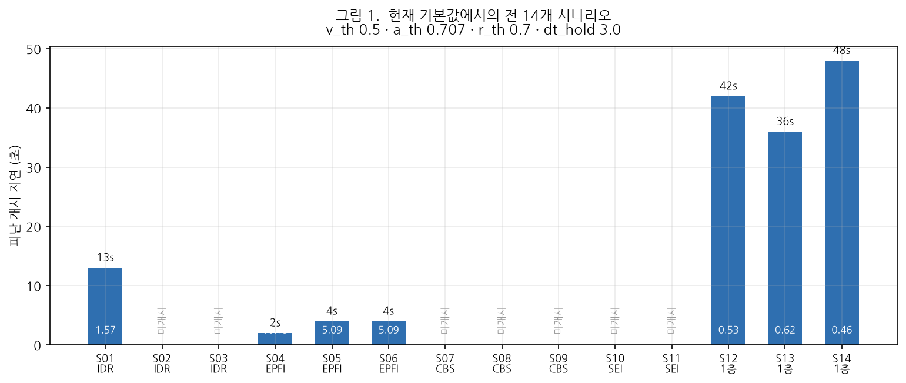
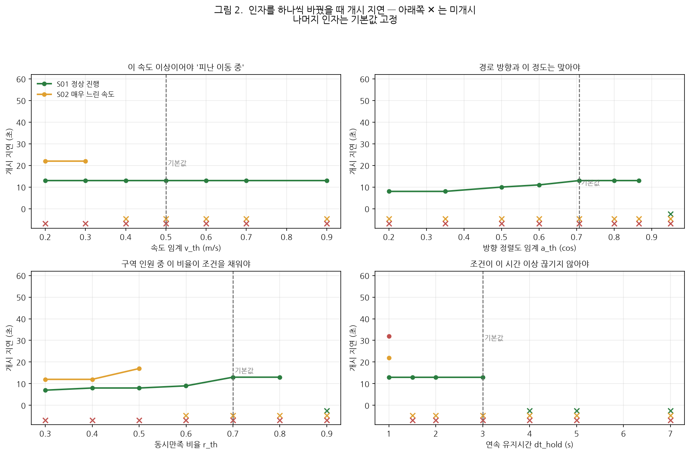
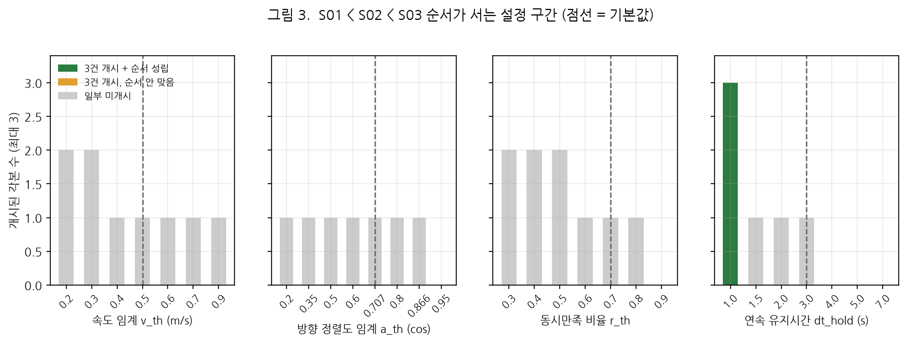

# 피난 반응 확산지표(IDR) 검증 결과보고서

**AI hub 1층·3층 합동 훈련 — 피난경로 개정본 기준 · 파라미터 민감도 포함**

| 항목 | 내용 |
|---|---|
| 문서번호 | MACS-EVAC-VR-2026-005 |
| 문서구분 | 검증 결과보고서 (최종) |
| 작성일 | 2026년 9월 17일 |
| 작성 | PIA SPACE · MACS-EVAC 개발팀 |
| 검증대상 | 피난 반응 확산지표(IDR) |
| 측정 대상 | 개정 피난경로(`r1`·`r2`·`r3`) 기준 재녹화 세션 **14건** |
| 스윕 범위 | `v_th`·`a_th`·`r_th`·`dt_hold` 각 7~8수준 (총 29설정 × 14세션) |
| 판정 | **조건부 적합** — 각본을 재현하나 **기본값 `dt_hold` 3.0 에서는 재현되지 않는다** |

---

## 1. 지표를 어떻게 읽는가

### 1.1 정의

$$\mathrm{IDR}_e = \frac{D(e,\,\text{경보발생원})}{t_{e,\mathrm{start}} - t_{\mathrm{alarm}}} \quad [\mathrm{m/s}]$$

**경보 발생원에서 그 구역까지의 거리**를 **그 구역이 피난을 개시하기까지 걸린 시간**으로
나눈 값이다. "경보가 얼마나 빨리, 얼마나 멀리까지 퍼졌나"를 잰다.

### 1.2 값의 방향 — **클수록 좋다**

| 값 | 의미 |
|---|---|
| **크다** (예 10 m/s) | 먼 구역이 **즉시** 반응했다 — 경보 전달·대피 개시가 빠르다 |
| **작다** (예 0.5 m/s) | 반응이 **느렸다** — 같은 거리를 훨씬 오래 걸려 개시했다 |
| **미개시** | 개시 조건을 끝내 못 채웠다 — 값 자체가 산출되지 않는다 |

거리 $D$ 는 도면이 고정이면 상수이므로, **실무에서는 분모인 개시 지연(초)을 보는 것이
더 직관적이다.** 본 보고서는 두 값을 함께 싣는다.

> **주의** — IDR 은 상한이 없다(0~∞). 개시 지연이 1초면 20 m/s 도 나온다.
> 구역이 경보 발생원에서 멀수록 같은 지연이라도 값이 커지므로, **다른 도면·다른
> 구역끼리 숫자를 직접 비교하면 안 된다.**

### 1.3 개시 판정 — 네 개의 문턱

구역이 "피난을 개시했다"고 보려면 아래를 **동시에, 연속으로** 만족해야 한다.

| 인자 | 뜻 | 기본값 | 올리면 |
|---|---|---:|---|
| `v_th` | 이 속도 이상이어야 '이동 중' | 0.5 m/s | 느린 사람이 빠진다 |
| `a_th` | 경로 방향과 이만큼 맞아야 (cosine) | 0.707 (45°) | 비스듬히 가는 사람이 빠진다 |
| `r_th` | 구역 인원 중 이 비율이 위 둘을 동시 충족 | 0.7 | 더 많은 인원이 동시에 움직여야 |
| `dt_hold` | 조건이 이만큼 끊기지 않아야 | 3.0 s | 잠깐 멈추면 리셋된다 |

**넷 다 올리면 판정이 깐깐해져 개시가 늦거나 안 선다.** 내리면 그 반대다.

---

## 2. 검증 설계

### 2.1 IDR 을 겨냥한 3개 각본

각 각본은 **개시 조건을 하나씩 어기도록** 촬영했다.

| 시나리오 | 각본 | 어기는 조건 | 기대 |
|---|---|---|---|
| **S01** | 권장경로 2명 넘어감 + 우측 우회 2명 | (정상 진행) | 빠른 개시 |
| **S02** | 권장경로 — **매우 느린 속도** | 속도 `v_th` | 느린 개시 |
| **S03** | **2초 멈췄다 움직였다** 이동 | 연속 유지 `dt_hold` | 가장 느린 개시 |

판정 기준은 **"개시 지연이 S01 < S02 < S03 순으로 벌어지는가"** 다.
값을 맞히는 것이 아니라 **순서가 서는가**를 본다 — 각본이 그렇게 설계됐기 때문이다.

### 2.2 측정 방법

세션을 리플레이로 재계산하며 **인자를 하나씩만** 바꾸고 나머지는 기본값에 고정했다.
같은 녹화본이므로 관측은 동일하고, 차이는 전적으로 그 인자에서 온다.

---

## 3. 기본값에서의 결과



**그림 1 읽는 법** — 막대 높이가 **개시 지연(초)**, 막대 안 숫자가 **IDR(m/s)** 이다.
파란 막대는 개시 판정이 선 시나리오, 회색은 미개시다.
**막대가 낮을수록(지연이 짧을수록) 반응이 빠른 것이고, 그때 IDR 값은 커진다.**

| 시나리오 | 지연 | IDR | | 시나리오 | 지연 | IDR |
|---|---:|---:|---|---|---:|---:|
| S01 | 13 s | 1.57 | | S08·S09 | 미개시 | — |
| **S02** | **미개시** | — | | S10·S11 | 미개시 | — |
| **S03** | **미개시** | — | | S12 | 42 s | 0.53 |
| S04 | 2 s | 10.19 | | S13 | 36 s | 0.62 |
| S05·S06 | 4 s | 5.09 | | S14 | 48 s | 0.46 |
| S07 | 미개시 | — | | | | |

**기본값(`dt_hold` 3.0)에서는 IDR 각본 3건 중 S02·S03 이 미개시다.** 두 각본이
"느리다"·"멈췄다"를 표현했는데 값이 안 나오니, **순서를 비교할 수가 없다.**
이것이 본 검증의 출발점이다.

---

## 4. 인자별 민감도



**그림 2 읽는 법** — 각 칸이 인자 하나다. 가로축이 그 인자 값, 세로축이 개시 지연(초).
**선이 위로 갈수록 개시가 늦다**는 뜻이고, 아래쪽 **✕ 는 그 설정에서 개시 자체가
안 선 것**이다. 세로 점선이 현재 기본값이다.

### 4.1 `v_th` (속도 임계) — S02 를 켜고 끄는 스위치

| `v_th` | S01 | S02 | S03 |
|---|---|---|---|
| 0.2 · 0.3 | 13 s | **22 s** | 미개시 |
| 0.4 이상 | 13 s | **미개시** | 미개시 |

**S01 은 전 구간 13초로 꿈쩍도 않는다.** 정상 속도로 걸었으니 어떤 문턱을 대도
넘는다. 반면 S02 는 0.4 를 경계로 켜지고 꺼진다.

> **해석** — S02 참가자들의 실제 이동 속도가 **0.3~0.4 m/s 사이**라는 뜻이다.
> 각본("매우 느린 속도")이 실제로 그렇게 촬영됐음을 지표가 확인해 준다.
> `v_th` 를 낮추면 느린 사람도 '이동 중'으로 세므로 개시가 서고, 올리면 빠진다.

### 4.2 `a_th` (방향 정렬도) — 조이면 개시가 늦어진다

| `a_th` | 각도 | S01 개시 지연 |
|---|---|---|
| 0.20 | 78° | **8 s** |
| 0.50 | 60° | 10 s |
| 0.707 | 45° | **13 s** (기본값) |
| 0.866 | 30° | 13 s |
| 0.95 | 18° | **미개시** |

**완만히, 단조롭게 늘어난다.** 방향 조건을 조일수록 조건을 채우는 사람이 줄어
`r_th` 를 채우는 시점이 늦어지기 때문이다.

> **해석** — `a_th` 는 **개시 시점을 미세 조정하는 손잡이**다. 스위치가 아니다.
> 다만 0.95(18°) 는 너무 좁아 아무도 못 넘는다. S02·S03 은 이 인자로는
> 살아나지 않는다 — 그들의 문제는 방향이 아니라 속도·연속성이기 때문이다.

### 4.3 `r_th` (동시만족 비율) — 가장 센 손잡이

| `r_th` | S01 | S02 | S03 |
|---|---|---|---|
| 0.3 | **7 s** | 12 s | 미개시 |
| 0.5 | 8 s | 17 s | 미개시 |
| 0.7 | **13 s** (기본값) | 미개시 | 미개시 |
| 0.9 | **미개시** | 미개시 | 미개시 |

지연이 7초에서 13초까지, **거의 2배로 움직인다.** 네 인자 중 변화 폭이 가장 크다.

> **해석** — `r_th` 는 "몇 명이 동시에 움직여야 구역이 개시한 것으로 볼까"를 정한다.
> 낮추면 **선발대 몇 명만 움직여도 개시**로 보고, 높이면 **대다수가 움직일 때까지
> 기다린다.** 훈련 평가 목적에 따라 정할 값이지 기술적으로 정답이 있는 값이 아니다.
> 0.9 는 사실상 전원이라 현실적으로 못 채운다.

### 4.4 `dt_hold` (연속 유지시간) — S03 을 켜고 끄는 스위치

| `dt_hold` | S01 | S02 | S03 |
|---|---|---|---|
| **1.0 s** | **13 s** | **22 s** | **32 s** |
| 1.5 · 2.0 | 13 s | 미개시 | 미개시 |
| 3.0 (기본값) | 13 s | 미개시 | 미개시 |
| 4.0 이상 | **미개시** | 미개시 | 미개시 |

**1.0 초에서만 세 각본이 모두 개시된다.**

> **해석** — S03 은 "2초 멈췄다 움직였다"를 반복한다. `dt_hold` 가 2초 이상이면
> 멈출 때마다 카운터가 리셋돼 **영원히 못 채운다.** 1.0 초(샘플 주기 1초이므로
> **연속 2샘플**)면 움직이는 구간만으로 조건을 채울 수 있다.
> 4초 이상에서는 정상 진행한 S01 조차 미개시가 된다 — 너무 깐깐한 값이다.

---

## 5. 각본 순서가 서는 설정



**그림 3 읽는 법** — 막대 높이는 그 설정에서 **개시된 각본 수**(최대 3),
색은 **초록 = 3건 모두 개시되고 S01 < S02 < S03 순서까지 성립**,
주황 = 3건 개시됐으나 순서가 어긋남, 회색 = 일부 미개시.

**전체 29개 설정 중 순서가 서는 것은 `dt_hold` 1.0 하나뿐이다.**

| | `v_th` | `a_th` | `r_th` | `dt_hold` |
|---|---|---|---|---|
| 3건 개시 | 없음 | 없음 | 없음 | **1.0 s** |
| 2건 개시 | 0.2 · 0.3 | 없음 | 0.3 · 0.4 · 0.5 | — |

`v_th` 나 `r_th` 를 낮추면 S02 는 살아나지만 **S03 은 어떤 값으로도 살아나지 않는다.**
S03 의 제약은 오직 `dt_hold` 다.

### 그 설정에서의 결과

| 시나리오 | 각본 | 개시 지연 | IDR | 참여율 |
|---|---|---:|---:|---:|
| **S01** | 정상 진행 | **13 초** | 1.57 | 91 % |
| **S02** | 매우 느린 속도 | **22 초** | 0.93 | 75 % |
| **S03** | 2초 멈췄다 이동 | **32 초** | 0.64 | 83 % |

**각본 의도 그대로 단조롭게 벌어진다.** 지연은 13 → 22 → 32 초로 늘고,
IDR 은 1.57 → 0.93 → 0.64 로 줄어든다(같은 거리를 더 오래 걸렸으므로).

---

## 6. 종합 판정

| 검증 항목 | 결과 | 판정 |
|---|---|:---:|
| 정의식 구현 | 거리 ÷ 지연, 조건 4개 동시·연속 판정 정상 | **적합** |
| 각본 순서 재현 (`dt_hold` 1.0) | 13 s → 22 s → 32 s 단조 증가 | **적합** |
| 인자별 분리 | `v_th` 가 S02 를, `dt_hold` 가 S03 을 가름 | **적합** |
| **기본값(`dt_hold` 3.0) 재현성** | **S02·S03 미개시 — 순서 비교 불가** | **부적합** |
| 전체 개시율 (기본값) | 6/14 | 참고 |
| 전체 개시율 (`dt_hold` 1.0) | 10/14 | 참고 |

> ## 종합 판정: **조건부 적합**
>
> IDR 은 속도·정지 각본을 **개시 지연 차이로 정확히 구분한다.**
> 다만 그것이 드러나는 설정은 **`dt_hold` 1.0 초** 하나뿐이고,
> **현재 기본값 3.0 초에서는 두 각본이 미개시라 비교 자체가 되지 않는다.**

### 조치 사항

| 우선순위 | 조치 | 근거 |
|:---:|---|---|
| 1 | **`dt_hold` 3.0 → 1.0 초** | §4.4 · §5 — 유일하게 세 각본이 모두 개시되는 값 |
| 2 | `v_th` 0.5 · `a_th` 0.707 유지 | §4.1 · §4.2 — 현 값에서 S01 이 안정적으로 개시 |
| 3 | `r_th` 는 평가 목적에 따라 합의 | §4.3 — 0.3(선발대 기준) ~ 0.7(대다수 기준) |
| 4 | 미개시 4건(S08~S11) 원인 점검 | §3 — 밀집·분산으로 구역 참여율이 안 차는 구조 |

---

## 7. 한계 및 유의사항

1. **`dt_hold` 1.0 초는 이 각본에서 도출한 값**이다. 2초 정지를 지연으로 읽으려면
   1초여야 하지만, 정지 동작이 더 긴 현장에서는 다시 정해야 한다.
   또한 1.0 초는 샘플 2개라 **단발 오검출에 상대적으로 약하다.**
2. **구역이 층 전체 하나**다. IDR 은 원래 "어느 구역이 먼저 반응했나"를 보는 지표인데,
   구역이 하나뿐이라 그 비교를 하지 못했다. 구역을 실제 사용 단위로 나누면 결과가
   달라질 수 있다.
3. **각본은 촬영 계획 기준**이다. S02 가 실제로 얼마나 느렸는지는 영상으로 재확인하지
   않았다 — 다만 `v_th` 0.3~0.4 경계에서 켜지고 꺼지는 것이 간접 증거다.
4. **IDR 값끼리의 절대 비교는 성립하지 않는다**(§1.2). 본 보고서도 같은 구역·같은
   거리 안에서 지연만 비교했다.
5. 미개시 4건(S08·S09·S10·S11)은 **원인을 규명하지 않았다.** 밀집·두 출구 분산으로
   구역 참여율이 문턱에 못 미치는 것으로 보이나 확인이 필요하다.

---

## 8. 재현 절차

```bash
python docs/deliverables/2026-09-17_IDR-피난반응확산-검증보고서/data/collect.py
python docs/deliverables/2026-09-17_IDR-피난반응확산-검증보고서/data/make_figures.py
```

화면에서는 ④ 리플레이 → `경로v2 …` 세션 → [임계값 조정] 에서 값을 바꾸고
**[이 값으로 재계산 ↻]** 을 누르면 같은 값이 나온다.

---

## 부록 A. 원자료

| 파일 | 내용 |
|---|---|
| [`data/idr_sweep.csv`](data/idr_sweep.csv) | 14세션 × 29설정 전수 — 상태·지연·IDR·참여율·거리 |
| [`data/idr_sweep.json`](data/idr_sweep.json) | 위와 동일(원본) |
| [`data/collect.py`](data/collect.py) · [`data/make_figures.py`](data/make_figures.py) | 수집·작도 스크립트 |

---

<div align="center">

**— 이상 —**

</div>
