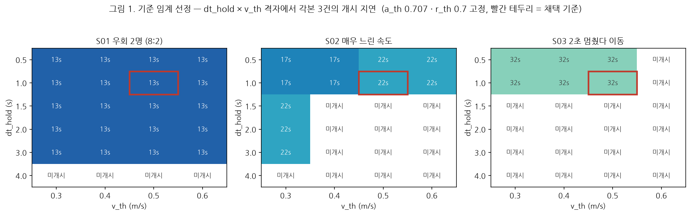
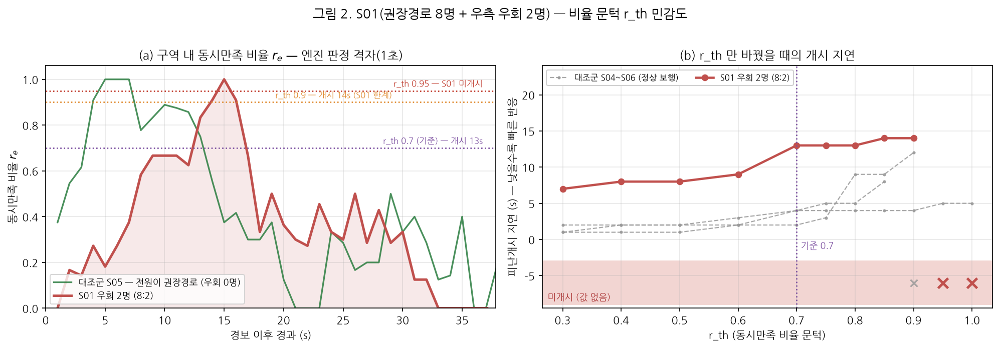
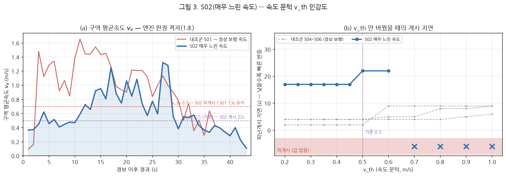
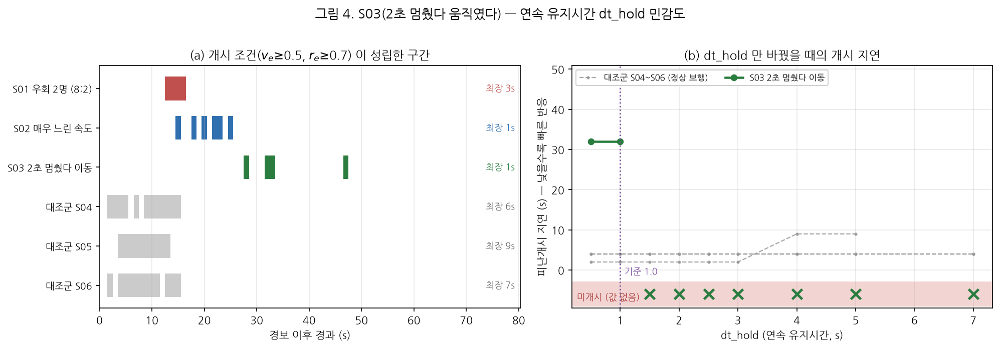
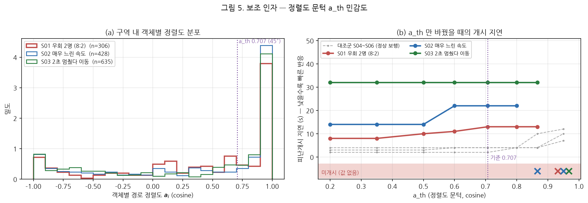

# 피난 반응 확산지표(IDR) 검증 결과보고서

**AI hub 1층·3층 합동 훈련 — 피난경로 개정본 기준 · 각본별 파라미터 민감도**

| 항목 | 내용 |
|---|---|
| 문서번호 | MACS-EVAC-VR-2026-005 |
| 문서구분 | 검증 결과보고서 (최종) |
| 작성일 | 2026년 9월 17일 |
| 작성 | PIA SPACE · MACS-EVAC 개발팀 |
| 검증대상 | 피난 반응 확산지표(IDR) — 개시 판정 4개 임계값 |
| 측정 대상 | 개정 피난경로(`r1`·`r2`·`r3`) 기준 재녹화 세션 **14건** |
| 측정 방법 | 세션 녹화본(.db) 리플레이 — 임계값만 바꿔 재산출(역방향 재파라미터화) |
| 스윕 범위 | `r_th`·`v_th`·`dt_hold`·`a_th` 각 8~12수준 + 격자 24설정 = **세션당 66설정 / 총 924회** |
| 코드 기준 | `system/metrics/` @ `22ff47d` (§7.4) |
| 판정 | **적합** — 각본이 겨눈 인자를 각각 정확히 겨눠 뒤집는다. 단 **배포 기본값 `dt_hold` 3.0 s 는 각본 2건을 놓친다** (→ 1.0 s 권고) |

---

## 1. 이 보고서가 답하려는 질문

IDR 은 **"경보가 얼마나 빨리, 얼마나 멀리까지 퍼졌나"** 를 재는 지표다.

$$\mathrm{IDR}_e = \frac{D(e,\ \text{경보발생원})}{t_{e,\mathrm{start}} - t_{\mathrm{alarm}}}\ \ [\mathrm{m/s}]$$

거리 $D$ 는 도면이 고정이면 상수이므로, 실제로 재는 것은 **분모 — 그 구역이 피난을
개시하기까지 걸린 초(개시 지연)** 다. 본 보고서는 두 값을 함께 싣되 그림은 전부
**개시 지연(초)** 축으로 그린다. **지연이 짧을수록 IDR 이 크고, 좋다.**

| IDR 값 | 의미 |
|---|---|
| **크다** (예 10 m/s) | 먼 구역이 **즉시** 반응 — 경보 전달·대피 개시가 빠르다 |
| **작다** (예 0.6 m/s) | 같은 거리를 **훨씬 오래** 걸려 개시했다 |
| **미개시** | 개시 조건을 끝내 못 채웠다 — **값 자체가 산출되지 않는다** |

> IDR 은 상한이 없다(0~∞). 구역이 경보원에서 멀수록 같은 지연에도 값이 커지므로
> **다른 도면·다른 구역끼리 숫자를 직접 비교하면 안 된다.** 본 보고서는 14건 전부
> 같은 구역·같은 경보원($D = 20.4\,\mathrm{m}$)이라 비교가 성립한다.

### 1.1 개시 판정 — 네 개의 문턱

구역이 "피난을 개시했다"고 보려면 아래를 **동시에, 끊기지 않고** 만족해야 한다.

| 인자 | 무엇을 재나 | 올리면 |
|---|---|---|
| `v_th` | 구역 평균속도 $v_e$ 가 이 값 이상이어야 '이동 중' | **느린 사람이 빠진다** |
| `a_th` | 개인의 진행방향이 경로와 이만큼 맞아야 (cosine) | **비스듬히·역행하는 사람이 빠진다** |
| `r_th` | 구역 인원 중 위 둘을 **동시에** 만족하는 비율 $r_e$ | **더 많은 인원이 한꺼번에 움직여야** |
| `dt_hold` | 그 조건이 이만큼 **연속으로** 유지돼야 | **잠깐이라도 멈추면 리셋된다** |

넷 다 올리면 판정이 깐깐해져 개시가 늦거나 아예 안 선다. 내리면 그 반대다.
네 값 모두 요구사항 D-6 상 **고객 확정 대상**이며 코드 기본값은 임시값이다.

---

## 2. 검증 설계 — 각본 하나에 인자 하나

훈련 각본 3건은 각각 **다른 인자를 겨냥해** 연출됐다. 따라서 "네 인자를 한꺼번에
훑는" 방식이 아니라, **각본이 겨눈 인자만 움직이고 나머지 셋은 고정**해서
**뒤집히는 지점**을 찾는다. 같은 스윕에 **정상 보행 각본(S04~S06)을 대조군으로 함께
태워**, 뒤집힌 것이 각본 때문인지 임계값 때문인지를 가른다.

| 각본 | 연출 | 겨눈 인자 | 기대 |
|---|---|---|---|
| **S01** | 권장경로 8명 + **우측으로 빙 도는 2명** (8 : 2) | `r_th` | 우회 2명 때문에 **높은 비율을 요구하면 개시가 안 서야** 한다 |
| **S02** | 권장경로 — **매우 느린 속도** | `v_th` | 속도 문턱을 올릴수록 **점점 안 잡혀야** 한다 |
| **S03** | **2초 멈췄다 움직였다** 반복 | `dt_hold` | 유지시간을 늘릴수록 **끊겨서 안 잡혀야** 한다 |
| S04~S06 | 정상 보행 (경로만 다름) | — | **대조군** — 같은 스윕에서 오래 버텨야 한다 |

### 2.1 기준 임계(base) 를 먼저 정한다

민감도를 보려면 **출발점이 "실제 피난개시가 잡히는 수준"** 이어야 한다. 너무 느슨하면
아무거나 개시로 잡혀 비교가 무의미하고, 너무 빡빡하면 처음부터 전부 미개시라
움직일 여지가 없다. `a_th`·`r_th` 를 운영 기본값에 고정한 채 `dt_hold × v_th` 격자를
훑어 그 구간을 찾았다.



**그림 1 읽는 법** — 가로축은 속도 문턱 `v_th`, 세로축은 연속 유지시간 `dt_hold`,
칸 안의 숫자는 **그 설정에서 측정된 개시 지연(초)** 이다. **진할수록 빨리 개시**했고,
흰 칸은 **끝내 개시되지 않았다**는 뜻이다. 빨간 테두리가 본 보고서가 채택한 기준이다.

- **`dt_hold` 1.0 s 이하인 위 두 줄에서만 각본 3건이 모두 개시된다.** 1.5 s 부터
  S02·S03 이 흰 칸으로 넘어가고, 3.0 s(현행 배포 기본값)에서는 S01 하나만 남는다.
- `v_th` 는 0.3→0.6 으로 두 배 올려도 S01 은 13 s 로 꿈쩍하지 않는다. **정상 보행은
  속도 문턱에 둔감하다** — 이것이 §4 에서 S02 와의 대비를 만든다.
- 따라서 **기준 = `v_th` 0.5 · `a_th` 0.707 · `r_th` 0.7 · `dt_hold` 1.0** 로 잡았다.
  `dt_hold` 만 운영 기본값(3.0)에서 내렸고 나머지 셋은 그대로다.

**이 기준이 "너무 느슨한 것 아닌가"** — 아니다. 같은 기준에서 **CBS·SEI 각본 4건
(S08 문 근처 밀집 · S09 시차 합류 · S10·S11 7:3 분산)은 여전히 미개시**다. 구역 인원이
한꺼번에 같은 방향으로 움직이지 않으면 개시로 잡히지 않는다는 뜻으로, 기준이
아무거나 통과시키는 수준이 아님을 보여준다.

### 2.2 기준에서의 측정값

| 각본 | 개시 지연 | IDR | 판정시점 $r_e$ | 조건 최장 연속 |
|---|---:|---:|---:|---:|
| **S01** 우회 2명 (8:2) | **13 s** | **1.57 m/s** | 0.91 | 3 s |
| **S02** 매우 느린 속도 | **22 s** | **0.93 m/s** | 0.75 | 1 s |
| **S03** 2초 멈췄다 이동 | **32 s** | **0.64 m/s** | 0.83 | 1 s |
| S04 정상 보행 (대조) | 2 s | 10.19 m/s | 0.75 | 6 s |
| S05 정상 보행 (대조) | 4 s | 5.09 m/s | 1.00 | 9 s |
| S06 정상 보행 (대조) | 4 s | 5.09 m/s | 0.80 | 7 s |

**각본 의도대로 정렬된다.** 정상 보행 2~4 s → 우회 13 s → 느린 보행 22 s →
멈춤 반복 32 s. IDR 값도 같은 순서로 10.19 → 1.57 → 0.93 → 0.64 m/s 로 내려간다.
**"반응이 흐트러질수록 IDR 이 작아진다"** 는 지표의 방향이 그대로 재현됐다.

---

## 3. S01 — 우회 2명(8 : 2)이 비율 문턱 `r_th` 를 어떻게 흔드는가



**그림 2 (a) 읽는 법** — 세로축은 **동시만족 비율 $r_e$**, 즉 그 순간 구역에 있던
사람 중 "충분히 빠르고(≥ `v_th`) 경로 방향과 맞게(≥ `a_th`)" 움직이던 사람의 **비율**이다.
**1.0 이면 전원이 한꺼번에 제대로 대피 중**, 0 이면 아무도 아니다. 가로 점선은
`r_th` 후보값이고, **곡선이 그 선 위로 올라가 `dt_hold` 만큼 머물러야 개시**가 선다.
빨간 실선이 S01(우회 2명), 초록 실선이 전원 권장경로로 간 대조군 S05 다.

**(b) 읽는 법** — 가로축 `r_th` 를 올려가며 개시 지연(초)이 어떻게 변하는지다.
**아래쪽일수록 빨리 개시**, 아래 분홍 띠의 ✕ 는 **그 설정에서는 끝내 개시되지 않았다**
는 뜻이다. 회색 점선이 정상 보행 대조군 S04~S06.

### 무엇이 보이나

| `r_th` | 0.3 | 0.5 | **0.7 (기준)** | 0.8 | 0.9 | **0.95** | 1.0 |
|---|---:|---:|---:|---:|---:|---:|---:|
| **S01 개시 지연** | 7 s | 8 s | **13 s** | 13 s | 14 s | **미개시** | 미개시 |
| S05 (전원 권장경로) | 1 s | 2 s | 4 s | 4 s | 4 s | **5 s** | **5 s** |

- **요구 비율을 올릴수록 개시가 늦어진다.** 0.3 에서 7 s 이던 것이 0.7 에서 13 s 로
  **6초 늦어진다.** 우회 2명이 빠진 만큼 "구역의 70 %가 동시에 움직이는" 순간이
  뒤로 밀리기 때문이다.
- **0.95 를 요구하면 S01 은 끝내 개시되지 않는다.** 반면 **전원이 권장경로로 간 S05 는
  `r_th` 1.0(전원 동시)에서도 5 s 에 개시**된다. 같은 임계, 같은 구역, 같은 경보원에서
  갈린 것은 **각본뿐** — 우회 2명이 있으면 20 % 가 조건을 못 채우므로 그 위의 비율을
  요구하는 순간 판정이 서지 않는다. **각본이 겨눈 그대로다.**
- (a) 를 보면 이유가 직접 보인다. S01 의 $r_e$ 는 15 초 근처에서 한 번 1.0 을 찍지만
  **그 값을 1초 이상 유지하지 못하고** 곧 0.6 대로 내려앉는다. 대조군 S05 는 4~7 초
  구간에서 1.0 을 **연속으로** 유지한다. **$r_e$ 는 "얼마나 높이 올라갔나"가 아니라
  "얼마나 오래 머물렀나"로 읽어야 한다.**

### 값이 크면 / 작으면

**`r_th` 가 크다** = "구역이 **한 덩어리로** 움직여야 개시로 인정한다" — 이탈자·지체자를
엄격히 벌하지만, 20 % 만 다르게 움직여도 지표가 산출되지 않는다.
**작다** = 몇 명만 뛰어도 구역 전체가 개시한 것으로 본다 — 값은 잘 나오지만
훈련 품질을 변별하지 못한다.
**본 각본(8 : 2) 기준 경계는 0.9 와 0.95 사이**이며, 운영 권고값은 **0.7** 이다
(우회 2명을 지연 6 초로 **벌은 주되 산출은 유지**하는 구간).

---

## 4. S02 — "매우 느린 속도"는 속도 문턱 `v_th` 에서 어떻게 사라지는가



**그림 3 (a) 읽는 법** — 세로축은 **구역 평균속도 $v_e$ (m/s)** 다. 파란 굵은 선이
S02(매우 느린 속도), 붉은 선이 같은 경로를 **정상 속도**로 걸은 S01 이다. 가로 점선이
`v_th` 후보이며, **평균속도가 그 선 위에 있어야** 개시 조건의 첫 번째 항이 선다.
**(b)** 는 그림 2 와 같은 방식으로, `v_th` 만 올려가며 본 개시 지연이다.

### 무엇이 보이나

| `v_th` (m/s) | 0.2 | 0.4 | **0.5 (기준)** | 0.6 | **0.7** | 0.9 | 1.0 |
|---|---:|---:|---:|---:|---:|---:|---:|
| **S02 느린 보행** | 17 s | 17 s | **22 s** | 22 s | **미개시** | 미개시 | 미개시 |
| S01 정상 보행 (대조) | 13 s | 13 s | 13 s | 13 s | **13 s** | 13 s | 14 s |

- **정상 보행은 문턱을 두 배로 올려도 꿈쩍하지 않는다.** S01 은 `v_th` 0.2 → 0.9
  전 구간에서 13 s 고정이고, 1.0 m/s 에서야 14 s 로 1초 밀린다.
- **느린 보행만 무너진다.** S02 는 0.45 까지 17 s → 0.5~0.6 구간에서 22 s 로 **5초
  밀리고** → **0.7 에서 완전히 사라진다.** (a) 에서 두 곡선의 간격이 그 이유다.
  초반 0~15 초 동안 S01 은 1.0~1.7 m/s 를 오가는데 S02 는 0.4~0.9 에 머문다.
- **즉 `v_th` 는 "느림"만 걸러내는 인자다.** 정상 보행에는 사실상 무해하고, 느린
  보행에만 작동한다 — 각본이 겨눈 그대로다.

### 값이 크면 / 작으면

**`v_th` 가 크다** = "이 속도 미만은 대피로 보지 않는다" — 걷는 둥 마는 둥 하는
훈련을 걸러내지만, 통로가 좁거나 인원이 많아 **물리적으로 느릴 수밖에 없는 현장**에서는
정상 훈련까지 미개시로 만든다. **작다** = 서성이는 움직임도 대피로 집계된다.
**본 각본 기준 경계는 0.6 과 0.7 사이**이고, 권고값은 **0.5** 다 — 정상 보행에는
여유(0.9 까지 무해)를 남기면서 느린 보행에는 22 s 라는 벌점을 주는 지점이다.

---

## 5. S03 — "2초 멈췄다 움직였다"는 유지시간 `dt_hold` 에서 어떻게 사라지는가



**그림 4 (a) 읽는 법** — 가로축은 경보 이후 경과 시간, 색칠된 블록은 **개시 조건
($v_e ≥$ 0.5 **그리고** $r_e ≥$ 0.7)이 성립한 1초 구간**이다. 오른쪽 라벨은 그 블록이
**끊기지 않고 이어진 최장 길이**다. **`dt_hold` 는 "이 블록이 이만큼 길어야 한다"는
요구**이므로, **최장 블록보다 큰 `dt_hold` 를 요구하면 그 각본은 절대 개시되지 않는다.**
**(b)** 는 `dt_hold` 만 올려가며 본 개시 지연이다.

### 무엇이 보이나

| `dt_hold` (s) | 0.5 | **1.0 (기준)** | **1.5** | 2.0 | 3.0 | 5.0 | 7.0 |
|---|---:|---:|---:|---:|---:|---:|---:|
| **S03 멈췄다 이동** | 32 s | **32 s** | **미개시** | 미개시 | 미개시 | 미개시 | 미개시 |
| S05 정상 보행 (대조) | 4 s | 4 s | **4 s** | 4 s | 4 s | 4 s | **4 s** |
| S06 정상 보행 (대조) | 4 s | 4 s | 4 s | 4 s | 4 s | 4 s | **4 s** |

- **(a) 가 각본을 그대로 그린다.** S03 의 블록은 28 s·33 s·47 s 부근에 **1초짜리
  섬처럼 흩어져** 있다 — 2초마다 멈추니 조건이 그때마다 리셋된다. 반면 대조군
  S04~S06 은 **6~9 초짜리 통 블록**이다.
- 그 결과 **S03 의 한계는 정확히 1 초**다. `dt_hold` 1.0 까지는 32 s 에 개시되고,
  **1.5 부터는 어떤 값에서도 개시되지 않는다.** 대조군은 **7 초를 요구해도 4 s 에
  개시**된다. 같은 임계에서 7배의 여유 차이가 난다.
- S01(우회)·S02(느림)의 최장 블록은 각각 3 s·1 s 로, **"끊김"은 우회·느림과는 다른
  축의 결함**임을 보여준다. 세 각본이 서로 다른 인자에서 무너진다.

### 값이 크면 / 작으면

**`dt_hold` 가 크다** = "잠깐의 움직임은 대피 개시로 치지 않는다" — 우연한 이동이나
검출 튐을 걸러내는 **잡음 방어**다. 다만 **실제로 멈칫거리며 대피하는 훈련까지
통째로 미개시로 만든다.** **작다** = 한순간만 조건이 맞아도 개시로 잡아 값이
과대평가된다. **본 각본 기준 경계는 1.0 과 1.5 사이**이며, 권고값은 **1.0** 이다.

> **현행 배포 기본값 `dt_hold` 3.0 s 는 S02·S03 두 각본을 모두 놓친다.**
> 지표 로직의 결함이 아니라 **기본값이 판정선 바깥에 있는 문제**다 (→ §6).

---

## 6. 보조 인자 — 정렬도 `a_th`



**그림 5 (a) 읽는 법** — 가로축은 **개인별 경로 정렬도 $a_i$** (진행방향과 권장경로
접선의 코사인). **+1 은 경로와 완전히 같은 방향**, 0 은 직각, **−1 은 정반대(역행)** 다.
세로축은 관측 밀도이며, 보라 점선(`a_th` 0.707 = 45°) **오른쪽에 있는 관측만**
$r_e$ 계산에 들어간다. **(b)** 는 `a_th` 만 올려가며 본 개시 지연이다.

- 분포가 **양 끝(+1 과 −1)에 쌍봉으로 몰린다.** +1 쪽은 출구로 향하는 본류,
  −1 쪽은 **역행·되돌아감**이다. 세 각본 모두 −1 부근 관측이 존재한다.
- `a_th` 를 0.2(78°)까지 낮추면 S01 은 13 s → 8 s, S02 는 22 s → 14 s 로 당겨진다.
  **비스듬히 가는 사람까지 대피로 세기 때문**이다.
- **0.95(18°) 는 과하다.** S01·S03 이 미개시로 넘어간다. 실제 보행은 통로를 따라
  좌우로 흔들리므로 18° 이내를 계속 유지하는 사람은 드물다.
- **권고값 0.707(45°) 유지.** 0.6~0.8 구간에서 세 각본 모두 판정이 안정적이다.

**값이 크면** = 경로를 정확히 따라가는 사람만 인정 — 역행·우회를 엄히 보지만
정상 보행도 탈락시킨다. **작다** = 방향 무관하게 움직이기만 하면 인정 — 우회 각본과
정상 각본을 구별하지 못한다.

---

## 7. 결론

### 7.1 판정 — **적합**

세 각본이 각각 겨눈 인자에서, **그 인자에서만** 뒤집힌다.

| 각본 | 겨눈 인자 | 뒤집히는 경계 | 대조군(정상 보행)은 |
|---|---|---|---|
| S01 우회 2명 (8:2) | `r_th` | **0.9 → 0.95 사이** | `r_th` 1.0 에서도 5 s 에 개시 |
| S02 매우 느린 속도 | `v_th` | **0.6 → 0.7 사이** | `v_th` 0.9 까지 13 s 유지 |
| S03 2초 멈췄다 이동 | `dt_hold` | **1.0 → 1.5 사이** | `dt_hold` 7 s 에서도 4 s 에 개시 |

같은 세션·같은 구역·같은 경보원에서 **각본만 다른데 경계가 다르게 나온다** —
지표가 연출된 행동을 실제로 읽고 있다는 뜻이다. 또한 IDR 값 자체도 각본 난이도
순서대로 10.19 → 1.57 → 0.93 → 0.64 m/s 로 단조 하락한다.

### 7.2 조치 사항

| # | 조치 | 근거 |
|---|---|---|
| **1** | **`dt_hold` 기본값 3.0 s → 1.0 s** (`system/config/schema.py:Thresholds`) | 3.0 s 에서는 S02·S03 이 미개시라 **값이 산출되지 않는다.** 1.0 s 에서 3건 전부 개시되고 각본 순서(13→22→32 s)가 재현된다 (그림 1·4) |
| 2 | `v_th` 0.5 · `a_th` 0.707 · `r_th` 0.7 **유지** | 각 인자의 뒤집힘 경계(`v_th` 0.6~0.7 · `a_th` 0.866~0.95 · `r_th` 0.9~0.95)에서 한 단계 이상 떨어져 있어, 현장 편차로 판정이 뒤집히지 않는다 |
| 3 | 훈련 평가 시 **개시 지연(초)을 IDR 과 함께 보고** | $D$ 가 상수라 IDR 은 지연의 역수 스케일이다. 지연이 현장 커뮤니케이션에 더 직관적이다 |
| 4 | 임계값 4종을 **고객 확정 절차에 올린다** (요구사항 D-6) | 코드 기본값은 임시값이다. 본 보고서의 경계표가 확정 근거가 된다 |

### 7.3 한계

1. **단일 사이트·단일 구역** — AI hub 3층 `z1` 한 구역, $D = 20.4\,\mathrm{m}$ 고정이다.
   경계값(`r_th` 0.9~0.95 · `v_th` 0.6~0.7 · `dt_hold` 1.0~1.5 s)은 **이 현장의 보행 특성에 묶인 값**이며, 통로 폭·인원
   밀도가 다른 현장에서는 재측정이 필요하다.
2. **연출 인원수를 영상으로 재검증하지 않았다** — "8 : 2", "2초 멈춤"은 각본 기준이고,
   실제 인원이 정확히 그렇게 움직였는지는 별도 확인하지 않았다. 판정시점 $r_e$ 0.91
   (≈ 10/11)이 각본과 일치한다는 정황 근거만 있다.
3. **CBS·SEI 각본 4건(S08~S11)은 기준에서 미개시**다. 두 출구로 갈라지거나 시차를 두고
   나가면 "구역이 한꺼번에 움직이는" 순간이 성립하지 않는다. **분산 대피를 어떻게
   평가할지는 지표 정의 차원의 후속 논의 대상**이며, 임계값 조정으로 해결할 문제가 아니다.
4. **구역 1개 기준** — 다구역 사이트에서 구역별 IDR 이 서로 다른 임계를 필요로 하는지는
   확인하지 않았다.

### 7.4 측정 코드 기준

본 보고서는 `system/metrics/` **커밋 `22ff47d` 상태**로 측정했다. 개시 판정에 쓰이는
속도·정렬도는 `MetricsEngine._obj_kinematics` 의 산출물이므로, **운동학 계산이 바뀌면
같은 세션에서도 개시 판정이 달라진다.** 본 보고서의 경계값을 인용할 때는 이 커밋을
함께 명시하고, 운동학이 개정되면 재측정한다.

---

## 부록 A. 산출물

| 파일 | 내용 |
|---|---|
| `data/collect.py` | 세션 14건 × 66설정 리플레이 수집 (`idr_sweep.json` 생성) |
| `data/collect_series.py` | 엔진 판정 격자 위의 원자료(구역 내 개인별 속도·정렬도) 정밀 수집 |
| `data/make_figures.py` | 그림 5종 + CSV 2종 생성 |
| `data/idr_sweep.json` | 원자료 — 스윕·격자·시계열 전체 |
| `data/idr_sweep.csv` | 시나리오 × 인자 × 값 → 판정·개시지연·IDR·$r_e$ |
| `data/idr_grid.csv` | 시나리오 × (`dt_hold` × `v_th`) 격자 판정 |
| `img/fig1_base_grid.png` | 그림 1 — 기준 임계 선정 격자 |
| `img/fig2_s01_ratio.png` | 그림 2 — S01 비율 문턱 `r_th` |
| `img/fig3_s02_speed.png` | 그림 3 — S02 속도 문턱 `v_th` |
| `img/fig4_s03_hold.png` | 그림 4 — S03 유지시간 `dt_hold` |
| `img/fig5_align.png` | 그림 5 — 정렬도 문턱 `a_th` |

### 재현 절차

```bash
conda activate boosttrack
python docs/deliverables/2026-09-17_IDR-피난반응확산-검증보고서/data/collect.py
PYTHONPATH=docs/deliverables/2026-09-17_IDR-피난반응확산-검증보고서/data \
  python docs/deliverables/2026-09-17_IDR-피난반응확산-검증보고서/data/collect_series.py
python docs/deliverables/2026-09-17_IDR-피난반응확산-검증보고서/data/make_figures.py
```

## 부록 B. 대상 세션 14건

| # | 세션 라벨 | 층 | 겨눈 지표 |
|---|---|---|---|
| S01 | 경로v2 01 IDR 권장경로 2명+우측 우회 2명 | 3F | **IDR** (`r_th`) |
| S02 | 경로v2 02 IDR 매우 느린 속도 | 3F | **IDR** (`v_th`) |
| S03 | 경로v2 03 IDR 2초 멈췄다 이동 | 3F | **IDR** (`dt_hold`) |
| S04 | 경로v2 04 EPFI 2명 완전 빙 돌아 | 3F | 대조군 |
| S05 | 경로v2 05 EPFI 2명 시작점 복귀 후 재진입 | 3F | 대조군 |
| S06 | 경로v2 06 EPFI 1명 빙빙 돌기 | 3F | 대조군 |
| S07~S09 | 경로v2 07~09 CBS | 3F | 참고 |
| S10~S11 | 경로v2 10~11 SEI | 3F | 참고 |
| S12~S14 | 경로v2 12~14 1층 | 1F | 참고 |

---

*본 문서는 `docs/deliverables/` 컨벤션(폴더 1개 = 보고서 1건)에 따라 작성됐다.
경로 충실도(EPFI) 검증은 별도 문서 **MACS-EVAC-VR-2026-006** 을 참조한다.*
