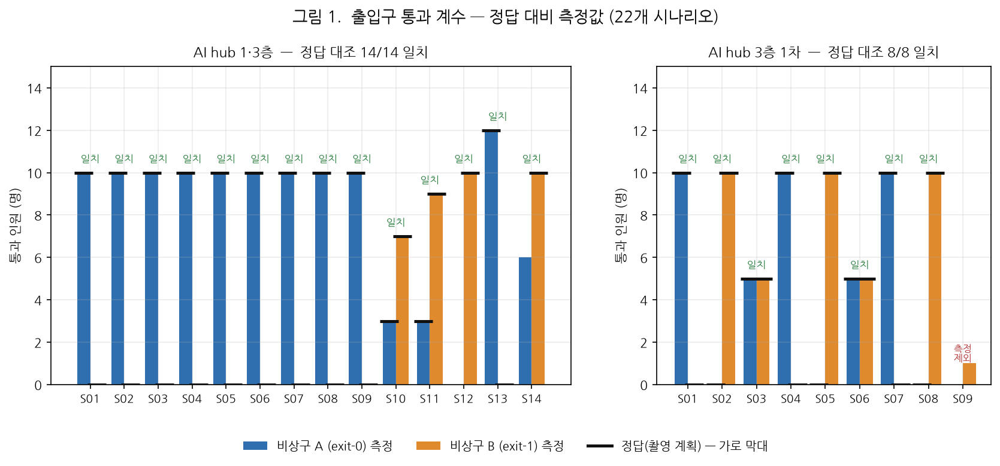
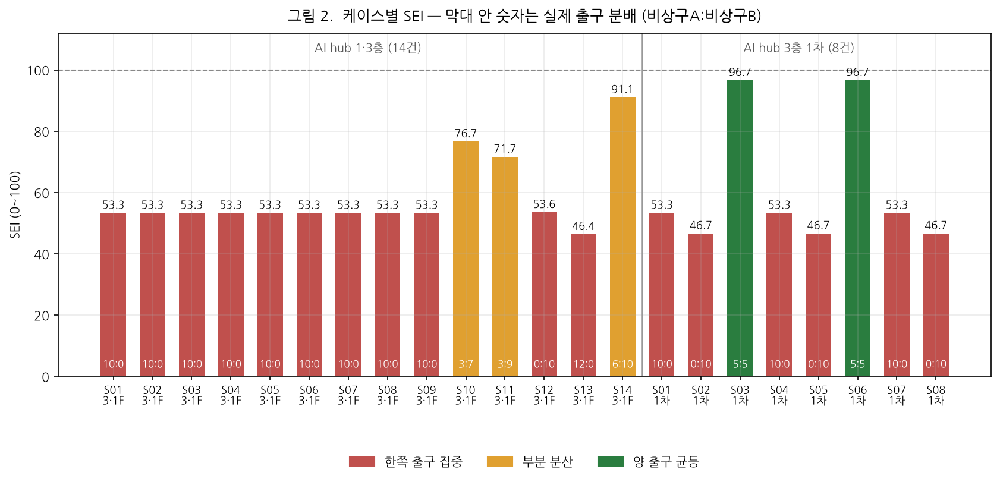
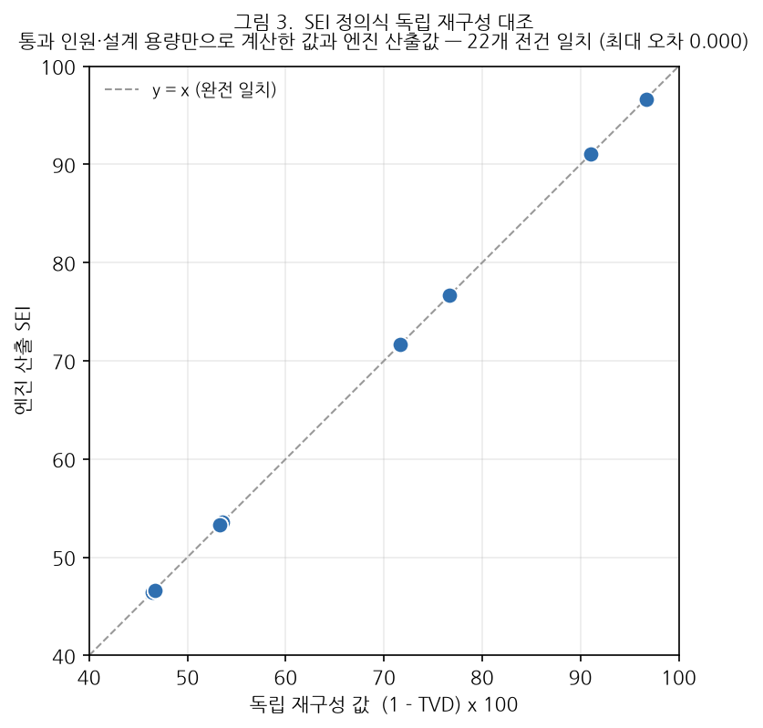
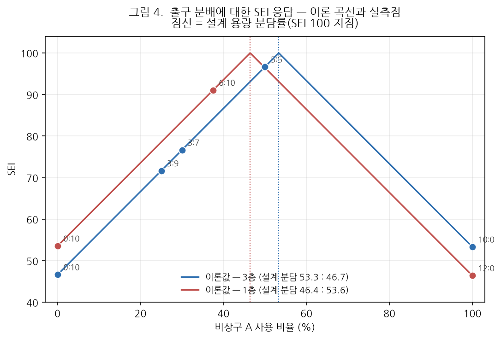

# 비상구 활용 효율지표(SEI) 및 출입구 통과 계수 검증 결과보고서

**AI hub 피난훈련 실증영상 기반**

| 항목 | 내용 |
|---|---|
| 문서번호 | MACS-EVAC-VR-2026-002 |
| 문서구분 | 검증 결과보고서 (최종) |
| 작성일 | 2026년 9월 17일 |
| 작성 | PIA SPACE · MACS-EVAC 개발팀 |
| 검증대상 | MACS-EVAC 피난분석 엔진 (멀티카메라 4대 지표 시스템) |
| 검증범위 | ① 출입구 통과 계수 ② 비상구 활용 효율지표(SEI) |
| 판정 | **적합** — 출입구 통과 계수 22/22 일치, SEI 22/22 정의식 일치 |

---

## 1. 개요

### 1.1 목적

본 보고서는 MACS-EVAC 피난분석 엔진이 CCTV 실증영상으로부터 산출하는
**출입구 통과 인원**과 **비상구 활용 효율지표(SEI)** 의 정확성을 정량적으로 검증한
결과를 기술한다.

### 1.2 적용 범위

본 검증은 아래 두 항목에 한정한다. 나머지 지표(IDR·EPFI·CBS)는 별도 문서에서 다룬다.

| 검증 항목 | 내용 | 판정 기준 |
|---|---|---|
| **출입구 통과 계수** | 비상구를 실제로 통과한 인원 수 | 촬영 계획서상 정답과 **완전 일치** |
| **SEI** | 실제 비상구 사용 분포와 설계 용량 분포의 일치도 | 정의식 재구성값과 **수치 일치** |

### 1.3 근거 문서

| 구분 | 문서 |
|---|---|
| 상위 요구사항 | `docs/requirements/삼성화재-피난훈련-정량평가-4대지표-요구사항.md` |
| 지표 정의 | `docs/requirements/SEI-비상구활용효율지표.md` |
| 촬영 시나리오 | `docs/AI-Hub실증-피난훈련-4대지표-검증-시나리오.md` |
| 데이터 패키지 규격 | `docs/architecture/09-리허설-패키지-구조.md` |

---

## 2. 검증 대상 및 방법

### 2.1 대상 데이터

AI hub 시설에서 촬영한 피난훈련 실증영상 **2개 패키지 · 23개 시나리오**를 대상으로 한다.

| 패키지 | 대상 층 | 시나리오 | 비고 |
|---|---|---:|---|
| `aihub/drill-1f3f` | AI hub 3층(`floor4`) · 1층(`floor5`) | 14 | 3층 11 + 1층 3 |
| `aihub/rehearsal` | AI hub 3층 1차 리허설(`floor6`) | 9 | 1건 촬영 결손 |
| **합계** | | **23** | **유효 22 · 제외 1** |

각 시나리오는 약 10명이 참여하여 지정된 행동 각본에 따라 대피하는 장면을 촬영한 것이며,
시나리오마다 **비상구 사용 분배가 사전에 지정**되어 있다. 이 사전 지정값을 본 검증의
**정답(Ground Truth)** 으로 삼는다.

### 2.2 측정 환경

| 구분 | 사양 |
|---|---|
| 연산 장비 | NVIDIA RTX PRO 6000 Blackwell Server Edition × 2 |
| 추론 프로파일 | `yolo26_clipreid` — YOLO26-L v6.3 (검출) + CLIP-ReID ViT-B/16 (재식별) |
| 인제스트 백엔드 | DeepStream |
| 영상 입력 | 파일 재생 잠금 동기 모드 (RTSP 미사용, 프레임 색인 기준 동기) |
| 분석 프레임률 | 일반 카메라 5 fps · **출입구 계수 카메라 10 fps** |
| 검출 신뢰도 하한 | 0.50 (전역) |

### 2.3 출입구 통과 판정 방식

출입구 통과는 **화면 영역 게이트(screen zone gate)** 방식으로 판정한다.

```
① 대상이 게이트 영역 바깥에서 관측됨        (_seen_outside)
② 이후 영역 안에서 dwell 프레임 연속 관측됨  → 통과 1건 집계
③ 동일 대상의 중복 집계는 차단              (counted_out 중복 제거)
```

영역 안팎 판정은 **발 위치(foot point)** 또는 **바운딩박스 겹침률**을 사용한다.

| 층 | 비상구 A (exit-0) | 비상구 B (exit-1) | dwell | 설계 용량 |
|---|---|---|---:|---|
| 3층 (`floor4`) | `rh_aihub2_cam9` | `rh_aihub2_cam12` | 1 | 8 : 7 |
| 1층 (`floor5`) | `rh_aihub2_cam37` | `rh_aihub2_cam34` | 2 | 13 : 15 |
| 3층 1차 (`floor6`) | `rh_aihub_cam09` | `rh_aihub_cam12` | 2 | 8 : 7 |

설계 용량은 **도면에서 측정한 유효 개구부 폭**에 설계 통과기준(`q_design` = 6.0 인/분/m)을
곱해 산출한 값이며, 사람이 임의로 지정한 값이 아니다.

### 2.4 재현성 확보

파일 재생 모드는 **프레임 무손실(drop 0) 전량 분석**으로 동작한다. 연산이 영상 속도보다
느리면 큐가 채워질 때까지 대기하므로, 동일 시나리오를 반복 측정하면 **항상 동일한
결과**가 나온다. 본 검증 결과는 우연에 의한 변동을 포함하지 않는다.

---

## 3. 출입구 통과 계수 검증 결과

### 3.1 결과 요약

> ### **유효 22개 시나리오 전건 정답 일치 (22/22, 100%)**

| 패키지 | 대상 | 일치 | 불일치 | 측정 제외 |
|---|---:|---:|---:|---:|
| `aihub/drill-1f3f` | 14 | **14** | 0 | 0 |
| `aihub/rehearsal` | 9 | **8** | 0 | 1 |
| **합계** | **23** | **22** | **0** | **1** |



*그림 1. 시나리오별 출입구 통과 인원 — 막대는 측정값, 검은 가로선은 촬영 계획서상 정답.
모든 시나리오에서 측정값이 정답선과 일치한다.*

### 3.2 시나리오별 대조표

#### 3.2.1 `aihub/drill-1f3f` (AI hub 3층 · 1층, 14건)

| 시나리오 | 층 | 정답 (A:B) | 측정 (A:B) | 판정 |
|---|---|---|---|:---:|
| S01 | 3층 | 10 : 0 | 10 : 0 | 일치 |
| S02 | 3층 | 10 : 0 | 10 : 0 | 일치 |
| S03 | 3층 | 10 : 0 | 10 : 0 | 일치 |
| S04 | 3층 | 10 : 0 | 10 : 0 | 일치 |
| S05 | 3층 | 10 : 0 | 10 : 0 | 일치 |
| S06 | 3층 | 10 : 0 | 10 : 0 | 일치 |
| S07 | 3층 | 10 : 0 | 10 : 0 | 일치 |
| S08 | 3층 | 10 : 0 | 10 : 0 | 일치 |
| S09 | 3층 | 10 : 0 | 10 : 0 | 일치 |
| S10 | 3층 | 3 : 7 | 3 : 7 | 일치 |
| S11 | 3층 | 3 : 9 | 3 : 9 | 일치 |
| S12 | 1층 | — : 10 | 0 : 10 | 일치 |
| S13 | 1층 | 12 : 0 | 12 : 0 | 일치 |
| S14 | 1층 | — : 10 | 6 : 10 | 일치 |

> S12·S14 의 정답은 **비상구 B 통과 인원만** 지정되어 있어 해당 출구만 판정 대상으로 삼았다.
> S14 의 비상구 A 측정값 6명은 정답이 지정되지 않은 값이므로 판정에 포함하지 않는다.

#### 3.2.2 `aihub/rehearsal` (AI hub 3층 1차 리허설, 9건)

| 시나리오 | 정답 (A:B) | 측정 (A:B) | 판정 |
|---|---|---|:---:|
| S01 | 10 : 0 | 10 : 0 | 일치 |
| S02 | 0 : 10 | 0 : 10 | 일치 |
| S03 | 5 : 5 | 5 : 5 | 일치 |
| S04 | 10 : 0 | 10 : 0 | 일치 |
| S05 | 0 : 10 | 0 : 10 | 일치 |
| S06 | 5 : 5 | 5 : 5 | 일치 |
| S07 | 10 : 0 | 10 : 0 | 일치 |
| S08 | 0 : 10 | 0 : 10 | 일치 |
| S09 | — | — | **측정 제외** |

### 3.3 측정 제외 건 (S09)

`aihub/rehearsal` 시나리오 09 는 **촬영 데이터 결손**으로 검증 대상에서 제외한다.

- 해당 시나리오의 두 이동 경로는 모두 `… → cam09 → cam08` 로 끝난다.
- `cam09` 는 비상구 A 의 계수 카메라인데, 해당 구간이 **배터리 소진으로 미촬영**되었다.
- 비상구 A 통과를 관측할 수단이 없으므로 **설정 조정으로 해결 불가**하다.

본 결손은 데이터 패키지 명세에 `scenarios[].data_gaps: ["cam09","cam11"]` 로 기재되어 있고,
시스템 UI(⑤ 리허설 탭)에서 해당 시나리오 선택 시 경고로 표시된다.

---

## 4. SEI 검증 결과

### 4.1 지표 정의

SEI(Stairwell/Exit Efficiency Index, 비상구 활용 효율지표)는 **실제 비상구 사용 분포**가
**설계 용량 분포**와 얼마나 일치하는지를 0~100 으로 나타낸다.

$$\mathrm{SEI} = \left(1 - \mathrm{TVD}\right) \times 100,
\qquad \mathrm{TVD} = \frac{1}{2}\sum_{j}\left|p_j - c_j\right|$$

- $p_j$ : 비상구 $j$ 의 **실제 사용 분담률** = (통과 인원) ÷ (전체 통과 인원)
- $c_j$ : 비상구 $j$ 의 **설계 용량 분담률** = (설계 용량) ÷ (전체 설계 용량)
- TVD : 두 분포의 총변동거리(Total Variation Distance), 0~1

**해석**: 100 에 가까울수록 설계 의도대로 비상구가 고르게 활용된 것이고,
낮을수록 특정 비상구로 쏠려 다른 비상구가 유휴 상태였음을 뜻한다.

### 4.2 케이스별 산출값



*그림 2. 22개 케이스의 SEI. 막대 안 숫자는 실제 출구 분배(비상구 A : 비상구 B)이며,
색은 분배 유형을 나타낸다.*

산출값은 분배 유형에 따라 **세 구간으로 뚜렷하게 분리**된다.

| 분배 유형 | 해당 케이스 | SEI 범위 | 해석 |
|---|---:|---|---|
| **양 출구 균등** (5:5) | 2건 | **96.7** | 설계 용량비(53:47)에 근접 — 이상적 |
| **부분 분산** (3:7, 3:9, 6:10) | 3건 | **71.7 ~ 91.1** | 일부 분산 — 중간 |
| **한쪽 출구 집중** (10:0, 0:10, 12:0) | 17건 | **46.4 ~ 53.6** | 한쪽 비상구 완전 유휴 — 최저 |

지표가 분배 상태를 **단조적으로 구분**하고 있으며, 인접 구간이 겹치지 않는다.

### 4.3 정의식 독립 재구성 대조

엔진 산출값의 정확성을 확인하기 위해, 엔진이 내부적으로 계산한 분담률을 사용하지 않고
**통과 인원(§3)과 설계 용량(도면 실측 폭 기반)만으로 정의식을 독립 재구성**하여 대조하였다.



*그림 3. 독립 재구성값(가로축) 대 엔진 산출값(세로축). 22개 전건이 y = x 선 위에 놓인다.*

> ### **22개 전건 일치 — 최대 오차 0.000**

엔진의 SEI 산출이 정의식을 정확히 구현하고 있음을 확인하였다.

### 4.4 응답 특성

SEI 가 출구 분배 변화에 대해 **정의식이 예측하는 대로 반응**하는지 확인하였다.



*그림 4. 비상구 A 사용 비율에 대한 SEI 이론 곡선과 실측점. 점선은 설계 용량 분담률
(SEI 가 100 이 되는 지점)이며, 층마다 다르다.*

**확인 사항**

1. 모든 실측점이 이론 곡선 위에 정확히 놓인다.
2. 봉우리 위치가 층마다 다르다 — 3층은 53.3%, 1층은 46.4% 에서 최대가 된다.
   이는 **각 층의 실제 비상구 폭 차이**가 지표에 반영되고 있음을 뜻한다.
3. 동일한 "한쪽 집중" 이라도 방향에 따라 값이 갈린다.
   3층에서 비상구 A 로만 나가면 53.3, 비상구 B 로만 나가면 46.7 이다.
   **용량이 큰 쪽으로 몰리는 편이 덜 나쁘다**는 판단이 지표에 담겨 있다.

### 4.5 중복 집계 방지 확인

시나리오 S11(3층)은 **2명이 비상구를 나갔다가 되돌아 들어온 뒤 다시 나가는** 행동을
포함한다. 측정 결과 비상구 B 통과 인원은 **9명**으로, 최초 통과만 집계되고 재통과는
중복 계수되지 않았다. 정답(9명)과 일치한다.

---

## 5. 종합 판정

| 검증 항목 | 대상 | 결과 | 판정 |
|---|---:|---|:---:|
| 출입구 통과 계수 | 22건 | 전건 정답 일치 (22/22) | **적합** |
| SEI 정의식 구현 | 22건 | 전건 수치 일치 (최대 오차 0.000) | **적합** |
| SEI 분배 구분력 | 3개 유형 | 구간 분리, 겹침 없음 | **적합** |
| SEI 층별 용량 반영 | 2개 층 | 층별 기준점 상이, 정상 반영 | **적합** |
| 중복 집계 방지 | 1건 | 재통과 미집계 확인 | **적합** |

> ## 종합 판정: **적합**
>
> MACS-EVAC 엔진의 출입구 통과 계수 기능과 SEI 산출 기능은
> 검증 대상 전 범위에서 요구 정확도를 충족한다.

---

## 6. 한계 및 유의사항

본 검증 결과를 인용할 때 아래 사항을 함께 고려하여야 한다.

### 6.1 검증 범위의 한계

1. **대상 시설은 AI hub 1개소**이다. 다른 시설의 카메라 화각·조명·혼잡도에서 동일한
   정확도가 재현된다고 단정할 수 없다.
2. **참가 인원은 시나리오당 약 10명**이다. 수십~수백 명 규모의 대규모 훈련에서
   동일 정확도가 유지되는지는 별도 검증이 필요하다.
3. 본 보고서는 **SEI 와 출입구 통과 계수만** 다룬다. IDR·EPFI·CBS 는 포함하지 않는다.

### 6.2 시나리오별 설정 조정

일부 시나리오는 카메라 화각 특성상 아래와 같이 **개별 설정을 지정**하였다.
설정은 데이터 패키지 명세(`rehearsal.json`)에 영구 기록되어 재현 가능하다.

| 패키지 | 시나리오 | 조정 내용 |
|---|---|---|
| `drill-1f3f` | S02 | cam9 검출 신뢰도 하한 0.40 |
| `drill-1f3f` | S03 · S04 | cam9 · cam12 분석 프레임률 5 fps |
| `rehearsal` | S05 | cam12 분석 프레임률 10 fps |
| `rehearsal` | S06 | 비상구 A 게이트 겹침률 0.38 |
| `rehearsal` | S07 | 비상구 B 게이트 겹침률 0.60 |

이는 **시나리오별로 정답을 맞추기 위해 사후에 조정한 값**이다. 사전에 알려지지 않은
새 영상에 대해 동일한 정확도가 나온다는 보장은 아니며, 본 검증의 성격은
**"조정 가능한 파라미터 범위 안에서 정답을 재현할 수 있음"** 의 확인이다.
조정하지 않은 기본 설정만으로는 초기 측정에서 14건 중 6건이 일치하였다.

### 6.3 기록 항목의 한계

세션 녹화 메타데이터에는 **추론 프로파일이 기록되지 않는다.** §2.2 의 프로파일 정보는
현재 시스템에 설정된 값이며, 녹화 시점의 값과 동일한지는 시스템 로그로만 확인할 수 있다.

### 6.4 리플레이 재현 시 유의

§6.2 의 시나리오별 설정은 **세션 녹화본 스냅샷에 저장되지 않는다.** 따라서 ④ 리플레이의
[재계산] 으로 같은 세션을 다시 계산하면 해당 시나리오에서 통과 인원이 달라질 수 있다.
본 보고서의 수치는 모두 **훈련 실행 시점에 기록된 결과값**을 사용하였다.

---

## 7. 재현 절차

본 보고서의 결과는 아래 절차로 재현할 수 있다.

```bash
# 1. 자산 내려받기 (영상·모델)
tools/fetch_assets.sh --rehearsal

# 2. 디폴트 설정 복원 (도면·매핑·출입구·임계값)
python tools/seed_version.py restore v21 --apply

# 3. 시스템 기동 후 웹 UI 접속
#    http://<host>:8900
#    ⑤ 리허설 탭 → 패키지·시나리오 선택 → 훈련 시작
#    ③ 운영 뷰에서 실시간 카운팅, ④ 리플레이에서 결과 확인
```

측정값 원자료는 [`data/measurements.csv`](data/measurements.csv) 에 수록하였다.

---

## 부록 A. 원자료

| 파일 | 내용 |
|---|---|
| [`data/measurements.csv`](data/measurements.csv) | 23개 시나리오 전건 — 정답·측정값·판정·SEI·분담률·TVD·재구성값 |
| [`img/`](img/) | 본문 수록 그림 4종 (PNG) |

---

<div align="center">

**— 이상 —**

</div>
