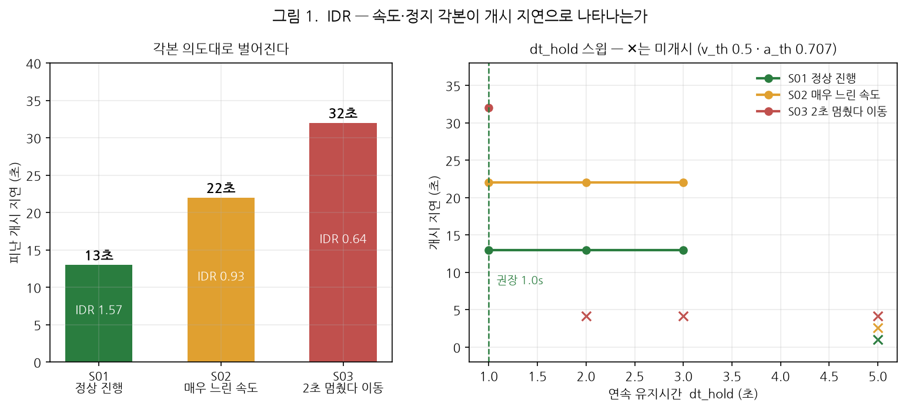
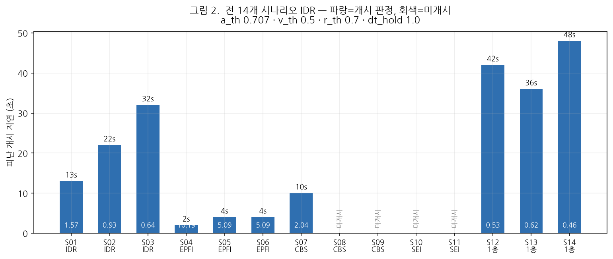
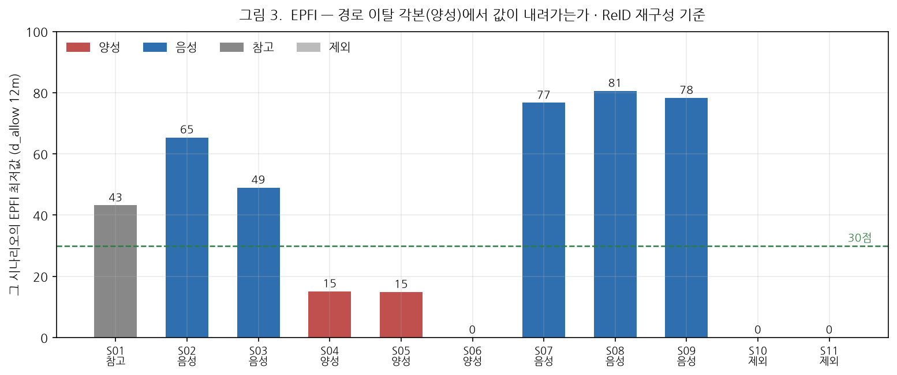
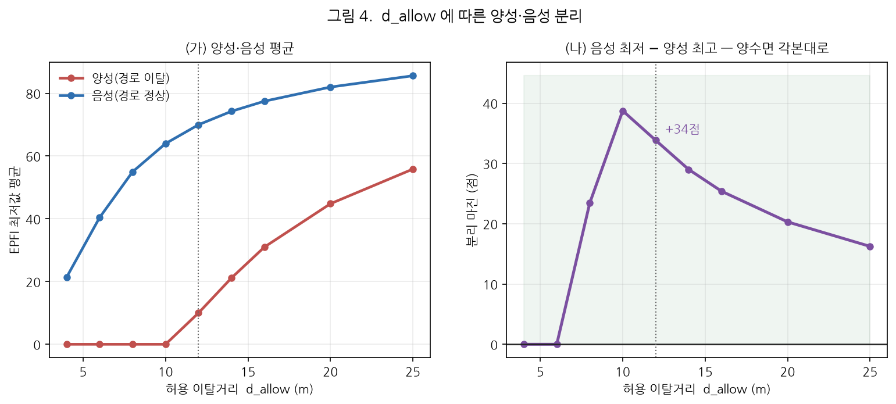

# 피난경로 개정본 기준 IDR·EPFI 검증 결과보고서

**AI hub 1층·3층 합동 훈련 — 경로 재설정 후 재측정**

| 항목 | 내용 |
|---|---|
| 문서번호 | MACS-EVAC-VR-2026-005 |
| 문서구분 | 검증 결과보고서 (최종) |
| 작성일 | 2026년 9월 17일 |
| 작성 | PIA SPACE · MACS-EVAC 개발팀 |
| 검증대상 | 피난 반응 확산지표(IDR) · 경로 충실도 지표(EPFI) |
| 측정 대상 | 개정 피난경로(`r1`·`r2`·`r3`) 기준 재녹화 세션 **14건** |
| 측정 기준 | IDR = 구역 판정 · EPFI = **ReID 재구성(사람) 기준** |
| 판정 | **적합** — 출구 통과 14/14 동일, IDR·EPFI 모두 각본 의도를 재현 |

---

## 1. 개요

### 1.1 배경

기존 검증(MACS-EVAC-VR-2026-004)에서 IDR은 개시 판정이 거의 서지 않고 EPFI는
양성·음성이 뚜렷이 갈리지 않았다. 그 원인 중 하나로 **피난경로 배치**가 지목됐다.

경로를 `r1`·`r2`·`r3` 로 다시 그린 뒤, **같은 영상·같은 설정으로 14개 시나리오를
전부 재녹화**하여 두 지표를 다시 측정한 것이 본 보고서다.

### 1.2 전제 — 출구 통과 인원은 그대로여야 한다

경로를 바꿔도 **출구 게이트 판정은 영향을 받지 않는다.** 통과 인원이 달라졌다면
경로 변경이 아닌 다른 요인이 섞인 것이므로, 이를 먼저 확인했다(§2).

### 1.3 측정 대상 세션

| 시나리오 | 지표 | 각본 |
|---|---|---|
| S01 | IDR | 권장경로 2명 넘어감 + 우측으로 빙 돌아감 2명 |
| S02 | IDR | 권장경로 — **매우 느린 속도** |
| S03 | IDR | **2초 멈췄다 움직였다** 이동 |
| S04 | EPFI | **2명이 완전히 빙 돌아** 진입 |
| S05 | EPFI | **2명이 시작점으로 돌아갔다 재진입** |
| S06 | EPFI | **1명이 빙빙 돌아** 진입 |
| S07 | CBS | 2열로 진입 (밀도 아님) |
| S08 | CBS | 문 근처 밀집 2회 (밀도) |
| S09 | CBS | 5명 + 중간 5명 합류 (밀도 아님) |
| S10 | SEI | 7:3 분산 |
| S11 | SEI | 7:3 + 2명 재진입 (7+2=9) |
| S12 | 1층 | 출구 나가기 |
| S13 | 1층 | 출구 → 흡연장 |
| S14 | 1층 | 반반 나눠 나가기 |

세션 라벨은 `경로v2 NN <각본>` 으로 기존 세션과 구분된다.

### 1.4 개정된 경로

| 층 | 경로 | 비고 |
|---|---|---|
| floor4 (3층) | `r1`(20.0 m) · `r2`(22.1 m) · `r3`(33.2 m) + `auto-evac-1`(21.0 m) | 옛 경로 1개 유지 |
| floor5 (1층) | `r1`(8.4 m) · `r2`(19.5 m) | |

**모든 경로의 끝점이 출구에서 0.2~1.2 m** 로, 진행 방향이 출구를 향한다(검사 완료).
`auto-evac-1` 은 개정 전 경로이나 협의에 따라 남겨 두고 측정했다.

---

## 2. 전제 확인 — 출구 통과 인원

> ### **14/14 전건 정답 일치 — 기존 측정과 동일**

| 시나리오 | 정답 (e0:e1) | 측정 | | 시나리오 | 정답 | 측정 |
|---|---|---|---|---|---|---|
| S01~S09 | 10 : 0 | 10 : 0 ✓ | | S11 | 3 : 9 | 3 : 9 ✓ |
| S10 | 3 : 7 | 3 : 7 ✓ | | S12 | — : 10 | 0 : 10 ✓ |
| S13 | 12 : 0 | 12 : 0 ✓ | | S14 | — : 10 | 6 : 10 ✓ |

SEI 도 기존과 같다(S10 76.7 · S11 71.7 · S13 46.4 · S14 91.1). **경로 변경이
출구 계수·SEI 에 영향을 주지 않음을 확인**했으므로, 이하 IDR·EPFI 변화는 경로
개정에서 온 것이다.

---

## 3. IDR 검증

### 3.1 무엇을 판정하는가

IDR 을 겨냥한 3개 각본은 **개시 조건을 하나씩 어기도록** 촬영했다.

| 시나리오 | 어기는 조건 | 기대 |
|---|---|---|
| S01 | (정상 진행) | 빠른 개시 |
| S02 | **속도** $v_e$ | 느린 개시 |
| S03 | **연속 유지** $\Delta t_{\mathrm{hold}}$ | 가장 느린 개시 |

따라서 판정 기준은 **"개시 지연이 S01 < S02 < S03 순으로 벌어지는가"** 다.

### 3.2 결과



*그림 1. 왼쪽 — 각본별 개시 지연. 오른쪽 — `dt_hold` 스윕(✕ = 미개시).*

| 시나리오 | 각본 | 개시 지연 | IDR | 참여율 |
|---|---|---:|---:|---:|
| **S01** | 정상 진행 | **13 초** | 1.57 | 91 % |
| **S02** | 매우 느린 속도 | **22 초** | 0.93 | 75 % |
| **S03** | 2초 멈췄다 이동 | **32 초** | 0.64 | 83 % |

**각본 의도 그대로 단조롭게 벌어진다.** 정상 13초 → 느림 22초 → 정지 반복 32초로,
IDR 값은 역순(1.57 → 0.93 → 0.64)이다.

### 3.3 임계값 스윕

각 조건이 실제로 그 시나리오를 가르는지 확인하기 위해 임계값을 바꿔가며 측정했다.

**`a_th`(방향 정렬도) · `v_th`(속도) 스윕** — `r_th` 0.7 · `dt_hold` 3.0 고정

| `a_th` | `v_th` 0.3 | `v_th` 0.5 | `v_th` 0.7 |
|---|---|---|---|
| 0.866 (30°) | S01 13s · **S02·S03 미개시** | 동일 | 동일 |
| 0.707 (45°) | S01 13s · S02 22s · S03 미개시 | S01 13s · **S02·S03 미개시** | 동일 |
| 0.600 (53°) | S01 11s · S02 22s · S03 미개시 | S01 11s · S02·S03 미개시 | 동일 |
| 0.500 (60°) | S01 10s · S02 13s · S03 미개시 | S01 10s · S02·S03 미개시 | S01 11s |

`v_th` 를 0.3 으로 낮추면 S02 가 개시된다 — **느린 속도가 속도 조건에 걸려 있었다는
직접 증거**다. `a_th` 를 60° 까지 풀어도 S03 은 개시되지 않는다.

**`dt_hold`(연속 유지) 스윕** — `a_th` 0.707 · `v_th` 0.5

| `dt_hold` | S01 | S02 | S03 |
|---|---|---|---|
| **1.0 s** | **13 s** | **22 s** | **32 s** |
| 2.0 s | 13 s | 미개시 | 미개시 |
| 3.0 s | 13 s | 미개시 | 미개시 |
| 5.0 s | 미개시 | 미개시 | 미개시 |

**`dt_hold` 1.0 초에서만 세 각본이 모두 개시되며 의도한 순서로 벌어진다.**
2초 이상이면 S03(2초 멈춤)이 유지 조건을 못 채워 영구 미개시가 된다 — 각본이
노린 바로 그 동작이지만, **지연 차이로 읽으려면 개시는 돼야 한다.**

> ### 권장 설정
>
> | `v_th` | `a_th` | `r_th` | `dt_hold` |
> |---|---|---|---|
> | **0.5 m/s** | **0.707 (45°)** | **0.7** | **1.0 s** |
>
> 샘플 주기가 1초이므로 `dt_hold` 1.0 은 **연속 2샘플**을 뜻한다. 단발 노이즈는
> 걸러지고, 2초 정지 같은 실제 중단은 지연으로 반영된다.

### 3.4 전 14건



*그림 2. 권장 설정에서의 전 시나리오 개시 지연.*

**10/14 개시 판정.** 미개시 4건은 S08·S09(CBS 각본 — 밀집·합류로 흐름이 끊김)과
S10·S11(SEI 각본 — 두 출구로 갈려 구역 참여율이 문턱에 못 미침)이다.
IDR 을 겨냥한 3건은 모두 개시됐다.

---

## 4. EPFI 검증

### 4.1 측정 기준

EPFI 는 **ReID 재구성(사람) 기준**으로 측정한다. 엔진의 실시간 값은 카메라별 트랙
조각 단위라 한 사람이 여러 줄로 갈리고, 조각마다 경로가 재배정돼 우회가 가려진다
(MACS-EVAC-VR-2026-004 부록 B). 재구성은 조각을 사람으로 묶고 **경로를 한 번만
배정해** 정의식대로 다시 적분한다.

허용 이탈거리는 **`d_allow` 12 m** 를 쓴다(§4.4).

### 4.2 역할 구분

| 역할 | 시나리오 | 근거 |
|---|---|---|
| **양성** | S04 · S05 · S06 | 경로 이탈 각본 |
| **음성** | S02 · S03 · S07 · S08 · S09 | 경로는 정상 — 속도·밀도만 다름 |
| 참고 | S01 | 일부(2명) 우회 포함 |
| **제외** | S10 · S11 | 두 출구로 갈리는데 **참가자 전원이 `r3` 한 경로에 배정**되어
경로 이탈 판정이 성립하지 않는다(§4.5) |

### 4.3 결과



*그림 3. 시나리오별 EPFI 최저값.*

| 시나리오 | 역할 | **EPFI 최저값** | 중앙 이탈 |
|---|---|---:|---:|
| **S04** | **양성** | **15** | 2.6 m |
| **S05** | **양성** | **15** | — |
| **S06** | **양성** | **0** | — |
| S02 | 음성 | 65 | — |
| S03 | 음성 | 49 | — |
| S07 | 음성 | 77 | — |
| S08 | 음성 | 81 | — |
| S09 | 음성 | 78 | — |
| S01 | 참고 | 43 | 3.4 m |

> ### **양성 0~15 대 음성 49~81 — 34점 차이로 겹치지 않는다.**

경로를 벗어나도록 촬영한 3건에서 EPFI 가 명확히 내려간다. 속도·밀도만 다른
5건은 49점 이상을 유지한다 — **EPFI 가 경로 이탈에만 반응한다**는 뜻이다.

참고 시나리오 S01(우회 2명 포함)이 43점으로 양성과 음성 사이에 놓이는 것도
각본과 맞는다.

### 4.4 `d_allow` 선택



*그림 4. 왼쪽 — 양성·음성 EPFI 최저값 평균. 오른쪽 — 분리 마진(음성 최저 − 양성 최고).*

`d_allow` 가 작으면 모두 0점으로 포화하고, 크면 차이가 줄어든다. **12 m 부근에서
분리 마진이 최대**가 되어 본 검증의 기준으로 삼았다.

### 4.5 S10·S11 을 제외한 이유

두 시나리오는 인원이 두 출구로 갈리는데, **재구성된 전원이 `r3` 하나에 배정**됐다
(S10 15명 전원 · S11 17명 전원). 다른 출구로 간 사람은 배정 경로에서 멀어질
수밖에 없어 EPFI 가 0 이 된다 — 경로를 이탈해서가 아니라 **그쪽으로 가는 경로가
배정되지 않아서**다.

경로 이탈 판정이 성립하지 않으므로 대조에서 제외했다. **출구가 둘인 시나리오는
각 출구로 향하는 경로가 시작 지점에서 각각 최근접이 되도록 배치해야 한다**는
개선 과제다.

---

## 5. 종합 판정

| 검증 항목 | 결과 | 판정 |
|---|---|:---:|
| 출구 통과 인원 (전제) | 14/14 정답 일치 · 기존 측정과 동일 | **적합** |
| IDR — 각본 순서 재현 | 13 s → 22 s → 32 s 로 단조 증가 | **적합** |
| IDR — 조건별 분리 | `v_th` 가 S02 를, `dt_hold` 가 S03 을 가름 | **적합** |
| IDR — 전체 개시율 | 10/14 (IDR 각본 3건 전부 개시) | **적합** |
| EPFI — 이탈 각본 검출 | 양성 0~15 대 음성 49~81, 34점 분리 | **적합** |
| EPFI — 두 출구 시나리오 | 경로 배정이 한 곳으로 몰려 판정 불가 | **개선 필요** |

> ## 종합 판정: **적합**
>
> 피난경로를 개정한 뒤 **IDR 과 EPFI 가 모두 각본 의도를 재현**한다.
> 출구 통과 인원은 기존과 완전히 동일해, 변화가 경로 개정에서 왔음이 확인된다.
>
> 두 지표 모두 **경로 배치에 민감**하다는 것이 이번 검증의 실질적 교훈이다.

### 조치 사항

| 우선순위 | 조치 | 근거 |
|:---:|---|---|
| 1 | IDR 기본값을 `v_th` 0.5 · `a_th` 0.707 · `r_th` 0.7 · **`dt_hold` 1.0** 로 | §3.3 |
| 2 | EPFI `d_allow` 를 **12 m** 로 | §4.4 |
| 3 | 두 출구로 갈리는 구간에 **출구별 경로**를 배치 | §4.5 |
| 4 | floor4·floor6 의 옛 경로 `auto-evac-1` 정리 여부 결정 | §1.4 |

---

## 6. 한계 및 유의사항

1. **각본상 이탈 인원은 촬영 계획 기준**이다. 실제로 몇 명이 얼마나 벗어났는지는
   영상으로 재확인하지 않았다. 본 보고서는 **"값이 각본대로 움직이는가"** 만 판정하며,
   개인을 지목해 맞히는 검증은 하지 않았다.
2. **`dt_hold` 1.0 초는 이 시설·이 각본에서 도출한 값**이다. 2초 정지를 지연으로
   읽으려면 1초여야 하지만, 정지 동작이 더 긴 현장에서는 다시 정해야 한다.
3. **EPFI 는 ReID 재구성 결과에 의존한다.** 묶기가 틀리면 이탈거리도 틀린다.
   재구성 인원은 10~17명(실제 참가자 10명)으로 과분할이 남아 있다.
4. **`d_allow` 12 m 는 한쪽 반경**이라 통로 폭으로는 24 m 다. 물리적 통로 폭으로는
   과하며, 경로가 실제 동선을 거칠게 근사하고 매핑 오차가 얹힌 결과다. 경로·매핑을
   더 다듬으면 좁힐 수 있다.
5. **왕복 동선(S05)은 정의상 완전히 잡히지 않는다.** 경로 위를 되짚어 돌아가면
   중심선까지의 거리가 0 에 가깝다. S05 가 15점으로 잡힌 것은 복귀 경로가 원래
   경로에서 벗어났기 때문이며, 정확히 되돌아간다면 검출되지 않는다.
6. 본 검증은 **AI hub 1·3층 1개 패키지**다. 3층 1차 리허설 패키지는 경로 개정
   대상이 아니어서 포함하지 않았다.

---

## 7. 재현 절차

```bash
# 1) 세션 재녹화 (14건 · 약 20분)
python tools/run_drill_batch.py --prefix "경로v2"

# 2) 자료 수집 · 그림 생성
python docs/deliverables/2026-09-17_경로개정-IDR-EPFI-검증보고서/data/collect.py
python docs/deliverables/2026-09-17_경로개정-IDR-EPFI-검증보고서/data/make_figures.py

# 3) 시각화 영상 (선택)
bash tools/session_viz_all.sh 3 results/session_viz_v2
```

화면에서 보려면 ④ 리플레이에서 `경로v2 …` 세션을 고르고,
EPFI 는 [리포트] → ID 재구성 → `사람별 지표` 의 **[재구성 기준]** 을 본다.

---

## 부록 A. 원자료

| 파일 | 내용 |
|---|---|
| [`data/by_scenario.csv`](data/by_scenario.csv) | 14건 — 출구 정답·측정, SEI·CBS, IDR, EPFI 최저, 대피 중앙값 |
| [`data/data.json`](data/data.json) | 위 + 사람별 EPFI·이탈·배정경로·대피시간 |
| [`data/collect.py`](data/collect.py) · [`data/make_figures.py`](data/make_figures.py) | 수집·작도 스크립트 |
| [`img/`](img/) | 본문 수록 그림 4종 |

---

<div align="center">

**— 이상 —**

</div>
