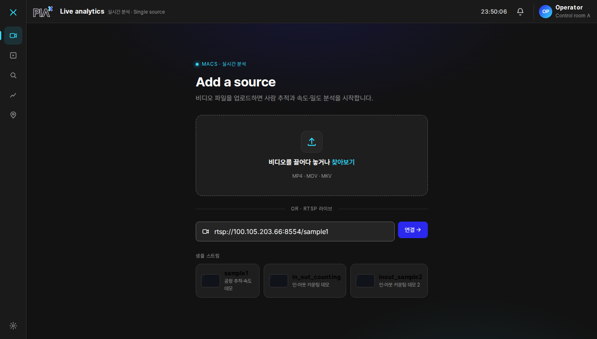
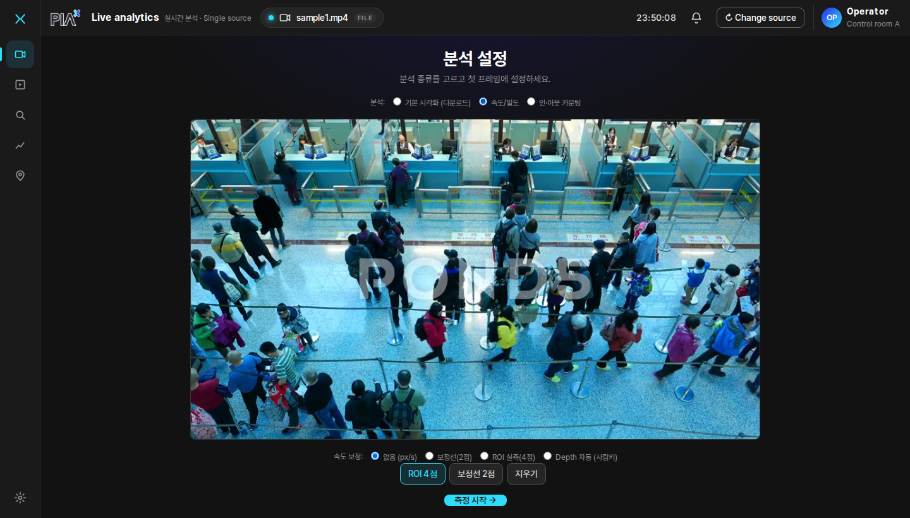
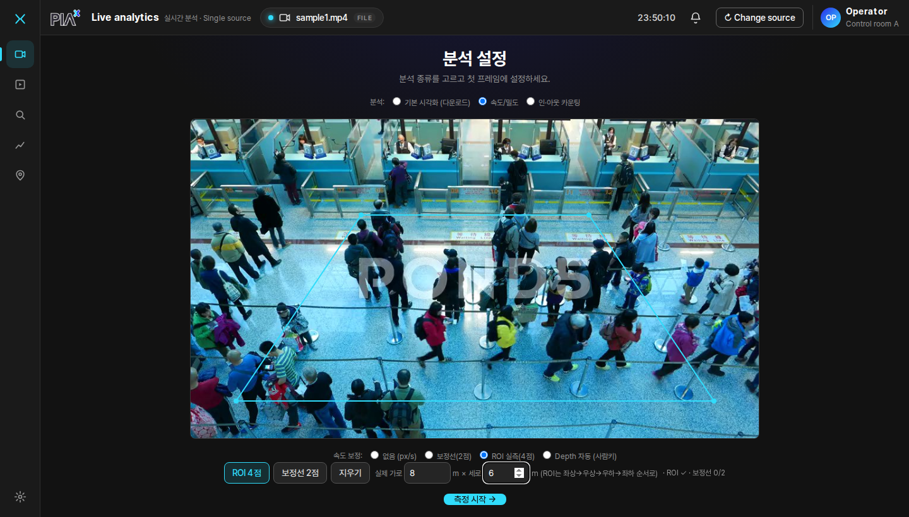
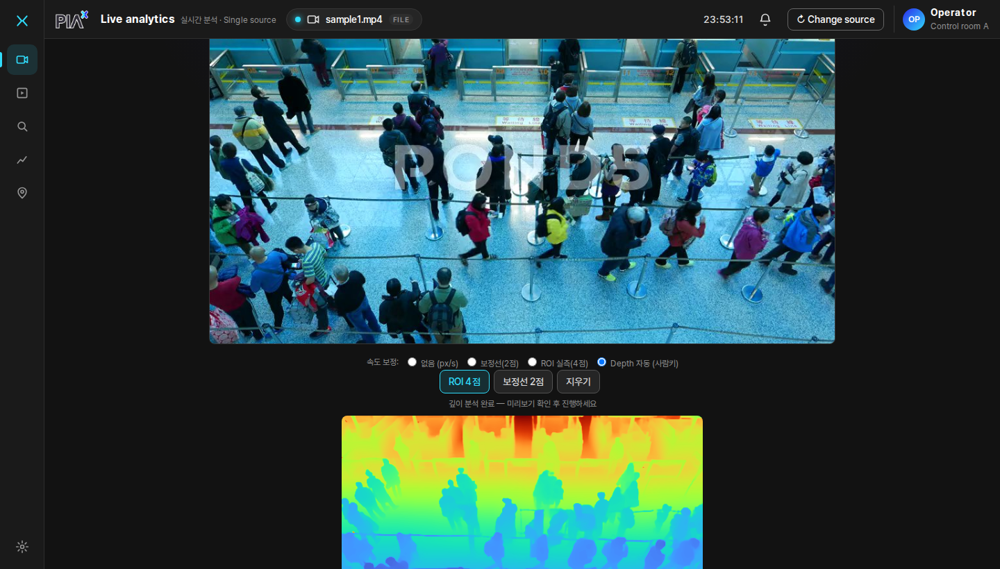
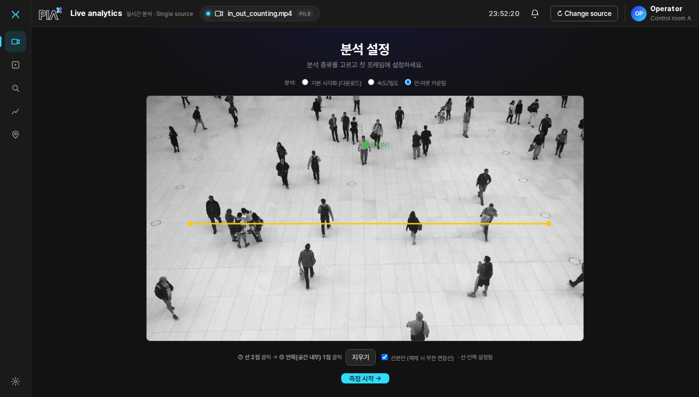
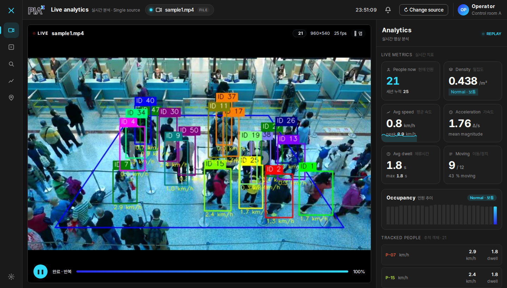
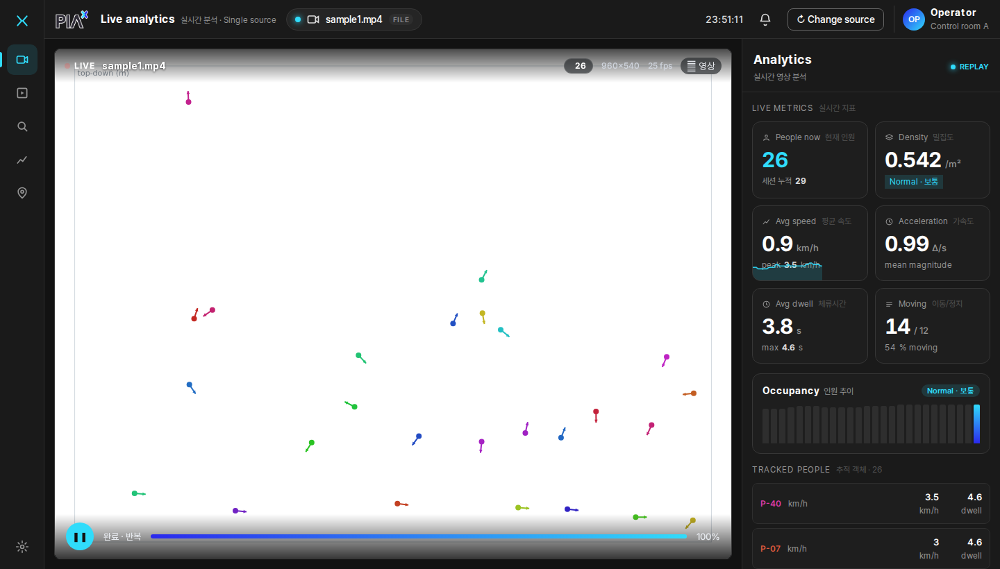
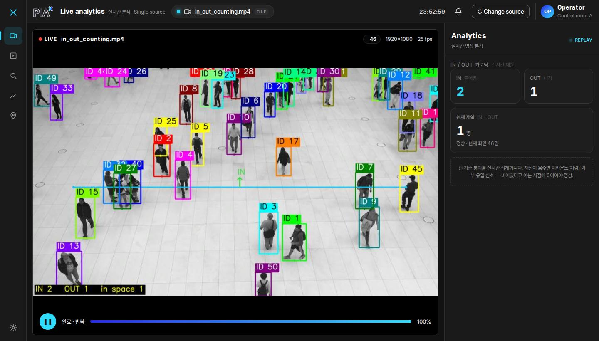
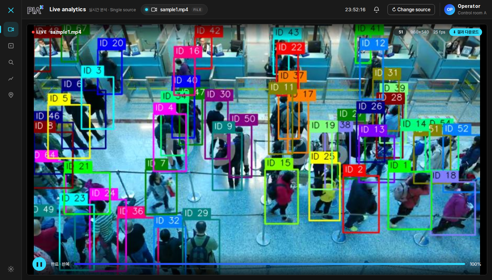

# MACS-EVAC 웹 UI 사용 가이드

비디오/RTSP를 입력해 사람을 추적하고 **속도·밀도·체류·인아웃 카운팅**을 실시간으로
보는 화면별 사용법과 지표 계산 방식을 스크린샷과 함께 정리한 가이드입니다.

브라우저로 접속하면 **① 소스 추가 → ② 분석 설정 → ③ 분석 화면** 순서로 진행합니다.
좌측 아이콘 레일 + 상단바(로고·시계·`Change source`)는 항상 떠 있습니다.

---

## 1. 화면 ① — 소스 추가 (Add a source)



| 동작 | 결과 |
|------|------|
| **드롭존 클릭 / 드래그&드롭** | 비디오 파일 업로드 → 설정 화면으로 |
| **RTSP 주소 입력 + `연결 →`** | 라이브 스트림 연결 → 설정 화면으로 |
| **샘플 스트림 카드 클릭** | 그 RTSP로 바로 연결 (sample1 / in_out_counting / inout_sample2) |

- **파일** 업로드 = 유한 영상(추론 후 결과 저장·반복재생·다운로드 가능).
- **RTSP** = 라이브(무한, 정지 버튼으로 종료, 저장/다운로드 없음).

---

## 2. 화면 ② — 분석 설정

업로드/연결하면 **첫 프레임**이 캔버스에 뜨고, 상단에서 **분석 종류**를 고릅니다.

### 분석 종류 (3가지)
- **기본 시각화(다운로드)** — 파일 전용. ID+박스만. 결과를 H.264로 저장·다운로드.
- **속도/밀도** — 추적 + 속도·밀도·체류·가속도 대시보드.
- **인·아웃 카운팅** — 선 통과 in/out + 재실(occupancy).

> RTSP(라이브)로 들어오면 "기본 시각화(다운로드)"는 저장 개념이 없어 **자동으로 숨겨집니다**.

### (a) 기본 시각화 — 설정 없음

별도 설정 없이 바로 **`측정 시작`**. (ID+박스만 그리고 끝나면 다운로드 제공)

### (b) 속도/밀도 — 보정 모드 선택


"속도 보정"을 고릅니다 — 이게 **px/s vs km/h**를 결정합니다:
| 보정 | 입력 | 단위 |
|------|------|------|
| **없음** | — | px/s (상대) |
| **보정선(2점)** | 두 점 + 실제 거리(m) | km/h (전역 비율) |
| **ROI 실측(4점)** | 사각형 4점 + 실제 가로·세로(m) | km/h (원근 보정) |
| **Depth 자동** | — | km/h (사람키 1.7m 추정) |

### (b-1) ROI 실측(호모그래피)

바닥의 사각 구역을 **좌상→우상→우하→좌하** 순서로 4점 찍고 실제 가로·세로(m)를 입력 →
화면 위치별 축척(원근)을 자동 보정해 km/h를 정확히 계산.

### (b-2) Depth 자동 — 깊이 미리보기 확인

`깊이 분석 →` 누르면 첫 프레임을 AI(Depth-Anything-3)로 분석해 **컬러 깊이맵**을 보여줍니다.
초점거리·평면 적합도·인원이 표시되고, **`이 깊이로 측정 시작`** 으로 진행. (사람키 1.7m로 자동 스케일)

### (c) 인·아웃 카운팅 — 선 + 안쪽 지정

**① 선 2점** 클릭 → **② 안쪽(공간 내부) 1점** 클릭. "선분만"(기본)은 그린 구간 근처만,
해제하면 무한 연장선 전체에서 통과를 셉니다.

---

## 3. 화면 ③ — 분석

좌측 영상(추적 오버레이) + 우측 대시보드. 처리 중에는 라이브로 흐르고, **파일은 완료 후
결과를 source fps로 무한 루프 재생**(대시보드도 같은 프레임으로 동기).

### (a) 속도/밀도 대시보드


- 영상: ID 박스 + 발끝 기준 속도 라벨, ROI(설정 시) 표시.
- 대시보드: **현재 인원 / 세션 누적 / 밀도(+혼잡도) / 평균·최고 속도 / 가속도 / 평균·최대 체류 / 이동·정지 / 인원 추이 / 객체별 표.**
- 상단 우측 **`🗺 맵`** 토글로 top-down 맵 전환.

### (b) 2D 맵 뷰

흰 평면에 각 사람을 **발끝 지면 좌표 점 + 방향벡터**로 top-down 표시. (호모그래피/Depth면 미터 기준)

### (c) 인·아웃 카운팅

영상에 라인 + IN 방향 화살표. 대시보드에 **IN / OUT / 현재 재실(=IN−OUT)**.
재실이 **음수면 경보**(미카운트·외부유입 신호 — 비었다고 아는 시점에 0이어야 정상).

### (d) 기본 시각화 + 다운로드

ID+박스만 깔끔하게(대시보드 숨김). 완료되면 우상단 **`⬇ 결과 다운로드`**(H.264 mp4).

---

## 4. 성능 지표 계산 방식

기준점은 모든 지표에서 **발끝(박스 하단 중앙 `((x1+x2)/2, y2)`)** 입니다.

### 속도 (km/h 또는 px/s)
**최근 1초 슬라이딩 윈도우**의 처음↔끝 발끝 위치로:
```
dt   = t_끝 − t_처음           (실제 경과초; 파일=프레임/fps, RTSP=실시계)
거리  = 처음↔끝 이동 (px 또는 보정 시 미터)
속도  = 거리 / dt   → 미터면 ×3.6 으로 km/h
```
- 보정선: `(픽셀거리/ppm)/dt×3.6`. 호모그래피/Depth: 발끝을 지면 미터로 변환 후 미터거리/dt×3.6.
- 5px(또는 deadband) 미만 이동은 0 처리(노이즈 제거).

### 가속도
객체별 `|속도_지금 − 속도_직전| / Δt` 의 화면 평균 (단위 Δ/s).

### 밀도 / 혼잡도
`인원 ÷ 면적`. 보정 시 **명/m²**(면적 = ROI 또는 전체프레임을 미터로 환산), 미보정 시 명/Mpx.
혼잡도 pill = 명/m² 기준 `<0.4 여유 / <1.0 보통 / ≥1.0 혼잡`.

### 체류시간
각 사람의 `현재시각 − 처음 등장시각`(초). 평균/최대 표시.

### 현재 인원 / 세션 누적
- 현재 인원 = 지금 ROI(미설정 시 전체) 안의 추적 객체 수.
- 세션 누적 = 분석 시작 후 **나타난 고유 트랙 ID 수**(신규 ID마다 +1). ID 스위치·재입장으로 과대될 수 있음.

### 인·아웃 / 재실
발끝이 선을 **반대편으로 넘는 순간(부호 뒤집힘)** 카운트. 안쪽이면 IN++, 바깥이면 OUT++.
`재실 = 시작값(0) + IN − OUT`. 음수면 경보.

> 참고: 표시되는 km/h·밀도는 **추정값**입니다. 사람이 겹치거나(가림) 추적 ID가 바뀌면,
> 또 바닥이 평평하지 않으면 오차가 생길 수 있습니다.

---

## 5. 모드 요약

| 분석 | 입력 소스 | 화면/지표 | 저장·다운로드 |
|------|----------|-----------|--------------|
| 기본 시각화 | 파일 | ID+박스, 대시보드 없음 | **H.264 다운로드** |
| 속도/밀도 | 파일·RTSP | 속도·밀도·체류·가속도 대시보드 + 맵 | (파일) 결과 재생 |
| 인·아웃 카운팅 | 파일·RTSP | IN/OUT/재실 + 경보 | (파일) 결과 재생 |

| 갱신 단계 | 대시보드 |
|-----------|----------|
| 처리 중 | ~600ms 폴링(간헐) |
| 완료·반복재생(파일) | source fps 동기 |
| RTSP 라이브 | ~600ms 폴링 |

---

## 6. 팁

- **새 소스로 바꾸기**: 상단바 `Change source` → 처음(소스 추가) 화면으로.
- **RTSP 정지**: 분석 화면 하단 정지 버튼. (새 소스를 시작하면 기존 라이브는 자동 정지)
- **다운로드**: 기본 시각화 모드가 끝나면 우상단 `⬇ 결과 다운로드` → `tracked_<id>.mp4`(어디서나 재생).
- **영상↔맵**: 속도/밀도 모드에서 우상단 `🗺 맵` 버튼으로 전환.
- 미리보기 글자가 약간 부드러워 보이는 건 정상(전송용 축소). **다운로드 파일은 원본 화질**이라 선명합니다.
