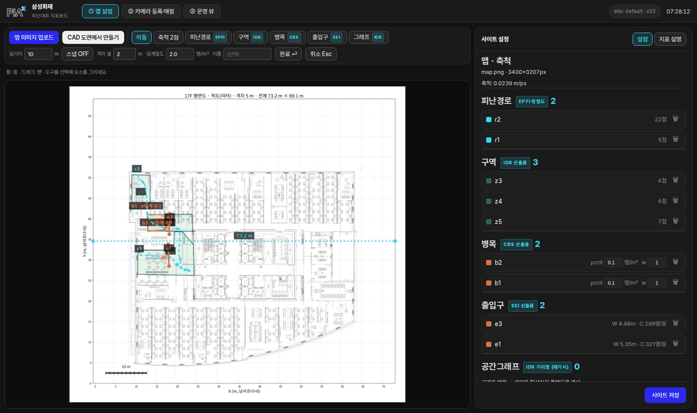
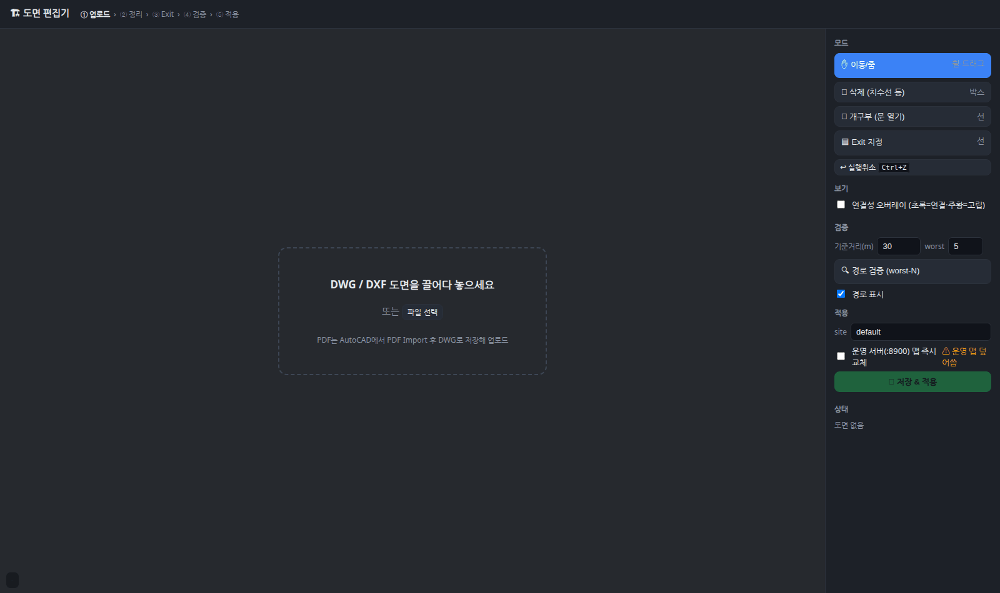
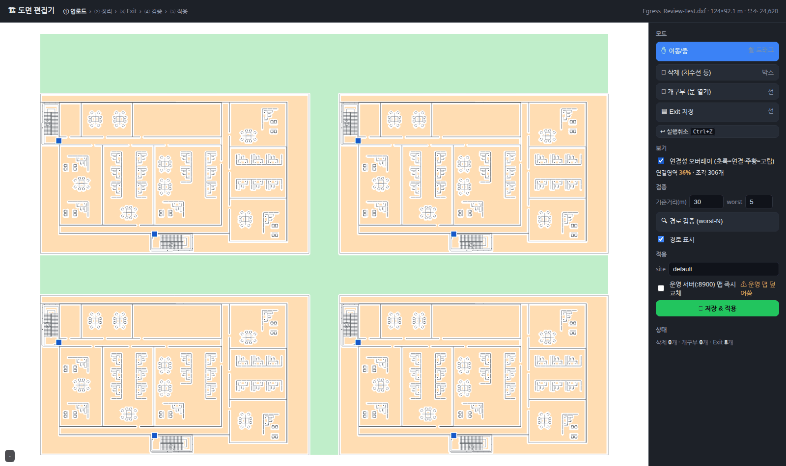
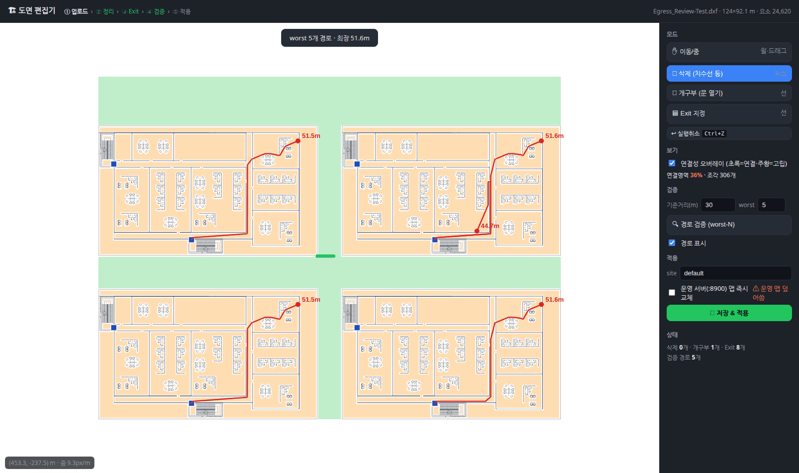
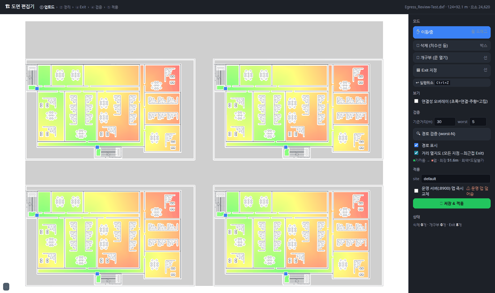
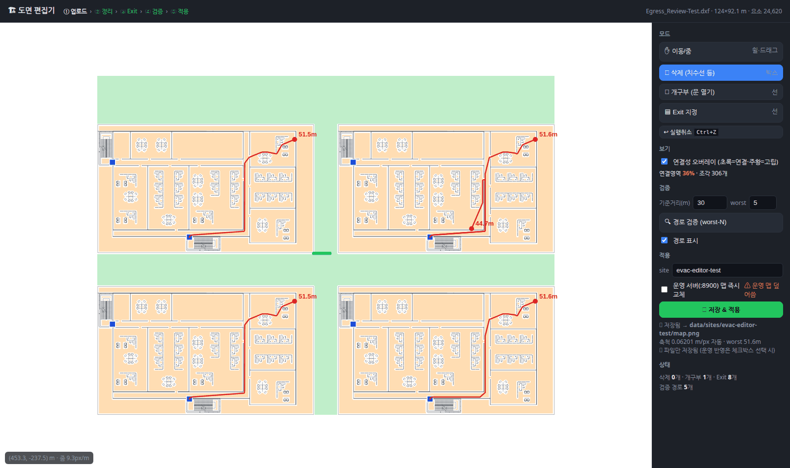

# 도면 편집기 사용 가이드 (CAD → 2D맵 + 피난경로)

맵 설정에서 **CAD 도면(DWG/DXF)으로부터 2D맵을 만드는** 새 창 도구.
AutoCAD 없이 브라우저에서 ①문 열기(터치업) ②Exit 지정 ③피난경로 검증까지 하고,
[저장 & 적용]하면 운영 웹의 맵·축척이 자동 반영된다.

> 알고리즘 원리(왜 시작점이 필요 없는가)는 맨 아래 **§7 동작 원리** 참조.

---

## 1. 진입 — 맵 설정에서 버튼 클릭



**① 맵 설정** 탭 툴바의 **[CAD 도면에서 만들기]** 를 누르면 편집기가 새 창으로 뜬다.
(직접 접속: `http://<서버>:8910/`)

- 버튼으로 열면 "운영 서버 즉시 반영"이 **기본 켜짐**(맵설정에서 열었다는 의도).
  직접 URL로 열면 기본 꺼짐 — 파일만 저장된다.

## 2. 업로드



DWG 또는 DXF를 **드래그&드롭**(DWG는 서버가 자동 변환, 수십 초).
PDF 도면은 AutoCAD에서 *PDF Import* 후 DWG로 저장해 올린다.

- 도면에 `Evac_Exit` 레이어(삼성 매크로 규약)가 이미 있으면 **Exit 자동 인식**.
- 캔버스 조작: **휠=줌 · 드래그=팬** (이동 모드).

## 3. 정리(터치업) — 문 열기·가짜 벽 제거



**[연결성 오버레이]** 를 켜면 걸어갈 수 있는 영역이 색으로 보인다:
**초록 = 서로 연결된 보행공간 · 주황 = 고립된 방**(문이 닫혀 있어 못 나가는 곳).

| 도구 | 언제 | 조작 |
|------|------|------|
| **🚪 개구부** | 방이 주황(고립)일 때 — 문짝이 그려져 통로가 막힘 | 문 위치에 **짧게 선 드래그** → 그 자리(폭 0.9m)가 통행 가능해지고 방이 초록으로 바뀜 |
| **🧹 삭제** | 치수선·불필요 요소가 벽으로 오인될 때 | **박스 드래그** → 걸린 요소 일괄 삭제 (`Ctrl+Z` 실행취소) |

편집은 **비파괴** — 원본 도면은 그대로 두고 편집 내역만 저장된다.
삼성화재 매크로의 "AutoCAD에서 문/치수선 수동 삭제" 공정과 동일한 효과를
클릭 몇 번으로 대체하는 것 (+삼성 쪽엔 없는 실시간 연결성 피드백).

## 4. Exit 지정

**🟦 Exit 모드**에서 피난계단 출입구에 **폭만큼 선을 드래그**한다(여러 개 가능).
선의 **중점**이 도착점이 된다 — 삼성 매크로의 `Evac_Exit` 규약과 동일.

## 5. 검증 — 경로가 제대로 나오는지 확인

### worst-N 경로 (가장 취약한 지점)


기준거리(m)·개수를 넣고 **[경로 검증]** — Exit에서 **가장 먼 지점 N곳**의 피난경로가
거리와 함께 그려진다(초록=기준 이내 Pass, 빨강=초과 Fail). 법규 검토의 관심 대상인
"최악 지점이 몇 m인가"에 바로 답한다.

### 거리 열지도 (전체를 한눈에)


**[거리 열지도]** 를 켜면 **모든 지점의 최근접 Exit까지 피난거리**가 색으로 깔린다:
초록(가까움) → 노랑 → 빨강(멂), 회색 = 도달 불가(아직 문이 닫힌 곳).

- 이것이 "전체 최적경로"의 총체다 — 개별 경로 수천 개를 그리면 스파게티가 되지만,
  열지도는 같은 정보를 한 장으로 보여준다(§7 참조).
- 빨간 구역이 넓으면 Exit 추가/재배치를 검토하고, 회색 방이 남았으면 3번으로 돌아가
  문을 더 연다.

## 6. 저장 & 적용



site 이름 확인 후 **[저장 & 적용]**:

| 산출물 | 내용 |
|--------|------|
| `data/sites/<site>/map.png` | 터치업된 깨끗한 평면도 = 2D맵 배경 |
| `floor.json` | 편집내역(삭제/개구부/Exit)·좌표계·**m_per_px 축척(자동)** |
| `evac_distfield.npz` | **거리장 사전계산** — 운영 중 실시간 피난거리 조회용 |

"운영 서버 즉시 반영"이 켜져 있으면 :8900 맵이 곧바로 교체되고, 열려있던
맵 설정 화면이 **자동 갱신**된다(새로고침 불필요). **축척 2점 수동 지정도 생략** —
CAD가 mm 단위라 편집기가 정확한 m/px를 자동 기입한다.

---

## 7. 동작 원리 — 시작점이 왜 따로 필요 없나

핵심은 **경로를 "시작점→Exit"로 하나씩 찾는 게 아니라, Exit에서 출발해 전체를 한 번에
계산**한다는 것.

```
① 격자화     도면을 5cm 격자로 나누고 벽 주변 30.48cm(=1ft) 이격까지 막음 → 벽1/통행0
② 거리장     모든 Exit를 동시에 출발점으로 다익스트라(8방향) 1회 실행
             → "모든 칸"에 대해 [최근접 Exit까지의 최단 보행거리]가 채워진 지도(距離場)
③ 경로 추출  어떤 지점이든 그 지도의 내리막(거리가 줄어드는 방향)을 따라 내려가면
             그게 곧 그 지점의 최적 피난경로 (직선화 후 표시)
```

그래서:

- **시작점은 계산에 필요 없다** — 거리장은 시작점과 무관하게 Exit만으로 만들어지고,
  시작점은 "다 만들어진 지도에서 값을 읽는 위치"일 뿐이다. 어떤 지점을 찍어도
  경로·거리가 즉시 나온다.
- **worst-N** = 그 지도에서 값이 가장 큰(가장 먼) 칸 N개를 자동으로 뽑아 경로를 보여주는 것.
- **거리 열지도** = 그 지도 자체를 색으로 보여주는 것 → "전체 최적경로"를 한 장으로 보기.
- **삼성 매크로의 mesh(Evac_Occupant)** = 1m 간격 격자점 전부를 시작점으로 찍어
  경로 수천 개를 그리는 방식 — 정보량은 열지도와 같고 표현만 다르다.
  (필요하면 CLI `evac_route.py route --mode occupant --starts ...`로 동일 재현 가능.)
- **운영(트래킹) 연동** = CCTV 추적이 주는 사람 좌표가 곧 시작점. 저장해둔
  거리장(`evac_distfield.npz`)에서 조회만 하면 되므로 **매 프레임 계산 비용 ≈ 0**,
  사람마다 실시간 피난거리·최적경로가 나온다 → EPFI 지표의 근거.

거리 값·판정은 삼성화재 원본 매크로와 대조 검증됨(동일 시작점에서 Pass/Fail 100% 일치,
거리 오차 ≈ 0.5m — [검증 문서](../../../cad/CAD_API_Based_Optimal_Evacuation_Route_Algorithm/삼성화재-회신-샘플도면-검증-2026-07-16.md) 참조).

---

## 부록 — 운영·관리

```bash
# 편집기 서비스 (pm2 상시 구동)
pm2 status evac-editor          # 상태
pm2 restart evac-editor         # 재시작
pm2 logs evac-editor            # 로그
# 수동 실행 시:
cd cad/CAD_API_Based_Optimal_Evacuation_Route_Algorithm
conda run -n boosttrack uvicorn evac.web:app --host 0.0.0.0 --port 8910
```

- 구현·API 명세: [`기능명세.md`](../../../cad/CAD_API_Based_Optimal_Evacuation_Route_Algorithm/기능명세.md) §3.5
- 알고리즘 분석·검증 이력: [`README.md`](../../../cad/CAD_API_Based_Optimal_Evacuation_Route_Algorithm/README.md)
