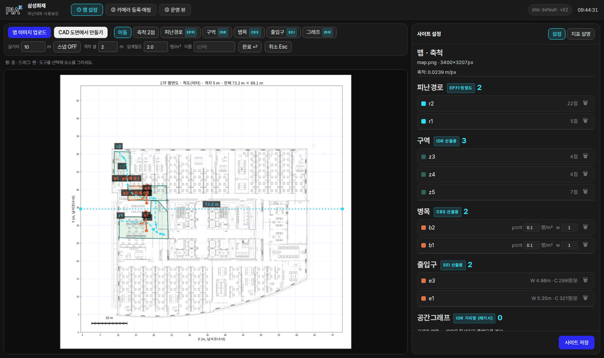
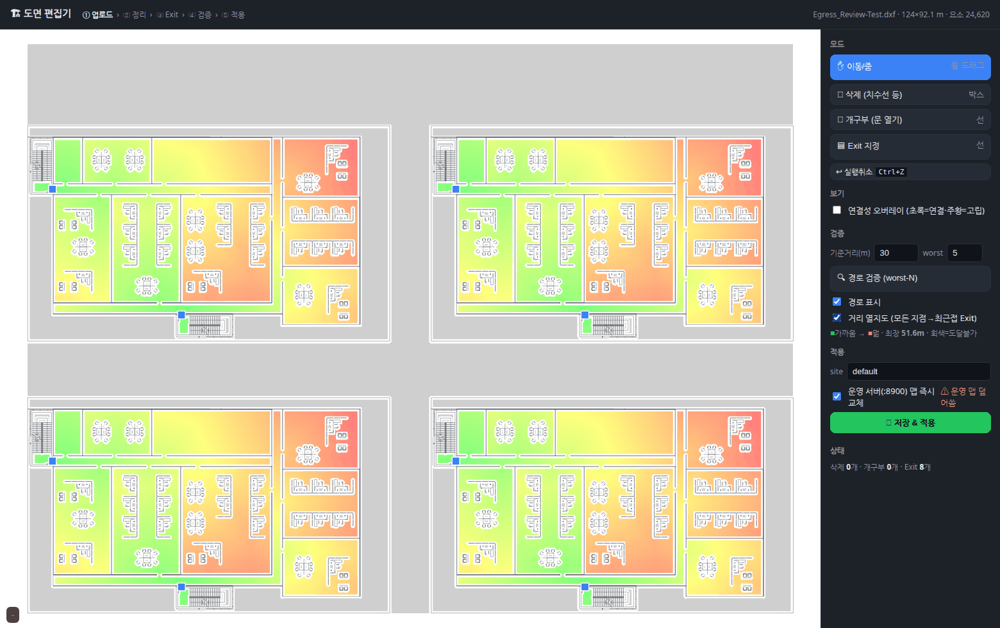
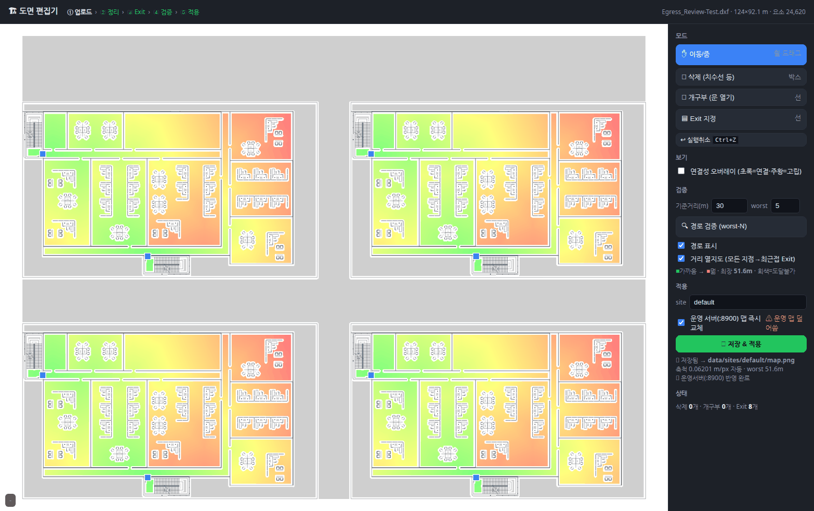
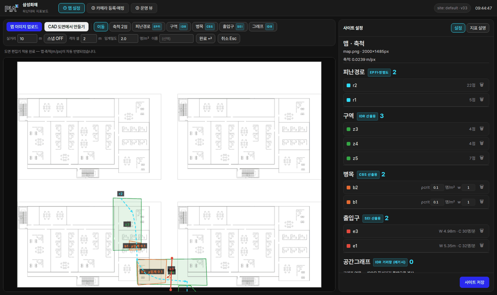

# 기존 운영 맵을 CAD 도면으로 교체하기 (실측 스크린샷)

이미 운영 중인 사이트의 2D맵을 **도면 편집기에서 만든 CAD 산출 맵으로 교체**하는
절차. 아래 스크린샷은 실제 운영 웹(:8900)에서 교체 → 자동 반영까지 실측한 화면이다.

> 편집기 자체 사용법(문 열기·Exit·검증·열지도)은 **[README.md](README.md)** 참조.
> 이 문서는 "교체가 일어나면 무엇이 어떻게 바뀌는가"에 집중한다.

---

## 절차 (4단계, 새로고침 불필요)

### 1️⃣ 교체 전 — 기존 맵 확인

맵 설정 화면. 기존 맵(여기선 17F 평면도)과 그 위에 그려둔 요소들(피난경로·구역·병목·
출입구)이 보인다. 툴바의 **[CAD 도면에서 만들기]** 클릭 → 편집기 새 창.

### 2️⃣ 편집기에서 새 도면 준비

DWG/DXF 업로드 → (필요시) 문 열기·삭제 → Exit 지정 → 열지도/worst-N으로 확인.
버튼 경유로 열렸으므로 **"운영 서버 즉시 반영"이 기본 체크**되어 있다 —
파일만 저장하고 싶으면 해제.

### 3️⃣ [저장 & 적용]

적용 결과에 저장 경로·**자동 축척(m/px)**·worst 거리·"운영서버 반영 완료"가 표시된다.

### 4️⃣ 교체 후 — 메인 화면 자동 갱신

편집기 창이 보낸 신호를 받아 **맵 설정 화면이 자동으로 새 맵을 로드**한다
(힌트: "도면 편집기 적용 완료 — 맵·축척(m/px)이 자동 반영되었습니다").

---

## 교체되면 무엇이 바뀌나 (실측 결과)

| 항목 | 교체 후 |
|------|---------|
| **맵 이미지** (`map.png`) | ✅ 새 CAD 산출 맵으로 **교체** |
| **축척** | ✅ `m_per_px` **자동 기입** (CAD가 mm 단위 — 축척 2점 수동 지정 불필요) |
| **기존 드로잉 요소** (피난경로·구역·병목·출입구) | ⚠ **삭제되지 않고 남지만, 위치가 어긋난다** |
| 카메라 등록·매핑 | ⚠ 동일 — 카메라↔맵 대응점도 이전 이미지 px 기준 |
| `evac_distfield.npz` / `floor.json` | ✅ 새로 저장 (실시간 피난거리 조회용) |

### ⚠ 왜 기존 요소가 어긋나나 + 어떻게 하나

드로잉 요소·카메라 대응점은 **맵 이미지의 픽셀 좌표**로 저장된다(시스템 규약).
새 이미지는 크기·구도가 다르므로(위 4️⃣ 스크린샷에서 좌하단에 몰린 초록 도형들이
그 예) 기존 요소는 그대로 재사용할 수 없다.

**권장 순서 — 맵 교체는 "사이트 초기 설정" 단계에서:**
1. 새 맵 적용 후, 우측 패널에서 어긋난 기존 요소들을 삭제
2. 새 맵 기준으로 구역·병목·출입구·피난경로를 다시 드로잉 (축척은 이미 자동)
3. 카메라↔맵 대응점 매핑도 새 맵에서 다시 지정
4. [사이트 저장]

> 같은 도면의 **같은 렌더를 다시 적용**하는 경우(예: 문 하나만 더 열어 재적용)는
> 이미지 크기가 동일하므로 기존 요소가 그대로 맞는다. 어긋나는 건 **다른 도면/구도로
> 바꿀 때**다.

### 되돌리기 (실수로 교체했을 때)

이전 맵 이미지 파일이 있다면 맵 설정의 **[맵 이미지 업로드]** 로 다시 올리면 끝
(요소들은 애초에 안 지워졌으므로 원위치로 복귀). 이전 이미지가 없으면
`data/sites/<site>/` 백업에서 `map.png`를 복원한다. 축척 2점 정보는 서버가
재업로드 시에도 보존한다.

---

*실측 환경: 2026-07-19, 운영 웹 :8900(macs-system) + 도면 편집기 :8910(evac-editor,
pm2). 테스트 도면 = 삼성화재 `Egress_Review-Test.dxf`. 시연 후 기존 17F 맵으로 원복함.*
