# 멀티카메라 2D맵 시스템 — 화면별 사용 가이드 (튜토리얼)

여러 대의 CCTV(RTSP)를 등록해 **공통 2D 평면도 위에서 사람을 추적**하고,
경보 세션으로 **4대 정량지표(IDR·EPFI·CBS·SEI)** 를 산출하는 화면의 사용법입니다.
아래 스크린샷은 실제 서버(:8900)에서 캡처했으며, **cam01~03 3채널이 5fps로 실추적 중**인
상태(디폴트 사이트 `default`)입니다. 디폴트에는 **도면(층)이 3개** 등록돼 있습니다 —
**17F**(기본 층 `default` · `map.png`)·**19F**(`floor2` · `map_floor2.png`)·**지상1층**
(`floor3` · `map_floor3.png`, 실건물 CAD 척도만·카메라 미배정). 층은 각각
독립된 맵·공간요소·지표를 가지며, 상단 **층 셀렉터**로 운영 뷰를 층 단위로 전환합니다
(아래 [1-0 도면(층) 관리] 참조).

- 접속: `http://<서버IP>:8900/` (pm2 `macs-system` 상시 기동, 재시작 `pm2 restart macs-system`)
- 상단 브랜드는 **삼성화재 피난대피 지표보드**. 기존 단일영상 분석 UI와는 **별도 서버** —
  기존 UI 좌측 레일의 맵 아이콘으로도 진입
- 전체 흐름(상단 5개 탭): **① 맵 설정 → ② 카메라 등록·매핑 → ③ 운영 뷰(경보 세션·4대 지표) → ④ 리플레이(지난 세션·건물 훈련 재생·재계산) → ⑤ 리허설(저장 영상 패키지 훈련)**
  — ①·②는 최초 1회(설정은 JSON으로 영속화, 재시작 시 자동 복원), ③이 평상시 화면,
  ④는 끝난 세션을 다시 보고 임계값을 바꿔 재계산하는 화면,
  ⑤는 RTSP 없이 **저장된 영상 패키지**로 훈련을 재현·시연하는 화면(아래 "⑤ 리허설" 절).
  ※ 아래 "경보 세션(4대 지표)" 절은 **③ 운영 뷰 안에서** 실행되는 기능입니다(별도 탭 아님).
- **인제스트 백엔드는 ffmpeg-NVDEC 또는 DeepStream 중 선택** — 어느 쪽이든 **UI·조작법은 동일**합니다.
  백엔드 전환·환경변수는 [`system/README.md`](../../../system/README.md) 참조(이 가이드는 UI 사용법 위주).

> 개발 문서: [설계서](../../architecture/02-멀티카메라-시스템-전환-설계.md) ·
> [계약(API)](../../../system/CONTRACT.md) · 실행: [`system/README.md`](../../../system/README.md)

---

## ⓪ 로그인 (진입 화면)

`:8900`에 접속하면 **PIA×삼성화재 공동 개발 브랜딩의 로그인 화면**이 먼저 표시됩니다.
현재는 **데모(mock)** 라, 접속 코드에 **아무 값(빈 값 포함)** 이나 넣고 [로그인]을 누르면
그대로 들어가지며, 접속할 때마다 이 화면이 다시 나타납니다(기억 안 함).

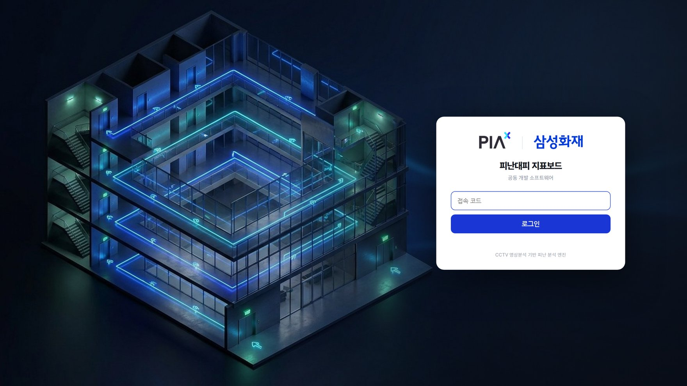

- 실제 인증이 아니라 브랜딩용 간이 게이트입니다. 접속 코드 변경·"한 번 통과 후 기억"·
  게이트 끄기 방법은 [`system/README.md`](../../../system/README.md)의 "로그인 게이트" 항목 참조.

---

## ① 맵 설정 — 평면도와 공간 요소 정의

### 1-0. 도면(층) 관리 — 다중 도면(N개 층)

한 사이트에 **여러 층(도면)** 을 둘 수 있습니다. **층마다 독립된 맵 이미지·공간요소
(경로·구역·병목·출입구)·지표**를 가지며, 카메라도 층에 소속됩니다(그 층 맵 좌표로 매핑).
디폴트 사이트에는 **17F**(기본 층 `default`)·**19F**(`floor2`)·**지상1층**(`floor3`) 3개 층이 들어 있습니다
(지상1층은 실건물 CAD 도면에서 뽑은 것으로 척도만 있고 카메라·구역·경로는 아직 없음 — 예시/확장용).

- **상단 층 셀렉터**(헤더 우측 `층 ▾`) — 지금 보고/편집할 층을 전환. 맵 설정·운영 뷰가
  선택된 층 기준으로 다시 그려집니다.
- **맵 설정 우측 [설정] 패널 상단 「도면(층)」 그룹**:
  - **편집할 층 선택** 드롭다운 + **층 이름** 입력(Enter로 저장)
  - **[+ 층 추가]** — 새 도면(층) 생성(서버가 `floor2`, `floor3`… 식으로 id 발급). 추가 후
    그 층으로 전환해 맵 업로드·요소 드로잉을 이어서 함
  - **[이름 저장]** — 현재 층 이름 변경 · **[현재 층 삭제]** — 그 층 제거(**소속 카메라는
    기본 층으로 재배정**, `default` 층은 삭제 불가)
- **CAD 도면 편집기(:8910) 연동** — [CAD 도면에서 만들기]는 **현재 선택된 층**의 맵으로
  저장·반영됩니다. 18F 등 다른 층 도면을 만들려면 **먼저 상단 층 셀렉터에서 그 층을
  선택(또는 [+ 층 추가])한 뒤** 버튼을 누르세요 → [도면-편집기 가이드](../도면-편집기/README.md).
- 각 층은 자기 층 카메라만 받는 엔진을 갖고, **평가 세션·4대 지표도 층별로 산출**됩니다.

### 1-1. 첫 화면

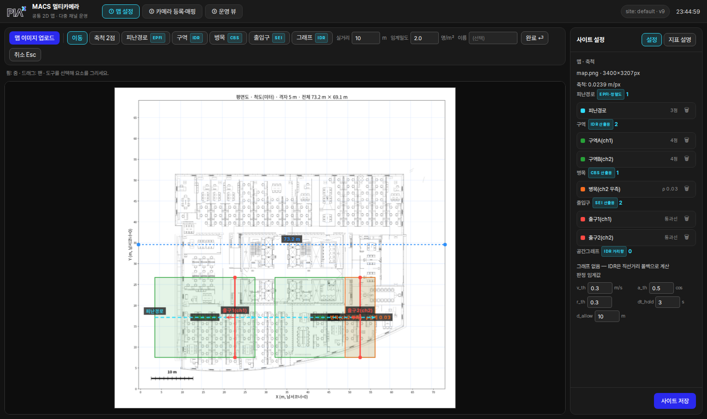

| 영역 | 내용 |
|------|------|
| 상단 탭 | ① 맵 설정 / ② 카메라 등록·매핑 / ③ 운영 뷰 전환 (우측에 **층 셀렉터** `층 ▾`(→ 1-0) + `site: default · v34` 버전 표시) |
| 툴바 (2줄) | **윗줄 = 도구**: [맵 이미지 업로드] · [CAD 도면에서 만들기] + 드로잉 도구(이동/축척 2점/피난경로/구역/병목/**병목 부채꼴**/출입구/그래프). 각 도구에 **지표 뱃지**(EPFI·IDR·CBS·SEI)가 붙어 어떤 지표용인지 표시 **아랫줄 = 그 도구가 쓰는 값**: 고른 도구에 따라 바뀐다(축척 2점→실거리·스냅 / 병목→임계밀도 / 요소 생성→이름) + [완료][취소], 오른쪽 끝에 보기 토글 [미터 격자]. 값을 한 줄에 다 늘어놓으면 지금 쓰이는 값이 어느 것인지 안 보여 분리했다 |
| 중앙 캔버스 | 평면도. **휠=줌, 드래그=팬** (모든 화면 공통) |
| 우측 패널 | [설정]↔[지표 설명] 토글. 설정=요소 목록(개수·삭제)·판정 임계값·[사이트 저장] |

- 디폴트 사이트에는 **피난경로 2개(r1·r2), 구역 3개(z3·z4·z5), 병목 2개(b1·b2), 출입구 2개(e1·e3)** 가
  이미 그려져 있습니다. 각 항목은 지표 산출 단위입니다(아래 설명).

### 1-2. 맵 업로드 — CAD 메타로 축척 자동

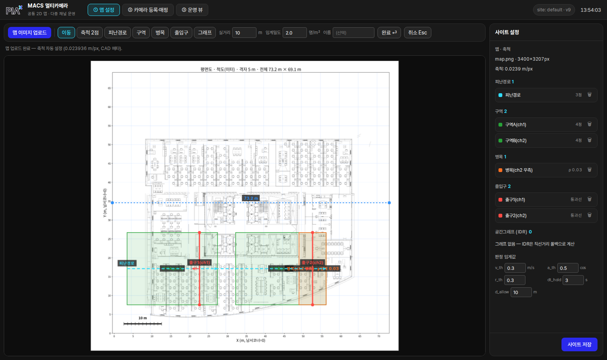

- [맵 이미지 업로드]에서 평면도 PNG 선택. **cad-convert 산출물이면 `*_scale.meta.json`을
  같이 선택** → m/px 축척이 자동 설정됨(힌트에 "축척 자동 설정" 표시). 디폴트 맵은
  우측 [맵·축척] 패널에 `map.png · 3400×3207px · 축척 0.0239 m/px`로 반영돼 있습니다.
- 메타 없이 이미지만 올리면 → 다음 단계(축척 2점)로 수동 지정
- **[CAD 도면에서 만들기]** — DWG/DXF 원본에서 직접 맵 생성(새 창 **도면 편집기**:
  문 열기 터치업·Exit 지정·피난경로 검증·열지도·축척 자동 반영).
  → **[도면-편집기 가이드](../도면-편집기/README.md)** 별도 가이드
  · 기존 운영 맵을 교체할 때의 절차·주의점(요소 재드로잉)은
  **[맵교체 가이드](../도면-편집기/맵교체.md)**

### 1-3. 축척 2점 (수동)

- [축척 2점] 선택 → 실거리를 아는 두 지점 클릭 + 실거리(m) 입력 ([스냅 OFF] 토글로 수평·수직 자동 스냅)
- 축척이 있어야 속도(m/s)·밀도(명/m²)·지표가 실단위로 계산됨 (미지정 시 해당 값 "—")

### 1-4. 공간 요소 드로잉

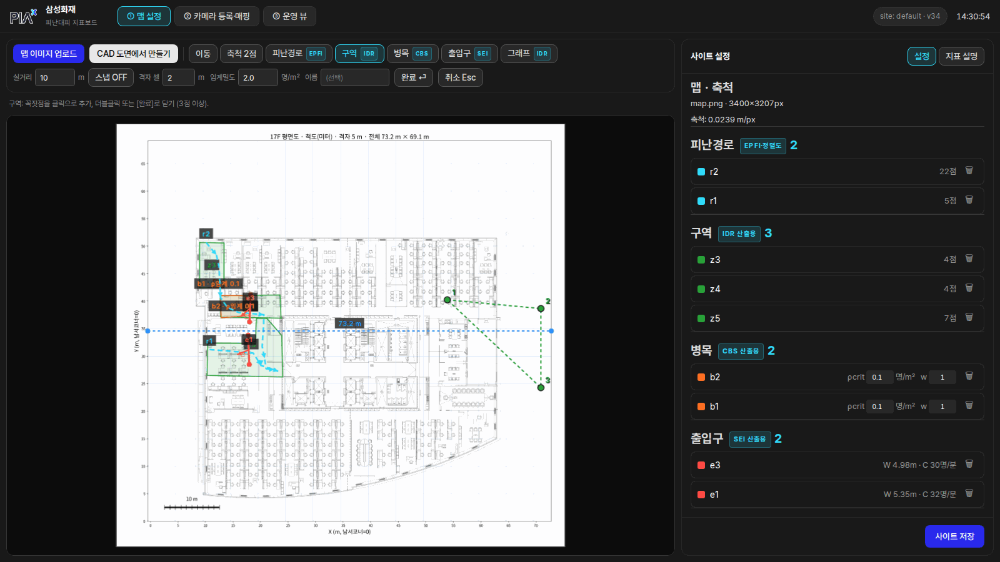

| 도구 | 그리는 법 | 쓰임 |
|------|-----------|------|
| **피난경로** | 클릭으로 꼭짓점, 드래그로 자유곡선. 더블클릭/Enter 완료. **시작→끝 순서 = 피난 방향(끝점이 출구 쪽)** | 방향 정렬도·EPFI·피난개시 판정 기준 |
| **구역** | 꼭짓점 3점+ 클릭, 더블클릭 완료 (위 스크린샷 — 점선이 그리는 중) | 재실 수·밀도·IDR 단위 |
| **병목** | 구역과 동일 + 임계밀도(ρcrit 명/m²)·가중치(w) 입력 | CBS(임계 초과 누적) |
| **병목 부채꼴** | ① 문·계단 위치(꼭짓점) ② 반경·시작방향 ③ 끝방향 — 3번째 클릭에 생성 | CBS. 문 앞 혼잡은 부채꼴로 생김 |
| **출입구** | 통과선 2점 → 세 번째 클릭 = '안쪽' 방향 | in/out 카운트·SEI |

- 우측 목록에서 요소별 🗑 삭제. Esc = 그리기 취소. 이름 입력칸으로 라벨 지정 가능
- **[↶ 실행취소] / `Ctrl+Z`** — 그리는 중이면 마지막으로 찍은 점부터, 아니면
  요소 추가·삭제를 역순으로 되돌린다(축척 지정·공간그래프 변경 포함, 60단계).
  인라인 숫자 편집(ρcrit·w·W·q)은 대상이 아니다. 입력칸에 커서가 있으면
  브라우저 기본 되돌리기가 동작한다
- **병목 목록**: ρcrit·w + **그룹**(집계용 라벨) + 부채꼴이면 **r(반경)·각(각도)** —
  반경·각도를 고치면 영역이 즉시 다시 그려집니다(파라미터가 정본, polygon은 생성물)
- **출입구 목록**: **W(유효폭 m)** · **q(인/분/m)** → **C = W × q** 가 자동 표시.
  두 칸에는 **지금 실제로 쓰이는 값**이 들어 있고, 상속값(도면 자동폭·사이트 기본 q)은
  **회색 점선**으로 구분된다. 고치면 그 문 전용 값이 되고, 각 칸 옆 **↺** 로 상속값에
  복귀한다. C는 파생값이라 직접 입력하지 않는다

> **피난경로가 하는 일 (예시)** — "회의실 앞→복도→비상구2"로 경로를 그렸다면:
> ① **방향 정렬도**: 각 사람의 이동 방향을 최근접 경로 구간의 진행 방향과 코사인 비교
> (경로 따라 걸으면 +1, 역방향이면 −1 — 운영 뷰 객체별 align)
> ② **피난개시 판정→IDR**: 구역 평균속도·**평균 정렬도**·동시만족 비율이 임계값을
> Δt_hold 유지한 최초 시점 = t_e,start. 경로가 없으면 "움직임"과 "피난 방향 움직임"을
> 구분할 수 없음 ③ **EPFI**: T_i=t_end−t_start 동안 사람↔배정경로 최근접거리 d(t)를 시간 적분 —
> `max(0, 1−∫d dt/(T_i·d_allow))×100`. 경로 위를 걸으면 100점, 평균 이탈이 d_allow를
> 넘으면 0점. **주의: 세션은 시작 시점의 경로/설정 스냅샷으로 계산** — 경로를 고치면
> 세션을 새로 시작해야 반영(카드에 ⚠ 경고 표시).
> 경로는 여러 개 등록 가능하며 사람마다 **세션 첫 관측 위치의 최근접 경로가 자동 배정**됨.

> **구역이 하는 일 (예시)** — "z3/z4/z5"처럼 구역을 그려두면:
> ① 실시간 구역별 재실·밀도 ② **IDR이 구역 단위로 판정** — "z4: 경보 2초 후 개시 /
> z3: 6초 후 개시"처럼 **어느 구역이 늦게 반응했는지** 구분
> ③ **경보→사람 거리**와 연결 — 경보 시점 그 구역에 있던 사람 위치까지의
> **8방향 다익스트라(octile, 대각 √2 가중) 평균 거리**. 구역이 없으면 IDR 산출 대상이 없음.
> (병목과 차이: 병목=좁은 통로의 혼잡 누적 CBS 전용, 구역=사람 반응·점유 단위)

### 1-5. 공간그래프 (레거시 — IDR 거리 폴백)

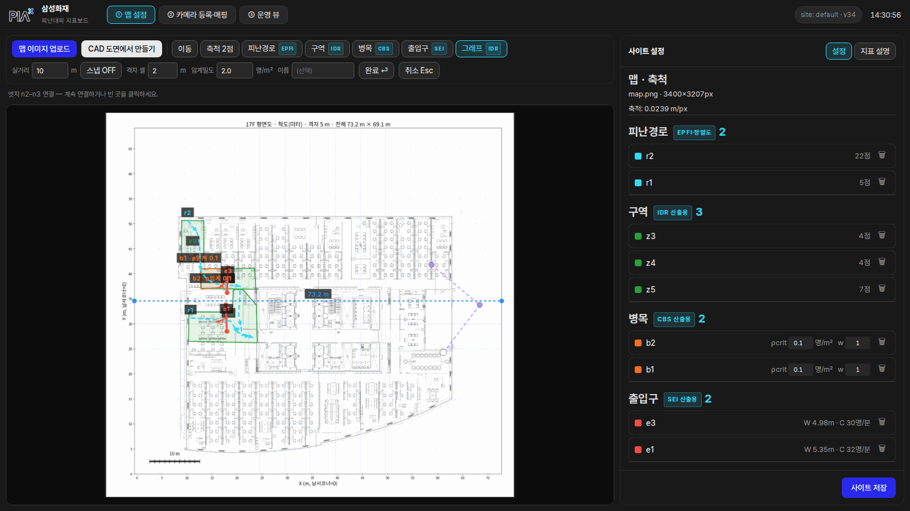

- IDR의 "거리"(경보→사람 거리)는 이제 **맵 축척 기반 격자 최단거리(8방향 다익스트라 —
  octile, 대각 √2 가중)** 가 1순위로 계산합니다. 경보 시점 그 구역에 있던 **사람 위치**
  기준 평균 거리이며(요구사항 §4.1 개정 2026-08-27), 8방향이라 도면을 45° 돌려 그려도
  거리가 방향에 흔들리지 않습니다(구 4방향 = 맨해튼 거리 버그 정정).
  → **거리 산출 우선순위: 격자 다익스트라(축척 있을 때) → 수동 공간그래프 → 직선거리**
- [그래프] 도구는 **레거시 폴백**용. 격자 다익스트라가 부적절한 특수 배치에서만 수동 보정으로 사용
  (빈 곳 클릭=노드, 노드 2회 클릭=엣지 연결, 노드 더블클릭=삭제). **디폴트 사이트에는 그래프 없음**
- 안 그려도 정상 동작 — 축척만 있으면 격자 다익스트라로 실거리 IDR이 계산됩니다

### 1-6. 지표 설명 탭 — 어떤 요소가 어떤 지표를 만드는가

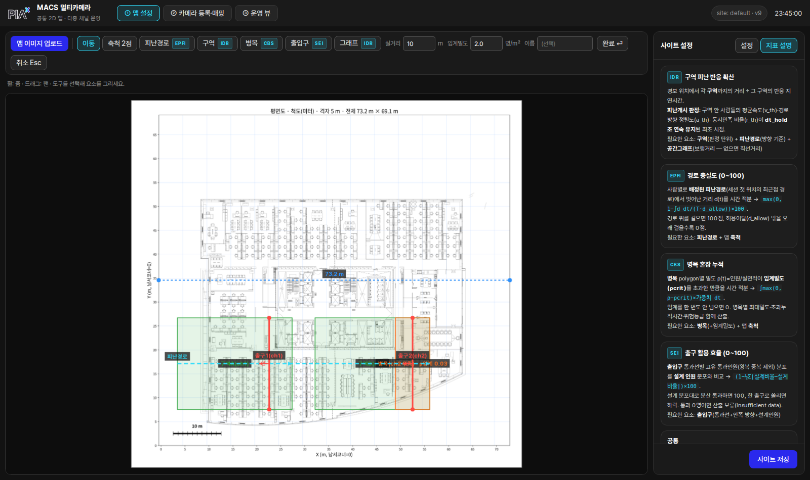

- 우측 패널 상단 **[지표 설명]** 토글 → IDR·EPFI·CBS·SEI 카드: **산출 수식 개요 +
  필요한 드로잉 요소**를 화면 안에서 바로 확인 (툴바·목록의 지표 뱃지와 대응)
- 도구 뱃지 요약: 피난경로=`EPFI·정렬도` · 구역=`IDR` · 병목=`CBS` · 출입구=`SEI` · 그래프=`IDR 거리항(레거시)`

### 1-7. 판정 임계값 + 저장

- 우측 하단 임계값은 지표별로 묶여 표시됩니다:
  - **IDR 피난개시 판정** — v_th(속도)·a_th(정렬도)·r_th(동시만족 비율)·dt_hold(유지시간)
  - **EPFI** — d_allow(경로 이탈 허용폭 m)
  - **CBS** — 병목 목록에서 항목별 ρcrit·w 개별 지정 (+그룹 라벨로 묶어 집계)
  - **SEI** — q_design(단위 유효폭당 설계 통과율 인/분/m). **출구 유효폭 × q_design =
    설계 통과용량 C_j**. 전역값이며, 문마다 다른 값은 출입구 목록의 q 칸에서 개별 지정
  - **IDR 거리 산출** — 격자 셀(경보원→사람 위치 거리를 8방향 다익스트라로 재는 배경 격자 크기 m).
    툴바에 있던 것을 지표 설정끼리 모으려고 이 패널로 옮겼다
  - **시스템** — min_conf(최소 검출 신뢰도)
  - 모두 **고객 확정 전까지 조정 가능한 잠정 설정값**
- **[사이트 저장]** → `data/sites/<site>/site.json` 버전업 저장, 운영 뷰에 즉시 반영

### 1-8. 추론 모델 탭 — 검출·ReID 조합 전환

- 우측 패널 상단 **[추론 모델]** 토글. 카드 클릭 → 확인 → 전환
  (`GET·POST /api/infer/profile`, 선택은 `data/infer_profile.json`에 영속)

| id | 검출 | ReID | 트래커 |
|----|------|------|--------|
| `yolox_fastreid` | YOLOX-X(MOT20) 896×1600 | FastReID SBS-S50 2048d | BoostTrack++ det_thresh 0.4 |
| `yolo26_clipreid` | YOLO26-L v6.3 640×640 | CLIP-ReID ViT-B/16 768d | BoostTrack++ det_thresh 0.6 |

- 전환 = **추론 계층만 재기동**(DS 워커 또는 AnalyzerThread). 사이트 설정·세션 녹화본 불변,
  추적 ID는 초기화
- **평가 세션 중이면 409** — 구간마다 검출기가 다르면 4대 지표가 무효
- 엔진 없으면 카드가 비활성. `bash tools/fetch_assets.sh --onnx` →
  `bash tools/build_profile_engines.sh --ds` (엔진은 GPU·TRT 버전 종속이라 서버마다 빌드)
- 조합 정의는 레포 루트 `model_zoo.py` — 설계 `docs/architecture/07-추론-프로파일-교체구조.md`

---

## ② 카메라 등록·매핑 — RTSP를 도면 좌표에 연결

### 2-1. 카메라 목록·추가 · 검출 신뢰도(min_conf) 인라인

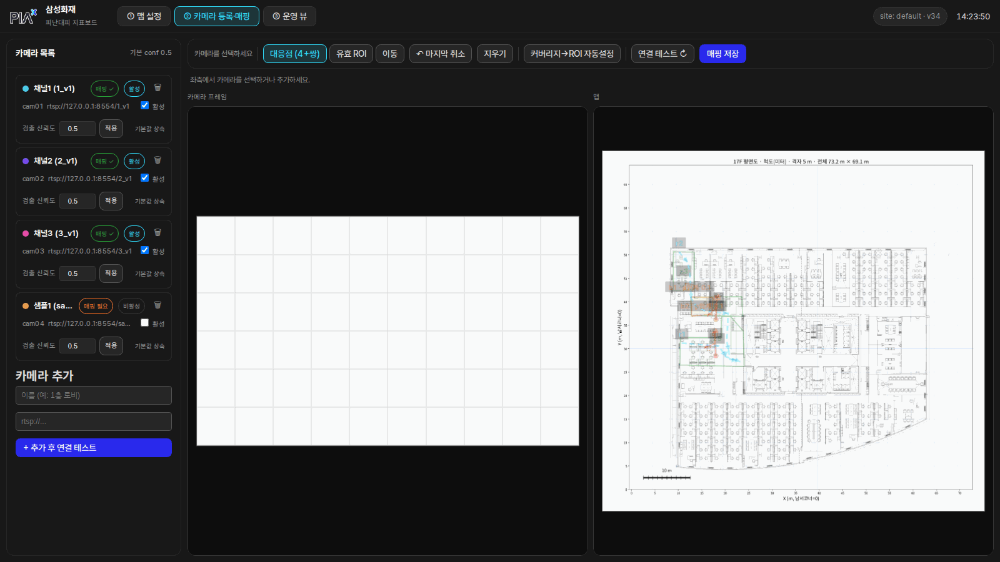

- 좌측: 등록된 카메라(이름·RTSP·매핑✓·활성 토글·삭제). 추가 폼에 이름+RTSP 입력 →
  [+ 추가 후 연결 테스트]. 추가 즉시 수신 시작(분석 fps 기본 5)
- **각 카메라 행에 [검출 신뢰도] 입력 + [적용] 버튼** — 그 카메라의 `min_conf`를 인라인으로 조정
  - 목록 헤더에 **사이트 전역 기본값**(`기본 conf 0.5`) 표시
  - 값을 비우고 [적용]하면 **기본값 상속**(행에 "기본값 상속" 표기), 값을 넣으면 "오버라이드"
  - 디폴트 사이트는 cam01~03 모두 **오버라이드 없이 0.5를 상속**(입력칸에 실효값 0.5가 채워져 표시)
  - 이 값 미만 검출은 추적·지표에서 모두 제외 → **정지 사물 오탐 차단**(신뢰도 기준)
- 디폴트: cam01~03(1_v1/2_v1/3_v1) 매핑 완료·활성 5fps — **cam01·cam02는 17F(기본 층),
  cam03은 19F(`floor2`)에 소속·매핑**돼 있습니다(카메라별 소속 층은 아래 2-2 매핑에서 지정).
  **cam04(sample1)는 샘플 placeholder — 비활성·미매핑**(필요 시 활성화 후 매핑해 사용)
- 카메라 행에는 **소속 층 뱃지**가 함께 표시됩니다(예: `층 19F`)

### 2-2. 카메라↔맵 대응점 매핑

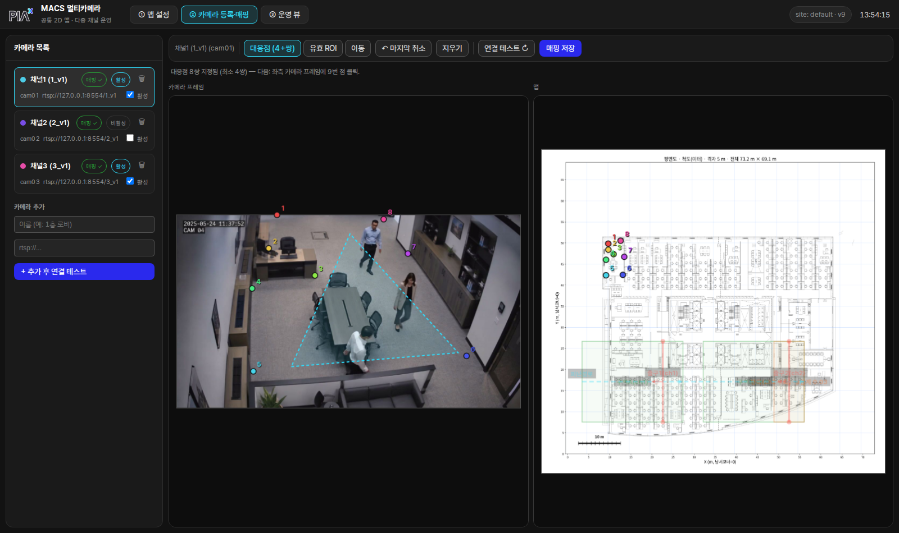

- 카메라 선택 → **좌: 실카메라 첫 프레임 / 우: 평면도** 나란히 표시
- **툴바 2줄** (① 맵 설정과 같은 규칙)
  - **윗줄 = 대상·모드**: 카메라명 · [매핑 층 ▾] ‖ [대응점][유효 ROI][출입구 통과선][이동]
    ‖ 오른쪽 끝 **[매핑 저장]**
  - **아랫줄 = 그 모드가 쓰는 것**: 대응점·ROI → [↶ 마지막 취소][지우기][커버리지→ROI 자동설정] /
    출입구 통과선 → 출입구 선택·[선][영역]·체류·[해제] / 이동 → 안내문.
    오른쪽 끝에 **보기**([전체 커버리지][도면 회전])와 **카메라**([미리보기][연결 테스트])
- **매핑 층 선택** — 우측 평면도는 **그 카메라의 소속 층 맵**입니다. 다른 층으로 매핑하려면
  **[매핑 층]** 을 바꾼 뒤(맵이 그 층으로 교체됨) 대응점을 다시 지정합니다 — 대응점은 **그
  층 맵 px 기준**이라 층을 바꾸면 좌표계가 달라집니다(다중 도면 사이트)
- **[대응점] 모드**: 같은 지점을 좌·우에서 번갈아 **4쌍 이상 클릭**(바닥 모서리·기둥 밑 등 바닥면 기준)
  → 서버가 호모그래피 산출·저장, 그 카메라의 발끝 좌표가 도면 좌표로 변환됨
  - 이 모드에서는 **대응점 + 그 대응점들의 커버리지(볼록껍질, 노란 점선)만** 표시됩니다
    (유효 ROI 다각형과 겹쳐 보이지 않음)
- 아랫줄 [↶ 실행취소](= `Ctrl+Z`)·[지우기]로 대응점 편집, [연결 테스트 ↻]로 프레임
  갱신, 윗줄 [매핑 저장]으로 저장. 실행취소는 지금 모드 기준으로 되돌린다 —
  대응점은 마지막 점, ROI는 마지막 꼭짓점, 출입구 통과선은 안쪽점→선점 순

### 2-3. 유효 ROI — 실제 탐지영역(위치 기준 오탐 제외)

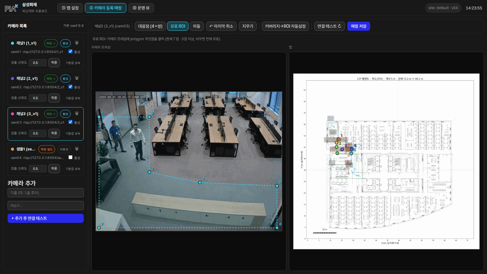

- **[유효 ROI] 모드**: 카메라 프레임 위에 **분석할 영역 polygon**(청록 점선, 꼭짓점 순서 그대로)을
  클릭으로 지정. **이 다각형 밖의 검출은 위치로 무시**됩니다(3점 이상, 비우면 프레임 전체 유효)
  - 이 모드에서는 **valid_roi 다각형만** 표시(대응점 커버리지와 분리)
  - [커버리지→ROI 자동설정] — 대응점 볼록껍질을 유효 ROI로 자동 채운 뒤 다듬어 저장 가능
- 디폴트 사이트의 **cam03에는 7점짜리 valid_roi가 설정**돼 있습니다 — 분석 대상 바닥 영역만 남기고
  화각 가장자리를 제외한 예시
- **min_conf vs valid_roi 역할 구분**
  - `min_conf`(2-1) = **신뢰도 기준** 오탐 차단(낮은 확신 검출 제거)
  - `valid_roi`(여기) = **위치 기준** 오탐 차단(예: 책상·의자 등 사람이 설 수 없는 구역을 영역에서 제외)
  - 둘은 독립적으로 함께 쓰입니다

### 2-4. RTSP 미리보기 — 등록 전에 추론까지 확인

- 상단 **[미리보기 ▶]** → 주소를 넣고 [시작]. 별도 프로세스가 그 스트림을 받아
  **현재 추론 모델 그대로** 돌리고 ID 박스가 그려진 프레임을 보여줍니다
  (해상도·소스 fps·추론 fps·프레임당 검출 수·고유 트랙·첫 프레임 지연·추론 모델)
- 등록·저장되지 않습니다. 켤 때만 뜨는 프로세스라 평상시 GPU·메모리 점유 0
  (운영 fps 영향 실측: 43.8 → 45.2fps, 큐 드랍 0)
- 상한 10분 자동 종료. `POST /api/preview/{start,stop}` · `GET /api/preview/{status,frame}`

### 2-5. 출입구 화면 집계 — 문이 대응점 범위 밖일 때

문 앞은 화각이 가장 눕는 구간이라 대응점을 문까지 넓히기 어렵습니다. 통과 판정만
**카메라 좌표계에서** 수행하도록 돌릴 수 있습니다(통과 인원은 맵 좌표 없이도 셀 수 있음).

- **[출입구 통과선]** 모드 → 담당 출입구 선택 → **선 / 영역** 중 택1

| 방식 | 조건 | 판정 |
|------|------|------|
| 선 | 문 전체가 화면 안 | 2점 통과선 + 3번째 클릭으로 '안쪽' 방향 → 교차 시 1명 |
| 영역 | 문이 화면 가장자리에 걸려 절반만 보임 | 3점 이상 polygon → 같은 track id가 `체류`(기본 2) 프레임 연속으로 들어오면 1명 |

- 영역 판정 '안' 기준: 발끝점 포함 **또는** bbox 5×5 샘플의 30% 이상 포함(발이 잘린 박스 대응)
- 같은 id는 영역에 머무는 동안 1회만. 밖으로 나갔다 다시 들어오면 재계수
- 맵의 출입구 선은 남아 **위치·유효폭·설계용량**에 계속 쓰이고 집계에서만 빠짐
  (맵에는 점선 + 담당 카메라명 표기). **객체 표출 방식은 바뀌지 않음**
- 한 출입구 = 한 방식 · 한 카메라. [해제] → 맵 기준 집계로 복귀
- 스키마: `ExitLine.count_cam` + `cam_line` | `cam_zone`·`cam_zone_dwell`

---

## ③ 운영 뷰 — 평상시 실시간 화면

### 3-1. 실시간 맵과 지표

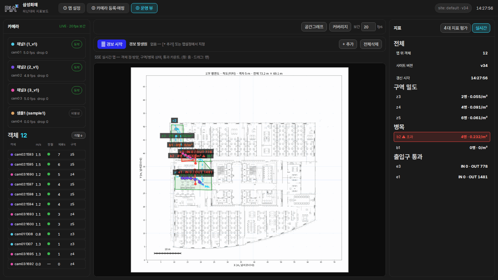

| 영역 | 내용 |
|------|------|
| 좌측 | 카메라 목록 — 상태 뱃지(동작/재접속/끊김)·수신 fps·드랍. 아래 **객체 목록**(객체별 m/s·정렬도·체류s·구역, 행 클릭=맵 하이라이트, [이탈↓] 정렬) |
| 중앙 | 평면도 + **객체 점·방향 화살표(카메라별 색)** + 경로/구역/병목/출입구 오버레이. 병목 임계 초과 시 붉은 하이라이트 |
| 우측 | [4대 지표 평가]↔[실시간] 토글. 실시간 = 맵 위 객체 수·구역별 재실/밀도·병목·출입구 IN/OUT |
| 상단 | **🔔 경보 시작**(세션 — 다층 사이트는 **🔔 건물 전체 경보 시작**)·경보 발생원 패널·**[표시] 레이어 토글**(→ 3-1a)·[공간그래프]·[커버리지] 토글·보간 fps·SSE 연결 상태(LIVE) |

- 갱신은 SSE 실시간. **카메라 영상은 표출하지 않음**(리소스 절약) — 원본 확인은 스냅샷으로
- RTSP가 끊기면 자동 재접속(지수 백오프), 좌측 뱃지로 상태 확인
- **다중 도면**: 상단 **층 셀렉터**로 운영 뷰를 층 단위로 전환합니다. 맵·객체·카메라 목록·
  실시간 지표·평가 세션이 모두 **선택된 층 기준**으로 표시됩니다(층마다 독립 엔진·세션)

### 3-1a. [표시] 레이어 토글 — 지도 요소 골라 보기

상단 **[표시]** 칩 묶음으로 지도 위 공간요소를 종류별로 끄고 켭니다 —
**구역**(IDR)·**경로**(EPFI)·**병목**(CBS)·**출입구**(SEI)·**경보원** 5개 칩.

- **기본은 전부 on.** 칩을 끄면 그 요소만 지도에서 숨겨집니다(예: "IDR 구역만" 보려고
  경로·병목·출입구를 꺼둠). 각 칩 옆 지표 대응은 위 괄호와 같습니다.
- **표시 전용 — 지표 계산에는 전혀 영향 없습니다.** 숨긴 요소도 세션·4대 지표에 그대로 반영됩니다.
- 선택은 **브라우저에 기억**(localStorage)됩니다 — 보는 사람 취향이지 서버(사이트) 설정이 아니라
  ①·④ 화면과 다른 브라우저에는 영향을 주지 않습니다.

### 3-2. 카메라 커버리지 표시

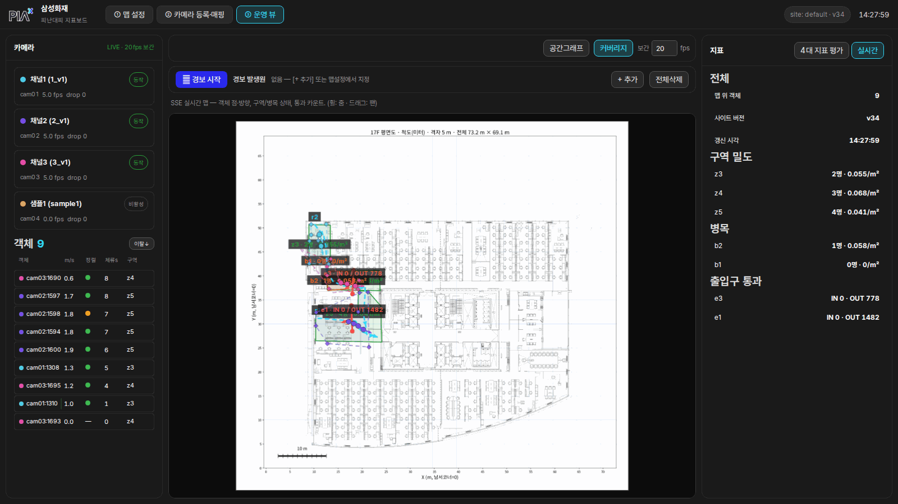

- 상단 **[커버리지]** 토글 → 맵 위에 카메라별 **실제 탐지영역**을 색으로 겹쳐 표시
- 표시 규칙이 백엔드 판정과 일치: **valid_roi가 있으면 그 다각형을 맵에 투영**(예: cam03),
  없으면 대응점 볼록껍질. 어느 카메라가 어디를 커버하는지·사각지대를 한눈에 확인

### 3-3. 카메라 스냅샷

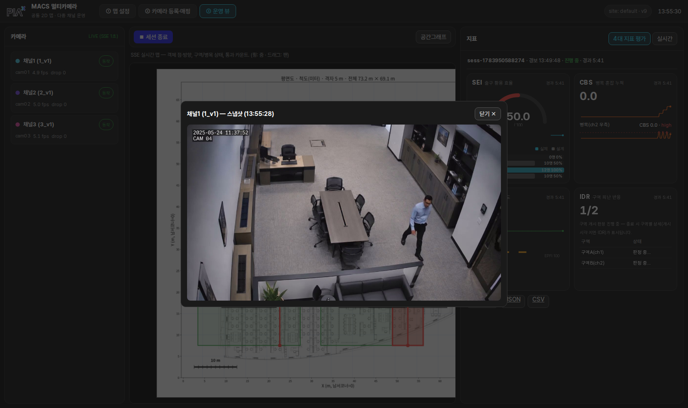

- 좌측 카메라 행 클릭 → **그 순간의 원본 프레임 1장** 팝업 (디버깅·화각 확인용)

---

## 경보 세션 — 4대 정량지표 산출 (③ 운영 뷰 안에서 실행)

### 4-1. 경보 발생원 지정 → 경보 시작

운영 뷰 상단 **경보 발생원 패널**에서 경보 위치를 N개 지정한 뒤 세션을 시작합니다.

1. **`+ 추가`** 버튼 클릭 → 맵 위에 "맵 클릭 → 경보 발생원 추가" 오버레이 표시
2. **도면 위 원하는 지점 클릭** → 🔔N 칩으로 패널에 추가됨. 여러 곳 반복 클릭 가능
3. **`+ 추가`** 다시 클릭하거나 다른 곳 클릭하면 추가 모드 해제
4. 추가한 원점 목록 확인 후 **`🔔 경보 시작`**(다층 사이트는 **`🔔 건물 전체 경보 시작`**) 클릭 → 세션 시작

- 잘못 추가했으면 칩 오른쪽 **✕** 또는 **`전체삭제`**로 초기화 후 재설정
- 경보 발생원이 없으면 `🔔 경보 시작`이 비활성화됨
- 세션 종료 후에도 마지막 세션의 경보 원점이 패널에 복원됨

> **IDR 계산**: 경보 원점이 N개면 각 구역의 IDR을 원점별로 계산한 뒤 평균.
> 경보 위치가 구역 내부이면 해당 구역 IDR은 0 (즉시 반응 기대).

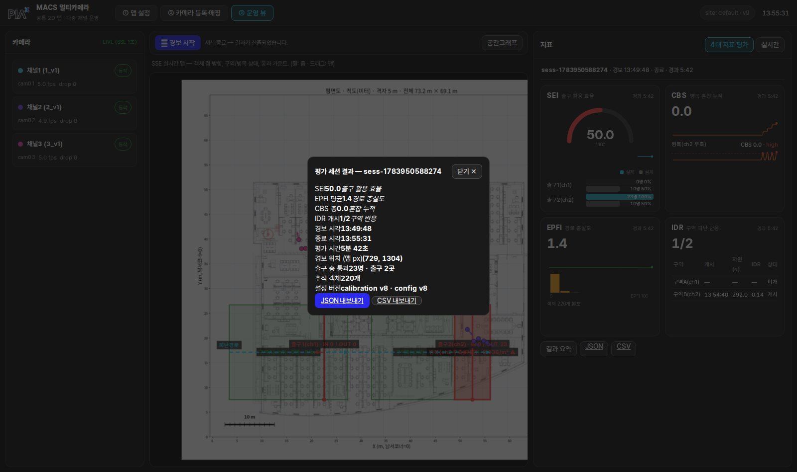

### 4-1b. 단일 층 세션 vs 건물 훈련(건물 전체 경보)

층이 하나뿐인 사이트와 여러 층인 사이트에서 경보 시작 버튼과 세션 단위가 달라집니다.

| | **단일 층 세션** | **건물 훈련**(건물 전체 경보) |
|---|---|---|
| 조건 | 참여(카메라 매핑) 층이 1개 | 사이트에 **층이 2개 이상** |
| 버튼 | **`🔔 경보 시작`** | **`🔔 건물 전체 경보 시작`** (기본) |
| 세션 단위 | 그 층 하나 | **전 층이 하나의 경보 세션 공유** |
| t_alarm | 그 층 경보 시각 | **참여 전 층 공유 t_alarm** |
| 4대 지표 | 층 단위 | **건물 단위로 롤업** (EPFI 평균·CBS 합·SEI 통합분포·IDR 구역별 유지) + 층별 상세 |

- **다층 사이트의 기본은 건물 훈련입니다.** 하나의 훈련 = 전 층 공유 t_alarm 세션이며,
  **참여하는 각 층에 경보 원점이 지정돼 있어야 시작**됩니다(전 층 IDR 보장). 원점이 빠진 층이
  있으면 그 층 이름과 함께 안내가 뜨고, 해당 층으로 이동해 경보 위치를 지정한 뒤 다시 시작합니다.
- 결과는 **④ 리플레이 [건물 훈련]** 목록에 라벨과 함께 쌓이고, 전 층 `.db` 동시 리플레이로
  건물 단위 재계산까지 됩니다(계약 v1.11).
- **UI 표기는 "건물 훈련"**, 내부 코드·API는 `drill`입니다.
  설계 근거: [ADR 06 건물 드릴 세션·4대지표 롤업](../../architecture/06-건물-드릴-세션-4대지표-롤업-설계.md).

### 4-2. 4대 지표 카드 (우측 [4대 지표 평가] 패널)

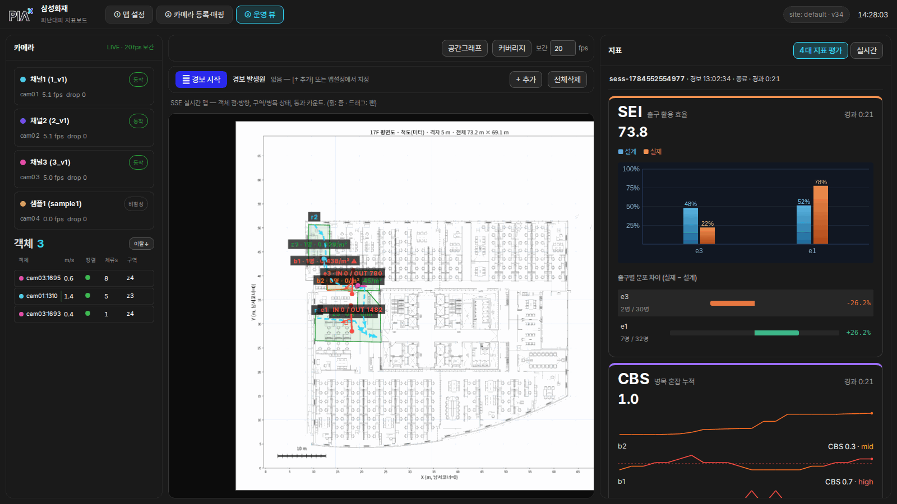

세션이 진행 중이거나 최근 종료된 세션이 있으면 우측 [4대 지표 평가] 패널에 카드가 채워집니다
(위 예시는 종료된 세션 `SEI 73.8 / CBS 1.0 / EPFI 95.0 / IDR 3/3`).

| 카드 | 표시 내용 |
|------|-----------|
| **SEI** (출구 활용 효율) | 게이지(0~100) + **출구별 설계/실제 분포 바 비교** + 출구별 편차 + **C_j 근거**(`폭 3.57m(수동) × 6인/분/m`). 통과 0명이면 "—"(insufficient data) |
| **CBS** (병목 혼잡 누적) | 총 CBS + 병목별 밀도 시간추이 스파크라인(임계 초과 구간 붉게, 위험등급 mid/high) + **선택 집계** — 그룹 칩/체크박스로 병목을 골라 그 묶음의 합계·평균·최악·최대 초과시간 |
| **EPFI** (경로 충실도) | 평균(0~100) + 추이 + 객체별 분포 히스토그램 + **객체별 d(t) 이탈 곡선**(선택, 면적=누적 이탈량, 점선=d_allow) |
| **IDR** (구역 피난 반응) | 개시 구역 수(예 3/3) + 평균 + 구역별 표(개시 지연 Δt·IDR m/s — 미개시 회색) |

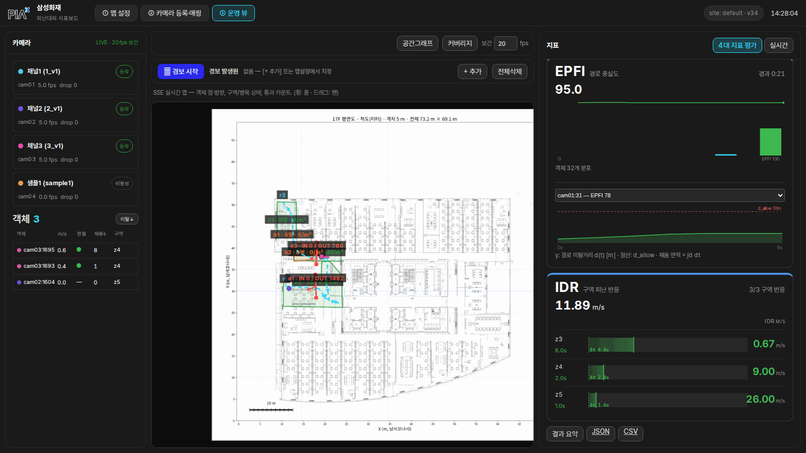

- 우측 상단 [실시간] 버튼으로 실시간 지표 패널과 전환 가능
- 종료 후에도 카드·타임라인이 유지되고, 하단 [결과 요약]·[JSON]·[CSV] 버튼이 나타납니다

### 4-3. 세션 종료 → 결과

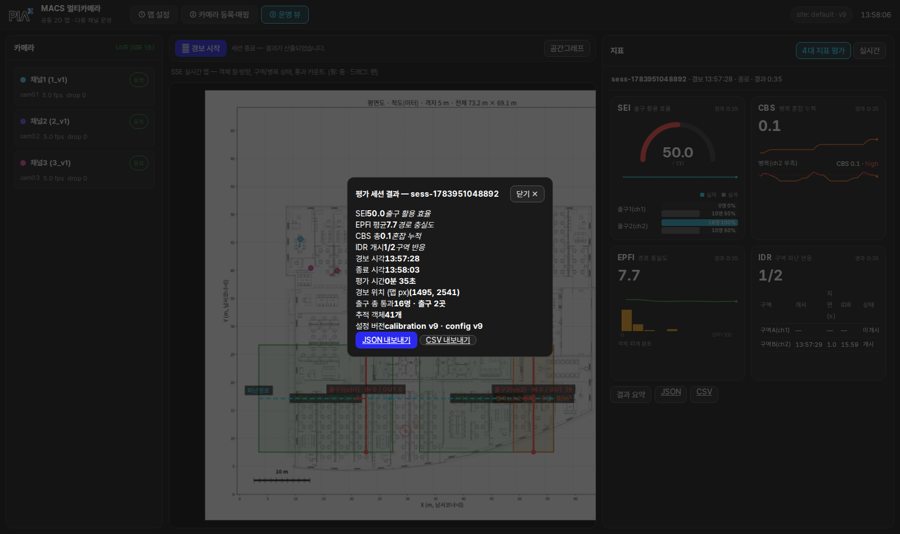

- [⏹ 세션 종료]/[결과 요약] → **결과 리포트 모달(해석형)** — 지표를 몰라도 결과가 읽히게 구성:
  1. **종합평**: 총평 한 문장("이번 훈련은 전반적으로 우수/양호/개선 필요") + ✔ 잘된 점 / ⚠ 개선 지점
  2. **개요**: 경보 시각·평가 시간·발생원·총 통과 인원·추적 객체·설정 버전
  3. **4대 지표 해석 카드**(지표별 고유색): 각 카드에 "무엇을 재는 지표인지" 설명 +
     이번 값의 **자동 해석 문장**(예: "10F e1 출구가 설계보다 27%p 적게 사용됨 — 안내·유도 개선 검토 지점")
  4. **출구별 이용 분포 막대**(막대=실제, 주황 눈금=설계 기대) + **[JSON]·[CSV] 내보내기**
  5. **개인 이동 기록(여정)** — 🌐 글로벌 ID 모드로 측정된 세션이면 사람별로
     `시작(구역) → 출구 통과(시각) · 이동거리 · 소요 · 평균속도 · 커버리지 · 경유 카메라` 표가 추가됨
  - 등급(우수·보통·미흡)은 이해를 돕는 표시 기준(SEI·EPFI 80/60점, CBS 0.5/10)이며 공식 판정 기준이 아님

> **🌐 글로벌 ID (선택, 기본 꺼짐)** — ① 설정 [추론 모델] 패널의 토글. 켜면 카메라 간
> 동일인을 외형 특징으로 연결해 **같은 사람은 어느 카메라에서든 같은 id(gN)** 가 되고,
> 출구 인원이 사람 기준으로 세지며 결과에 개인 이동 기록이 붙습니다. 옵션: 기억 시간
> (TTL, 기본 600s)·매칭 임계(기본 0.55 — 낮추면 연결↑·오병합 위험↑. 속도 게이트
> 3m/s·최소 관측수와 함께 CJ 리허설 실측으로 캘리브레이션). 세션 중엔 변경 불가,
> 훈련 이력에 🌐 배지로 표시. 여정 수는 "고유 인원"이 아니라 **연결 조각 수** —
> 같은 사람이 연결에 실패하면 조각 여러 개로 나뉘며, 커버리지 %로 드러납니다.
> 꺼져 있으면 기존 카메라별 ID 동작 그대로입니다.
- 결과는 `data/sites/<site>/sessions/<세션id>.json` 자동 저장 —
  **서버를 재시작해도 유지**, `GET /api/sessions`로 이력 조회

---

## ④ 리플레이 — 지난 세션 재생·지표 재계산

끝난 경보 세션을 **2D 도면 위에 그대로 다시 재생**하고, **도면은 그대로 둔 채 4대 지표
세팅값(임계값)만 바꿔 지표를 다시 산출**하는 화면입니다. 영상이 아니라 **분석 결과
(사람 위치·궤적·지표)** 를 재생합니다. (설계·DB 근거: [ADR 05](../../architecture/05-세션-녹화-리플레이-지표재계산-설계.md))

> **기본 모드 = 건물 훈련 롤업 재계산** (상단 [건물 훈련] 탭, 기본 on — 리허설 세션도 건물
> 세션으로 여기 들어옵니다). 건물 훈련 이력을 고르면 **전 층 결과를 건물 롤업**으로 보여주고,
> **층 선택기**로 층을 골라 그 층을 2D 재생합니다. 임계값을 바꿔 [재계산]하면 **건물 지표**가
> 다시 산출되고, **📋 리포트**로 건물 롤업 리포트(종합평·지표 해석·층별 상세 — ③ 결과 모달과
> 동일한 해석형)를 봅니다. 우측 패널에는 ③과 같은 **CBS 병목 선택 집계**(그룹 칩·체크박스 →
> 선택 묶음의 합계·평균·최악, 재생 프레임 밀도 스파크라인)가 있어 재계산 결과를 병목 묶음으로
> 비교할 수 있습니다(건물 훈련은 재생 중인 층 기준, 층 전환 시 따라감). [개별 층] 탭은 디버그용
> (같은 훈련에 속한 층별 세션은 건물 훈련으로 묶여 개별 층 목록에서는 빠집니다).
> 설계: [ADR 06 건물 드릴 롤업](../../architecture/06-건물-드릴-세션-4대지표-롤업-설계.md).

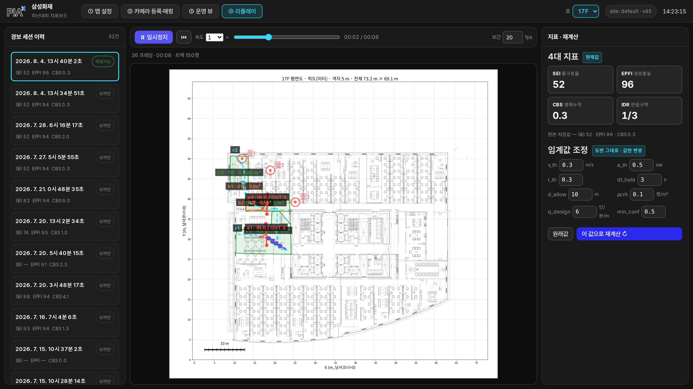

| 영역 | 내용 |
|------|------|
| 좌측 | **경보 세션 이력** — 세션별 시각·SEI/EPFI/CBS 요약. `재생가능`(녹화 있음)/`요약만`(녹화 이전 세션) 뱃지 |
| 상단 | **▶재생/⏸ · ⏮처음으로 · 배속(0.5~16×) · 프로그레스바(시크) · 현재/전체 시간 · 보간 fps** |
| 중앙 | 그 층 도면 위에 사람 점·방향·구역/병목/출구 카운트·경보원(🔔)을 시각으로 재생 |
| 우측 | **재계산된 4대 지표**(+원본 저장값 비교) · **임계값 조정**(v_th·a_th·r_th·dt_hold·d_allow·ρcrit·q_design·min_conf) · **[이 값으로 재계산 ↻]** |

> **q_design을 바꾸면 SEI도 다시 계산됩니다** (2026-08-21). 이전에는 설계 통과용량 C_j가
> 세션 스냅샷에 굳어 있어 q_design을 조절해도 SEI가 변하지 않았습니다. 출구별 유효폭·
> 기준을 바꿔 재산출하려면 API로 `exits:{<출구id>:{width_m, q_design}}` 를 함께 보냅니다.

**쓰는 법**
1. 좌측에서 세션 선택 → 중앙에 재생 준비. **프로그레스바를 드래그**하면 그 순간으로 바로 이동해
   정지 상태로 볼 수 있고, ▶로 이어 재생·배속 조절.
2. 우측 임계값을 바꾸고 **[이 값으로 재계산]** → 도면·궤적 그대로, 지표만 다시 산출됩니다.
   원본 저장값은 함께 표시되며 **절대 바뀌지 않습니다**(파생본만 생성).

**전제·한계**
- **녹화는 세션 시작 시점부터** 시작됩니다 — 이 기능 배포(재시작) **이후에 실행한 세션만**
  `재생가능`. 그 이전 과거 세션은 원본 트랙이 없어 `요약만`(2D 재생 불가, 소급 복구 안 됨).
- 녹화는 **추적 결과 좌표**입니다 — 검출·추적 자체 오류(놓친 사람·ID 뒤바뀜)나 **카메라 매핑
  (호모그래피) 변경**을 반영한 재계산은 불가(원본 영상 재추론은 별개 범위).
- 켜고 끄기: 서버 환경변수 `SESSION_RECORD`(기본 on, `0`이면 녹화 끔).

---

## ⑤ 리허설 — 저장 영상 패키지로 훈련 재현

RTSP 카메라 없이 **미리 저장해 둔 훈련 영상 패키지**로 4대 지표 파이프라인을 그대로 돌려
훈련을 재현·시연하는 화면입니다. 현장 수집(RTSP·DS 디코드) 대신 **영상 파일을 직접
프레임 잠금 동기로 읽어** 추론하므로(파일 모드), 카메라별 버퍼·재접속 지터 없이 점들이
경로를 따라 깔끔하게 나옵니다. 설계·구현 근거: [ADR 09 리허설 패키지 구조](../../architecture/09-리허설-패키지-구조.md) ·
실행/환경변수: [`system/vsource/README.md`](../../../system/vsource/README.md).

### 5-1. 리허설 패키지란 — 폴더 하나 = 진실의 원천

리허설을 구성하는 정보(영상·시나리오·카메라·매핑)를 **폴더 하나에 자기완결 패키지**로 담습니다.

- 위치·정본: **`media/vsource/<site>/<set>/rehearsal.json`** (매니페스트 = 진실의 원천, git 추적).
  영상 파일(`scenario_NN/camX.mp4`)만 용량 때문에 git 제외 — HF `backseollgi/MCMOT`의
  **레포 경로 그대로**에 보관하고 `bash tools/fetch_assets.sh --rehearsal`로 제자리에 내려받습니다.
- 매핑(카메라↔도면 대응점)은 UI에서 찍되 **사이트가 아니라 패키지 `rehearsal.json`에 저장**됩니다.
  운영 사이트를 오염시키지 않습니다("🎬 리허설 매핑 — 원본 매핑은 안 건드림" 배너).
- 층은 **사이트 층을 빌려 씁니다(빙의 모드)** — 도면·구역·출구·경로는 **건물의 속성**이라
  ① 맵설정에서 만든 사이트 층을 그대로 쓰고, 영상·카메라·매핑만 패키지가 갖습니다.
  그래서 ①에서 그 층의 CAD·구역·경로를 고치면 **리허설 지표에 즉시 반영**됩니다.

### 5-2. 실행 흐름

1. ⑤ 탭에서 **패키지·시나리오 선택** → 대기(standby). 준비는 각 카메라의 **첫 등장 프레임을
   정지로 붙잡아** 매핑 스냅샷으로 씁니다(카메라 부착 대기 없이 즉시).
2. 매핑이 없는 카메라는 **② 매핑 도구(기존 UI 재사용)** 로 대응점을 찍습니다 → 결과가
   패키지에 저장됩니다. 다층 리허설(10F+17F 등)은 카메라마다 붙일 사이트 층을 고릅니다.
3. **③ 운영 뷰에서 [🎬 리허설 훈련 시작]** — 운영 뷰가 리허설 층으로 자동 전환되고, 경보
   원점 검사를 통과하면 **t=0부터 재생**(그 순간이 경보 시각 t_alarm). 리허설은 층 수와
   무관하게 **건물 세션**으로 열립니다.
4. **영상이 끝나면 세션이 자동 종료·저장**됩니다(`VSOURCE_AUTO_END_SESSION`, 기본 on).
   ③에서 [훈련 종료]를 따로 누르지 않아도 롤업 결과가 산출되고, ④ [건물 훈련] 목록에 남습니다.

### 5-3. 자동 반영·복원 (사이트 무오염)

- 리허설을 시작하면 패키지의 **가상 카메라(`rh_*`)** 가 런타임에 얹혔다가, 종료 시 떼어집니다.
  사이트 카메라·설정 파일은 **한 번도 쓰지 않으므로** "복원"은 얹기 중단이 전부입니다.
- 파일 모드 준비 시 사이트 RTSP/DS 인제스트는 파킹(`park_site`)돼 GPU를 비우고, 종료 시 다시
  살아납니다(`VSOURCE_PARK_SITE`). 리허설 중 ② 카메라 목록에는 **그 시나리오의 rh 카메라만** 보입니다.
- 세션 중에는 반영·복원이 막힙니다(라이브 세션 있으면 409) — 엔진 재기동 비용 때문입니다.

---

## 자주 묻는 것

| 질문 | 답 |
|------|-----|
| 설정을 매번 다시 해야 하나 | 아니오 — 전부 JSON 영속화, 재시작 시 카메라까지 자동 기동 |
| 카메라 영상은 어디서 보나 | 운영 뷰 카메라 행 클릭(스냅샷). 연속 영상 표출은 의도적으로 없음 |
| 같은 사람이 맵에 2점으로 보임 | 중첩 화각에서 카메라별 ID가 각각 찍히는 알려진 한계(글로벌 ID 병합은 최종 단계 로드맵) |
| 속도·밀도가 "—" | 맵 축척 미지정 — ①-2/①-3으로 축척 설정 |
| SEI가 "—" | 세션 중 출구 통과 0명이거나 출구 설계인원 미입력(insufficient_data 처리) |
| 지표 값이 이상하게 큼/작음 | 카메라 매핑(대응점)이 부정확하면 좌표·속도가 왜곡 — ②-2에서 재매핑 |
| 안 움직이는 객체가 계속 표시됨 | 의자 등 정지 사물 오탐 케이스 — ②-1의 **검출 신뢰도(min_conf)**를 올려 신뢰도로 차단(기본 0.5), 그래도 남으면 ②-3의 **유효 ROI**에서 그 위치를 영역 밖으로 빼 위치로 차단 |
| ffmpeg / DeepStream 차이 | 인제스트(디코드·추론) 백엔드만 다를 뿐 **UI·조작·지표는 동일**. 전환은 `system/README.md` |
