# DeepStream × 운영 webui(:8900) 통합 검증 (P10)

- **일시**: 2026-07-20
- **대상**: `feature/deepstream-ingest` (5374eef 기준 + 본 검증에서 수정 1건)
- **목적**: `INGEST_BACKEND=deepstream` 스위치를 실운영 webui(:8900)에 적용해
  실사용 시나리오(운영뷰 → 채널 증설 → 4대 지표 세션 → 장애 복구 → 롤백)를 E2E로 검증.
- **방법**: pm2 `macs-system` DS 모드 재기동 + Playwright(headless chromium) UI 자동화.
  스트림은 mediamtx(`rtsp://127.0.0.1:8554/*`) 12경로, GPU1 전용(GPU0 미사용).

## 결과 요약

| # | 항목 | 결과 | 비고 |
|---|------|------|------|
| 1 | DS 모드 기동 (`backend=deepstream`, 워커 자동 기동) | ✅ | docker.sock 권한 문제 1건 발견·수정 (아래) |
| 2 | 운영뷰 2D 맵 — 객체 도트 실시간 이동 | ✅ | 기존 매핑 cam01~03 그대로 사용, 5초간 240px 이동 확인 |
| 3 | 수식 계산 (속도·구역 밀도·출구 카운트) | ✅ | 속도 0.9~1.5 m/s, 밀도 0.02~0.17/m², OUT 카운트 누적 증가 |
| 4 | 채널 증설 fps 가시성 (4→8→12→16→20ch) | ✅ | 12ch까지 5.0fps 유지, 16ch 평균 4.2, 20ch 평균 2.8로 저하가 UI에 표시 |
| 5 | 4대 지표 세션 (시작→60초→종료) | ✅ | SEI 98.1 · EPFI 94.2 · CBS 4.1 · IDR 3/3 구역, 추적 80객체 |
| 6 | 재접속 내성 (스트림 단절→복구) | ✅ | 단절 10.4초 후 `reconnecting`, 3.7초 만에 `running` 복귀 |
| 7 | 롤백 리허설 (ffmpeg 복귀 → DS 재전환) | ✅ | ffmpeg 4ch@5.0fps·맵 객체 정상 → DS 모드로 재전환 완료 |

회귀: `tests/system` 68 passed / 1 failed —
실패는 기존 알려진 1건(`test_session.py::TestIDR::test_graph_empty_straight_line_fallback`)뿐,
본 검증 변경(bash 스크립트)과 무관.

## 발견 문제와 수정

### F-1. pm2 데몬의 docker 그룹 누락 → DS 워커 기동 실패 (수정됨)

DS 모드 첫 재기동 시 서버가 기동 실패로 크래시 루프:

```
RuntimeError: [macs-ds-worker-gpu1] docker run 실패:
permission denied while trying to connect to the docker API at unix:///var/run/docker.sock
```

- **원인**: pm2 god 데몬(pid 580952)이 사용자가 docker 그룹에 추가되기 **전에** 떠 있어
  보조 그룹 목록에 docker(111)가 없음 → 자식 프로세스 전체가 docker.sock 접근 불가.
  (로그인 셸에서는 `docker ps` 정상 — 데몬 상속 그룹만의 문제)
- **수정**: `tools/run_system_server.sh` — deepstream 모드이고 현재 프로세스에 docker
  그룹이 없되 `/etc/group` 멤버십은 있는 경우 `sg docker -c "…"`로 그룹을 보충해 실행.
  ffmpeg 모드·정상 그룹 환경에서는 기존 실행 경로 그대로(동작 불변).

### F-2. pm2 `--update-env`로는 환경변수 "제거"가 안 됨 (운영 메모)

롤백 시 셸에서 `INGEST_BACKEND`를 unset하고 `pm2 restart --update-env` 해도
pm2에 저장된 기존 값이 남아 deepstream으로 재기동됨.
**롤백은 반드시 `INGEST_BACKEND=ffmpeg`를 명시**할 것 (스크립트 주석의 "제거(또는 =ffmpeg)"
중 pm2 운영에서는 후자만 유효 — 완전 제거는 `pm2 delete` 후 재등록 필요).

## 상세

### 1. DS 모드 기동

```
INGEST_BACKEND=deepstream GPU_DEVICES=1 pm2 restart macs-system --update-env
```

- `/api/status` → `"backend": "deepstream"`, `macs-ds-worker-gpu1` 컨테이너 자동 기동.
- 기존 등록 카메라 3채널(cam01~03 = 1_v1/2_v1/3_v1) 자동 재기동, 약 30초 내 트래킹 유입.

### 2·3. 운영뷰 2D 맵 + 수식 계산 (3ch, 기존 매핑 그대로)

5초 간격 두 시점의 `/api/map/state` 비교 — 동일 gid 객체가 240~255px(≈5.8m) 이동,
`speed_mps`(0.9~1.5)와 정합. 우측 실시간 패널·객체 목록 패널 모두 0이 아닌 값으로 갱신:

- 구역 밀도: z3 0.083 / z4 0.114 / z5 0.061 명/m² (인원수와 함께 갱신)
- 출구 통과: e3 OUT 13→23, e1 OUT 16→29 (5초 사이 누적 증가)
- 객체 패널: 객체별 m/s·정렬·체류s·구역 표시, "피난중" 상태 뱃지

| 시점 | 스크린샷 |
|---|---|
| t0 | 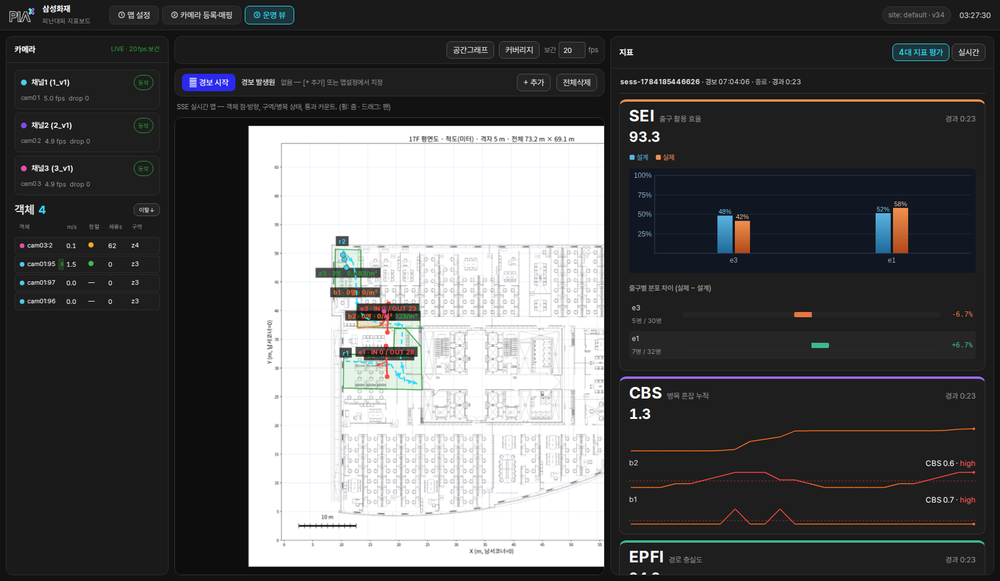 |
| t+5s | 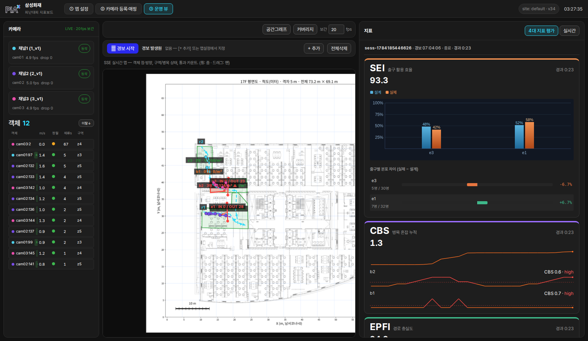 |

### 4. 채널 증설 시 fps 저하 가시성

카메라 관리 API로 증설(신규 스트림 9개 + 동일 스트림 중복 구독 8개), 각 단계 90~150초
안정화 후 `/api/status`의 `fps_in`(=운영뷰 좌측 카메라 목록 표시값) 실측:

| 채널 | fps 평균 | fps 최소~최대 | 상태 | 스크린샷 |
|---|---|---|---|---|
| 4ch | 5.00 | 4.9~5.1 | 전 채널 running | 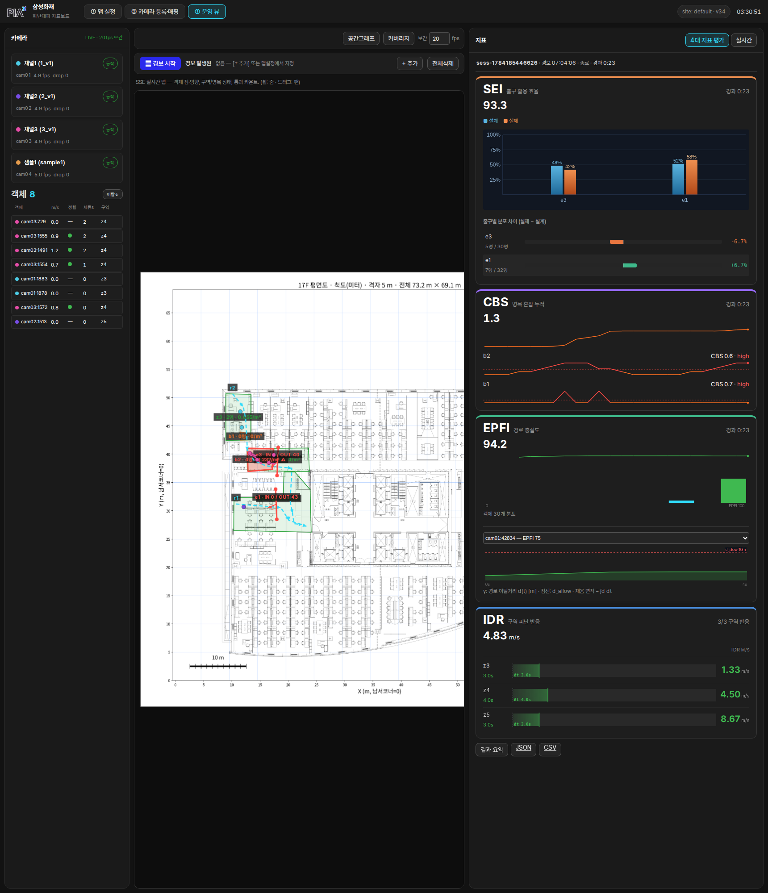 |
| 8ch | 5.00 | 4.9~5.1 | 전 채널 running | 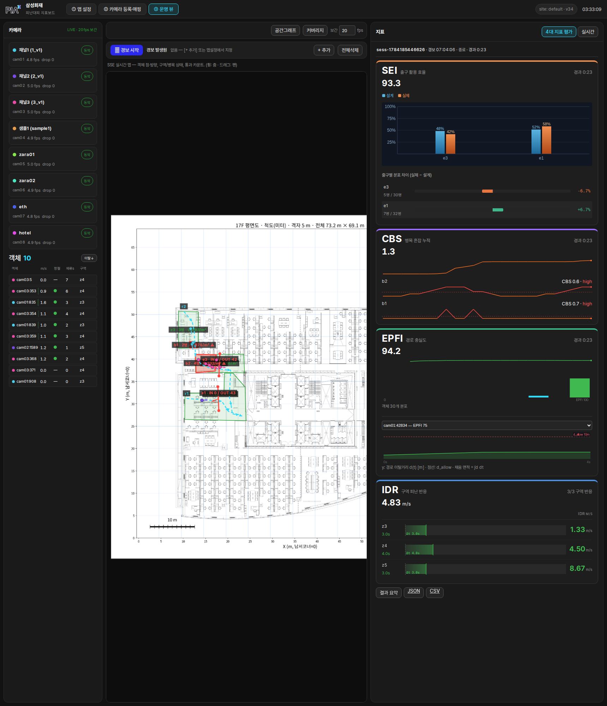 |
| 12ch | 5.00 | 5.0~5.0 | 전 채널 running |  |
| 16ch | 4.17 | 3.9~4.4 | 전 채널 running, 저하 시작 |  |
| 20ch | 2.83 | 2.4~3.4 | 전 채널 running, 뚜렷한 저하 | 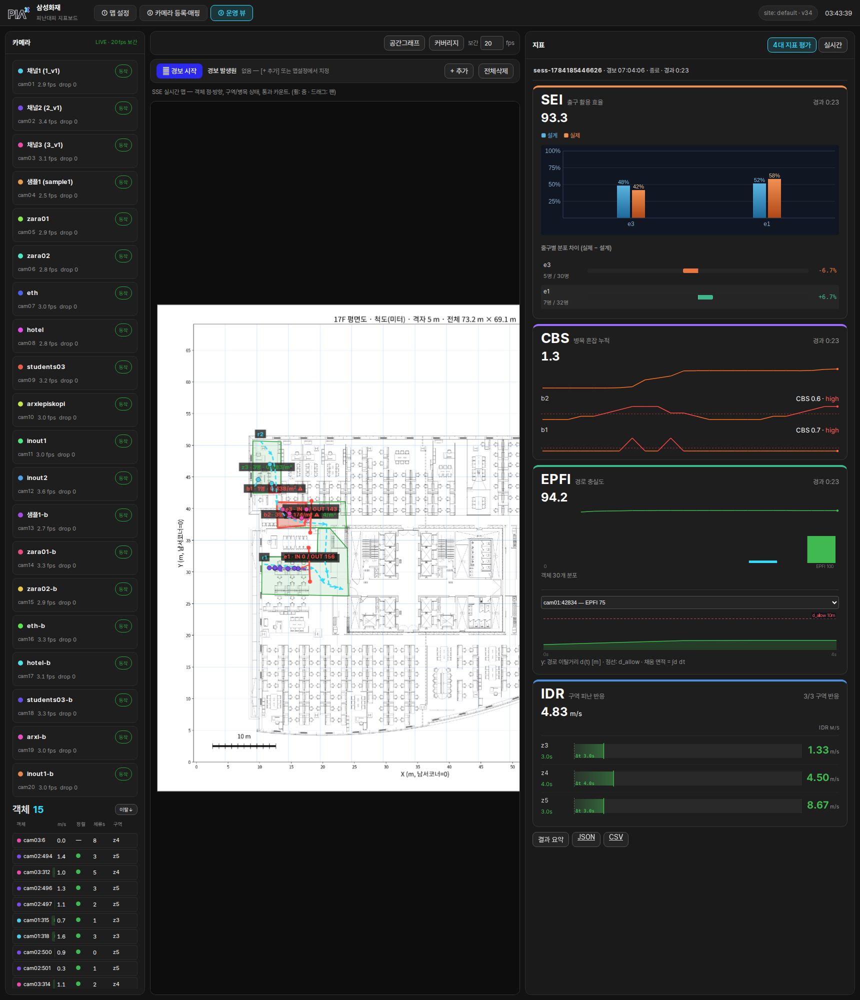 |

- UI 카메라 목록의 채널별 fps 숫자가 실제 처리량 저하를 그대로 반영 — **저하 가시성 확인**.
- 16ch가 P9 실측(16ch@5fps)보다 낮게 나온 것은 검증 시점에 GPU1에 타 프로세스가
  상주(약 5GB·유틸 수십%)한 공유 환경 영향으로 판단. 전유 조건이면 P9 수치가 기준.
- 증설·삭제 모두 서버 재시작 없이 해당 워커 컨테이너만 재기동(hot add/remove) — 매 조작
  후 1분 내 전 채널 running 복귀.

### 5. 4대 지표 평가 세션

운영뷰에서 [+ 추가]로 맵에 경보 발생원 1개 지정 → [🔔 경보 시작] → 65초 → [⏹ 세션 종료]
(Playwright로 실제 버튼 플로우 수행, 4ch/매핑 3ch 상태):

- **SEI 98.1** (출구 활용 효율 — e3 20/30명·e1 23/32명, 분포 차이 ±1.9%)
- **EPFI 평균 94.2** (경로 충실도, 객체 80개 분포)
- **CBS 총 4.1** (b1 2.03 / b2 2.05, high 구간 스파크라인 표시)
- **IDR 3/3 구역 반응** (z3~z5 모두 개시, response_delay 1.0s, 경보원별 IDR 산출)
- person_metrics 80객체, 결과 JSON/CSV 내보내기 버튼 노출, 세션 저장본
  `data/sites/default/sessions/sess-1784519297902.json` 생성.

| 단계 | 스크린샷 |
|---|---|
| 세션 시작 직후 | 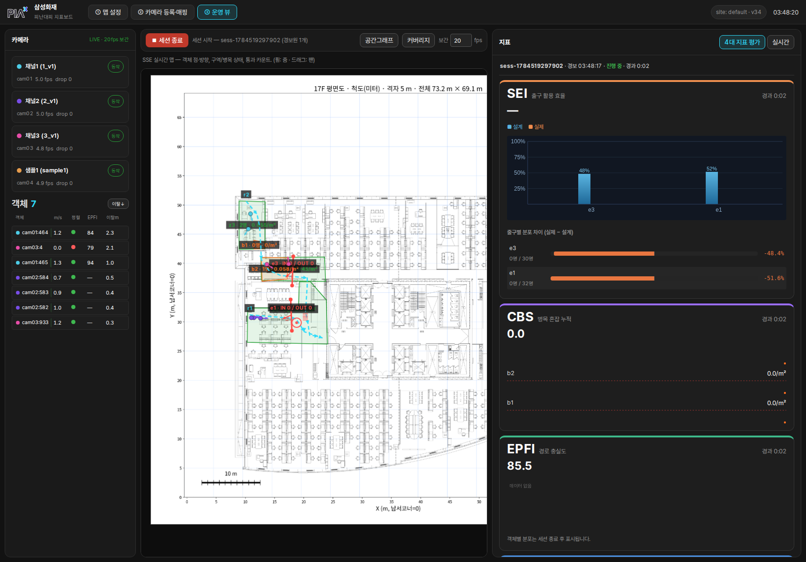 |
| 진행 30초(4대 지표 패널) | 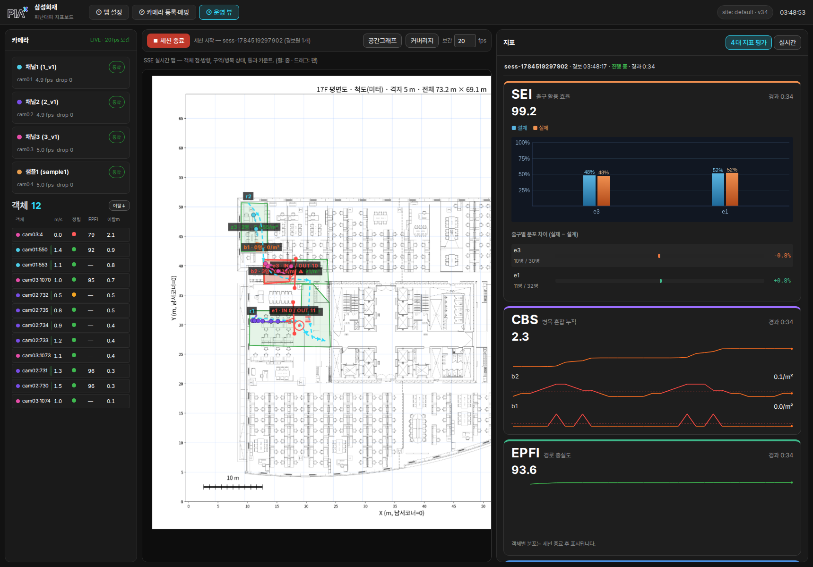 |
| 종료·결과 모달 | 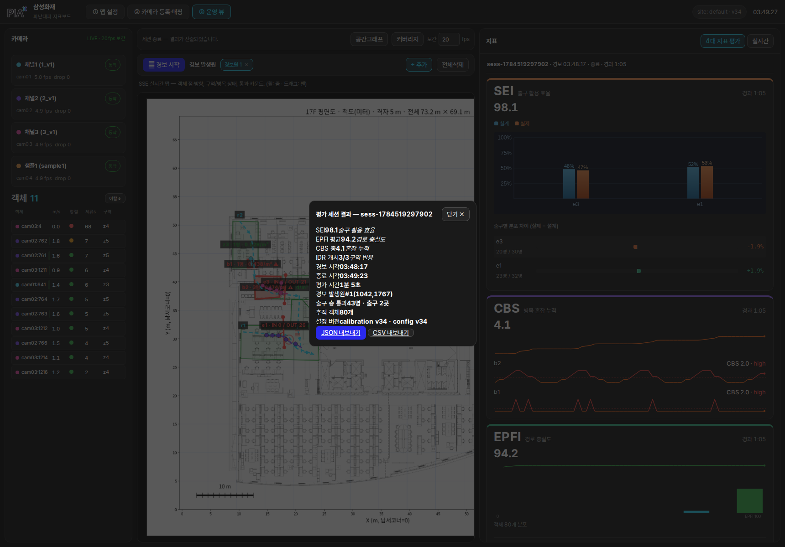 |

### 6. 재접속 내성

`pm2 restart 1_v1`로 cam01 스트림을 강제 단절 후 상태 전이를 2초 간격 폴링:

```
t+0.0s   running (4.6fps)
t+10.4s  reconnecting (0.0fps)   ← 단절 감지, UI에 표시
t+14.1s  running (1.5fps)        ← DS 워커 자체 재접속
이후     running (4.6fps)        ← fps 완전 복구
```

| 단절 중 | 복구 후 |
|---|---|
| 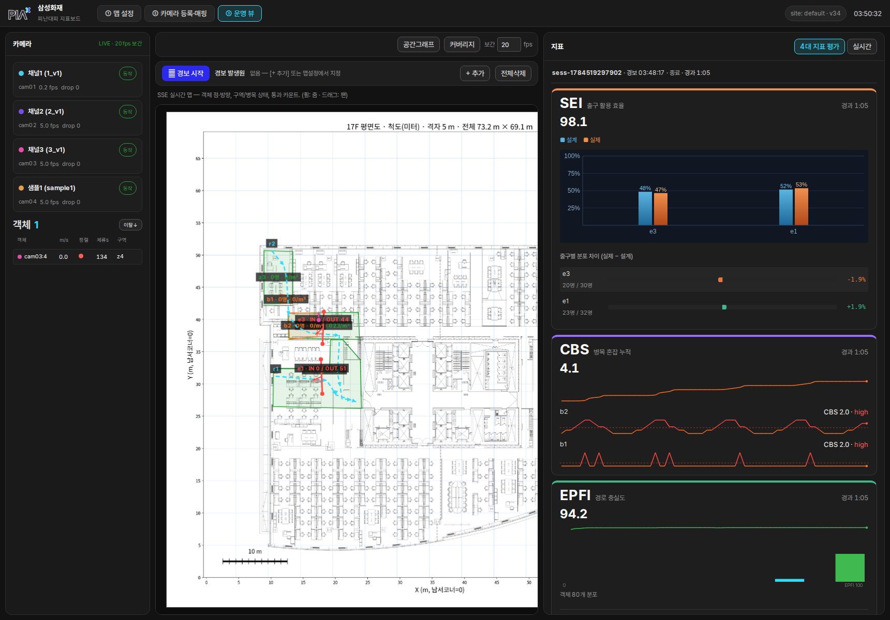 |  |

### 7. 롤백 리허설

1. `INGEST_BACKEND=ffmpeg GPU_DEVICES=0,1 pm2 restart macs-system --update-env`
   → `backend=ffmpeg`, DS 워커 컨테이너 자동 정리, 4ch 전 채널 5.0fps,
   호스트 TRT 추론 재개(avg_infer 56ms), 맵 객체 12개 — **기존 경로 무손상**.
2. 확인 후 다시 `INGEST_BACKEND=deepstream GPU_DEVICES=1`로 재전환 — 최종 상태.

### 데이터 원상복구

- 검증 중 추가한 cam05~cam20 전부 삭제. 기존 cam01~03 설정 파일은 백업본과 diff로
  **바이트 단위 무변경** 확인. cam04(sample1, 매핑 없음)는 최종 상시 구동용으로 유지.

## 남긴 서버 상태

- pm2 `macs-system`: **DS 모드** (`INGEST_BACKEND=deepstream GPU_DEVICES=1 SITE_ID=default`),
  `macs-ds-worker-gpu1` 컨테이너 구동 중.
- 등록 카메라 4ch — cam01(1_v1)·cam02(2_v1)·cam03(3_v1, 이상 매핑 있음)·cam04(sample1),
  전 채널 running ≈5fps, 맵 객체 실시간 표출:


## 추기 — 운영 장애: TRT 비블로킹 스트림 레이스로 인한 "깨진 프레임" 폭풍 (2026-07-20, 수정됨)

### 증상

P10 이후 운영(:8900, DS 모드 3ch 라이브)에서 아래가 상시 발생:

- 워커 로그에 `[camXX] 검출 3000~7000개 — 깨진 프레임 판정, 트래킹 생략` 경고가
  초당 수 건 (프레임의 약 10%가 폐기, 실효 fps 4.0~4.8로 저하)
- 운영뷰 2D 맵 도트 끊김·순간이동, 로컬 트랙 ID가 십수 분 만에 수천 번대로 폭증
  (ID 대량 교체), 사람 아닌 곳(의자)에 정적 트랙

### 원인 규명 과정 (증거)

1. **덤프 재현 실패가 첫 단서** — `--verify-dump --dump-frames 120`으로 같은 3ch를
   돌리면 깨진 프레임 0건(검출 3~9개 정상). 같은 시각 운영 워커는 계속 경고
   → 픽셀(디코드·mux·pitch) 문제가 아니라 **타이밍 민감한 레이스**.
2. **경고의 배치 상관** — cam02·cam03 경고가 동일 밀리초에 쌍으로 반복 발생
   → 카메라별 디코드 손상으로는 불가능, **배치 추론 단위로 한꺼번에 깨짐**.
3. **통제 실험** — 운영과 동일 인자 60초: 경고 108건. `--copy-mode`(CPU 복사 경로)
   60초: 17건. 줄지만 0이 아님 → surface zero-copy 밖, **양 경로 공통 지점** =
   `TRTEngine.__call__`.

### 근본 원인

`torch.cuda.Stream()`은 **non-blocking 스트림**으로 legacy default 스트림과 암묵
동기화가 없다. 입력 배치를 만드는 커널(`torch.stack`·GPU letterbox·ReID crop)은
전부 default 스트림에 enqueue되는데, `execute_async_v3(self.stream)`이 대기 없이
즉시 실행되므로 GPU가 바쁠 때(라이브 3ch NVDEC+mux+conv+추론 동시 부하) TRT가
**복사 미완료 메모리를 읽는다** → 쓰레기 입력 → 저신뢰 오검출 수천 개.
같은 레이스가 ReID 입력(crop 배치)에도 있어, 가드를 통과한 프레임에서도 임베딩이
간헐 오염 → 연관 실패 → ID 폭증·맵 순간이동. 파일 lossless 검증에서는 GPU가
한산해 레이스를 항상 이겼기 때문에 P7 유사도 검증을 통과했었다.

### 수정 (커밋 대상 2파일, 각 1줄 + 주석)

`execute_async_v3` 직전에 입력 생성 스트림 완료를 명시 대기:

```python
self.stream.wait_stream(torch.cuda.current_stream())
self.context.execute_async_v3(self.stream.cuda_stream)
```

- `system/ingest_ds/trt_infer.py` `TRTEngine.__call__` — 운영 DS 워커 (검출·ReID 공용)
- `src/inference_trt.py` `TRTEngine.__call__` — 동일 패턴의 잠재 버그 (기존 단일영상 경로)

### 수정 후 실측

| 항목 | 수정 전 (운영) | 수정 후 (운영, 동일 3ch) |
|---|---|---|
| 깨진 프레임 경고 | 10~26건/10초 상시 | **0건** (재시작 후 연속 관찰) |
| detmax (윈도 내 최대 검출) | 3,000~7,537 | **7~11** |
| 실효 분석 fps | 4.0~4.8 | **전 채널 5.0 고정** |
| 맵 연속성 (12초·17트랙·86스텝 폴링) | 순간이동·끊김 | **순간이동(>200px/s) 0건** |
| 로컬 트랙 ID | 십수 분에 수천 번대 | 정상 증가 (재시작 4분 후 ~190) |

- 동일 인자 별도 워커 120초 재검증: 경고 0건 (수정 전 60초 108건).
- **유사도 스팟체크** — `verify_ds_similarity.py` 3단계 재실행, P7 보고서와 수치
  동일: 검출 매칭률 99.44%·IoU 0.9756, ReID cosine 0.9563, 트랙 매칭 98.95%
  → 정상 프레임 출력 불변(수정은 실행 순서만 강제).
- 회귀: `tests/system` 68 passed / 1 failed — 실패는 기존 알려진 1건
  (`test_graph_empty_straight_line_fallback`)으로 본 수정과 무관.

| 수정 전 | 수정 후 |
|---|---|
| 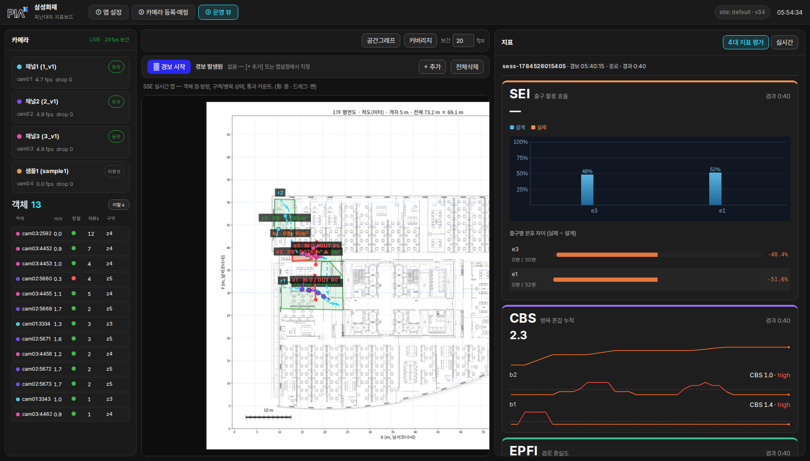 | 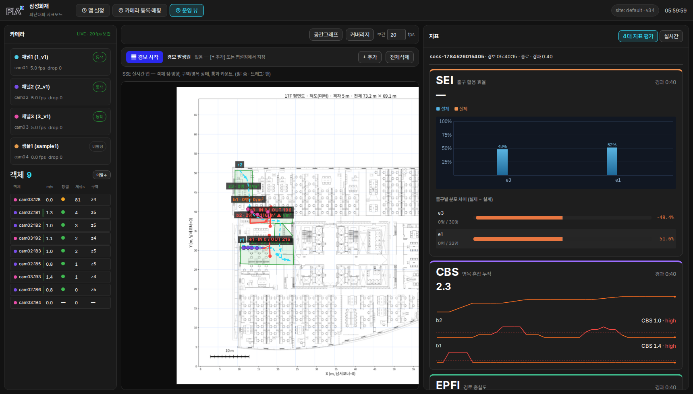 |

### 정적 트랙(의자) 오탐 — 검출기 오탐으로 판정 (설정 제안만)

워커 재시작(트래커 리셋) 후에도 cam03 맵 (986, 1350) 지점에 정적 트랙이
재생성됨 — 호모그래피 역투영으로 카메라 픽셀 (662, 301)을 확인하니 **검은 사무용
의자** 위였다(conf 0.57~0.62). 깨진 프레임 잔재가 아닌 **검출기 자체 오탐**.
코드 수정 없음 — 사이트 설정으로 대응 제안:

- cam03 `min_conf`를 0.65 부근으로 상향(단, 원거리 실인원 검출 감소 트레이드오프), 또는
- cam03 `valid_roi`로 책상 구역 제외 (현재 `valid_roi: null`).

### 남은 리스크

- 임베더의 `out.cpu()`(D2H)와 후처리의 `pred.cpu()`는 default 스트림 동기화를
  동반해 추가 레이스 없음 — 단, 향후 스트림 구조를 바꿀 때 `wait_stream`
  대칭(입력 대기·출력 sync)을 유지할 것.
- cam04(sample1)는 검증 시점에 비활성 상태 — 활성 3ch 기준 실측이며, 4ch 활성 시
  배치 4로도 동일 경로라 영향 없음(120초 재검증은 batch≤3, 유사도 검증은 batch 7).
