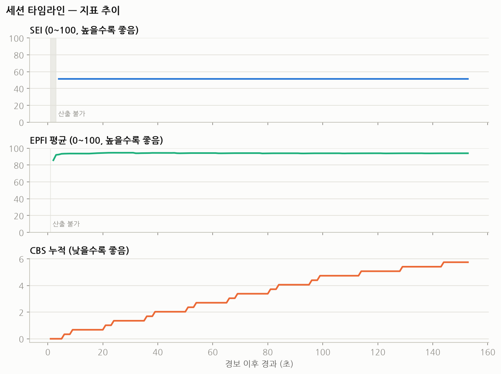
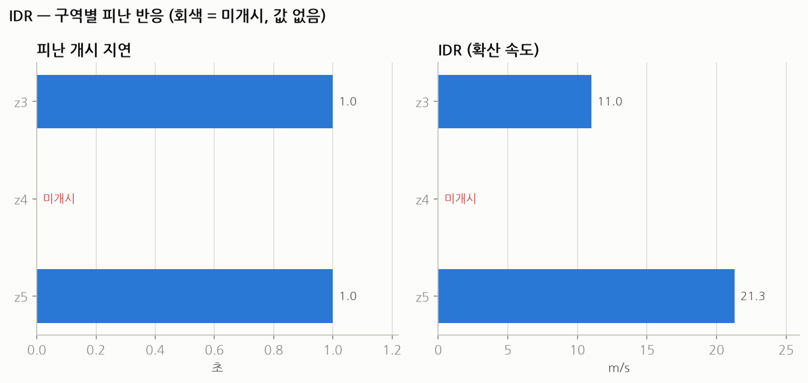
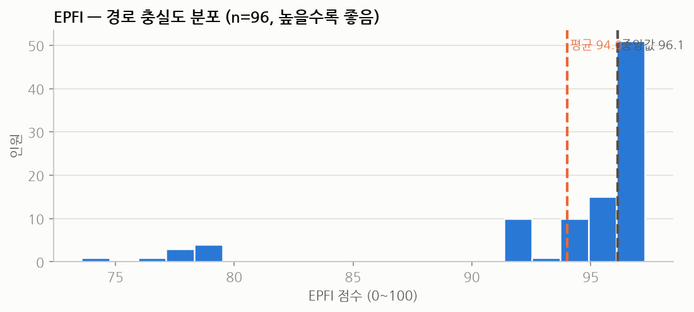
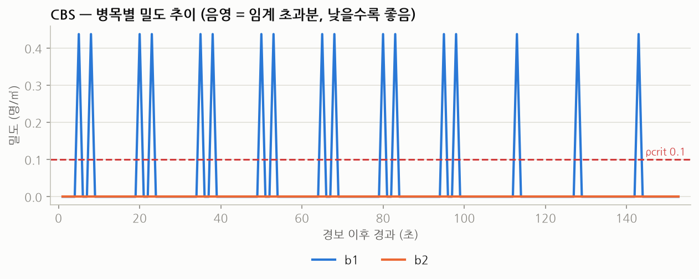
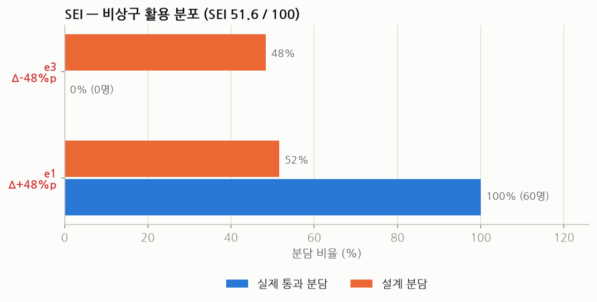

# 피난훈련 정량평가 — sess-1786977645508

> 대상 세션 `sess-1786977645508` · default 층 · 2026-08-17 14:40:45 ~ 14:43:18 ·
> 평가 구간 152.8초. 4대 정량지표(IDR·EPFI·CBS·SEI) 기준 해석.
> 종합점수·등급은 산출하지 않음(요구사항 D-8 — 고객 승인 가중치 확정 후 별도).
>
> ⚠️ **본 세션은 실제 피난훈련이 아니라 파이프라인 검증용 세션임.** 입력은 mediamtx
> 송출 테스트 영상(보행자 일반 영상) 3채널이며, 경보 전 정지 상태가 존재하지 않음.
> 따라서 아래 수치는 **지표 산출·해석 절차의 검증 근거**로 읽어야 하며, 훈련 성과
> 평가로 해석해서는 안 됨.

---

## 0. 요약

- **비상구 e3가 전혀 사용되지 않음** — 설계 분담 48.4%인 출구의 실제 통과 0명, 전원(60명)
  e1로 집중. SEI 51.6점의 단일 원인.
- **z4 구역 피난 미개시** — 3개 구역 중 1개가 `not_started`. 참여율 0.0으로, 해당 구역에
  관측 객체 자체가 없었던 것으로 보임(카메라 커버리지 문제 가능성).
- **b1 병목 위험도 high** — 최대 밀도 0.438명/㎡(임계 0.1의 4.4배), 임계 초과 누적 17초,
  CBS 5.75. 반면 b2는 통과 자체가 없어 CBS 0.
- **IDR 값이 물리적으로 비현실적(11.0·21.3 m/s)** — 검증 세션의 구조적 한계로, 지표
  오류가 아니라 입력 시나리오 문제임(§3 참조).
- 데이터 신뢰도: **ok** — 맵 투영 실패 13.8%, 관측 트랙 119명. 단 등록 카메라 3대 중
  cam03이 관측에 기여하지 않음.

| 지표 | 값 | 방향 | 한 줄 판단 |
|------|-----|------|-----------|
| IDR | 개시 2 / 전체 3 구역, 11.0~21.3 m/s | 높을수록 좋음 | 값 자체는 시나리오 한계로 해석 불가. **미개시 1구역이 실질 발견** |
| EPFI | 평균 94.0 (중앙값 96.1, n=96) | 높을수록 좋음 | 허용 이탈 10m 대비 평균 0.60m — 경로 충실도 양호 |
| CBS | 합계 5.75 (b1 5.75 / b2 0) | **낮을수록 좋음** | b1 단독 기여. 임계 초과가 세션 전반에 산발 |
| SEI | 51.6 / 100 | 높을수록 좋음 | 출구 쏠림 100:0 — 개선 여지가 가장 큰 지표 |

---

## 1. 세션 개요

| 항목 | 내용 |
|------|------|
| 세션 ID | `sess-1786977645508` |
| 층 / 사이트 | default / default |
| 경보 시각 | 2026-08-17 14:40:45 |
| 경보 발생원 | 3개 — (752, 925) · (1045, 1047) · (1304, 1377) 맵 px |
| 평가 구간 | 152.8초 (14:40:45 ~ 14:43:18) |
| 관측 트랙 | 119명 |
| 관측 카메라 | cam01, cam02 (**cam03 미관측**) |
| 설정 버전 | calibration 47 / config 47 |
| 원본 | `data/sites/default/sessions/sess-1786977645508.json` (녹화 `.db` 있음) |

경보 후 4초 시점에 2개 구역이 동시 개시 판정되고 이후 세션 끝까지 변동 없음
(`zones_started` 2 고정). SEI는 4초 시점부터 51.6으로 고정되는데, e1 통과가 초반에
시작되고 e3 통과가 끝까지 0이었기 때문에 분포비가 즉시 확정된 결과임. EPFI 평균은
초반 92.5에서 상승 후 94 부근에서 안정. CBS만 유일하게 세션 내내 계단식으로 누적되어
최종 5.75에 도달 — 혼잡이 한 시점에 몰린 것이 아니라 **전 구간에 산발적으로 반복**됨.

---

## 2. 데이터 신뢰도

| 항목 | 값 | 판단 |
|------|-----|------|
| 맵 투영 실패 비율 | 13.8% | 주의 임계(15%) 미만 — 허용 범위 |
| 관측 트랙 수 | 119명 | 충분 |
| 관측 카메라 | cam01, cam02 | **cam03 기여 0** |
| 경고 | 없음 | — |
| 종합 | **ok** | 지표 해석 진행 가능 |

맵 투영 실패 13.8%는 카메라 유효영역(valid_roi) 밖이나 호모그래피 범위를 벗어난 검출
비율이며, 현 임계에서는 허용 범위임.

다만 **cam03이 등록·가동 상태(5fps)임에도 관측 트랙에 전혀 기여하지 않은 점**은 별도
확인이 필요함. 해당 카메라가 담당하는 공간의 지표는 과소 산출되었을 수 있으며, §3의
z4 미개시 판정과 연관 가능성이 있음.

---

## 3. IDR — 구역별 피난 반응 확산

| 구역 | 상태 | 개시 지연 | 경보원 거리 | IDR | 참여율 |
|------|------|-----------|-------------|-----|--------|
| z3 | 개시 | 1.0초 | 11.00 m | 11.00 m/s | 100% |
| z4 | **미개시** | — | 12.67 m | — | **0%** |
| z5 | 개시 | 1.0초 | 21.28 m | 21.28 m/s | 100% |

**미개시 구역 z4** — 3개 구역 중 유일하게 피난 개시가 판정되지 않음. 참여율이 0.0이라
"구역 내 객체가 관측되지 않음"과 "객체는 있었으나 개시 조건(v_th·a_th·r_th를 Δt_hold
이상 유지)을 충족하지 않음"이 구분되지 않는 상태임. 두 가능성 모두 열려 있음:

- **커버리지 원인**: z4 폴리곤이 cam01·cam02 유효영역과 겹치지 않아 애초에 관측되지
  않았을 가능성. cam03 미관측(§2)과 함께 확인 필요.
- **거동 원인**: 관측은 되었으나 이동이 개시 판정 임계에 미달했을 가능성.

실제 훈련이라면 이 구분이 평가의 핵심이므로, 세션 전에 **구역 폴리곤 ↔ 카메라 유효영역
중첩 검사**를 선행할 것을 권고함(§8).

**IDR 값의 해석 유보** — 산출된 11.0·21.3 m/s는 사람의 피난 반응 확산 속도로 볼 수 없는
값임(보행속도의 약 10~18배). 원인은 지표 결함이 아니라 검증 세션의 구조에 있음:
`IDR = 경보원까지 거리 / 개시 지연`인데, 본 세션의 개시 지연이 두 구역 모두 **1.0초**로
최소값에 가까움. 테스트 영상 속 보행자는 경보 시점에 이미 이동 중이었으므로 개시 조건이
즉시 충족되었고, 분모가 최소화되어 IDR이 발산한 것임.

즉 **실제 훈련에서는 경보 전 정지 구간이 존재해야 IDR이 의미를 가짐.** 본 세션은 그
전제가 성립하지 않으므로 값 자체는 비교·평가에 사용하지 않음.

다중 경보원(3개) 기준 구역별 편차는 아래와 같음. z3은 경보원별 4.0~20.0 m/s로 5배
편차, z5는 16.8~26.0 m/s로 상대적으로 균일함 — 경보원 위치에 따라 산출값이 크게 달라
지므로, 실제 훈련에서는 **경보원 정의가 IDR 해석의 전제**가 됨.

| 구역 | 경보원 1 | 경보원 2 | 경보원 3 |
|------|----------|----------|----------|
| z3 | 4.0 | 9.0 | 20.0 |
| z5 | 26.0 | 21.0 | 16.8 |

> 현 임계값 기준 — v_th 0.3, a_th 0.5, r_th 0.3, Δt_hold 3.0초. (고객 확정 전 임의값 — 요구사항 §9)

---

## 4. EPFI — 권장 경로 충실도

| 항목 | 값 |
|------|-----|
| 전체 평균 | 94.00 |
| 중앙값 / 사분위 | 96.14 (94.12 ~ 96.76) |
| 최소 / 최대 | 73.58 / 97.28 |
| 산출 대상 | 96명 (전체 119명 중) |
| 경로 미배정 | 23명 |
| 평균 이탈 거리 | 0.60 m (허용 d_allow 10.0 m) |
| 최대 이탈 거리 | 2.64 m |
| 경로 배정 | r1 76명 / r2 43명 |

**이탈 상위 8명**

| 트랙 | EPFI | 배정 경로 | 평균 이탈 | 최대 이탈 | 관측 |
|------|------|-----------|-----------|-----------|------|
| cam01:2980 | 73.58 | r2 | 2.64 m | 3.08 m | 2.4초 |
| cam01:2935 | 76.26 | r2 | 2.37 m | 3.07 m | 3.2초 |
| cam01:3006 | 77.83 | r2 | 2.22 m | 3.07 m | 4.0초 |
| cam01:3015 | 78.07 | r2 | 2.19 m | 3.07 m | 4.0초 |
| cam01:2972 | 78.08 | r2 | 2.19 m | 3.07 m | 4.0초 |
| cam01:2962 | 78.32 | r2 | 2.17 m | 3.07 m | 4.2초 |
| cam01:2986 | 78.44 | r2 | 2.16 m | 3.07 m | 4.0초 |
| cam01:2995 | 78.62 | r2 | 2.14 m | 3.05 m | 4.0초 |

분포가 좁고 상단에 몰려 있음(사분위 94.1~96.8). **최저값 73.58도 허용 이탈 10m 기준으로는
여유가 큰 편** — 실제 최대 이탈이 3.08m로 허용치의 31% 수준임. 즉 현 임계값에서는 경로
이탈이 문제로 검출되지 않는 상태임.

이탈 상위 8명이 **전원 r2 경로 배정이고 최대 이탈이 3.05~3.08m로 거의 동일**한 점이
특징적임. 개인별 산발적 이탈이라기보다 **r2 경로선 자체가 실제 보행 동선에서 약 3m
평행 이격되어 있을 가능성**이 높음. 경로 polyline 위치 점검을 권고함(§8).

경로 미배정 23명(19.3%)은 관측 구간이 짧거나 경로 근방에 진입하지 않은 트랙으로,
EPFI 산출에서 제외됨. 실제 훈련에서 이 비율이 커지면 평균값의 대표성이 떨어지므로
함께 보고할 필요가 있음.

> 현 임계값 기준 — d_allow 10.0 m, min_conf 0.5. (고객 확정 전 임의값)

---

## 5. CBS — 병목 구역 혼잡 누적

| 병목 | CBS | 최대 밀도 | 임계 초과 | 위험도 |
|------|-----|-----------|-----------|--------|
| b1 | 5.7467 | 0.438 명/㎡ | 17.0초 | **high** |
| b2 | 0.0 | 0.0 명/㎡ | 0.0초 | low |

**b1이 CBS 전량을 발생시킴.** 최대 밀도 0.438명/㎡은 임계 0.1의 4.4배이며, 임계 초과
상태가 누적 17.0초 지속됨. 첫 초과가 경보 후 5.0초, 마지막이 143.0초로 **세션 거의 전
구간(5~143초)에 걸쳐 산발 반복**되는 양상임 — 타임라인의 CBS 곡선이 특정 시점에 급등하지
않고 계단식으로 꾸준히 누적되는 것이 이를 뒷받침함.

이는 "한 번의 대규모 정체"가 아니라 **통과 흐름이 반복적으로 임계를 넘나드는 구조**로,
실제 훈련이라면 병목 폭·유도 인력 배치보다 **유입 속도 조절**이 유효한 대응 방향임.

**b2는 CBS 0이나 "안전"으로 읽어서는 안 됨.** 최대 밀도가 0.0으로, 해당 구역을 통과한
객체가 아예 없었음을 의미함. 병목으로서 검증된 것이 아니라 **미검증 상태**임. §6의 e3
미사용과 같은 원인(동선 편중)으로 추정됨.

> 현 임계값 기준 — ρcrit 0.1 명/㎡, 가중치 w(b1) 1.0 · w(b2) 1.0. (고객 확정 전 임의값)

---

## 6. SEI — 비상구 공간 활용 효율

| 비상구 | 실제 통과 | 실제 분담 | 설계 분담 | 설계 용량 | Δ |
|--------|-----------|-----------|-----------|-----------|---|
| e3 | **0명** | 0.0% | 48.4% | 30명 | **−48.4%p** |
| e1 | 60명 | 100.0% | 51.6% | 32명 | **+48.4%p** |

**미사용 비상구 e3** — 설계상 전체의 48.4%를 담당해야 할 비상구를 **단 1명도 사용하지
않음**. 총 통과 60명 전원이 e1로 집중됨. SEI 51.6점은 이 단일 사실에서 나온 값이며,
분포 편차 48.4%p는 산출 가능한 최대 편차(50%p)에 근접함.

2개 출구 구성에서 한쪽이 완전히 미사용이면 SEI는 구조적으로 50점 근방으로 수렴하므로,
**51.6이라는 수치보다 "e3 통과 0명"이라는 사실 자체가 보고 대상**임.

실제 훈련이라면 다음 중 하나가 원인일 것이며 구분이 필요함:

- e3가 물리적으로 폐쇄·잠금 상태였음
- e3로 향하는 유도 표식·안내가 부재했음
- 권장 경로(r1·r2) 자체가 e1 방향으로만 설계되어 있음
- e3 통과선이 카메라 유효영역 밖이라 **통과가 계측되지 않았음**(계측 문제)

본 검증 세션에서는 테스트 영상의 보행 동선이 한 방향으로만 흐르는 것이 직접 원인이나,
현장 적용 시에는 위 4가지를 반드시 구분해야 함 — 특히 마지막 항목은 지표가 아니라
**계측 실패**이므로 개선 대상이 전혀 달라짐.

---

## 7. 지표 간 관찰

세 지표가 **하나의 원인**을 다른 각도에서 보여주고 있음.

- **e3 미사용(SEI) · b2 통과 0(CBS) · z4 미개시(IDR)** 가 동시에 발생함. 세 대상 모두
  동일하게 "관측·통과 자체가 없었다"는 형태이며, 개별 지표의 악화라기보다 **공간의 한쪽
  절반이 평가에 잡히지 않은 것**으로 보는 편이 정합적임.
- 이 해석은 cam03 미관측(§2)과 맵 투영 실패 13.8%와도 일관됨. 즉 지표 3개가 동시에
  "한쪽이 비어 있다"고 말하고 있고, 카메라 관측 데이터도 같은 방향을 가리킴.
- 반대로 **관측된 절반에서는 지표가 정상 동작**함 — EPFI 96명 산출, b1 CBS 누적 계산,
  e1 통과 60명 계수, z3·z5 개시 판정. 즉 파이프라인 자체는 검증되었고, 문제는 **관측
  범위**에 있음.

> 위는 지표 간 연결 관찰이며, 4지표를 합산한 종합 판정이 아님(요구사항 D-8).

---

## 8. 개선 권고

### 계측 개선 (최우선)

1. **구역·병목·출구 ↔ 카메라 유효영역 중첩 검사를 세션 전 필수 절차로 도입**
   근거: z4 참여율 0% · b2 최대밀도 0 · e3 통과 0명이 동시 발생. 계측 실패와 실제
   미사용이 현재 구분 불가함. 세션 시작 전 각 공간요소가 최소 1대 이상의 카메라
   유효영역에 포함되는지 확인하는 점검이 필요함.
2. **cam03 관측 기여 0 원인 확인**
   근거: 등록·가동(5fps) 상태임에도 `cameras_observed`에 미포함. 매핑(호모그래피)
   미지정, valid_roi 과소 설정, 또는 검출 실패 중 어느 것인지 확인 필요.

### 지표 산출 조건 개선

3. **IDR 평가를 위해 경보 전 정지 구간을 확보**
   근거: 개시 지연이 두 구역 모두 1.0초로, IDR이 11.0·21.3 m/s로 발산함. 실제 훈련
   시에는 경보 전 최소 Δt_hold(3초) 이상의 정상 상태 구간을 세션에 포함해야 개시
   판정이 의미를 가짐.
4. **r2 경로 polyline 위치 점검**
   근거: 이탈 상위 8명 전원이 r2 배정이며 최대 이탈이 3.05~3.08m로 균일함. 개인 편차가
   아니라 경로선이 실제 동선에서 평행 이격되어 있을 가능성이 높음.

### 운영 (실제 훈련 적용 시)

5. **b1 병목은 유입 속도 조절이 유효할 것으로 판단**
   근거: CBS 5.75 · 임계 초과 17초가 5~143초 전 구간에 산발 분포. 단발 정체가 아니라
   반복적 임계 초과이므로, 병목 확장보다 유입 조절·분산 유도가 대응 방향으로 적합함.
6. **임계값 고객 확정 필요**
   근거: 현 판정은 전부 임의 디폴트값 기준임(요구사항 §9). 특히 ρcrit 0.1 명/㎡은
   b1을 high로 만든 직접 기준이고, d_allow 10.0 m는 EPFI 이탈을 문제로 검출하지 않게
   만든 기준임. 두 값의 확정 전까지 위험도 판정은 잠정임.

---

## 9. 부록 — 적용 파라미터 · 역추적

요구사항 §8(역추적성) — 이 레포트의 모든 수치는 아래 입력에서 재현 가능함.

| 임계값 | 값 | 확정 여부 |
|--------|-----|-----------|
| v_th (개시 속도) | 0.3 | 고객 미확정(§9) |
| a_th (개시 정렬도) | 0.5 | 고객 미확정 |
| r_th (참여율) | 0.3 | 고객 미확정 |
| Δt_hold (유지시간) | 3.0 초 | 고객 미확정 |
| d_allow (허용 이탈) | 10.0 m | 고객 미확정 |
| ρcrit (임계 밀도) | 0.1 명/㎡ | 고객 미확정 |
| w_b1 / w_b2 (병목 가중치) | 1.0 / 1.0 | 고객 미확정 |
| min_conf (최소 검출 신뢰도) | 0.5 | — |
| q_design | 6.0 | — |

- 세션 결과: `data/sites/default/sessions/sess-1786977645508.json`
- 원본 트랙 녹화: `data/sites/default/sessions/sess-1786977645508.db`
  — 임계값을 바꿔 재계산 가능 (`POST /api/session/sess-1786977645508/replay`)
- 설정 버전: calibration 47 / config 47
- 다이제스트 생성: `conda run -n boosttrack python tools/session_digest.py sess-1786977645508`
- 타임라인 샘플: 153포인트 (1초 간격)

> 임계값이 고객 확정으로 바뀌면 위 녹화본으로 **같은 세션을 재계산**해 이 레포트를
> 갱신할 수 있음. 도면·호모그래피가 동일하면 결과는 결정적으로 재현됨(요구사항 §8).
