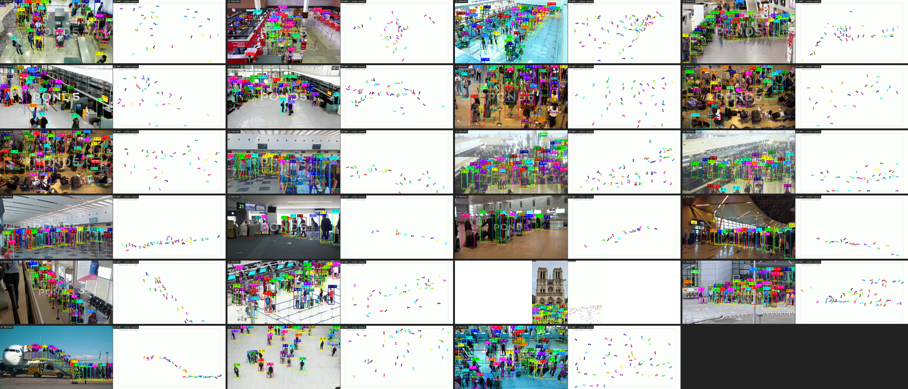
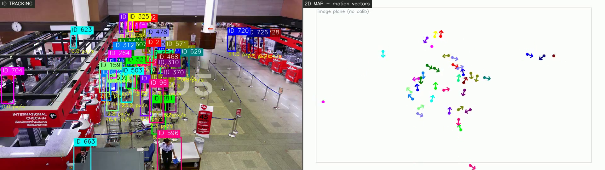
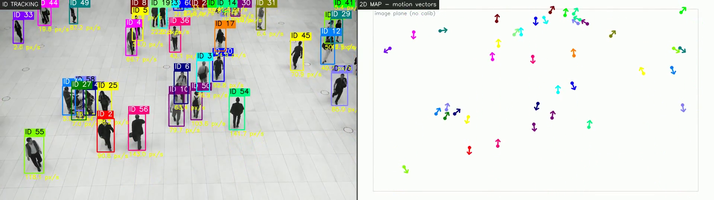
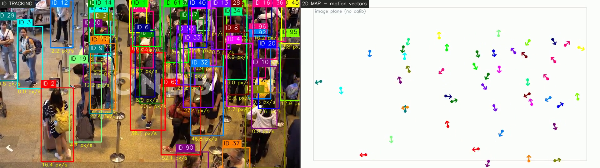
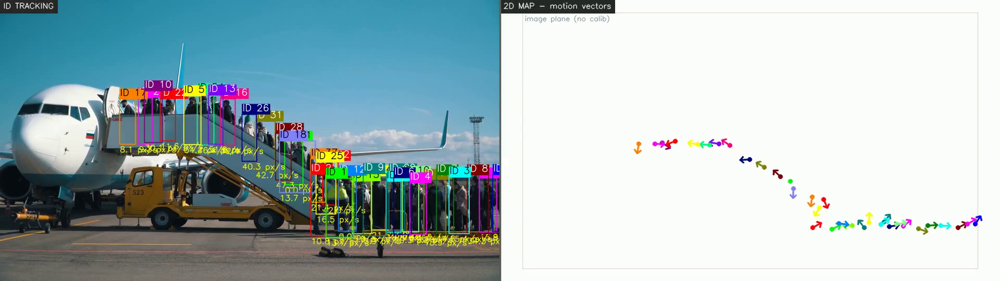
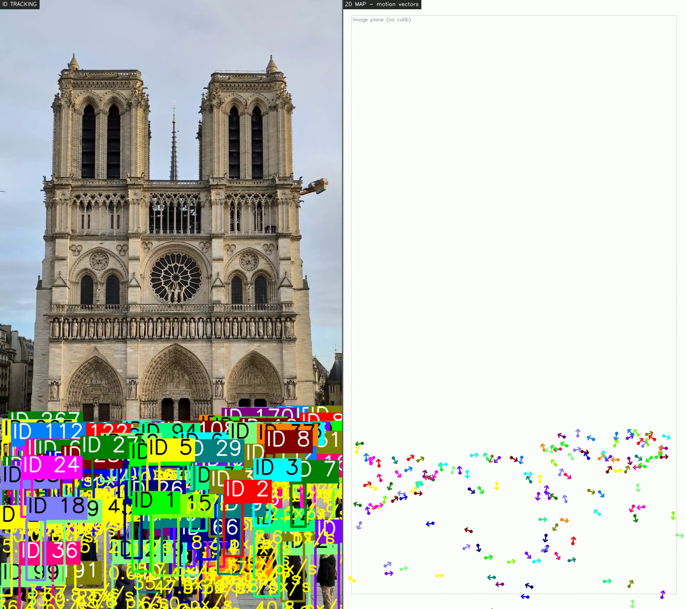

# 삼성화재 주간 미팅 — C-LAB 샘플 영상 추적 시각화 보고서

- **작성일**: 2026-06-16
- **대상**: 삼성화재 주간 미팅 (영상분석 엔진 진척 공유)
- **데이터셋**: `nas_200tb/ai-public/tracking_dataset/samsung_clab_sample/` (22편)
- **결과물**: `results/clab_concat/` — 영상별 좌우 합성(concat) 시각화 mp4 22편 + 요약 몽타주 1장
- **엔진**: BoostTrack++ (TensorRT FP16, YOLOX-MOT20 검출 + FastReID-SBS-S50 ReID)

> 관련 문서: [북극성 요구사항](../../requirements/CCTV-영상분석-엔진-필수추출정보.md) ·
> [추적 시각화 스킬(track-viz)](../../../.claude/skills/track-viz/SKILL.md) ·
> [최적화 보고서](../../optimization-report.md)

---

## 1. 목적

이 영상들을 시각화한 목적은 다음과 같다. 삼성화재 C-LAB에서 제공한 **공항/터미널
군중·대기열(queue) 장면 22편**에 추적 엔진(BoostTrack++)을 실제로 적용해, 우리 엔진이
이 도메인에서 [북극성 5대 필수 추출 정보](../../requirements/CCTV-영상분석-엔진-필수추출정보.md)를
추출할 수 있는지 눈으로 확인. 특히 공항 대기열의 특성은 다음과 같다.

- **밀집**과 상호 **가림(occlusion)** 이 심한 환경
- 줄을 따라 **느리게·간헐적으로 이동**
- 카메라 각도·해상도·프레임레이트가 **제각각**(960×540 ~ 4K, 24~60fps)

따라서 재실자 추적·밀도·이동방향이라는 피난 분석의 핵심 지표를 검증하기에 적합한
스트레스 테스트 셋.

---

## 2. 데이터셋 통계

### 2.1 요약

| 항목 | 값 |
|------|-----|
| 영상 수 | **22편** |
| 총 재생시간 | **약 487초 (≈8.1분)** |
| 총 프레임 수 | **약 13,842 프레임** |
| 원본 총 용량 | 약 161 MB (H.264) |
| 도메인 | **전부 공항/터미널 군중·대기열** (보안검색·여권심사·체크인·탑승 대기·수하물) |
| 코덱 | 전부 H.264 |

### 2.2 해상도 / 프레임레이트 분포

| 해상도 | 편수 | 비고 |
|--------|------|------|
| 960×540 | 19 | 표준(웹용 다운스케일본) |
| 1920×1080 (FHD) | 1 | `in_out_counting` (인·아웃 카운팅 테스트용) |
| 3840×2160 (4K) | 1 | `9511654-uhd` (고해상도 부하 확인용) |
| 1080×1920 (세로형) | 1 | `248698_small` (portrait 입력 처리 확인) |

| FPS | 편수 |
|-----|------|
| 25 fps | 11 |
| 30 fps | 7 |
| 24 fps | 2 |
| 59.9 fps | 2 (홍콩공항 2편) |

> 해상도·fps가 의도적으로 섞여 있어 **다양한 소스 조건에서의 강건성**을 함께 확인.

### 2.3 영상별 상세

| # | 파일 | 장면(도메인) | 해상도 | fps | 길이(s) | 프레임 |
|---|------|------|--------|-----|--------|--------|
| 1 | 050480301-passengers-queue-security-chec | 보안검색 대기열 | 960×540 | 25 | 32 | 814 |
| 2 | 055410059-passengers-queue-check-counter | 체크인 카운터 혼잡 | 960×540 | 30 | 59 | 1,783 |
| 3 | 058357453-passport-control-area-queue-in | 여권심사 대기열 | 960×540 | 25 | 31 | 792 |
| 4 | 065783530-passengers-stand-queue-boardin | 탑승 대기 | 960×540 | 30 | 25 | 779 |
| 5 | 072249790-queue-people-munich-airport-ch | 뮌헨공항 체크인 | 960×540 | 25 | 44 | 1,106 |
| 6 | 072249879-queue-muich-airport-check-coun | 뮌헨공항 카운터 | 960×540 | 25 | 47 | 1,199 |
| 7 | 109159853-crowd-passengers-luggage-queue | 수하물 대기 군중 | 960×540 | 25 | 27 | 696 |
| 8 | 111799657-crowd-passengers-luggage-queue | 수하물 대기 군중 | 960×540 | 25 | 26 | 672 |
| 9 | 112042486-crowd-passengers-luggage-queue | 수하물 대기 군중 | 960×540 | 25 | 20 | 504 |
| 10 | 122046908-queue-people-waiting-boarding | 탑승 대기 | 960×540 | 30 | 10 | 314 |
| 11 | 125351610-airport-check-queue-hong-kong | 홍콩공항 대기열 | 960×540 | 59.9 | 9 | 556 |
| 12 | 125354383-airport-check-queue-hong-kong | 홍콩공항 대기열 | 960×540 | 59.9 | 11 | 690 |
| 13 | 147456879-queue-people-waiting-boarding | 탑승 대기 | 960×540 | 30 | 10 | 304 |
| 14 | 156385369-queue-passengers-boarding-plan | 탑승 대기열 | 960×540 | 24 | 21 | 504 |
| 15 | 169890819-people-face-masks-queue-check | 마스크 착용 대기열 | 960×540 | 25 | 16 | 403 |
| 16 | 202242337-queue-people-board-airport-ter | 터미널 탑승 대기 | 960×540 | 30 | 13 | 390 |
| 17 | 205254994-huge-crowd-airport-endless-que | 초대형 군중 대기열 | 960×540 | 30 | 14 | 422 |
| 18 | 220226800-time-lapse-crowded-traveler-pe | 혼잡 타임랩스 | 960×540 | 25 | 12 | 308 |
| 19 | 248698_small | 세로형 군중 | 1080×1920 | 30 | 15 | 469 |
| 20 | 250078797-busy-queue-temperature-check-i | 발열체크 대기열 | 960×540 | 24 | 24 | 596 |
| 21 | 9511654-uhd_3840_2160_25fps | 4K 군중 | 3840×2160 | 25 | 8 | 200 |
| 22 | in_out_counting | 인·아웃 카운팅 테스트 | 1920×1080 | 25 | 13 | 341 |

---

## 3. 시각화 방법

`tools/concat_viz.py`(track-viz 스킬)로 영상마다 추론 후 **좌우 2분할** 패널을 합성.

```
원본 영상 → BoostTrack++ (TRT FP16) 추론
   ├─ 좌측: ID 추적 오버레이 (ID별 고유색 박스 + ID 번호, 속도/방향 라벨)
   └─ 우측: 2D 맵 — 사람을 top-down 평면에 점 + 이동 방향벡터(화살표)로 표시
        → 두 패널을 가로로 합쳐(hconcat) H.264로 재인코딩 (어디서나 재생)
```

- **같은 ID = 좌우 같은 색** → 영상 속 사람과 맵 위의 점이 한눈에 매칭.
- **모델 1개 로드 후 22편을 순차 처리**(단일 GPU 직렬). 4K는 패널 폭 960px로 다운스케일.
- 본 배치는 **캘리브레이션(ROI/호모그래피) 없이** 실행 → 우측 맵은 *이미지 평면 좌표*
  (원근 보정 X). **ID 지속성·상대 위치·이동 방향**을 확인하는 데모 목적이며, true
  top-down 미터맵·km/h 속도는 별도 보정 단계에서 산출(§5 참고).

---

## 4. 핵심 요구사항 대비

확인하려는 기준은 [북극성 5대 필수 추출 정보](../../requirements/CCTV-영상분석-엔진-필수추출정보.md)다.
이 시각화로 **현재 확인 가능한 것**과 **보정이 더 필요한 것**을 구분하면 다음과 같다.

| 필수 정보 | 시각화에서 확인 포인트 | 현재 상태 |
|-----------|----------------------|-----------|
| ① 객체 추적(ID 유지) | 좌측 ID 박스가 가림·밀집 속에서 **같은 사람에 같은 ID**를 유지하는가 | ✅ 확인 가능 — 본 배치의 1차 검증 대상 |
| ② 평면도 좌표 변환 | 우측 2D 맵에 사람이 점으로 투영되는가 | △ 이미지 평면까지 구현. **실측 호모그래피 보정 필요**(미터 좌표) |
| ③ 이동 속도·방향 | 우측 맵의 **방향벡터(화살표)**, 좌측 속도 라벨 | △ 방향은 ✅. 속도는 px/s(보정 시 km/h) |
| ④ 구역 밀도 | 밀집 장면에서 검출 누락/밀도 추정 | △ 대시보드 밀도지표 존재(webui). 본 배치엔 미표출 |
| ⑤ 시간 이벤트 | 인·아웃 통과/체류 | △ `in_out_counting`으로 카운팅 라인 동작 별도 검증 |

즉 이번 시각화의 **1차 목표는 ①(밀집/가림 환경의 ID 추적 강건성)** 확인이며,
②③④⑤는 같은 파이프라인 위에서 캘리브레이션·대시보드를 얹어 단계적으로 검증.

---

## 5. 결과

### 5.1 전체 요약 몽타주 (22편 대표 프레임)

각 칸이 한 영상의 대표 프레임(좌: ID 추적 / 우: 2D 맵).



### 5.2 대표 장면

**체크인 카운터 혼잡 (055410059, 960×540·30fps·1,783프레임)** — 가장 긴/혼잡한 장면.
다수 인원에 ID 색 박스가 부여되고, 우측 맵에 동일 색 점으로 분포 표시.



**인·아웃 카운팅 테스트 (in_out_counting, 1920×1080)** — 좌측에 ID·속도 라벨,
우측 맵에 **이동 방향 화살표**가 선명하게 표시.



**수하물 대기 군중 (109159853)** — 밀집·가림이 심한 군중에서의 추적.



**다양한 소스 조건**: 4K(`9511654`)·세로형(`248698_small`) 입력도 동일 파이프라인으로 처리.




---

## 6. 관찰 및 한계

- **강점**: 단일 TRT 모델로 22편(해상도·fps 제각각, 4K·세로형 포함)을 **무수정으로 일괄
  처리**. 밀집 대기열에서도 ID 박스와 2D 맵 점이 일관되게 매칭.
- **현재 한계**:
  - 캘리브레이션 미적용 → 우측 맵은 이미지 평면(원근 보정 X), 속도는 px/s.
    **실측 미터맵·km/h는 영상별 ROI/호모그래피 보정 후 산출**.
  - 매우 밀집한 장면의 **가림 구간 ID 스위치**는 정밀 정량평가 미실시(본 보고서는 정성 확인).
- **다음 단계 제안**:
  1. 대표 장면 2~3편에 **호모그래피 보정**을 적용해 미터 좌표·km/h·명/m² 밀도 산출 데모.
  2. `in_out_counting` 기반 **출입 카운팅/체류 이벤트** 정량 결과 표.
  3. 밀집 장면 ID 스위치율 등 **정량 추적 정확도** 측정(필요 시 GT 일부 라벨링).

---

## 부록 — 재현 방법

```bash
PY=~/miniconda3/envs/boosttrack/bin/python
# 폴더 통째 시각화 (NAS 원본은 읽기만, 결과는 results/ 아래)
$PY tools/concat_viz.py \
  /home/pia/data/nas_200tb/ai-public/tracking_dataset/samsung_clab_sample \
  --out results/clab_concat > results/clab_concat/_batch.log 2>&1
# 요약 몽타주
tools/montage.sh results/clab_concat
```
