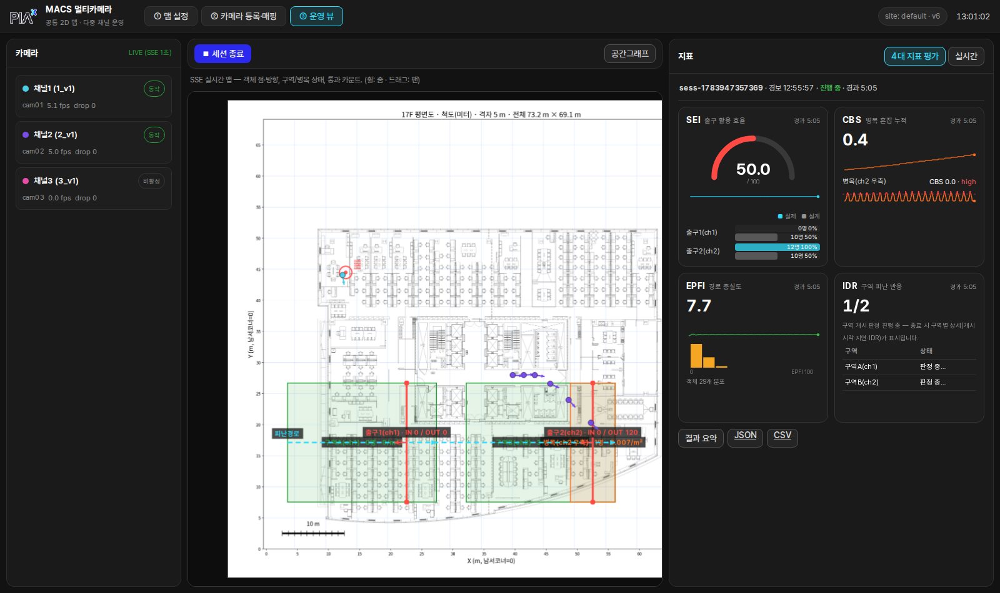
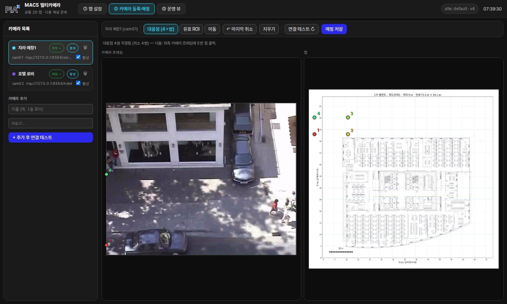

# 멀티카메라 2D맵 시스템 전환 및 4대 정량지표 구현 보고

- **작성일**: 2026-07-13
- **대상**: 삼성화재 주간 미팅 (신규 요구사항 반영 개발 결과 공유)
- **결과물**: `system/` 신규 패키지(설정·인제스트·트래킹·공간·지표·API) + main 탭 웹 UI + 4대 지표 평가 세션. 서버 `:8900`(pm2 `macs-system` 상시 기동)
- **엔진/도구**: ffmpeg-NVDEC 디코드 · BoostTrack++(TRT FP16, 카메라별 인스턴스) · FastAPI/SSE · vanilla JS canvas
- **개발 방식**: 3트랙 병렬 에이전트(계약 동결 → ingest·tracking / spatial·metrics / frontend) + 통합, 총 13커밋

> 관련 문서: [4대지표 요구사항](../../requirements/삼성화재-피난훈련-정량평가-4대지표-요구사항.md) ·
> [전환 설계서](../../architecture/02-멀티카메라-시스템-전환-설계.md) ·
> [M0 실측](../../architecture/03-M0-환경검증-디코딩스택-실측.md) ·
> [충족도 점검](2026-07-13_4대지표-요구사항-충족도-점검-및-구현필요사항.md) · 실행 가이드: `system/README.md`

---

## 1. 목적

이번 작업의 목적은 다음과 같다. 지난 충족도 점검에서 확인된 "부품은 절반 존재,
지표 계산층 0%" 상태를 해소하기 위해, PoC(영상 1개=잡 1개) 구조를 **공통 2D 평면도
좌표계 위에서 여러 카메라가 상시 동작하는 시스템**으로 전환하고, 그 위에 **4대 정량지표
(IDR·EPFI·CBS·SEI) 평가 세션**을 구현. 주요 전제는 다음과 같다.

- 멀티카메라 입력 + 카메라별 local ID 유지(글로벌 병합은 최종 단계 — D-1)
- 카메라 영상 오버레이 미표출 — 산출은 2D 맵 데이터(SSE)만(리소스 절감)
- 16채널 목표(최종 50채널 확장 전제), 채널당 분석 5fps 기본
- 모든 공간 요소·임계값은 JSON 영속화(하드코딩 금지 — D-6·D-10)

## 2. 구현 범위

구현 완료 항목은 다음과 같다.

| 구분 | 내용 |
|------|------|
| 인제스트 | ffmpeg-NVDEC 카메라별 워커 · oldest-drop 큐 · 3신호 재접속 워치독(지수 백오프) · 2GPU 분산 |
| 트래킹 | 공유 TRT(검출+ReID) + **카메라별 트래커 인스턴스**(ID 공간 격리, 기존 모드 회귀 무손상) |
| 공간·지표 | 호모그래피 맵 투영 · 다중 구역/병목/통과선/경로 · 속도·정렬도·밀도·방향성 카운팅 |
| 4대 지표 | 평가 세션(경보 t_alarm~종료): SEI·CBS·EPFI·IDR + 1초 타임라인 + EvaluationResult(JSON/CSV) |
| 웹 UI | main 탭 3화면: 맵 설정(드로잉·그래프·임계값) → 카메라 등록·매핑(대응점 4+) → 운영 뷰(SSE+지표 카드) |
| 영속화 | site.json·cameras/*.json·sessions/*.json — 재시작 시 자동 복원(카메라 자동 기동) |
| 운영 | pm2 `macs-system` 상시 기동 · cad-convert `*_scale.meta.json`(m/px) 자동 축척 |

## 3. 실측 결과

실측 기반 수치는 다음과 같다.

### 3.1 파이프라인 (M0·M2·M3)

| 항목 | 값 | 비고 |
|------|-----|------|
| 16ch NVDEC 디코드 | dec 사용률 3% · CPU 2.2코어 · 드랍 0/60초 | RTX PRO 6000 ×2 |
| 재접속 | 강제 단선 후 14초 자동 복구, 60초 안정 시 백오프 리셋 | pm2 stop/start 실험 |
| 추론 지연 | 평균 50.9~56.7ms/frame | **타 워크로드와 GPU 공유 조건** |
| 지속 처리량 | ≈18~20fps → 현 조건 4ch×5fps 한계 | 전유 조건 재실측 예정 |
| 단일영상 회귀 | 리팩토링 전후 출력 비트 단위 동일 | 5,250 트랙관측 |

### 3.2 4대 지표 — 실추적 70초 평가 세션 (3채널: 1_v1·2_v1·3_v1, 17F 도면)

| 지표 | 실측값 | 해석 |
|------|--------|------|
| SEI | **50.0** | 25명 전원 출구2 통과(출구1 0명) — 설계 5:5 대비 쏠림의 수식 그대로 |
| CBS | **0.09** (peak 0.044명/m², 초과 9초, high) | 병목 임계 초과 누적 실측 |
| EPFI | 평균 **4.0** (개별 최고 14.5) | 실제 동선이 지정 경로에서 이탈 — 정직한 산출 |
| IDR | z2 개시 판정(지연 7.0초, IDR 5.81) / z1 not_started | FR-03 유지시간 판정 실동작 |
| 품질 | 79명 추적 · 3채널 관측 · 미매핑 11.5% · 타임라인 70점 | quality 블록 |

예외 처리 실검증: 통과 0명 → SEI `insufficient_data`(None) · 병목 무인 → CBS 0 ·
pm2 재시작 후 결과/타임라인 유지.

### 3.3 검증 체계

- pytest **57개 통과** — 요구사항 §8 완료 기준(권장경로 완전추종 EPFI=100 · 임계 미초과
  CBS=0 · 분포 일치 SEI=100 · 정확한 유지시간에 t_e,start · 동일입력 결정성) 포함
- Playwright e2e — mock·실서버 양쪽: 경보 시작(맵 클릭)→카드 갱신→종료→결과 모달→내보내기

## 4. 결과 화면

**운영 뷰 — 실추적 4대 지표 대시보드** (17F 도면 · 3채널 · 세션 진행 중.
우측 2×2 카드: SEI 게이지+출구 분포 / CBS 스파크라인 / EPFI 히스토그램 / IDR 구역표)

**카메라↔맵 매핑 화면** (좌: 실카메라 프레임+대응점 / 우: 도면+대응점)

## 5. 핵심 요구사항 대비

[4대지표 요구사항](../../requirements/삼성화재-피난훈련-정량평가-4대지표-요구사항.md) FR 기준 충족 현황.

| FR | 상태 | 비고 |
|----|------|------|
| FR-01 좌표 통합 | ⚠️ 부분 | 발끝점→호모그래피→맵 ✅ / 왜곡보정·기준점 오차 기록 잔여 |
| FR-02 다중 카메라 궤적 | ✅ (D-1 범위) | 멀티 입력+카메라별 ID. 글로벌 병합은 최종 단계 |
| FR-03 피난 개시 판정 | ✅ | v·a·r 동시조건 dt_hold 유지 → t_e,start |
| FR-04 IDR | ✅ | 수동 노드그래프 다익스트라(미지정 시 직선 폴백) |
| FR-05 EPFI | ✅ | 점→경로 최근접거리 시간적분 |
| FR-06 CBS | ✅ | 병목별 임계초과 적분·가중치·위험등급 |
| FR-07 SEI | ✅ | 방향성 crossing·왕복 debounce·분포비교·insufficient_data |
| FR-08 대시보드 | ✅ | 실시간 SSE + 세션 카드(시간대별 추이) — 재생 모드는 잔여 |
| FR-09 저장·연계 | ✅ | 세션 영속화·이력 API·JSON/CSV 내보내기 |

## 6. 관찰 및 한계

**강점**

- 계약 동결 후 3트랙 병렬 개발 — 트랙 간 충돌 0, 통합 이슈는 형식 불일치 수준
- 설정→운영 전 주기 영속화 — 재시작·재부팅에도 무인 복원

**현재 한계**

1. 추론 처리량이 공유 GPU 조건 실측 — 16ch×5fps는 **GPU 전유 재실측** 필요(노브: 채널 fps·검출 배치)
2. 데모의 카메라 매핑이 임시 사분면 — 대응점 실지정 시 위치·속도 정확화(UI 플로우는 완비)
3. 임계값·비상구 설계인원은 임의 디폴트 — **고객 확정 6건** 미팅 상정 필요(요구사항 §9)
4. 녹화본 재생 모드·FR-01 품질 기록 잔여

**다음 단계**

1. GPU 전유 시간대 16ch 처리량 재실측 → 필요 시 검출 배치 TRT 재빌드
2. 고객 확정 6건(임계값·설계인원·CAD 형식 등) 미팅 안건 상정
3. WBS 반영(`/wbs-review`) 및 P2 잔여(품질 기록·재생 모드) 착수
