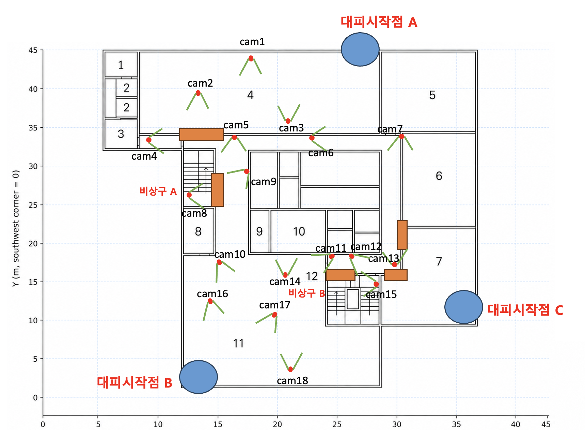
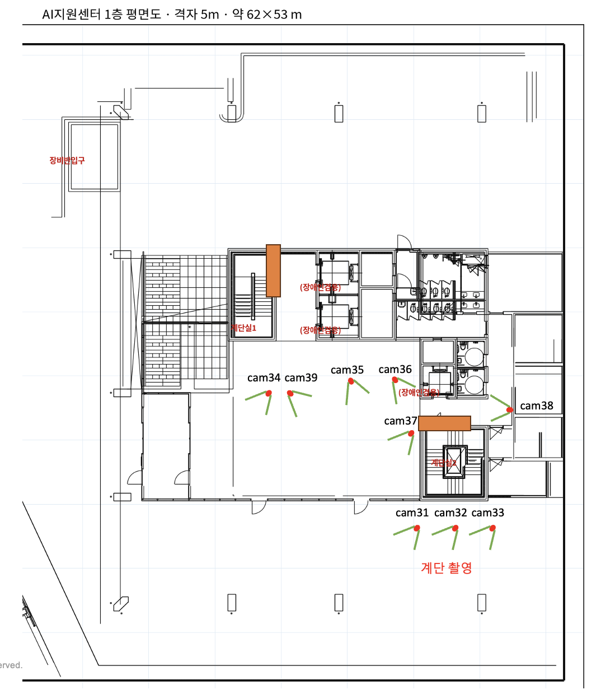

# 촬영기록 및 카메라 매핑 — AI hub 1층·3층 합동 훈련

액션캠 **27대** · **2026-09-11** 촬영 · 시나리오 14개.
패키지 `aihub-drill-1f3f` (`media/vsource/aihub/drill-1f3f/`).

> 이 문서가 **근거**, `../rehearsal.json` 이 **실행값**이다. 둘이 어긋나면
> 매니페스트를 고친다.

## 시나리오 맵과 카메라 위치

### AI Hub 3층 — cam1~cam18



### AI Hub 1층 및 계단 — cam31~cam39



### 폴더 구조

```
camera_data/
 ├─ 01_original/   원본 (SD카드, 수정 금지) — 27대 × MP4 155개, 163GB
 ├─ 02_concat/     카메라별 전체 연결본 (camN_full.mp4) — 31개
 └─ 03_scenarios/  시나리오별 최종 분할본 + 그리드 영상 — 147개, 15.6GB
```

업로드: https://huggingface.co/datasets/PIA-SPACE/C-lab-AIHub-2026-09-11

---

## 촬영 구성

층이 상이하여 **분리해 촬영**함.

| 카메라 | 녹화 시각 | 시나리오 |
| --- | --- | --- |
| cam1 ~ cam18 (18대) | 13:59 ~ 15:20 | Scenario 01 ~ 11 |
| cam31 ~ cam39 (9대) | 14:47 ~ 15:09 | Scenario 12 ~ 14 |
- 도면 번호와 실제 카메라 번호가 일치함.

---

## 작업 흐름

### 1. `02_concat` — 카메라별 시간순 연결

- 액션캠이 10분 단위로 파일을 분할 저장할 때, 이전 파일 종료 지점 1초가 다음 파일 시작부에 중복 기록됨.  중복구간 124곳 전체를 프레임 해시로 실측 후 제거함

### 2. 싱크 — 슬레이트 기준점 적용

- 전 카메라를 취합해 촬영한 슬레이트(손뼉)를 기준점으로 사용함
- 손바닥 접촉 프레임을 프레임 시트에서 육안 판독해 확정함
- 카메라 내장 시각(번인)은 수동 설정값이라 기준으로 미채택

### 3. `03_scenarios/scenario_NN` — 오프셋 기준 시나리오 구간 컷

- 이후 시나리오별 그리드로 합성해 동기화 육안 검증 수행

---

## 카메라별 최종 오프셋

각 조 그리드 영상 **0초**(= 슬레이트 손 접촉 순간)에 대응하는 `02_concat` 시각.

AI Hub 3층

| 카메라 | 02_concat 기준 시작지점 | 원본 파일 | 전체 길이 |
| --- | --- | --- | --- |
| cam1 | 00:00:19.267 | 6개 | 00:57:16.533 |
| cam2 | 00:00:59.867 | 8개 | 01:13:00.433 |
| cam3 | 00:01:02.867 | 8개 | 01:14:47.033 |
| cam4 | 00:00:56.433 | 8개 | 01:12:30.867 |
| cam5 | 00:00:25.600 | 8개 | 01:11:37.500 |
| cam6 | 00:00:57.833 | 6개 | 00:59:45.867 |
| cam7 | 00:00:28.033 | 8개 | 01:15:53.533 |
| cam8 | 00:00:23.533 | 7개 | 01:07:39.167 |
| cam9 | 00:00:21.533 | 8개 | 01:11:14.667 |
| cam10 | 00:00:54.200 | 5개 | 00:42:21.233 |
| cam11 | 00:00:46.933 | 6개 | 00:56:31.733 |
| cam12 | 00:00:41.333 | 6개 | 00:56:44.000 |
| cam13 | 00:00:58.033 | 8개 | 01:13:41.533 |
| cam14 | 00:01:05.333 | 5개 | 00:42:10.733 |
| cam15 | 00:01:07.700 | 9개 | 01:21:48.800 |
| cam16 | 00:00:30.267 | 5개 | 00:45:40.150 |
| cam17 | 00:01:20.700 | 5개 | 00:41:26.150 |
| cam18 | 00:01:22.567 | 6개 | 00:59:59.833 |

AI Hub 1층 및 계단

| 카메라 | 02_concat 기준 시작지점 | 원본 파일 | 전체 길이 |
| --- | --- | --- | --- |
| cam31 | 00:00:34.000 | 3개 | 00:21:06.100 |
| cam32 | 00:00:27.533 | 3개 | 00:20:29.433 |
| cam33 | 00:00:32.400 | 2개 | 00:19:58.300 |
| cam34 | 00:00:14.533 | 3개 | 00:21:51.233 |
| cam35 | 00:00:16.133 | 3개 | 00:20:19.733 |
| cam36 | 00:00:24.433 | 3개 | 00:21:56.233 |
| cam37 | 00:00:30.117 | 3개 | 00:21:17.783 |
| cam38 | 00:00:11.167 | 3개 | 00:21:35.733 |
| cam39 | 00:00:36.033 | 2개 | 00:19:43.800 |

---

## 시나리오 목록

시간은 해당 조의 전체 그리드 영상 기준. `A·B 분리`는 두 그룹이 상이한 경로로 이동해 **양쪽 경로의 모든** 카메라를 포함함을 의미함. 그리드 패널은 이동 경로 순서로 배치함.

| 시나리오 | 그리드 구간 | 길이 | 카메라 | 구성 | 이동 경로 |
| --- | --- | --- | --- | --- | --- |
| Scenario 01 | 00:11:59 ~ 00:12:37 | 38초 | 9대 | A·B 분리 | A 16→17→18→10→11→9→5→8 / B 16→17→18→10→11→14→9→5→8 |
| Scenario 02 | 00:13:30 ~ 00:14:19 | 49초 | 8대 | A·B 동일 | 16→17→18→10→11→9→5→8 |
| Scenario 03 | 00:15:09 ~ 00:16:30 | 81초 | 8대 | A·B 동일 | 16→17→18→10→11→9→5→8 |
| Scenario 04 | 00:17:29 ~ 00:18:28 | 59초 | 13대 | A·B 분리 | A 16→17→18→10→11→9→5→8 / B 16→17→18→10→14→11→12→13→7→6→5→9→8 |
| Scenario 05 | 00:19:46 ~ 00:20:30 | 44초 | 8대 | A·B 분리 | A 16→17→18→10→11→9→5→8 / B 16→17→18→10→11→9→11→10→18→17→16→17→18→10→11→9→5→8 |
| Scenario 06 | 00:21:34 ~ 00:22:36 | 62초 | 13대 | A·B 분리 | A 16→17→18→10→11→9→5→8 / B 16→17→18→10→14→11→12→13→7→6→5→9→8 |
| Scenario 07 | 00:24:50 ~ 00:25:35 | 45초 | 7대 | A·B 동일 | 3→1→2→4→5→9→8 |
| Scenario 08 | 00:27:00 ~ 00:28:01 | 61초 | 7대 | A·B 동일 | 3→1→2→4→5→9→8 |
| Scenario 09 | 00:30:13 ~ 00:30:58 | 45초 | 7대 | A·B 분리 | A 3→1→2→4→5→9→8 / B 1→2→4→5→9→8 |
| Scenario 10 | 00:32:27 ~ 00:33:46 | 79초 | 12대 | A·B 분리 | A 3→1→2→4→5→9→8 / B 3→1→2→4→5→6→7→13→12→15 |
| Scenario 11 | 00:36:40 ~ 00:38:35 | 115초 | 16대 | A·B 분리 | A 3→1→2→4→5→9→8 / B 3→1→2→4→5→6→7→13→12→15→(서익,영우)12→11→14→10→16→10→14→11→12→15 |
| Scenario 12 | 00:10:45 ~ 00:12:03 | 78초 | 8대 | A·B 동일 | 31→32→33→36→35→38→39→34 |
| Scenario 13 | 00:15:07 ~ 00:16:15 | 68초 | 8대 | A·B 동일 | 31→32→33→36→35→38→39→37 |
| Scenario 14 | 00:17:27 ~ 00:18:44 | 77초 | 9대 | A·B 분리 | A 31→32→33→36→35→38→39→34 / B 31→32→33→36→35→38→39→37 |