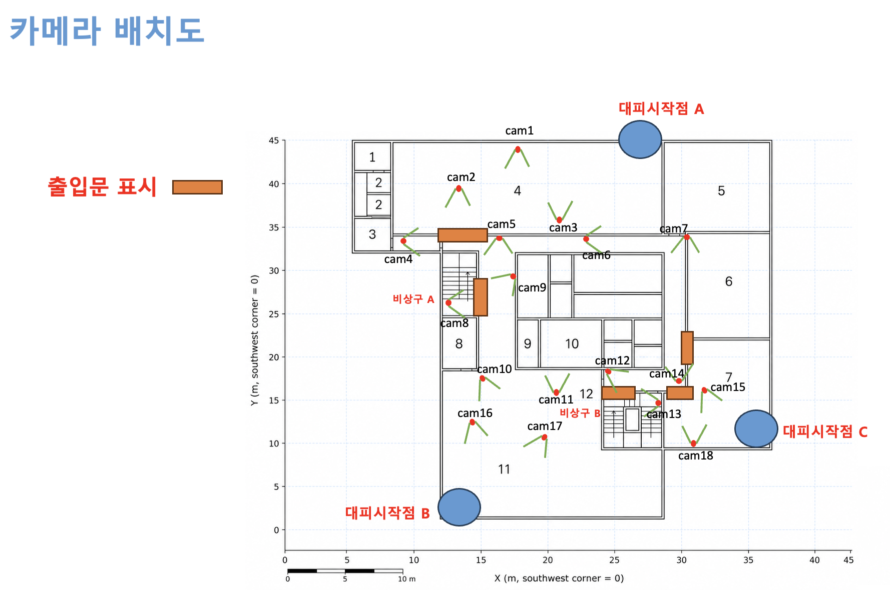

# 액션캠 피난 시나리오 데이터셋 (18대) — 2026-09-04 촬영


액션캠 18대 피난 시나리오 영상 동기화 및 분할 작업을 완료하여 공유드립니다.
 
업로드 완료 — 03_scenarios
https://huggingface.co/datasets/PIA-SPACE/C-lab-AIHub 
시나리오 9개, 클립 76개 + 검증용 그리드 9개, 총 85개 파일(6.9GB)입니다. 파일명은 도면 위치 번호(cam01~cam18) 기준입니다.
 
압축 없이 폴더째 올렸습니다. 압축 효율이 거의 없기도 하고, 로컬 저장 공간도 여유가 없어(01_original·02_concat이 각 128GB 내외라 압축본을 따로 둘 공간이 부족했습니다) 폴더째 올리는 쪽으로 진행했습니다. 전체 디렉토리 또는 필요하신 시나리오나 카메라만 골라 받으실 수 있습니다.
 
Plain Text
hf download PIA-SPACE/C-lab-AIHub --repo-type=dataset \  --include "03_scenarios/scenario_01/*" "03_scenarios/scenario_02/*"


> **정리자 주 — 촬영 층**: 시나리오 01~09 전부 **AI hub(AI지원센터) 3층** (확인 2026-09-08).
> :8900 사이트 층 `floor4`(도면 `AI지원센터_3F.dxf`)에 붙는다 — `../rehearsal.json` `floors[]`.

## 시나리오 맵과 카메라 위치



> 방 번호 1~12 · 대피시작점 A·B·C · 비상구 A·B · 출입문 위치. 좌표는 남서쪽 코너 = (0,0) 기준 미터.

### 폴더 구조

```
 /
 ├─ 01_original/   원본 (SD카드, 수정 금지) — 18대 × MP4 128개, 129GB
 ├─ 02_concat/     카메라별 전체 연결본 (camN_full.mp4) — 18개, 128GB
 ├─ 03_scenarios/  시나리오별 최종 분할본 + 그리드 영상 — 85개, 6.9GB
 └─ 04_sync/       싱크 검증용 전체 그리드 영상
```

업로드: https://huggingface.co/datasets/PIA-SPACE/C-lab-AIHub

### 작업 흐름

1. **`02_concat`** — 원본 녹화본을 카메라별로 시간순 연결
    - 액션캠이 10분 단위로 파일을 분할할 때 **이전 파일 끝 1초가 다음 파일 앞에 중복 기록**되는 것을 확인해, 중복 110곳 전부를 프레임 해시로 실측 검증한 뒤 제거함.
2. **싱크** — 전 카메라를 모아놓고 촬영한 **슬레이트를** 기준점으로 사용
    - 슬레이트 ① : 배치 전 15대 촬영 (cam2·cam10·cam18 제외 — 이후 추가된 카메라)
    - 슬레이트 ② : cam11을 기준으로 cam2·cam10·cam18을 슬레이트 ① 타임라인에 연결
    - **손바닥이 맞닿는 프레임**을 육안으로 판독해 기준점을 확정하고, 오디오 상관 및 모션 상관으로 교차 검증.
    - 카메라 내장 시각은 수동 설정이라 기준으로 사용하지 않음.
3. **`03_scenarios/scenario_0N`** — 오프셋을 기준으로 시나리오 나눈 뒤 **도면 위치 번호**로 저장
→ 시나리오별 그리드 영상으로 합쳐 동기화 상태를 육안 검증

### 카메라별 최종 오프셋

전체 그리드 영상(`04_sync/grid_all18_slate2_full.mp4`) **0초**에 대응하는 각 카메라의 `02_concat` 시각.

| 도면 위치 | 실제 카메라 | 02_concat 기준 시작지점 |
| --- | --- | --- |
| cam01 | cam15 | 00:26:49.439 |
| cam02 | cam4 | 00:26:40.773 |
| cam03 | cam3 | 00:26:42.173 |
| cam04 | cam5 | 00:26:58.406 |
| cam05 | cam2 | 00:01:28.468 |
| cam06 | cam14 | 00:28:00.906 |
| cam07 | cam10 | 00:00:27.573 |
| cam08 | cam7 | 00:26:53.673 |
| cam09 | cam16 | 00:27:11.239 |
| cam10 | cam6 | 00:27:26.406 |
| cam11 | cam11 | 00:27:09.239 |
| cam12 | cam8 | 00:28:20.139 |
| cam13 | cam1 | 00:27:11.739 |
| cam14 | cam9 | 00:28:25.773 |
| cam15 | cam17 | 00:27:47.239 |
| cam16 | cam13 | 00:27:21.306 |
| cam17 | cam18 | 00:01:29.828 |
| cam18 | cam12 | 00:28:33.339 |

### 도면 위치 ↔ 실제 카메라 매핑

| 도면 | 실제 | 도면 | 실제 | 도면 | 실제 |
| --- | --- | --- | --- | --- | --- |
| cam01 | cam15 | cam07 | cam10 | cam13 | cam1 |
| cam02 | cam4 | cam08 | cam7 | cam14 | cam9 |
| cam03 | cam3 | cam09 | cam16 | cam15 | cam17 |
| cam04 | cam5 | cam10 | cam6 | cam16 | cam13 |
| cam05 | cam2 | cam11 | cam11 | cam17 | cam18 |
| cam06 | cam14 | cam12 | cam8 | cam18 | cam12 |

### 시나리오 목록

시간은 전체 그리드 영상 기준. `A·B`는 두 그룹이 서로 다른 경로로 이동함을 의미함.

| 시나리오 | 그리드 구간 | 길이 | 카메라 | 구성 | 이동 경로 (도면 번호) |
| --- | --- | --- | --- | --- | --- |
| Scenario 01 | 00:08:11 ~ 00:08:57 | 46초 | 7대 | A·B 동일 | 03 → 01 → 02 → 04 → 05 → 09 → 08 |
| Scenario 02 | 00:10:02 ~ 00:11:09 | 67초 | 10대 | A·B 동일 | 03 → 01 → 02 → 04 → 05 → 06 → 14 → 07 → 12 → 13 |
| Scenario 03 | 00:12:38 ~ 00:13:48 | 70초 | 12대 | **A·B 분리** | **A** 03 → 01 → 02 → 04 → 05 → 09 → 08

**B** 03 → 01 → 02 → 04 → 05 → 06 → 14 → 07 → 12 → 13 |
| Scenario 04 | 00:16:15 ~ 00:16:57 | 42초 | 6대 | A·B 동일 | 16 → 17 → 10 → 05 → 09 → 08 |
| Scenario 05 | 00:18:00 ~ 00:18:40 | 40초 | 6대 | A·B 동일 | 16 → 17 → 10 → 11 → 12 → 13 |
| Scenario 06 | 00:19:58 ~ 00:21:00 | 62초 | 12대 | **A·B 분리** | **A** 16 → 17 → 10 → 05 → 09 → 08

**B** 16 → 17 → 10 → 05 → 09 → 04 → 06 → 14 → 07 → 12 → 13 |
| Scenario 07 | 00:23:14 ~ 00:24:03 | 49초 | 9대 | A·B 동일 | 15 → 18 → 12 → 14 → 11 → 10 → 05 → 09 → 08 |
| Scenario 08 | 00:25:05 ~ 00:25:37 | 32초 | 5대 | A·B 동일 | 15 → 18 → 12 → 14 → 13 |
| Scenario 09 | 00:26:38 ~ 00:27:40 | 62초 | 9대 | **A·B 분리** | **A** 15 → 18 → 12 → 14 → 11(누락) → 10 → 05 → 09(누락) → 08

**B** 15 → 18 → 12 → 14 → 07 → 04 → 05 → 09(누락) → 08 |

> 이동 경로에서 누락된 도면 카메라는 **해당 구간 배터리 소진으로 미촬영됨**.
> 

### 완료 상태

- [x]  `02_concat` 18대 연결 완료 (파일 경계 1초 중복 제거)
- [x]  18대 싱크 프레임 단위 확정 (교차 검증 + 육안 판독)
- [x]  시나리오 01~09 컷 완료 — 클립 76개, 전부 `길이 × 30` 프레임 일치
- [x]  시나리오별 그리드 9개로 동기화 육안 검증 완료
- [x]  `03_scenarios` HF 업로드 완료 (85/85 검증)
- [x]  `01_original` HF 업로드 진행 중