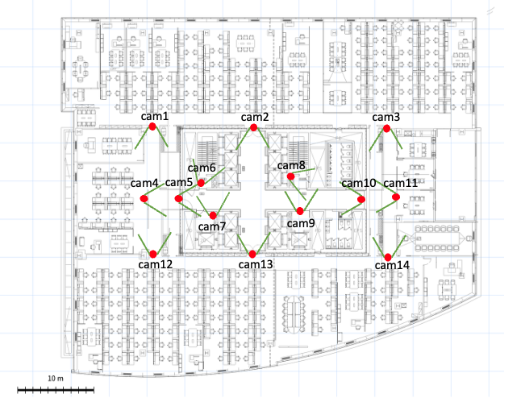

# CJ제일제당센터 10F 리허설 — 촬영 기록 및 카메라 매핑

> 출처: 촬영·편집 담당자 전달 문서 (2026-08-28 수령, 원문 그대로 보존). 이미지:
> [카메라-위치-도면-10F.png](카메라-위치-도면-10F.png)
> 이 문서의 **도면 위치 번호(cam1~14)** 가 패키지 `rehearsal.json` 의 `cameras[].cam` 이다.
> 실제 카메라 하드웨어는 6대(실카메라 cam1~6)이고 시나리오 그룹마다 위치를 옮겨 촬영했다.

## 시나리오 맵과 카메라 위치



### 폴더 구조 (원본 소스 — HF dataset `PIA-SPACE/C-lab`)

```
videos/
 ├─ 01_original/   원본 (SD카드, 수정 금지)
 ├─ 02_concat/     카메라별 전체 연결본 (camN_full.mp4)
 ├─ 03_scenarios/  시나리오별 최종 분할본 + 그리드 영상   ← 이 패키지의 원천
 └─ 04_sync/       카메라 간 시간 동기화 완료본 (camN_sync.mp4)
```

### 작업 흐름

1. `02_concat`: 원본 녹화본들을 카메라별로 시간순 concat
2. `04_sync`: 여러 카메라에 동시에 찍힌 공통 장면(사람이 겹치는 순간)을 기준으로 각 카메라의 실제 시작 오프셋 계산 → 프레임 단위로 미세 보정
3. `03_scenarios/scenario_0N`: `04_sync` 기준 시나리오 시간대로 컷 → 위치 번호(cam8, cam11 등)로 저장 → 그리드로 합쳐서 동기화 검증

### 04_sync 기준 카메라별 최종 오프셋

| 실제 카메라 | 02_concat 기준 시작지점 |
| --- | --- |
| cam1 | 00:11:08.534 |
| cam2 | 00:09:47.500 |
| cam3 | 00:11:06.234 |
| cam4 | 00:22:32.000 |
| cam5 | 00:06:54.967 |
| cam6 | 00:01:46.000 |

*(일부 시나리오 구간에서 10분 단위로 저장될 때마다 앞뒤로 겹치는 구간(오버랩)이 있어서, 해당 시나리오 클립에 한해 개별 보정함)*

### 시나리오별 도면 위치 ↔ 실제 카메라 매핑

| 적용 시나리오 | 도면 위치 | 실제 카메라 |
| --- | --- | --- |
| 1,2,3,4 | cam3 / cam11 / cam10 / cam8 / cam9 / cam14 | cam6 / cam1 / cam2 / cam3 / cam4 / cam5 |
| 5,6,7,8 | cam1 / cam4 / cam5 / cam7 / cam6 | cam6 / cam1 / cam2 / cam4 / cam3 |
| 9,10,11,12 | cam13 / cam5 / cam7 / cam6 / cam2 | cam1 / cam2 / cam4 / cam3 / cam6 |
| 13,14 | cam2 / cam10 / cam9 / cam8 / cam13 | cam6 / cam2 / cam5 / cam3 / cam1 |

### 시나리오 목록

| 시나리오 | 실제 촬영 시간 (카메라 인터페이스 시각) | 비고 | 이동 위치 |
| --- | --- | --- | --- |
| Scenario 01 | 15:20:36 ~ 15:21:11 | 피난 시나리오 1 | cam14 → cam11 → cam10 → cam9 → cam8 |
| Scenario 02 | 15:21:52 ~ 15:22:30 | 피난 시나리오 2 | cam14 → cam11 → cam10 → cam9 → cam8 |
| Scenario 03 | 15:23:15 ~ 15:23:56 | 피난 시나리오 3 | cam3 → cam11 → cam10 → cam9 → cam8 |
| Scenario 04 | 15:24:13 ~ 15:24:44 | 피난 시나리오 4 | cam3 → cam11 → cam10 → cam9 → cam8 |
| Scenario 05 | 15:29:18 ~ 15:29:50 | 피난 시나리오 5 | cam1 → cam4 → cam5 → cam7 → cam6 |
| Scenario 06 | 15:30:31 ~ 15:30:57 | 피난 시나리오 6 | cam1 → cam4 → cam5 → cam7 → cam6 |
| Scenario 07 | 15:31:23 ~ 15:31:53 | 피난 시나리오 7 | cam12 → cam4 → cam5 → cam7 → cam6 |
| Scenario 08 | 15:32:17 ~ 15:32:48 | 피난 시나리오 8 | cam12 → cam4 → cam5 → cam7 → cam6 |
| Scenario 09 | 15:35:27 ~ 15:35:51 | 피난 시나리오 9 | cam13 → cam5 → cam7 → cam6 |
| Scenario 10 | 15:36:21 ~ 15:36:44 | 피난 시나리오 10 | cam13 → cam5 → cam7 → cam6 |
| Scenario 11 | 15:37:31 ~ 15:38:00 | 피난 시나리오 11 | cam2 → cam5 → cam7 → cam6 |
| Scenario 12 | 15:38:26 ~ 15:38:56 | 피난 시나리오 12 | cam2 → cam5 → cam7 → cam6 |
| Scenario 13 | 15:41:13 ~ 15:41:43 | 피난 시나리오 13 | cam2 → cam10 → cam9 → cam8 |
| Scenario 14 | 15:42:24 ~ 15:42:49 | 피난 시나리오 14 | cam13 → cam10 → cam9 → cam8 |

### 완료 상태

- 01~14 전체 시나리오 컷 + 시나리오별 그리드 영상 생성 완료
- 각 그리드(`grid_scenarioN.mp4`)로 카메라 간 동기화 육안 검증 완료

---

## MCMOT 패키지에서의 해석 (정리자 주)

- **위치 번호가 카메라 id** — 시나리오가 달라도 같은 위치(예 cam8)는 같은 시점이므로 매핑 1회 재사용.
  `rehearsal.json` 의 `cameras[].cam` = 위치 번호, RTSP 경로 `cj_camN` 도 위치 기준. 설계와 일치.
- **실카메라 6대를 돌려 씀** — 같은 위치라도 시나리오 그룹에 따라 하드웨어가 다르다(예 위치 cam8 = 그룹 1~4 실카메라 cam3, 그룹 13~14 도 cam3). 화각·렌즈가 같은 기종이면 매핑에 영향 없음. 그룹별 실카메라는 `rehearsal.json` `scenarios[].physical_cams` 에 기록.
- **이동 위치 = 피난 동선** — ① 맵설정의 피난경로·출입구를 정할 때 참고. 그룹 1~4·13~14 는 동측(cam14/cam3/cam2 → cam8), 그룹 5~12 는 서측(→ cam6) 으로 빠진다 → 출입구가 **동·서 2곳**이어야 SEI 가 의미를 갖는다.
- 시나리오 05~08 은 **cam1(15:29~15:32)**, 09~14 는 **cam13/cam2** 시작 — 시작 위치가 곧 경보 후 첫 관측 지점.
- 촬영 시각은 카메라 인터페이스 시각(영상 하단 타임스탬프)과 같다 — 리허설 t=0 ≈ 표의 시작 시각.
